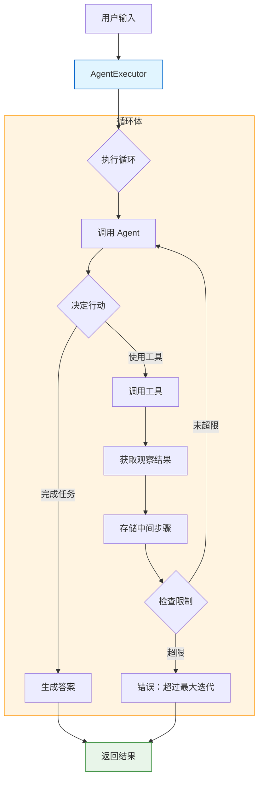
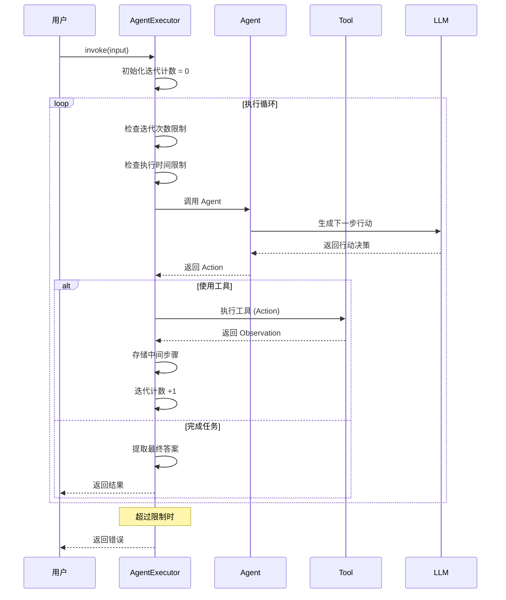

# Agent 执行器

> AgentExecutor 是 LangChain Agent 的核心执行引擎。本章将深入讲解 AgentExecutor 的工作原理、配置选项和高级用法。

## 什么是 AgentExecutor？

**AgentExecutor** 是 LangChain 中负责执行 Agent 的组件。它负责：

1. **接收输入**：获取用户的问题或指令
2. **驱动循环**：控制 Agent 的思考 - 行动 - 观察循环
3. **管理状态**：跟踪执行进度和中间结果
4. **处理错误**：捕获并处理执行过程中的异常
5. **返回结果**：输出最终答案或错误信息

::: v-pre

:::

## 基础用法

### 快速开始

```python
from langchain.agents import create_react_agent, AgentExecutor
from langchain import hub
from langchain_openai import ChatOpenAI
from langchain_core.tools import Tool

# 1. 初始化 LLM
llm = ChatOpenAI(model="gpt-4o", temperature=0)

# 2. 定义工具
def search(query: str) -> str:
    """搜索互联网"""
    return f"搜索结果：{query}"

def calculate(expression: str) -> str:
    """计算表达式"""
    return str(eval(expression))

tools = [
    Tool(name="Search", func=search, description="搜索信息"),
    Tool(name="Calculator", func=calculate, description="数学计算"),
]

# 3. 创建 Agent
prompt = hub.pull("hwchase17/react")
agent = create_react_agent(llm, tools, prompt)

# 4. 创建执行器
agent_executor = AgentExecutor(
    agent=agent,
    tools=tools,
    verbose=True
)

# 5. 执行
result = agent_executor.invoke({
    "input": "珠穆朗玛峰的高度乘以 2 是多少？"
})

print(result["output"])
```

### 输出结构

```python
result = agent_executor.invoke({"input": "你的问题"})

# result 是一个字典，包含：
print(result.keys())
# dict_keys(['input', 'output', 'intermediate_steps'])

print(f"输入：{result['input']}")
print(f"输出：{result['output']}")
print(f"中间步骤：{result['intermediate_steps']}")

# 中间步骤详情
for step in result.get('intermediate_steps', []):
    action, observation = step
    print(f"动作：{action.tool}")
    print(f"输入：{action.tool_input}")
    print(f"观察：{observation}")
```

## 核心配置参数

### max_iterations - 最大迭代次数

控制 Agent 最多执行多少次思考 - 行动循环。

```python
# 设置最大迭代次数
agent_executor = AgentExecutor(
    agent=agent,
    tools=tools,
    max_iterations=10,  # 默认通常是 15
)

# 迭代次数不足会发生什么？
agent_executor_low = AgentExecutor(
    agent=agent,
    tools=tools,
    max_iterations=2,  # 设置过低
    verbose=True
)

try:
    result = agent_executor_low.invoke({
        "input": "查找 AI 发展历史并总结主要阶段"
    })
except Exception as e:
    print(f"错误：{e}")
    # Agent stopped due to iteration limit or time limit.
```

💡 **提示**：max_iterations 设置过小可能导致任务无法完成，设置过大会增加 token 消耗和响应时间。建议值：
- 简单任务：5-10 次
- 中等任务：10-15 次
- 复杂任务：15-25 次

### max_execution_time - 最大执行时间

控制 Agent 执行的最大时间（秒）。

```python
from datetime import timedelta

agent_executor = AgentExecutor(
    agent=agent,
    tools=tools,
    max_execution_time=60,  # 60 秒超时
    # 或使用 timedelta
    # max_execution_time=timedelta(minutes=1),
)

# 监控执行时间
import time

start = time.time()
result = agent_executor.invoke({"input": "复杂任务..."})
elapsed = time.time() - start

print(f"执行时间：{elapsed:.2f}秒")
```

### handle_parsing_errors - 解析错误处理

当 Agent 的输出无法解析时如何处理。

```python
# 选项 1: 返回错误消息
agent_executor = AgentExecutor(
    agent=agent,
    tools=tools,
    handle_parsing_errors=True,  # 默认行为
)

# 选项 2: 自定义错误消息
agent_executor = AgentExecutor(
    agent=agent,
    tools=tools,
    handle_parsing_errors="解析失败，请重试并使用正确格式",
)

# 选项 3: 自定义处理函数
def custom_error_handler(error):
    """自定义错误处理"""
    print(f"捕获到错误：{error}")
    return "遇到了一点问题，让我重新尝试..."

agent_executor = AgentExecutor(
    agent=agent,
    tools=tools,
    handle_parsing_errors=custom_error_handler,
)

# 选项 4: 抛出异常
agent_executor = AgentExecutor(
    agent=agent,
    tools=tools,
    handle_parsing_errors=False,  # 抛出异常
)
```

### return_intermediate_steps - 返回中间步骤

是否返回详细的执行过程。

```python
# 返回中间步骤（用于调试）
agent_executor_debug = AgentExecutor(
    agent=agent,
    tools=tools,
    return_intermediate_steps=True,
    verbose=True
)

result = agent_executor_debug.invoke({"input": "问题"})

# 分析执行过程
print("执行过程分析:")
for i, (action, observation) in enumerate(result["intermediate_steps"]):
    print(f"\n步骤 {i+1}:")
    print(f"  工具：{action.tool}")
    print(f"  输入：{action.tool_input}")
    print(f"  输出：{observation[:100]}...")

# 不返回中间步骤（用于生产，节省内存）
agent_executor_prod = AgentExecutor(
    agent=agent,
    tools=tools,
    return_intermediate_steps=False,  # 默认
)
```

### handle_tool_error - 工具错误处理

```python
# 处理工具执行错误
agent_executor = AgentExecutor(
    agent=agent,
    tools=tools,
    handle_tool_error=True,  # 默认启用
)

# 自定义工具错误处理
def tool_error_handler(error, tool_name):
    return f"工具 {tool_name} 执行失败：{error}"

agent_executor = AgentExecutor(
    agent=agent,
    tools=tools,
    handle_tool_error=tool_error_handler,
)
```

## 执行流程详解

### 完整执行流程

::: v-pre

:::

### 执行过程追踪

```python
from langchain.agents import AgentExecutor
from langchain.callbacks.manager import CallbackManager

# 使用回调追踪执行过程
class ExecutionTracker:
    def __init__(self):
        self.steps = []
    
    def on_agent_action(self, action, **kwargs):
        self.steps.append({
            "type": "action",
            "tool": action.tool,
            "input": action.tool_input
        })
        print(f"🔧 使用工具：{action.tool}")
        print(f"   输入：{action.tool_input}")
    
    def on_tool_end(self, output, **kwargs):
        self.steps.append({
            "type": "observation",
            "output": output[:100]
        })
        print(f"📥 获取结果：{output[:100]}...")
    
    def on_chain_end(self, outputs, **kwargs):
        print(f"✅ 执行完成")
        print(f"   总步骤数：{len(self.steps)}")

tracker = ExecutionTracker()
callback_manager = CallbackManager(handlers=[tracker])

agent_executor = AgentExecutor(
    agent=agent,
    tools=tools,
    callback_manager=callback_manager,
    verbose=True
)

result = agent_executor.invoke({"input": "查询天气并计算温度差"})
```

## 高级功能

### 早停策略

```python
from langchain.agents import AgentExecutor, EarlyStoppingHandler

# 使用早停
agent_executor = AgentExecutor(
    agent=agent,
    tools=tools,
    max_iterations=20,
    early_stopping_method="force",  # 强制停止
    # early_stopping_method="generate",  # 尝试生成答案
)

# 自定义早停逻辑
class CustomEarlyStopping(EarlyStoppingHandler):
    def __call__(self, iterations, time_elapsed, **kwargs):
        # 自定义早停条件
        if iterations > 10:
            return True
        if time_elapsed > 30:
            return True
        return False

agent_executor = AgentExecutor(
    agent=agent,
    tools=tools,
    callbacks=[CustomEarlyStopping()]
)
```

### 记忆集成

```python
from langchain.memory import ConversationBufferMemory
from langchain.agents import create_react_agent, AgentExecutor

# 添加对话记忆
memory = ConversationBufferMemory(
    memory_key="chat_history",
    return_messages=True,
    input_key="input",
    output_key="output"
)

agent_executor = AgentExecutor(
    agent=agent,
    tools=tools,
    memory=memory,
    verbose=True
)

# 多轮对话
result1 = agent_executor.invoke({
    "input": "我喜欢看科幻小说"
})
print(result1["output"])

result2 = agent_executor.invoke({
    "input": "有什么推荐的吗？"  # Agent 会记住上一轮对话
})
print(result2["output"])

# 查看记忆历史
print(memory.chat_memory.messages)
```

### 多输入/多输出

```python
from langchain_core.prompts import PromptTemplate

# 自定义提示支持多输入
prompt = PromptTemplate.from_messages([
    ("system", """你是一个数据分析助手。
    
可用工具：
{tools}

工具名称：{tool_names}

请使用以下格式：
Question: 需要回答的问题
Thought: 你的思考
Action: 工具名称
Action Input: 工具输入
Observation: 工具结果
...（重复）
Thought: 我知道答案了
Final Answer: 最终回答

输入变量：
- input: 用户问题
- context: 额外上下文"""),
    ("human", "问题：{input}\n上下文：{context}"),
    ("ai", "{agent_scratchpad}"),
])

agent = create_react_agent(llm, tools, prompt)

agent_executor = AgentExecutor(
    agent=agent,
    tools=tools,
    input_variables=["input", "context"],  # 声明输入变量
    verbose=True
)

# 多输入调用
result = agent_executor.invoke({
    "input": "分析销售趋势",
    "context": "2024 年 Q1 销售额：100 万，Q2:120 万，Q3:150 万"
})
```

### 异步执行

```python
import asyncio

async def run_agent_async():
    result = await agent_executor.ainvoke({
        "input": "异步执行任务"
    })
    return result

# 批量异步执行
async def batch_execute(inputs: list[str]):
    tasks = [
        agent_executor.ainvoke({"input": inp})
        for inp in inputs
    ]
    results = await asyncio.gather(*tasks)
    return results

# 使用
# results = asyncio.run(batch_execute(["问题 1", "问题 2", "问题 3"]))
```

## AgentExecutor 的局限性

虽然 AgentExecutor 功能强大，但也有一些局限性：

### 1. 线性执行

AgentExecutor 按顺序执行，无法并行调用多个工具。

```python
# ❌ 无法并行执行
# 如果需要调用 search 和 calculate，会串行执行

# ✅ 解决方案：创建批量工具
@tool
def batch_search(queries: list[str]) -> dict[str, str]:
    """批量搜索多个查询"""
    results = {}
    for q in queries:
        results[q] = search_impl(q)
    return results
```

### 2. 状态管理有限

AgentExecutor 的状态管理相对简单，复杂场景可能需要 LangGraph。

```python
# AgentExecutor 状态有限
# 复杂状态需求 → 使用 LangGraph

from langgraph.prebuilt import create_react_agent

# LangGraph 提供更强大的状态管理
graph_agent = create_react_agent("gpt-4o", tools)
response = graph_agent.invoke({
    "messages": [("user", "复杂任务")]
})
```

### 3. 流程控制受限

无法实现复杂的条件分支和循环。

```python
# ❌ AgentExecutor 难以实现：
# if 条件 A: 执行流程 A
# else: 执行流程 B

# ✅ 解决方案：使用 LCEL 或 LangGraph
from langchain_core.runnables import RunnableLambda

def conditional_router(state):
    if state["condition"]:
        return chain_a.invoke(state)
    else:
        return chain_b.invoke(state)
```

### 4. 错误恢复能力弱

遇到错误时恢复策略有限。

```python
# AgentExecutor 错误处理
agent_executor = AgentExecutor(
    agent=agent,
    tools=tools,
    handle_parsing_errors=True,  # 有限的错误处理
)

# LangGraph 可以实现更复杂的错误恢复
```

## AgentExecutor vs LangGraph

| 特性 | AgentExecutor | LangGraph |
|------|---------------|-----------|
| **执行模式** | 线性循环 | 图结构 |
| **状态管理** | 简单 | 强大 |
| **并行执行** | ❌ | ✅ |
| **条件分支** | 有限 | ✅ |
| **错误恢复** | 基础 | 高级 |
| **学习曲线** | 低 | 较高 |
| **适用场景** | 简单 Agent | 复杂工作流 |

### 迁移示例

```python
# ============== AgentExecutor 版本 ==============
from langchain.agents import create_react_agent, AgentExecutor

executor = AgentExecutor(
    agent=create_react_agent(llm, tools),
    tools=tools
)

# ============== LangGraph 版本 ==============
from langgraph.prebuilt import create_react_agent

graph = create_react_agent("gpt-4o", tools)

# 使用更简单
response = graph.invoke({
    "messages": [("user", "你好")]
})
```

## 性能优化

### 1. 结果缓存

```python
from functools import lru_cache

@lru_cache(maxsize=100)
def cached_tool_call(tool_name: str, tool_input: str) -> str:
    """缓存工具调用结果"""
    tool = next(t for t in tools if t.name == tool_name)
    return tool.func(tool_input)

# 替换工具的 func
for tool in tools:
    original_func = tool.func
    tool.func = lambda x, t=tool: cached_tool_call(t.name, x)
```

### 2. 限制输出长度

```python
def truncate_output(output: str, max_length: int = 1000) -> str:
    """截断过长的输出"""
    if len(output) > max_length:
        return output[:max_length] + "...（输出已截断）"
    return output

# 包装工具
for tool in tools:
    original_func = tool.func
    tool.func = lambda x, t=tool: truncate_output(original_func(x))
```

### 3. 禁用不必要的日志

```python
# 生产环境配置
agent_executor = AgentExecutor(
    agent=agent,
    tools=tools,
    verbose=False,  # 关闭详细日志
    return_intermediate_steps=False,  # 不保存中间步骤
)
```

### 4. 超时控制

```python
import signal
from contextlib import contextmanager

@contextmanager
def timeout(seconds):
    def handler(signum, frame):
        raise TimeoutError(f"执行超过{seconds}秒")
    
    signal.signal(signal.SIGALRM, handler)
    signal.alarm(seconds)
    try:
        yield
    finally:
        signal.alarm(0)

# 使用超时
try:
    with timeout(30):
        result = agent_executor.invoke({"input": "任务"})
except TimeoutError as e:
    print(f"超时：{e}")
```

## 调试技巧

### 1. 详细日志

```python
# 开启最详细日志
agent_executor = AgentExecutor(
    agent=agent,
    tools=tools,
    verbose=True,
    return_intermediate_steps=True,
)

result = agent_executor.invoke({"input": "调试任务"})

# 打印完整执行轨迹
import json
print(json.dumps({
    "input": result["input"],
    "output": result["output"],
    "steps": [
        {
            "tool": str(action.tool),
            "input": action.tool_input,
            "output": observation
        }
        for action, observation in result.get("intermediate_steps", [])
    ]
}, indent=2, ensure_ascii=False))
```

### 2. 断点调试

```python
from langchain.agents import AgentExecutor

class DebugAgentExecutor(AgentExecutor):
    def _call(self, *args, **kwargs):
        print("=" * 50)
        print("开始执行 Agent")
        print(f"输入：{args}")
        print("=" * 50)
        
        result = super()._call(*args, **kwargs)
        
        print("=" * 50)
        print("执行完成")
        print(f"输出：{result}")
        print("=" * 50)
        
        return result

debug_executor = DebugAgentExecutor(
    agent=agent,
    tools=tools
)
```

### 3. 性能分析

```python
import time
import functools

def profile_execution(func):
    @functools.wraps(func)
    def wrapper(*args, **kwargs):
        start = time.time()
        result = func(*args, **kwargs)
        elapsed = time.time() - start
        
        print(f"执行时间：{elapsed:.2f}秒")
        print(f"LLM 调用次数：{getattr(wrapper, 'calls', 0)}")
        wrapper.calls = getattr(wrapper, 'calls', 0) + 1
        
        return result
    return wrapper

# 应用分析
agent_executor.invoke = profile_execution(agent_executor.invoke)
```

## 常见问题排查

### 问题 1：无限循环

```python
# 症状：Agent 反复调用同一个工具

# 原因：工具描述不清晰或 LLM 陷入循环

# 解决方案：
agent_executor = AgentExecutor(
    agent=agent,
    tools=tools,
    max_iterations=10,  # 设置合理的上限
    max_execution_time=60,  # 添加时间限制
    handle_parsing_errors="我已经尝试多次了，让我换个思路...",  # 打破循环
)

# 优化提示词
from langchain import hub
prompt = hub.pull("hwchase17/react")
# 在提示中添加反循环指令
prompt.messages[0].content += "\n\n注意：不要重复使用相同的工具处理相同的问题。"
```

### 问题 2：工具选择不当

```python
# 症状：Agent 总是选择错误的工具

# 原因：工具描述相似或不清晰

# 解决方案：区分工具描述
tools = [
    Tool(
        name="Search",
        func=search,
        description="""
        当你需要查询以下信息时使用：
        - 最新新闻和事件
        - 事实性信息
        - 人物、地点、产品信息
        不适用于数学计算或代码执行。
        """
    ),
    Tool(
        name="Calculator",
        func=calculate,
        description="""
        当你需要进行数学计算时使用：
        - 加减乘除
        - 科学计算
        - 统计计算
        输入必须是有效的数学表达式。
        """
    ),
]
```

### 问题 3：输出格式混乱

```python
# 症状：Final Answer 格式不正确

# 解决方案：优化输出解析
from langchain.agents import AgentOutputParser
from langchain_core.agents import AgentAction, AgentFinish

class RobustOutputParser(AgentOutputParser):
    def parse(self, text: str):
        # 更健壮的解析逻辑
        if "Final Answer:" in text:
            answer = text.split("Final Answer:")[-1].strip()
            return AgentFinish(return_values={"output": answer}, log=text)
        # ... 其他解析逻辑
        return AgentAction(tool="unknown", tool_input=text, log=text)

agent_executor = AgentExecutor(
    agent=agent,
    tools=tools,
    output_parser=RobustOutputParser(),
)
```

## 最佳实践

### ✅ 推荐做法

1. **设置合理的迭代上限**
```python
max_iterations=15  # 适用于大多数场景
```

2. **启用错误处理**
```python
handle_parsing_errors=True
```

3. **开发时开启 verbose**
```python
verbose=True  # 便于调试
```

4. **生产时关闭中间步骤**
```python
return_intermediate_steps=False  # 节省内存
```

5. **添加超时保护**
```python
max_execution_time=60  # 防止长时间运行
```

### ❌ 避免做法

1. **不要设置过低的 max_iterations**
```python
max_iterations=2  # ❌ 太少了
```

2. **不要忽略错误处理**
```python
handle_parsing_errors=False  # ❌ 可能导致崩溃
```

3. **不要在生产环境开启详细日志**
```python
verbose=True  # ❌ 生产环境应该关闭
```

## 本章小结

本章深入探讨了 AgentExecutor 的各个方面：

1. **基础用法**：创建和配置 AgentExecutor
2. **核心参数**：max_iterations、max_execution_time、handle_parsing_errors 等
3. **执行流程**：完整的执行机制解析
4. **高级功能**：记忆、异步、多输入输出
5. **局限性**：了解边界和替代方案
6. **调试技巧**：日志、性能分析、问题排查

下一章我们将学习 **LCEL 风格的 Agent**，了解更现代化的 Agent 构建方式。

## 继续学习

- [LCEL 风格 Agent](./lcel-agent.md) - 现代化 Agent 构建
- [ReAct Agent](./react-agent.md) - ReAct 实战回顾
- [自定义工具](./custom-tools.md) - 工具开发技巧
- [工具与工具包](./tools-toolkit.md) - 内置工具参考