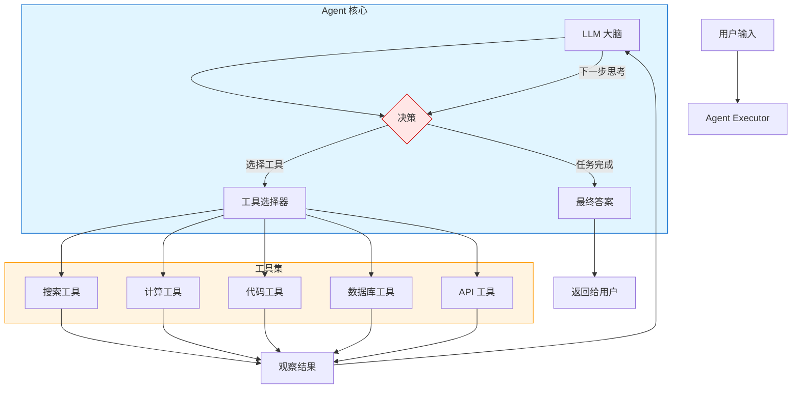
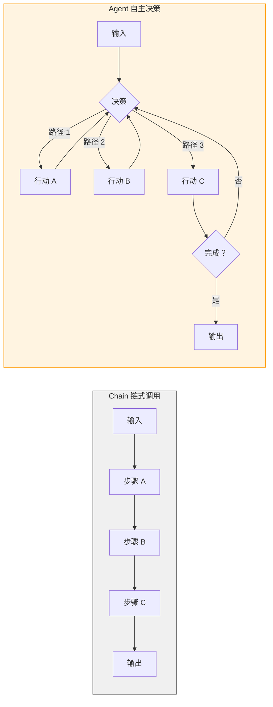
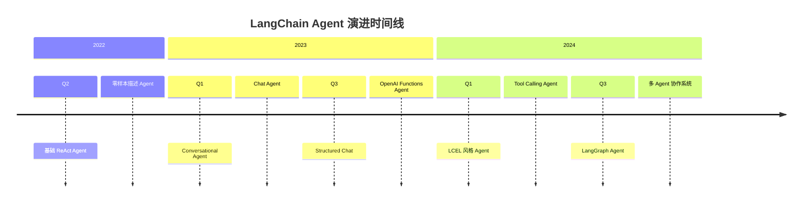

# Agent 概述

> LangChain Agent 是构建自主 AI 应用的核心组件。本章将带你深入理解 Agent 的概念、架构、类型以及演进历史。

## 什么是 Agent？

在 LangChain 中，**Agent（智能体）** 是一个能够自主决策、调用工具并完成复杂任务的系统。与传统 Chain 不同，Agent 具备动态决策能力，可以根据任务需求灵活选择执行路径。

### Agent 的核心公式

```
Agent = LLM + Tools + Loop
```

这个简洁的公式揭示了 Agent 的三个核心组成部分：

| 组成部分 | 说明 | 作用 |
|----------|------|------|
| **LLM** | 大语言模型 | 提供推理和决策能力，是 Agent 的"大脑" |
| **Tools** | 工具集合 | 提供执行能力，是 Agent 的"手脚" |
| **Loop** | 执行循环 | 驱动 Agent 持续思考 - 行动 - 观察，直到任务完成 |

💡 **提示**：Agent 的强大之处在于它能够根据当前状态动态决定下一步行动，而不是按照预设的固定流程执行。

## Agent 架构详解

::: v-pre

:::

**架构说明：**

1. **输入处理**：用户请求进入 AgentExecutor
2. **LLM 推理**：LLM 分析当前状态，决定下一步行动
3. **工具调用**：如果需要使用工具，Agent 选择并调用相应工具
4. **观察反馈**：工具执行结果作为新的观察输入给 LLM
5. **循环迭代**：LLM 基于新观察继续推理，直到任务完成
6. **输出结果**：生成最终答案返回给用户

## Agent 的主要类型

LangChain 支持多种 Agent 类型，每种类型适用于不同的场景：

### 1. ReAct Agent

**ReAct**（Reasoning + Acting）是最经典的 Agent 类型，它将推理和行动交织在一起。

```python
from langchain.agents import create_react_agent, AgentExecutor
from langchain import hub
from langchain_openai import ChatOpenAI
from langchain_core.tools import Tool

# 定义工具
tools = [
    Tool(
        name="Search",
        description="搜索互联网获取最新信息",
        func=lambda x: "搜索结果示例"
    ),
    Tool(
        name="Calculator", 
        description="执行数学计算",
        func=lambda x: str(eval(x))
    )
]

# 创建 ReAct Agent
llm = ChatOpenAI(model="gpt-4o", temperature=0)
prompt = hub.pull("hwchase17/react")

agent = create_react_agent(llm, tools, prompt)
agent_executor = AgentExecutor(agent=agent, tools=tools, verbose=True)

# 执行任务
result = agent_executor.invoke({
    "input": "今天北京的天气如何？温度乘以 2 是多少？"
})
print(result["output"])
```

**ReAct 特点：**
- 思考（Thought）→ 行动（Action）→ 观察（Observation）循环
- 适合需要多步推理和工具调用的复杂任务
- 输出可解释性强，便于调试

### 2. OpenAI Tools Agent

这是专为 OpenAI 函数调用（Function Calling）优化的 Agent 类型。

```python
from langchain.agents import create_openai_tools_agent, AgentExecutor
from langchain_openai import ChatOpenAI
from langchain_core.tools import tool

@tool
def get_weather(location: str) -> str:
    """获取指定地点的天气信息"""
    return f"{location} 今天晴朗，温度 25°C"

@tool  
def calculate(expression: str) -> str:
    """计算数学表达式"""
    return str(eval(expression))

llm = ChatOpenAI(model="gpt-4o")
tools = [get_weather, calculate]

agent = create_openai_tools_agent(llm, tools)
executor = AgentExecutor(agent=executor, tools=tools, verbose=True)

result = executor.invoke({"input": "上海天气如何？"})
```

**OpenAI Tools 特点：**
- 利用 OpenAI 原生函数调用能力
- 工具调用更准确、高效
- 仅适用于支持函数调用的模型

### 3. Structured Chat Agent

结构化聊天 Agent 使用更严格的输出格式，提高工具调用的可靠性。

```python
from langchain.agents import create_structured_chat_agent, AgentExecutor
from langchain_openai import ChatOpenAI
from langchain_core.tools import Tool

llm = ChatOpenAI(model="gpt-4o")
tools = [Tool(name="Search", description="搜索工具", func=lambda x: "结果")]

agent = create_structured_chat_agent(llm, tools)
executor = AgentExecutor(agent=agent, tools=tools, verbose=True)
```

**Structured Chat 特点：**
- 使用结构化格式减少解析错误
- 适合工具较多的复杂场景
- 对 LLM 输出格式要求更严格

### 4. Plan-and-Execute Agent

分阶段执行 Agent，先生成计划再逐步执行。

```python
from langchain_experimental.plan_and_execute import (
    PlanAndExecute,
    load_agent_executor,
    load_chat_planner
)
from langchain_openai import ChatOpenAI
from langchain.agents import load_tools

llm = ChatOpenAI(model="gpt-4o", temperature=0)
tools = load_tools(["serpapi", "llm-math"], llm=llm)

planner = load_chat_planner(llm)
executor = load_agent_executor(llm, tools, verbose=True)

agent = PlanAndExecute(planner=planner, executor=executor, verbose=True)
result = agent.invoke({"input": "分析 AI 行业发展趋势"})
```

**Plan-and-Execute 特点：**
- 适合复杂、长期的任务
- 先规划整体步骤，再逐个执行
- 可以更好地控制执行流程

## 类型对比表

| Agent 类型 | 适用场景 | 优点 | 缺点 |
|------------|----------|------|------|
| **ReAct** | 通用任务、多步推理 | 经典可靠、可解释性强 | 调用次数可能较多 |
| **OpenAI Tools** | OpenAI 模型、简单任务 | 高效准确、原生支持 | 仅限特定模型 |
| **Structured Chat** | 复杂工具集、高可靠性要求 | 格式严格、错误率低 | 配置较复杂 |
| **Plan-and-Execute** | 长期复杂任务、需要规划 | 有计划性、可控性强 | 响应较慢、开销大 |

## Agent vs Chain 的本质区别

理解 Agent 与 Chain 的区别对于选择合适的架构至关重要：

::: v-pre

:::

### 关键差异对比

| 维度 | Chain | Agent |
|------|-------|-------|
| **执行流程** | 预定义、固定顺序 | 动态、自主决策 |
| **决策能力** | 无，按预设执行 | 有，根据状态选择行动 |
| **工具调用** | 显式编排 | 自主选择 |
| **适用场景** | 结构化、确定性任务 | 非结构化、开放性任务 |
| **可预测性** | 高 | 相对较低 |
| **调试难度** | 容易 | 较复杂 |

💡 **提示**：如果任务流程是确定的，优先使用 Chain；如果需要灵活决策和工具调用，选择 Agent。

## Agent 演进史

### 第一代：基础 Agent

早期 LangChain Agent 主要基于简单的 ReAct 模式，功能相对基础。

```python
# 早期 Agent 示例
from langchain.agents import initialize_agent, Tool
from langchain.llms import OpenAI

llm = OpenAI(temperature=0)
tools = [Tool(name="Search", func=search_func)]
agent = initialize_agent(tools, llm, agent="zero-shot-react-description")
```

### 第二代：多样化 Agent

随着 LangChain 的发展，出现了更多类型的 Agent：
- Conversational Agent（对话式）
- Chat Agent（聊天式）
- Structured Chat Agent（结构化）

### 第三代：LCEL 与 LangGraph

现代 LangChain 采用 LCEL（LangChain Expression Language）风格：

```python
# LCEL 风格 Agent
from langchain.agents import create_tool_calling_agent
from langchain_core.runnables import RunnablePassthrough

agent = (
    RunnablePassthrough.assign(
        agent_scratchpad=lambda x: format_to_openai_tool_messages(x["intermediate_steps"])
    )
    | prompt
    | llm_with_tools
    | output_parser
)
```

### 第四代：LangGraph Agent

最新一代基于 LangGraph，提供更强大的状态管理和循环控制：

```python
from langgraph.prebuilt import create_react_agent

agent = create_react_agent("gpt-4o", tools)
response = agent.invoke({"messages": [("user", "查询天气")]})
```

## Agent 演进时间线

::: v-pre

:::

## 实际应用场景

### 场景 1：客户服务自动化

```python
from langchain.agents import AgentExecutor, create_tool_calling_agent
from langchain_openai import ChatOpenAI

# 客服工具集
tools = [
    Tool(name="OrderLookup", description="查询订单状态", func=lookup_order),
    Tool(name="RefundProcess", description="处理退款申请", func=process_refund),
    Tool(name="FAQSearch", description="搜索常见问题", func=search_faq),
]

llm = ChatOpenAI(model="gpt-4o")
agent = create_tool_calling_agent(llm, tools)
executor = AgentExecutor(agent=agent, tools=tools, verbose=True)

# 处理客户咨询
response = executor.invoke({
    "input": "我上周下的订单还没收到，能帮我查一下吗？订单号是 12345"
})
```

### 场景 2：数据分析助手

```python
# 数据分析 Agent
tools = [
    Tool(name="SQLQuery", description="执行数据库查询", func=run_query),
    Tool(name="DataViz", description="生成可视化图表", func=create_chart),
    Tool(name="StatAnalysis", description="统计分析", func=analyze_stats),
]

response = executor.invoke({
    "input": "分析上个月销售数据，生成趋势图并找出销售最好的产品"
})
```

### 场景 3：研究辅助工具

```python
# 研究助手 Agent
tools = [
    Tool(name="WebSearch", description="搜索学术论文", func=search_papers),
    Tool(name="PDFReader", description="解析 PDF 文档", func=read_pdf),
    Tool(name="CitationGen", description="生成引用格式", func=generate_citation),
    Tool(name="Summarizer", description="总结文档内容", func=summarize),
]

response = executor.invoke({
    "input": "查找关于大语言模型推理优化的最新论文并总结主要观点"
})
```

## 核心组件详解

### LLM 选择

选择合适的 LLM 是构建 Agent 的基础：

| 模型系列 | 推荐用于 | 特点 |
|----------|----------|------|
| GPT-4o / GPT-4 | 复杂 Agent 任务 | 最强的推理和工具调用能力 |
| GPT-3.5-Turbo | 简单 Agent 任务 | 成本低，速度快 |
| Claude 3 | 长上下文任务 | 优秀的长文本理解 |
| 本地模型 | 隐私敏感场景 | 数据不出域 |

### 工具设计原则

💡 **提示**：好的工具设计是 Agent 成功的关键。

1. **清晰的名称**：使用动词 + 名词格式，如 `search_web`、`calculate_expression`
2. **准确的描述**：描述应该说明工具的用途、输入和输出
3. **合理的粒度**：工具不应太细也不应太粗，一个工具做一件事
4. **错误处理**：工具应该有完善的错误处理和返回值

### 提示工程

Agent 的 System Prompt 直接影响其行为：

```python
from langchain_core.prompts import ChatPromptTemplate

prompt = ChatPromptTemplate.from_messages([
    ("system", """你是一个智能助手，可以调用工具帮助用户解决问题。

请遵循以下步骤：
1. 仔细分析用户的问题
2. 决定是否需要使用工具
3. 如果需要，选择合适的工具并调用
4. 根据工具返回结果给出最终答案

可用的工具：
{tools}

使用以下格式：
Question: 需要回答的问题
Thought: 你的思考过程
Action: 选择使用的工具名称
Action Input: 工具输入参数
Observation: 工具返回结果
...（上述 Thought/Action/Observation 可以重复 N 次）
Thought: 我现在知道了最终答案
Final Answer: 给用户的最终回答

开始！"""),
    ("human", "{input}"),
    ("ai", "{agent_scratchpad}"),
])
```

## 调试与优化

### 开启详细日志

```python
executor = AgentExecutor(
    agent=agent, 
    tools=tools, 
    verbose=True,  # 开启详细日志
    return_intermediate_steps=True  # 返回中间步骤
)

result = executor.invoke({"input": "你的问题"})
print(result["intermediate_steps"])  # 查看中间过程
```

### 常见问题排查

| 问题 | 可能原因 | 解决方案 |
|------|----------|----------|
| 工具调用失败 | 描述不清晰 | 优化工具描述和参数 |
| 无限循环 | max_iterations 过低 | 增加迭代次数上限 |
| 响应过慢 | 任务太复杂 | 简化任务或增加模型能力 |
| 输出格式错误 | 提示词不清晰 | 优化 System Prompt |

## 最佳实践

### ✅ 应该做的

- 为每个工具编写清晰、准确的描述
- 设置合理的 `max_iterations` 防止无限循环
- 使用 `verbose=True` 在开发阶段调试
- 为复杂任务提供更详细的上下文
- 处理边界情况和错误

### ❌ 不应该做的

- 不要创建过多工具（一般 5-10 个为宜）
- 不要让工具之间功能重叠
- 不要忽略错误处理
- 不要期望 Agent 能处理过于模糊的任务

## 本章小结

本章介绍了 LangChain Agent 的核心概念：

1. **Agent 公式**：Agent = LLM + Tools + Loop
2. **四种主要类型**：ReAct、OpenAI Tools、Structured Chat、Plan-and-Execute
3. **与 Chain 的区别**：Agent 具备动态决策能力
4. **演进历史**：从简单 ReAct 到 LangGraph 多 Agent 系统

下一章我们将深入探讨最经典的 **ReAct Agent**，了解其工作原理和实战应用。

## 继续学习

- [ReAct Agent 实战](./react-agent.md) - 深入学习 ReAct 原理和应用
- [工具与工具包](./tools-toolkit.md) - 了解内置工具和工具包
- [自定义工具](./custom-tools.md) - 创建你自己的工具
- [Agent 执行器](./agent-executor.md) - 深入 AgentExecutor
- [LCEL 风格 Agent](./lcel-agent.md) - 现代化的 Agent 构建方式