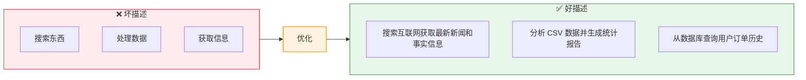
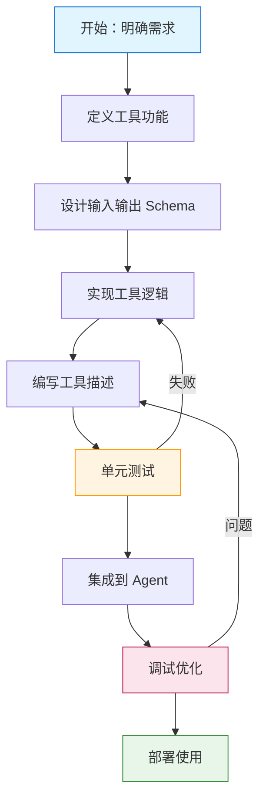

# 自定义工具

> 当内置工具无法满足需求时，我们需要创建自定义工具。本章将详细介绍自定义工具的开发方法、最佳实践和高级技巧。

## 为什么需要自定义工具？

LangChain 虽然提供了丰富的内置工具，但在实际项目中，我们常常需要：

- **访问私有 API**：公司内部的服务接口
- **操作专有数据**：自有数据库、文件系统
- **特定业务逻辑**：行业特有的计算和处理逻辑
- **性能优化**：针对特定场景的优化实现

```python
# 示例：电商公司的订单查询工具
# 内置工具无法满足，需要自定义

from langchain_core.tools import tool

@tool
def query_order_status(order_id: str, user_id: str) -> dict:
    """
    查询订单状态。
    
    参数:
        order_id: 订单号
        user_id: 用户 ID
    
    返回:
        订单详细信息
    """
    # 调用公司内部 API
    response = internal_api.get(f"/orders/{order_id}", params={"user_id": user_id})
    return response.json()
```

## @tool 装饰器详解

`@tool` 是 LangChain 提供的最便捷的工具定义方式。

### 基础用法

```python
from langchain_core.tools import tool

@tool
def add(a: int, b: int) -> int:
    """将两个数字相加"""
    return a + b

# 查看工具属性
print(f"名称：{add.name}")
print(f"描述：{add.description}")
print(f"参数：{add.args}")

# 使用工具
result = add.invoke({"a": 5, "b": 3})
print(f"结果：{result}")
```

### 完整工具定义

```python
from langchain_core.tools import tool
from typing import Optional, List
import json

@tool
def analyze_sales_data(
    start_date: str,
    end_date: str,
    product_category: Optional[str] = None,
    region: Optional[List[str]] = None
) -> dict:
    """
    分析销售数据。
    
    这个工具用于分析指定时间段内的销售数据，可以按产品类别和区域进行筛选。
    适用于销售报告、业绩分析、趋势预测等场景。
    
    参数:
        start_date: 开始日期，格式 YYYY-MM-DD
        end_date: 结束日期，格式 YYYY-MM-DD
        product_category: 可选，产品类别（如"电子产品"、"服装"）
        region: 可选，地区列表（如["华东", "华北"]）
    
    返回:
        包含以下字段的字典:
        - total_sales: 总销售额
        - order_count: 订单数量
        - avg_order_value: 平均订单价值
        - top_products: 热销产品列表
        - growth_rate: 环比增长率
    
    示例:
        >>> analyze_sales_data.invoke({
        ...     "start_date": "2024-01-01",
        ...     "end_date": "2024-01-31",
        ...     "product_category": "电子产品"
        ... })
        {'total_sales': 1000000, 'order_count': 5000, ...}
    """
    # 模拟数据分析逻辑
    result = {
        "total_sales": 1000000,
        "order_count": 5000,
        "avg_order_value": 200,
        "top_products": ["产品 A", "产品 B", "产品 C"],
        "growth_rate": 0.15
    }
    
    if product_category:
        result["category"] = product_category
    if region:
        result["regions"] = region
    
    return result

# 使用示例
result = analyze_sales_data.invoke({
    "start_date": "2024-01-01",
    "end_date": "2024-01-31",
    "product_category": "电子产品",
    "region": ["华东", "华南"]
})

print(json.dumps(result, indent=2, ensure_ascii=False))
```

### 返回值注解

```python
from langchain_core.tools import tool
from typing import TypedDict, Literal

# 使用 TypedDict 定义返回类型
class WeatherResult(TypedDict):
    temperature: float
    condition: str
    humidity: int
    wind_speed: float

@tool
def get_weather(city: str) -> WeatherResult:
    """
    获取城市天气。
    
    参数:
        city: 城市名称
    
    返回:
        包含温度、天气状况、湿度、风速的信息
    """
    return {
        "temperature": 25.5,
        "condition": "晴",
        "humidity": 60,
        "wind_speed": 3.2
    }

# 使用 Literal 定义枚举值
@tool
def set_status(status: Literal["online", "offline", "busy", "away"]) -> str:
    """
    设置用户状态。
    
    参数:
        status: 状态值，只能是 online、offline、busy 或 away
    
    返回:
        设置结果
    """
    return f"状态已设置为：{status}"
```

## StructuredTool 类

对于更复杂的场景，可以直接继承 `StructuredTool` 类。

### 基础继承

```python
from langchain_core.tools import StructuredTool
from typing import Type
from pydantic import BaseModel, Field

# 定义输入 schema
class CalculatorInput(BaseModel):
    """计算器输入"""
    operation: str = Field(description="运算类型：add, subtract, multiply, divide")
    a: float = Field(description="第一个操作数")
    b: float = Field(description="第二个操作数")

class AdvancedCalculator(StructuredTool):
    name = "advanced_calculator"
    description = "高级计算器，支持多种运算"
    args_schema: Type[BaseModel] = CalculatorInput
    
    def _run(self, operation: str, a: float, b: float) -> str:
        """执行计算"""
        operations = {
            "add": lambda x, y: x + y,
            "subtract": lambda x, y: x - y,
            "multiply": lambda x, y: x * y,
            "divide": lambda x, y: x / y if y != 0 else "错误：除数不能为零"
        }
        
        if operation not in operations:
            return f"错误：不支持的运算类型 {operation}"
        
        result = operations[operation](a, b)
        return f"{a} {operation} {b} = {result}"
    
    async def _arun(self, operation: str, a: float, b: float) -> str:
        """异步执行（可选）"""
        return self._run(operation, a, b)

# 创建工具
calculator = AdvancedCalculator()

# 使用
result = calculator.invoke({
    "operation": "multiply",
    "a": 15,
    "b": 7
})
print(result)
```

### Tool 类（简单工具）

对于不需要 schema 验证的简单工具，可以使用 `Tool` 类：

```python
from langchain_core.tools import Tool

def simple_add(a: float, b: float) -> float:
    return a + b

tool = Tool(
    name="simple_add",
    func=simple_add,
    description="简单加法工具"
)

# 或者直接传入 lambda
tool = Tool(
    name="greet",
    func=lambda name: f"你好，{name}!",
    description="打招呼工具"
)
```

## 工具描述的艺术

工具描述的质量直接影响 Agent 的选择准确性。这是自定义工具开发中最重要的一环。

### 好坏描述对比

::: v-pre

:::

### 详细描述示例

```python
from langchain_core.tools import tool

# ❌ 坏描述
@tool
def search(query: str) -> str:
    """搜索"""  # 太简单，Agent 不知道何时使用
    return search_api(query)

# ✅ 好描述
@tool
def search_web(query: str) -> str:
    """
    搜索互联网获取最新信息。
    
    【何时使用】
    - 需要查询最新新闻或事件
    - 验证事实或数据
    - 查找人物、地点、概念的信息
    - 获取产品评论或比较
    
    【何时不使用】
    - 数学计算（使用 Calculator 工具）
    - 代码执行（使用 Python 工具）
    - 查询内部数据库（使用 DBQuery 工具）
    
    【输入格式】
    - 清晰的搜索关键词
    - 可以包含年份以获取历史结果
    - 避免模糊的查询
    
    【示例查询】
    - "2024 年巴黎奥运会奖牌榜"
    - "Python 3.12 新特性"
    - "特斯拉 Model 3 评测"
    """
    return search_api(query)
```

### 描述模板

```python
def create_tool_description(
    purpose: str,
    when_to_use: list[str],
    when_not_to_use: list[str],
    input_format: str = None,
    examples: list[str] = None,
    return_format: str = None
) -> str:
    """
    创建结构化的工具描述。
    
    Args:
        purpose: 工具用途简述
        when_to_use: 使用场景列表
        when_not_to_use: 不适用场景列表
        input_format: 输入格式说明
        examples: 使用示例
        return_format: 返回格式说明
    """
    desc = f"{purpose}\n\n"
    
    if when_to_use:
        desc += "【何时使用】\n"
        desc += "\n".join(f"- {item}" for item in when_to_use)
        desc += "\n\n"
    
    if when_not_to_use:
        desc += "【何时不使用】\n"
        desc += "\n".join(f"- {item}" for item in when_not_to_use)
        desc += "\n\n"
    
    if input_format:
        desc += f"【输入格式】\n{input_format}\n\n"
    
    if examples:
        desc += "【示例】\n"
        desc += "\n".join(f"- {ex}" for ex in examples)
        desc += "\n\n"
    
    if return_format:
        desc += f"【返回格式】\n{return_format}\n"
    
    return desc

# 使用模板
weather_description = create_tool_description(
    purpose="获取指定城市的实时天气信息",
    when_to_use=[
        "用户询问天气情况",
        "需要规划户外活动",
        "出行前查询天气"
    ],
    when_not_to_use=[
        "历史天气查询",
        "长期天气预报（超过 7 天）",
        "海洋气象"
    ],
    input_format="城市名称，可以是中文或英文，如'北京'或'Beijing'",
    examples=[
        "北京今天天气如何？",
        "上海周末会下雨吗？",
        "纽约现在的温度"
    ],
    return_format="返回 JSON：包含温度、天气状况、湿度、风速、空气质量指数"
)

@tool
def get_weather(city: str) -> dict:
    description = weather_description
    # 实现...
    pass
```

## 多参数工具

实际业务中，工具往往需要多个参数。

### 可选参数

```python
from langchain_core.tools import tool
from typing import Optional, List

@tool
def search_products(
    keyword: str,
    min_price: Optional[float] = None,
    max_price: Optional[float] = None,
    categories: Optional[List[str]] = None,
    sort_by: str = "relevance"
) -> list[dict]:
    """
    搜索商品。
    
    参数:
        keyword: 搜索关键词（必需）
        min_price: 最低价格（可选）
        max_price: 最高价格（可选）
        categories: 商品类别列表（可选）
        sort_by: 排序方式，可选：relevance, price_asc, price_desc, sales
    
    返回:
        商品列表，每个商品包含：id, name, price, category, sales
    """
    # 构建查询参数
    params = {"q": keyword, "sort": sort_by}
    
    if min_price is not None:
        params["min_price"] = min_price
    if max_price is not None:
        params["max_price"] = max_price
    if categories:
        params["categories"] = ",".join(categories)
    
    # 调用搜索 API（模拟）
    results = [
        {"id": 1, "name": "商品 A", "price": 99, "category": "电子", "sales": 1000},
        {"id": 2, "name": "商品 B", "price": 199, "category": "服装", "sales": 500},
    ]
    
    # 应用筛选
    if min_price:
        results = [r for r in results if r["price"] >= min_price]
    if max_price:
        results = [r for r in results if r["price"] <= max_price]
    
    return results

# 使用示例
# 简单调用
results = search_products.invoke({"keyword": "手机"})

# 带筛选条件
results = search_products.invoke({
    "keyword": "笔记本电脑",
    "min_price": 3000,
    "max_price": 8000,
    "categories": ["电脑", "数码"],
    "sort_by": "sales"
})
```

### 复杂参数类型

```python
from langchain_core.tools import tool
from typing import TypedDict, Literal
from datetime import datetime

class DateRange(TypedDict):
    start: str  # ISO 格式日期
    end: str

class FilterOptions(TypedDict):
    status: Literal["active", "inactive", "all"]
    tags: list[str]
    author: str

@tool
def query_articles(
    date_range: DateRange,
    filters: Optional[FilterOptions] = None,
    limit: int = 10
) -> list[dict]:
    """
    查询文章。
    
    参数:
        date_range: 日期范围 {"start": "2024-01-01", "end": "2024-12-31"}
        filters: 可选，筛选条件
        limit: 返回结果数量限制，默认 10
    
    返回:
        文章列表
    """
    # 实现查询逻辑
    pass
```

## 异步工具

对于 I/O 密集型操作，异步工具可以提高性能。

### 定义异步工具

```python
from langchain_core.tools import tool
import aiohttp
import asyncio

@tool
async def fetch_webpage(url: str) -> str:
    """
    异步获取网页内容。
    
    参数:
        url: 网页 URL
    
    返回:
        网页 HTML 内容
    """
    async with aiohttp.ClientSession() as session:
        async with session.get(url, timeout=10) as response:
            return await response.text()

@tool
async def batch_fetch_urls(urls: list[str]) -> dict[str, str]:
    """
    批量获取多个网页内容。
    
    参数:
        urls: URL 列表
    
    返回:
        URL 到内容的映射
    """
    async def fetch(session, url):
        try:
            async with session.get(url, timeout=10) as response:
                return url, await response.text()
        except Exception as e:
            return url, f"错误：{e}"
    
    async with aiohttp.ClientSession() as session:
        tasks = [fetch(session, url) for url in urls]
        results = await asyncio.gather(*tasks)
        return dict(results)

# 异步使用
async def main():
    content = await fetch_webpage.ainvoke({"url": "https://example.com"})
    print(content[:200])
    
    contents = await batch_fetch_urls.ainvoke({
        "urls": ["https://example.com", "https://python.org"]
    })
    print(contents)

# asyncio.run(main())
```

### 混合异步/同步

```python
from langchain_core.tools import StructuredTool
from pydantic import BaseModel

class APIInput(BaseModel):
    endpoint: str
    method: str = "GET"
    data: dict = None

class AsyncAPITool(StructuredTool):
    name = "async_api"
    description = "异步调用 HTTP API"
    args_schema: type[BaseModel] = APIInput
    
    def _run(self, endpoint: str, method: str = "GET", data: dict = None) -> str:
        """同步版本（使用 requests）"""
        import requests
        
        url = f"https://api.example.com{endpoint}"
        if method == "GET":
            response = requests.get(url)
        elif method == "POST":
            response = requests.post(url, json=data)
        else:
            return f"不支持的方法：{method}"
        
        return response.text
    
    async def _arun(self, endpoint: str, method: str = "GET", data: dict = None) -> str:
        """异步版本（使用 aiohttp）"""
        import aiohttp
        
        url = f"https://api.example.com{endpoint}"
        async with aiohttp.ClientSession() as session:
            if method == "GET":
                async with session.get(url) as response:
                    return await response.text()
            elif method == "POST":
                async with session.post(url, json=data) as response:
                    return await response.text()
            else:
                return f"不支持的方法：{method}"

# 使用
api_tool = AsyncAPITool()

# 同步调用
result = api_tool.invoke({"endpoint": "/users", "method": "GET"})

# 异步调用
async def main():
    result = await api_tool.ainvoke({"endpoint": "/users", "method": "GET"})
```

## 自定义 Tool 开发流程

::: v-pre

:::

### 步骤 1：需求分析

```python
# 在编写代码前，先明确：
# 1. 工具要解决什么问题？
# 2. 输入是什么？输出是什么？
# 3. 什么场景下使用？
# 4. 有什么边界和限制？

# 示例：订单查询工具需求文档
"""
工具名称：query_order
用途：查询电商订单状态和详情
输入：order_id（订单号）、user_id（用户 ID）
输出：订单详细信息（状态、商品、金额、物流）
使用场景：客服查询、用户自助查询
限制：只能查询自己用户的订单
"""
```

### 步骤 2:实现与测试

```python
from langchain_core.tools import tool
import unittest

@tool
def calculate_shipping_fee(
    weight: float,
    distance: float,
    express: bool = False
) -> dict:
    """
    计算运费。
    
    参数:
        weight: 包裹重量（kg）
        distance: 运输距离（km）
        express: 是否加急，默认 False
    
    返回:
        包含基础运费、加急费、总费用的字典
    """
    # 基础费率：每 kg 每 km 0.01 元
    base_rate = 0.01
    base_fee = weight * distance * base_rate
    
    # 最低运费
    min_fee = 5.0
    base_fee = max(base_fee, min_fee)
    
    # 加急费
    express_fee = base_fee * 0.5 if express else 0
    
    total_fee = base_fee + express_fee
    
    return {
        "base_fee": round(base_fee, 2),
        "express_fee": round(express_fee, 2),
        "total_fee": round(total_fee, 2),
        "currency": "CNY"
    }

# 单元测试
class TestShippingFee(unittest.TestCase):
    def test_basic_calculation(self):
        result = calculate_shipping_fee.invoke({
            "weight": 2.0,
            "distance": 100.0
        })
        self.assertEqual(result["base_fee"], 2.0)  # 2 * 100 * 0.01
        self.assertEqual(result["express_fee"], 0)
    
    def test_express(self):
        result = calculate_shipping_fee.invoke({
            "weight": 2.0,
            "distance": 100.0,
            "express": True
        })
        self.assertEqual(result["express_fee"], 1.0)  # 2.0 * 0.5
    
    def test_minimum_fee(self):
        result = calculate_shipping_fee.invoke({
            "weight": 0.1,
            "distance": 10.0
        })
        self.assertEqual(result["base_fee"], 5.0)  # 最低运费

if __name__ == "__main__":
    unittest.main()
```

### 步骤 3：错误处理

```python
from langchain_core.tools import tool
from typing import Optional

@tool
def safe_calculate(expression: str) -> str:
    """
    安全地计算数学表达式。
    
    参数:
        expression: 数学表达式字符串
    
    返回:
        计算结果或错误信息
    """
    import math
    
    try:
        # 安全检查
        if not expression or not isinstance(expression, str):
            return "错误：表达式必须是非空字符串"
        
        # 只允许安全的字符
        allowed = set("0123456789+-*/()., math.sin cos tan log sqrt pow pi e")
        if not all(c in allowed or c.isalpha() or c.isspace() for c in expression):
            return "错误：表达式包含非法字符"
        
        # 安全执行
        safe_dict = {
            "abs": abs, "round": round,
            "math": math, "pi": math.pi, "e": math.e,
            "sin": math.sin, "cos": math.cos, "tan": math.tan,
            "log": math.log, "log10": math.log10, "sqrt": math.sqrt,
            "pow": pow, "min": min, "max": max,
        }
        
        result = eval(expression, {"__builtins__": {}}, safe_dict)
        return str(result)
    
    except ZeroDivisionError:
        return "错误：除数不能为零"
    except ValueError as e:
        return f"错误：数值错误 - {e}"
    except OverflowError:
        return "错误：数值溢出"
    except Exception as e:
        return f"错误：{type(e).__name__} - {e}"

# 测试错误处理
print(safe_calculate.invoke({"expression": "10 / 0"}))
# 输出：错误：除数不能为零

print(safe_calculate.invoke({"expression": "__import__('os').system('rm -rf /')"}))
# 输出：错误：表达式包含非法字符
```

## 工具注册与发现

### 工具注册表

```python
from typing import Dict, Callable
from langchain_core.tools import Tool

class ToolRegistry:
    """工具注册表"""
    
    _tools: Dict[str, Tool] = {}
    
    @classmethod
    def register(cls, tool: Tool) -> None:
        """注册一个工具"""
        cls._tools[tool.name] = tool
        print(f"已注册工具：{tool.name}")
    
    @classmethod
    def get(cls, name: str) -> Optional[Tool]:
        """获取工具"""
        return cls._tools.get(name)
    
    @classmethod
    def list_tools(cls) -> list[str]:
        """列出所有工具"""
        return list(cls._tools.keys())
    
    @classmethod
    def get_all_tools(cls) -> list[Tool]:
        """获取所有工具"""
        return list(cls._tools.values())

# 使用示例
registry = ToolRegistry()

# 创建并注册工具
@tool
def hello(name: str) -> str:
    """打招呼"""
    return f"你好，{name}!"

registry.register(hello)

# 获取工具
hello_tool = registry.get("hello")
print(hello_tool.invoke({"name": "世界"}))

# 列出所有工具
print(f"可用工具：{registry.list_tools()}")
```

### 工具分组

```python
from langchain_core.tools import Tool

class ToolGroup:
    """工具分组"""
    
    def __init__(self, name: str, description: str):
        self.name = name
        self.description = description
        self.tools: list[Tool] = []
    
    def add(self, tool: Tool) -> 'ToolGroup':
        self.tools.append(tool)
        return self
    
    def get_tools(self) -> list[Tool]:
        return self.tools

# 创建工具组
search_group = ToolGroup("搜索", "各种搜索相关工具")
search_group.add(Tool(name="web_search", func=web_search, description="网络搜索"))
search_group.add(Tool(name="db_search", func=db_search, description="数据库搜索"))

calc_group = ToolGroup("计算", "计算相关工具")
calc_group.add(Tool(name="calculator", func=calculate, description="计算器"))
calc_group.add(Tool(name="stats", func=stats, description="统计分析"))

# 合并工具组
all_tools = search_group.get_tools() + calc_group.get_tools()
```

## 实战案例：客服助手工具集

```python
from langchain_core.tools import tool
from datetime import datetime, timedelta
from typing import Optional, List
import json

# ==================== 订单查询工具 ====================

@tool
def query_order_by_id(order_id: str) -> dict:
    """
    根据订单号查询订单详情。
    
    【何时使用】
    - 用户提供订单号查询订单状态
    - 需要获取订单详细信息
    - 处理订单相关咨询
    
    【输入格式】
    - order_id: 订单号，如 "ORD20240101001"
    
    【返回格式】
    - 订单状态、商品信息、支付金额、物流状态
    """
    # 模拟订单数据
    orders = {
        "ORD20240101001": {
            "status": "已发货",
            "items": [{"name": "iPhone 15", "qty": 1, "price": 6999}],
            "total": 6999,
            "shipping": {"company": "顺丰", "tracking": "SF123456789"}
        },
        "ORD20240101002": {
            "status": "配送中",
            "items": [{"name": "AirPods Pro", "qty": 2, "price": 1899}],
            "total": 3798,
            "shipping": {"company": "京东", "tracking": "JD987654321"}
        }
    }
    
    return orders.get(order_id, {"error": "订单不存在"})

# ==================== 退款处理工具 ====================

@tool
def process_refund(
    order_id: str,
    reason: str,
    amount: Optional[float] = None
) -> dict:
    """
    处理退款申请。
    
    【何时使用】
    - 用户申请退款
    - 处理退货退款
    - 部分退款操作
    
    【参数】
    - order_id: 订单号
    - reason: 退款原因
    - amount: 退款金额（可选，默认全额）
    
    【返回】
    - 退款申请结果
    """
    # 模拟退款处理
    return {
        "refund_id": f"REF{datetime.now().strftime('%Y%m%d%H%M%S')}",
        "order_id": order_id,
        "reason": reason,
        "amount": amount or "全额",
        "status": "已受理",
        "estimated_days": "3-5 个工作日"
    }

# ==================== 物流查询工具 ====================

@tool
def track_shipping(tracking_number: str) -> dict:
    """
    查询物流信息。
    
    【何时使用】
    - 用户查询包裹位置
    - 确认配送状态
    - 处理物流异常
    
    【输入】
    - tracking_number: 物流单号
    
    【返回】
    - 物流轨迹列表
    """
    # 模拟物流信息
    return {
        "tracking_number": tracking_number,
        "status": "运输中",
        "updates": [
            {"time": "2024-01-15 08:00", "info": "已签收，签收人：本人"},
            {"time": "2024-01-15 06:30", "info": "派送中，快递员：张三"},
            {"time": "2024-01-14 22:00", "info": "到达北京分拨中心"},
            {"time": "2024-01-14 10:00", "info": "已发出"}
        ]
    }

# ==================== 用户信息工具 ====================

@tool
def get_user_info(user_id: str) -> dict:
    """
    获取用户信息。
    
    【何时使用】
    - 验证用户身份
    - 查询用户等级和权益
    - 处理账户相关问题
    
    【返回】
    - 用户基本信息
    """
    return {
        "user_id": user_id,
        "name": "张**",
        "level": "黄金会员",
        "points": 2580,
        "coupons": 3
    }

# ==================== 工单工具 ====================

@tool
def create_support_ticket(
    user_id: str,
    category: str,
    description: str,
    priority: str = "normal"
) -> dict:
    """
    创建客服工单。
    
    【何时使用】
    - 需要人工介入处理
    - 复杂问题升级
    - 投诉和建议
    
    【参数】
    - user_id: 用户 ID
    - category: 问题分类（技术/账单/物流/其他）
    - description: 问题描述
    - priority: 优先级（low/normal/high/urgent）
    
    【返回】
    - 工单信息
    """
    ticket_id = f"TKT{datetime.now().strftime('%Y%m%d%H%M%S')}"
    return {
        "ticket_id": ticket_id,
        "user_id": user_id,
        "category": category,
        "priority": priority,
        "status": "待处理",
        "created_at": datetime.now().isoformat()
    }

# ==================== 组装工具集 ====================

customer_service_tools = [
    query_order_by_id,
    process_refund,
    track_shipping,
    get_user_info,
    create_support_ticket
]

# 创建客服 Agent
from langchain_openai import ChatOpenAI
from langchain.agents import create_react_agent, AgentExecutor
from langchain import hub

llm = ChatOpenAI(model="gpt-4o", temperature=0)
prompt = hub.pull("hwchase17/react")

agent = create_react_agent(llm, customer_service_tools, prompt)
agent_executor = AgentExecutor(
    agent=agent,
    tools=customer_service_tools,
    verbose=True,
    max_iterations=10
)

# 测试
result = agent_executor.invoke({
    "input": "帮我查一下订单 ORD20240101001 的状态，物流到哪里了？"
})
print(result["output"])
```

## 性能优化

### 工具缓存

```python
from functools import lru_cache
from langchain_core.tools import tool

@lru_cache(maxsize=100)
def cached_api_call(endpoint: str, params: str) -> str:
    """带缓存的 API 调用"""
    # 实际 API 调用
    return api_request(endpoint, params)

@tool
def get_product_info(product_id: str) -> dict:
    """获取商品信息（带缓存）"""
    result = cached_api_call("/products", product_id)
    return json.loads(result)
```

### 批量处理

```python
@tool
def batch_query_orders(order_ids: list[str]) -> list[dict]:
    """
    批量查询订单。
    
    一次调用查询多个订单，比逐个查询更高效。
    
    参数:
        order_ids: 订单号列表
    
    返回:
        订单信息列表
    """
    # 批量查询实现
    results = []
    for order_id in order_ids:
        results.append(query_order_impl(order_id))
    return results
```

## 常见问题

### Q1: 工具描述应该多详细？

**A**: 详细但不过度。应该包括：
- 清晰的用途说明
- 何时使用/不使用
- 输入格式
- 1-2 个示例

### Q2: 如何处理工具的副作用？

**A**: 对于有副作用的操作（如写入、删除）：
```python
@tool
def delete_file(path: str) -> str:
    """
    删除文件。
    
    ⚠️ 警告：此操作不可恢复！
    使用前请确认文件路径正确。
    """
    # 添加确认步骤
    if not confirm_deletion(path):
        return "操作已取消"
    return delete_impl(path)
```

### Q3: 工具太多怎么办？

**A**: 分组建组，按需加载：
```python
# 按场景分组
basic_tools = [search, calculator]
advanced_tools = basic_tools + [code_executor, sql_query]

# 根据用户类型加载
if user.is_admin:
    tools = advanced_tools + admin_tools
else:
    tools = basic_tools
```

## 本章小结

本章深入探讨了自定义工具的开发：

1. **@tool 装饰器**：最便捷的工具定义方式
2. **StructuredTool 类**：适合复杂场景
3. **工具描述**：决定 Agent 选择准确性的关键
4. **多参数与异步**：处理复杂业务需求
5. **开发流程**：从需求到部署的完整流程
6. **实战案例**：客服助手工具集完整实现

下一章我们将深入 **AgentExecutor**，了解 Agent 的执行机制和高级配置。

## 继续学习

- [Agent 执行器](./agent-executor.md) - AgentExecutor 深入解析
- [LCEL 风格 Agent](./lcel-agent.md) - 现代化 Agent 构建
- [工具与工具包](./tools-toolkit.md) - 内置工具回顾
- [ReAct Agent](./react-agent.md) - ReAct 实战