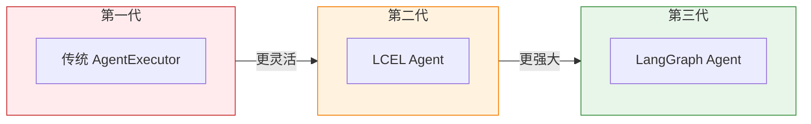
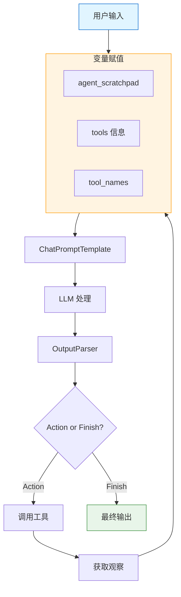

# LCEL 风格 Agent

> LangChain Expression Language (LCEL) 为 Agent 构建提供了更灵活、更现代化的方式。本章将深入讲解 LCEL 风格的 Agent 构建方法。

## 什么是 LCEL？

**LCEL** (LangChain Expression Language) 是 LangChain 的声明式表达式语言，它允许我们以更清晰、更组合的方式构建链和 Agent。

### LCEL 核心概念

```python
from langchain_core.runnables import RunnablePassthrough, RunnableLambda
from langchain_core.output_parsers import StrOutputParser
from langchain_openai import ChatOpenAI

# LCEL 基础：使用 | 操作符连接组件
llm = ChatOpenAI(model="gpt-4o")

# 最简单的链
chain = llm | StrOutputParser()
result = chain.invoke("你好")

# 带变量处理的链
from langchain_core.prompts import ChatPromptTemplate

prompt = ChatPromptTemplate.from_template("翻译以下内容成{language}：{text}")
chain = prompt | llm | StrOutputParser()

result = chain.invoke({
    "language": "英语",
    "text": "你好世界"
})
```

💡 **提示**：LCEL 的核心思想是**组合**——将小的、可复用的组件通过 `|` 操作符连接起来，形成复杂的处理流程。

## LCEL Agent 基础

### 传统 Agent vs LCEL Agent

```python
# ============== 传统 Agent 方式 ==============
from langchain.agents import create_react_agent, AgentExecutor
from langchain import hub

# 1. 获取预定义提示
prompt = hub.pull("hwchase17/react")

# 2. 创建 Agent
agent = create_react_agent(llm, tools, prompt)

# 3. 创建执行器
executor = AgentExecutor(agent=agent, tools=tools)

# ============== LCEL 方式 ==============
from langchain_core.runnables import RunnablePassthrough
from langchain.agents.output_parsers import ReActSingleInputOutputParser
from langchain.agents.format_scratchpad import format_log_to_str

# 1. 自定义提示
from langchain_core.prompts import ChatPromptTemplate

prompt = ChatPromptTemplate.from_messages([
    ("system", "你是一个助手，可以使用工具：{tools}"),
    ("human", "{input}"),
    ("ai", "{agent_scratchpad}"),
])

# 2. 构建 LCEL 链
agent = (
    RunnablePassthrough.assign(
        agent_scratchpad=lambda x: format_log_to_str(x["intermediate_steps"])
    )
    | prompt
    | llm
    | ReActSingleInputOutputParser()
)

# 3. 创建执行器
executor = AgentExecutor(agent=agent, tools=tools)
```

### 完整 LCEL Agent 示例

```python
from langchain_core.tools import Tool
from langchain_openai import ChatOpenAI
from langchain_core.prompts import ChatPromptTemplate
from langchain_core.runnables import RunnablePassthrough
from langchain.agents import AgentExecutor
from langchain.agents.output_parsers import ReActSingleInputOutputParser
from langchain.agents.format_scratchpad import format_log_to_str

# 1. 定义工具
def search(query: str) -> str:
    """搜索互联网"""
    return f"搜索结果：{query}"

def calculate(expression: str) -> str:
    """计算表达式"""
    return str(eval(expression))

tools = [
    Tool(name="Search", func=search, description="搜索信息"),
    Tool(name="Calculator", func=calculate, description="数学计算"),
]

# 2. 绑定工具到 LLM
llm = ChatOpenAI(model="gpt-4o", temperature=0)
llm_with_tools = llm.bind_tools(tools)

# 3. 创建提示模板
prompt = ChatPromptTemplate.from_messages([
    ("system", """你是一个智能助手，可以使用工具来回答问题。

可用工具：
{tools}

请使用以下格式：
Question: 需要回答的问题
Thought: 你的思考过程
Action: 工具名称（{tool_names}之一）
Action Input: 工具输入
Observation: 工具结果
...（可重复）
Thought: 我知道答案了
Final Answer: 最终回答"""),
    ("human", "{input}"),
    ("ai", "{agent_scratchpad}"),
])

# 4. 构建 LCEL Agent
agent = (
    RunnablePassthrough.assign(
        # 格式化中间步骤
        agent_scratchpad=lambda x: format_log_to_str(x["intermediate_steps"]),
        # 添加工具信息
        tools=lambda x: "\n".join([f"- {t.name}: {t.description}" for t in tools]),
        tool_names=lambda x: ", ".join([t.name for t in tools]),
    )
    | prompt
    | llm
    | ReActSingleInputOutputParser()
)

# 5. 创建执行器
agent_executor = AgentExecutor(
    agent=agent,
    tools=tools,
    verbose=True,
    return_intermediate_steps=True
)

# 6. 执行
result = agent_executor.invoke({
    "input": "计算 123 * 456 的结果"
})
print(result["output"])
```

## create_agent_with_tools

LangChain 提供了 `create_agent_with_tools` 函数简化 LCEL Agent 创建。

### 基础用法

```python
from langchain.agents import create_agent_with_tools, AgentExecutor
from langchain_core.tools import Tool
from langchain_openai import ChatOpenAI

# 定义工具
tools = [
    Tool(name="Search", func=lambda x: f"搜索：{x}", description="搜索工具"),
    Tool(name="Calculator", func=lambda x: str(eval(x)), description="计算器"),
]

# 创建 Agent
llm = ChatOpenAI(model="gpt-4o")
agent = create_agent_with_tools(llm, tools)

# 创建执行器
executor = AgentExecutor(agent=agent, tools=tools, verbose=True)

# 执行
result = executor.invoke({"input": "今天天气如何？"})
```

### 自定义提示

```python
from langchain.agents import create_agent_with_tools
from langchain_core.prompts import ChatPromptTemplate

# 自定义提示
custom_prompt = ChatPromptTemplate.from_messages([
    ("system", """你是一个专业的数据分析助手。
你可以使用以下工具来获取和分析数据：
{tools}

请按照以下格式响应：
Thought: 思考
Action: 工具
Action Input: 输入
Observation: 结果
...（重复）
Thought: 知道答案
Final Answer: 答案

开始！"""),
    ("human", "{input}"),
    ("ai", "{agent_scratchpad}"),
])

agent = create_agent_with_tools(
    llm=llm,
    tools=tools,
    prompt=custom_prompt
)
```

## 与 LangGraph Agent 的关系

LangGraph 是 LangChain 的新一代框架，提供了更强大的 Agent 构建能力。

### 演进关系

::: v-pre

:::

### 对比表

| 特性 | AgentExecutor | LCEL Agent | LangGraph |
|------|---------------|------------|-----------|
| **复杂度** | 低 | 中 | 高 |
| **灵活性** | 低 | 高 | 极高 |
| **状态管理** | 有限 | 有限 | 强大 |
| **并行执行** | ❌ | ❌ | ✅ |
| **条件分支** | 有限 | 有限 | ✅ |
| **学习曲线** | 平缓 | 中等 | 陡峭 |
| **适用场景** | 简单任务 | 中等复杂 | 复杂工作流 |

### 从 LCEL 迁移到 LangGraph

```python
# ============== LCEL 版本 ==============
from langchain.agents import AgentExecutor

lcel_agent = (
    RunnablePassthrough.assign(
        agent_scratchpad=lambda x: format_log_to_str(x["intermediate_steps"])
    )
    | prompt
    | llm
    | output_parser
)

executor = AgentExecutor(agent=lcel_agent, tools=tools)

# ============== LangGraph 版本 ==============
from langgraph.prebuilt import create_react_agent

# 更简单的 API
graph = create_react_agent("gpt-4o", tools)

# 执行
response = graph.invoke({
    "messages": [("user", "你好")]
})

# 获取消息
from langchain_core.messages import AIMessage
for msg in response["messages"]:
    if isinstance(msg, AIMessage):
        print(msg.content)
```

## 迁移路径

### 从传统 Agent 迁移到 LCEL

#### 步骤 1：理解现有结构

```python
# 传统方式
from langchain.agents import initialize_agent

agent = initialize_agent(
    tools,
    llm,
    agent="zero-shot-react-description",
    verbose=True
)
```

#### 步骤 2：提取提示模板

```python
# 提取或自定义提示
from langchain_core.prompts import PromptTemplate

prompt = PromptTemplate.from_messages([
    ("system", "系统提示..."),
    ("human", "{input}"),
    ("ai", "{agent_scratchpad}"),
])
```

#### 步骤 3：构建 LCEL 链

```python
from langchain_core.runnables import RunnablePassthrough
from langchain.agents.format_scratchpad import format_log_to_str

agent = (
    RunnablePassthrough.assign(
        agent_scratchpad=lambda x: format_log_to_str(x["intermediate_steps"])
    )
    | prompt
    | llm
    | output_parser
)
```

#### 步骤 4：创建执行器

```python
executor = AgentExecutor(agent=agent, tools=tools, verbose=True)
```

### 完整迁移示例

```python
# ==================== 迁移前 ====================
from langchain.agents import initialize_agent, load_tools
from langchain_openai import ChatOpenAI

llm = ChatOpenAI(model="gpt-4o")
tools = load_tools(["serpapi", "llm-math"], llm=llm)

# 传统 Agent
old_agent = initialize_agent(
    tools,
    llm,
    agent="zero-shot-react-description",
    verbose=True,
    handle_parsing_errors=True
)

# ==================== 迁移后 ====================
from langchain_core.prompts import ChatPromptTemplate
from langchain_core.runnables import RunnablePassthrough
from langchain.agents import AgentExecutor
from langchain.agents.output_parsers import ReActSingleInputOutputParser
from langchain.agents.format_scratchpad import format_log_to_str

# 自定义提示
prompt = ChatPromptTemplate.from_messages([
    ("system", """你是一个助手，可以使用工具回答问题。

可用工具：
{tools}

格式：
Question: 问题
Thought: 思考
Action: 工具
Action Input: 输入
Observation: 结果
...（重复）
Thought: 知道答案
Final Answer: 答案"""),
    ("human", "{input}"),
    ("ai", "{agent_scratchpad}"),
])

# LCEL Agent
new_agent = (
    RunnablePassthrough.assign(
        agent_scratchpad=lambda x: format_log_to_str(x["intermediate_steps"]),
        tools=lambda x: "\n".join([f"- {t.name}: {t.description}" for t in tools]),
    )
    | prompt
    | llm
    | ReActSingleInputOutputParser()
)

# 执行器
new_executor = AgentExecutor(
    agent=new_agent,
    tools=tools,
    verbose=True,
    handle_parsing_errors=True,
    max_iterations=15
)

# 测试对比
test_input = "今天北京的天气如何？温度乘以 2 是多少？"

print("=== 传统 Agent ===")
old_result = old_agent.invoke({"input": test_input})
print(old_result["output"])

print("\n=== LCEL Agent ===")
new_result = new_executor.invoke({"input": test_input})
print(new_result["output"])
```

## LCEL Agent 数据流

::: v-pre

:::

### 数据流详解

```python
from langchain_core.runnables import RunnablePassthrough

# 1. 输入处理
# 输入：{"input": "用户问题", "intermediate_steps": [...]}

# 2. 变量赋值
agent = RunnablePassthrough.assign(
    # 格式化中间步骤为字符串
    agent_scratchpad=lambda x: format_log_to_str(x["intermediate_steps"]),
    # 添加工具描述
    tools=lambda x: "\n".join([f"- {t.name}: {t.description}" for t in tools]),
    # 添加工具名称列表
    tool_names=lambda x: ", ".join([t.name for t in tools]),
)

# 此时数据变为：
# {
#     "input": "用户问题",
#     "intermediate_steps": [...],
#     "agent_scratchpad": "格式化后的步骤",
#     "tools": "工具 1: 描述 1\n工具 2: 描述 2",
#     "tool_names": "工具 1, 工具 2"
# }

# 3. 提示模板填充
# prompt 使用上述所有变量生成完整的提示

# 4. LLM 处理
# LLM 根据提示生成响应

# 5. 输出解析
# OutputParser 将 LLM 响应解析为 AgentAction 或 AgentFinish
```

## 高级 LCEL 技巧

### 1. 条件分支

```python
from langchain_core.runnables import RunnableLambda, RunnablePassthrough

def conditional_router(state):
    """根据条件选择不同路径"""
    if "计算" in state["input"]:
        return calc_chain.invoke(state)
    elif "搜索" in state["input"]:
        return search_chain.invoke(state)
    else:
        return default_chain.invoke(state)

branching_agent = RunnablePassthrough() | RunnableLambda(conditional_router)
```

### 2. 并行处理

```python
from langchain_core.runnables import RunnableParallel

# 并行执行多个任务
parallel_chain = RunnableParallel(
    summary=summary_chain,
    sentiment=sentiment_chain,
    keywords=keyword_chain,
)

result = parallel_chain.invoke({"text": "输入文本"})
# result = {
#     "summary": "...",
#     "sentiment": "...",
#     "keywords": "..."
# }
```

### 3. 错误处理

```python
from langchain_core.runnables import RunnableLambda

def safe_invoke(chain, fallback_value="处理失败"):
    def _safe(inputs):
        try:
            return chain.invoke(inputs)
        except Exception as e:
            return fallback_value
    return RunnableLambda(_safe)

# 使用
safe_chain = safe_invoke(risky_chain, fallback_value="使用默认值")
```

### 4. 链式组合

```python
# 组合多个链
preprocessing = RunnableLambda(lambda x: x.strip().lower())
llm_chain = prompt | llm | StrOutputParser()
postprocessing = RunnableLambda(lambda x: x.upper())

full_chain = preprocessing | llm_chain | postprocessing
```

## 性能优化

### 1. 流式输出

```python
# 流式处理响应
for chunk in agent_executor.stream({"input": "长篇问题"}):
    if "output" in chunk:
        print(chunk["output"], end="", flush=True)
```

### 2. 批量处理

```python
# 批量执行多个输入
inputs = [
    {"input": "问题 1"},
    {"input": "问题 2"},
    {"input": "问题 3"},
]

results = agent_executor.batch(inputs)
```

### 3. 缓存

```python
from langchain_core.caches import InMemoryCache
from langchain.globals import set_llm_cache

# 设置 LLM 缓存
set_llm_cache(InMemoryCache())

# 相同请求会命中缓存
result1 = agent_executor.invoke({"input": "相同问题"})
result2 = agent_executor.invoke({"input": "相同问题"})  # 快速
```

### 4. 异步批处理

```python
import asyncio

async def process_batch(inputs):
    tasks = [agent_executor.ainvoke(inp) for inp in inputs]
    return await asyncio.gather(*tasks)

# 使用
# results = asyncio.run(process_batch(inputs))
```

## 调试与监控

### 1. 详细日志

```python
from langchain.globals import set_debug
set_debug(True)  # 开启调试模式

# 或者配置 logger
import logging
logging.basicConfig(level=logging.DEBUG)
```

### 2. 回调处理

```python
from langchain.callbacks import streaming_stdout

agent_executor = AgentExecutor(
    agent=agent,
    tools=tools,
    callbacks=[streaming_stdout.StreamingStdOutCallbackHandler()],
)
```

### 3. 性能追踪

```python
from langchain.callbacks import get_openai_callback

with get_openai_callback() as cb:
    result = agent_executor.invoke({"input": "问题"})
    print(f"Token 使用：{cb.total_tokens}")
    print(f"总成本：${cb.total_cost}")
```

## 最佳实践

### ✅ 推荐

```python
# 1. 使用类型提示
from typing import TypedDict, List

class AgentState(TypedDict):
    input: str
    intermediate_steps: List
    output: str

# 2. 模块化设计
preprocessing_chain = ...
reasoning_chain = ...
output_chain = ...
full_agent = preprocessing_chain | reasoning_chain | output_chain

# 3. 配置外部化
agent_config = {
    "max_iterations": 15,
    "max_execution_time": 60,
    "handle_parsing_errors": True,
}
executor = AgentExecutor(agent=agent, tools=tools, **agent_config)
```

### ❌ 避免

```python
# 1. 过度复杂的链
# 不要把所有逻辑塞进一个巨型链

# 2. 忽略错误处理
# 始终设置 handle_parsing_errors

# 3. 硬编码配置
# 使用配置字典或环境变量
```

## 本章小结

本章深入探讨了 LCEL 风格的 Agent：

1. **LCEL 基础**：组合式构建链和 Agent
2. **完整示例**：从工具定义到执行器创建
3. **与 LangGraph**：理解演进关系和迁移路径
4. **数据流**：理解 LCEL Agent 的内部工作机制
5. **高级技巧**：条件分支、并行处理、错误处理
6. **性能优化**：流式、批处理、缓存

## 继续学习

- [Chain 基础](../chains/chain-basics.md) - 理解 Chain 概念
- [LCEL 入门](../lcel/) - LCEL 完整教程
- [LangGraph 入门](../langgraph/) - 新一代 Agent 框架
- [Agent 执行器](./agent-executor.md) - AgentExecutor 详解