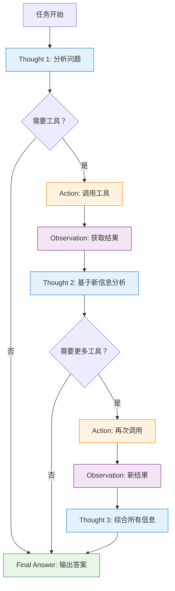

# ReAct Agent 实战

> ReAct（Reasoning + Acting）是最经典的 Agent 架构。本章将深入讲解 ReAct 原理、使用方法以及完整实战案例。

## ReAct 原理详解

**ReAct** 是 **"Reasoning + Acting"** 的缩写，由普林斯顿大学的研究团队在 2022 年提出。它的核心思想是将 **推理（Reasoning）** 和 **行动（Acting）** 交织在一起，让 AI 模型能够在思考中行动，在行动中思考。

### 核心思想

传统 AI 系统要么只做推理（如问答系统），要么只做行动（如执行脚本）。ReAct 的创新在于：

1. **推理指导行动**：通过显式的思考步骤，决定下一步应该采取什么行动
2. **行动反馈推理**：行动的结果作为新的信息输入，指导下一步推理
3. **循环迭代**：思考 - 行动 - 观察的循环持续进行，直到任务完成

::: v-pre

:::

### ReAct 提示模板

ReAct 的成功很大程度上依赖于精心设计的提示模板。标准的 ReAct 模板包含以下部分：

```
System: 你是一个智能助手，可以使用工具来回答问题。

可用工具：
{tools}

请使用以下格式：

Question: 需要回答的问题
Thought: 你应该总是思考下一步该做什么
Action: 要采取的行动，应该是 [{tool_names}] 之一
Action Input: 行动的输入
Observation: 行动的结果
...（这个 Thought/Action/Action Input/Observation 循环可以出现 N 次）
Thought: 我现在知道最终答案了
Final Answer: 对原始问题的最终回答

开始！

Question: {input}
Thought: {agent_scratchpad}
```

💡 **提示**：这个模板的核心是通过 `Thought` 步骤让模型显式地"说出"它的思考过程，这不仅帮助模型更好地推理，也让我们能够理解和调试 Agent 的行为。

## create_react_agent 使用指南

LangChain 提供了 `create_react_agent` 函数来快速创建 ReAct Agent。

### 基础用法

```python
from langchain.agents import create_react_agent, AgentExecutor
from langchain import hub
from langchain_openai import ChatOpenAI
from langchain_core.tools import Tool

# 1. 初始化 LLM
llm = ChatOpenAI(
    model="gpt-4o",
    temperature=0,  # Agent 通常使用较低温度
    max_tokens=2000
)

# 2. 定义工具
def search_func(query: str) -> str:
    """搜索互联网的模拟函数"""
    return f"搜索结果：关于'{query}'的相关信息"

def calculator_func(expression: str) -> str:
    """计算数学表达式"""
    try:
        return str(eval(expression))
    except Exception as e:
        return f"计算错误：{e}"

tools = [
    Tool(
        name="Search",
        func=search_func,
        description="当需要搜索互联网获取信息时使用此工具"
    ),
    Tool(
        name="Calculator",
        func=calculator_func,
        description="当需要执行数学计算时使用此工具。输入应该是有效的数学表达式"
    )
]

# 3. 获取 ReAct 提示模板
prompt = hub.pull("hwchase17/react")

# 4. 创建 Agent
agent = create_react_agent(
    llm=llm,
    tools=tools,
    prompt=prompt
)

# 5. 创建执行器
agent_executor = AgentExecutor(
    agent=agent,
    tools=tools,
    verbose=True,  # 打印详细执行过程
    max_iterations=10,  # 最大迭代次数
    max_execution_time=60,  # 最大执行时间（秒）
)

# 6. 执行任务
result = agent_executor.invoke({
    "input": "珠穆朗玛峰的高度是多少？把这个数字乘以 2"
})

print(result["output"])
```

### 使用自定义提示

```python
from langchain_core.prompts import PromptTemplate

# 自定义 ReAct 提示
custom_prompt = PromptTemplate.from_messages([
    ("system", """你是一个专业的数据分析助手。
你可以使用以下工具来获取和分析数据：

{tools}

请严格按照以下格式响应：

Thought: 你的思考过程
Action: 工具名称（从 {tool_names} 中选择）
Action Input: 工具输入参数
Observation: 工具返回结果
...（可以重复多次）
Thought: 我现在知道答案了
Final Answer: 最终回答

记住：
- 每次只调用一个工具
- 仔细分析每个观察结果
- 如果不确定，先搜索确认"""),
    ("human", "{input}"),
    ("ai", "{agent_scratchpad}"),
])

agent = create_react_agent(llm, tools, custom_prompt)
```

### 添加对话记忆

```python
from langchain.memory import ConversationBufferMemory

memory = ConversationBufferMemory(
    memory_key="chat_history",
    return_messages=True
)

agent_executor = AgentExecutor(
    agent=agent,
    tools=tools,
    memory=memory,  # 添加记忆
    verbose=True
)

# 多轮对话
agent_executor.invoke({"input": "我喜欢科幻小说"})
agent_executor.invoke({"input": "有什么推荐的吗？"})  # 会记住上一轮对话
```

## 完整 ReAct Agent 实战

让我们构建一个功能完整的 ReAct Agent，整合搜索、计算和代码执行能力。

### 实战案例：智能研究助手

这个 Agent 可以帮助用户进行综合研究任务，包括信息检索、数据计算和代码分析。

```python
from langchain.agents import create_react_agent, AgentExecutor
from langchain_core.tools import Tool
from langchain_openai import ChatOpenAI
import requests
import subprocess
import json

# ==================== 工具定义 ====================

# 1. 网络搜索工具
def search_web(query: str) -> str:
    """
    搜索互联网获取最新信息。
    适用于：新闻、事实核查、当前事件、产品信息等
    """
    # 实际使用时可以接入 SerpAPI、Bing Search 等
    try:
        # 这里使用维基百科 API 作为示例
        url = f"https://zh.wikipedia.org/w/api.php"
        params = {
            "action": "query",
            "list": "search",
            "srsearch": query,
            "format": "json",
            "srlimit": 3
        }
        response = requests.get(url, params=params, timeout=5)
        data = response.json()
        
        if data.get("query", {}).get("search"):
            results = []
            for item in data["query"]["search"][:3]:
                results.append(f"- {item['title']}: {item['snippet']}")
            return "\n".join(results)
        return "未找到相关结果"
    except Exception as e:
        return f"搜索出错：{e}"

# 2. 计算器工具
def calculate(expression: str) -> str:
    """
    执行数学计算。
    支持：加减乘除、幂运算、三角函数等
    输入格式：数学表达式，如 "2 + 2" 或 "sin(3.14/2)"
    """
    import math
    
    # 安全的计算环境
    safe_dict = {
        "abs": abs, "round": round,
        "math": math, "pi": math.pi, "e": math.e,
        "sin": math.sin, "cos": math.cos, "tan": math.tan,
        "log": math.log, "log10": math.log10, "sqrt": math.sqrt,
        "pow": pow, "min": min, "max": max,
    }
    
    try:
        # 安全检查：只允许数字和数学运算符
        allowed_chars = set("0123456789+-*/()., math.sin cos tan log sqrt pow")
        if not all(c in allowed_chars or c.isalpha() for c in expression):
            return "错误：表达式包含非法字符"
        
        result = eval(expression, {"__builtins__": {}}, safe_dict)
        return str(result)
    except Exception as e:
        return f"计算错误：{e}"

# 3. Python 代码执行工具
def execute_python(code: str) -> str:
    """
    执行 Python 代码并返回结果。
    适用于：数据处理、统计分析、图表生成等
    注意：代码应该是安全的、非恶意的
    """
    try:
        # 限制执行时间
        result = subprocess.run(
            ["python3", "-c", code],
            capture_output=True,
            text=True,
            timeout=10
        )
        
        output = result.stdout if result.stdout else result.stderr
        return output[:1000]  # 限制输出长度
    except subprocess.TimeoutExpired:
        return "错误：代码执行超时（超过 10 秒）"
    except Exception as e:
        return f"错误：{e}"

# 4. 日期时间工具
def get_datetime() -> str:
    """获取当前日期和时间"""
    from datetime import datetime
    return datetime.now().strftime("%Y年%m月%d日 %H:%M:%S")

# 5. 文本分析工具
def analyze_text(text: str) -> str:
    """
    分析文本的基本信息
    返回：字数、词数、句子数等统计信息
    """
    words = text.split()
    sentences = text.replace("!", ".").replace("?", ".").split(".")
    
    return json.dumps({
        "字符数": len(text),
        "单词数": len(words),
        "句子数": len([s for s in sentences if s.strip()]),
        "平均句长": round(len(words) / max(len(sentences), 1), 2)
    }, ensure_ascii=False)

# ==================== 工具列表 ====================

tools = [
    Tool(
        name="WebSearch",
        func=search_web,
        description="搜索互联网获取信息。适用于查询事实、新闻、定义、人物、事件等。输入是搜索关键词。"
    ),
    Tool(
        name="Calculator",
        func=calculate,
        description="执行数学计算。输入是数学表达式，如 '2+2' 或 'sqrt(16)*3'。支持基本运算和数学函数。"
    ),
    Tool(
        name="PythonExecutor",
        func=execute_python,
        description="执行 Python 代码。适用于复杂计算、数据处理、列表操作等。输入是完整的 Python 代码。"
    ),
    Tool(
        name="DateTime",
        func=get_datetime,
        description="获取当前日期和时间。不需要输入参数。"
    ),
    Tool(
        name="TextAnalyzer",
        func=analyze_text,
        description="分析文本的统计信息。输入是要分析的文本内容。"
    )
]

# ==================== 创建 Agent ====================

llm = ChatOpenAI(
    model="gpt-4o",
    temperature=0,
)

from langchain import hub
prompt = hub.pull("hwchase17/react")

agent = create_react_agent(llm, tools, prompt)

agent_executor = AgentExecutor(
    agent=agent,
    tools=tools,
    verbose=True,
    max_iterations=15,
    max_execution_time=120,
    handle_parsing_errors="请重新尝试，这次请确保使用正确的格式"
)

# ==================== 实战测试 ====================

print("=" * 60)
print("ReAct 智能研究助手")
print("=" * 60)

# 测试 1：信息查询 + 计算
print("\n【测试 1】信息查询结合计算")
result1 = agent_executor.invoke({
    "input": "圆周率是多少？请计算圆周率乘以 100 的结果"
})
print(f"答案：{result1['output']}")

# 测试 2：多步推理
print("\n【测试 2】多步推理任务")
result2 = agent_executor.invoke({
    "input": "现在是什么时间？请分析这段文字：'人工智能正在改变世界'"
})
print(f"答案：{result2['output']}")

# 测试 3：代码执行
print("\n【测试 3】代码执行")
result3 = agent_executor.invoke({
    "input": "请用 Python 计算 1 到 100 的和"
})
print(f"答案：{result3['output']}")
```

### 执行过程分析

让我们看看一个典型任务的执行过程：

```
【输入】圆周率是多少？请计算圆周率乘以 100 的结果

> 进入 Agent 执行...

Thought 1: 我需要先知道圆周率的值，然后进行计算
Action: WebSearch
Action Input: "圆周率"
Observation: 圆周率（π）是一个数学常数，约等于 3.14159265359...

Thought 2: 我得到了圆周率的值，现在需要计算它乘以 100
Action: Calculator
Action Input: "3.14159 * 100"
Observation: 314.159

Thought 3: 我已经得到了所有需要的信息，可以给出最终答案
Final Answer: 圆周率（π）约等于 3.14159，乘以 100 后的结果是 314.159

> 执行完成
```

💡 **提示**：从上面的执行过程可以看到，ReAct Agent 的工作方式是：
1. 首先思考任务需要什么
2. 然后选择并使用一个工具
3. 观察工具返回的结果
4. 基于新信息继续思考
5. 重复直到可以给出最终答案

## ReAct 的优缺点

### 优点 ✅

| 优点 | 说明 |
|------|------|
| **可解释性强** | 每个思考步骤都清晰可见，便于理解和调试 |
| **灵活性好** | 可以根据情况动态选择工具，不受固定流程限制 |
| **通用性强** | 适用于各种需要多步推理的任务 |
| **易于实现** | LangChain 提供了开箱即用的支持 |
| **容错性好** | 即使某一步失败，也可以尝试其他路径 |

### 缺点 ❌

| 缺点 | 说明 |
|------|------|
| **效率较低** | 每个步骤都需要一次 LLM 调用，可能比较慢 |
| **token 消耗大** | 多次迭代导致 token 使用量增加 |
| **可能无限循环** | 不当的配置可能导致反复调用相同工具 |
| **依赖提示质量** | 提示模板设计不好会严重影响效果 |
| **工具调用有限** | 每次只能调用一个工具，不能并行 |

### 性能对比

```python
# 性能测试对比
import time

# ReAct Agent
start = time.time()
result = agent_executor.invoke({"input": "查询天气并计算温度差"})
react_time = time.time() - start

# 对比：直接 LLM 调用
start = time.time()
response = llm.invoke("查询天气并计算温度差")
llm_time = time.time() - start

print(f"ReAct 耗时：{react_time:.2f}秒")
print(f"直接 LLM 耗时：{llm_time:.2f}秒")
print(f"ReAct 调用次数：{len(result.get('intermediate_steps', []))}")
```

典型结果：
- ReAct 可能需要进行 3-5 次 LLM 调用
- 总耗时通常是直接 LLM 调用的 3-5 倍
- 但准确性更高，特别是对于需要外部信息的任务

## 高级技巧

### 技巧 1：工具描述优化

```python
# ❌ 不好的工具描述
bad_tool = Tool(
    name="Search",
    func=search_func,
    description="搜索东西"  # 太模糊
)

# ✅ 好的工具描述
good_tool = Tool(
    name="Search",
    func=search_func,
    description="""当你需要查询以下信息时使用此工具：
- 最新新闻和事件
- 事实性信息（人名、地名、概念定义）
- 产品信息和价格
- 天气预报
- 股票价格

不适用于：数学计算、代码执行、内部数据处理

输入格式：搜索关键词，尽量具体""")
```

### 技巧 2：自定义错误处理

```python
from langchain.agents import AgentExecutor
from langchain_core.exceptions import OutputParserException

def custom_error_handler(error):
    """自定义错误处理策略"""
    if isinstance(error, OutputParserException):
        return "解析错误，请重新尝试并使用正确格式"
    return f"发生错误：{error}，请换个方式提问"

agent_executor = AgentExecutor(
    agent=agent,
    tools=tools,
    handle_parsing_errors=custom_error_handler,
    verbose=True
)
```

### 技巧 3：结果缓存

```python
from functools import lru_cache

@lru_cache(maxsize=100)
def cached_search(query: str) -> str:
    """带缓存的搜索函数"""
    return search_web(query)

# 替换工具中的函数
tools[0].func = cached_search
```

### 技巧 4：并发工具调用（进阶）

```python
# 虽然标准 ReAct 一次只能调用一个工具
# 但可以创建一个"批量工具"来模拟并发

def batch_process(tasks: str) -> str:
    """
    批量处理多个任务
    输入格式：JSON 数组，如 "[\"任务 1\", \"任务 2\"]"
    """
    import json
    task_list = json.loads(tasks)
    results = []
    for task in task_list:
        results.append(f"处理：{task} -> 结果")
    return "\n".join(results)

batch_tool = Tool(
    name="BatchProcessor",
    func=batch_process,
    description="批量处理多个任务。输入是 JSON 格式的任务列表"
)
```

## 调试技巧

### 查看中间步骤

```python
# 开启 return_intermediate_steps
agent_executor = AgentExecutor(
    agent=agent,
    tools=tools,
    return_intermediate_steps=True,
    verbose=True
)

result = agent_executor.invoke({"input": "你的问题"})

# 查看详细的执行过程
for step in result["intermediate_steps"]:
    action, observation = step
    print(f"动作：{action.tool}")
    print(f"输入：{action.tool_input}")
    print(f"观察：{observation}")
    print("-" * 40)
```

### 中断调试

```python
from langchain.agents import AgentExecutor

class DebugAgentExecutor(AgentExecutor):
    def _call(self, *args, **kwargs):
        print("=== Agent 开始执行 ===")
        result = super()._call(*args, **kwargs)
        print("=== Agent 执行完成 ===")
        return result

debug_executor = DebugAgentExecutor(
    agent=agent,
    tools=tools
)
```

## 常见问题

### Q1: Agent 无限循环怎么办？

**A**: 设置合适的 `max_iterations` 并检查工具描述：

```python
agent_executor = AgentExecutor(
    agent=agent,
    tools=tools,
    max_iterations=10,  # 限制最大迭代次数
    max_execution_time=60,  # 限制最大执行时间
)
```

### Q2: 工具调用总是失败？

**A**: 检查以下几点：
1. 工具描述是否清晰
2. 输入参数格式是否正确
3. LLM 是否能理解工具用途

### Q3: 如何提高 Agent 的准确性？

**A**: 
1. 使用更强的 LLM（如 GPT-4）
2. 优化工具描述
3. 提供更详细的提示模板
4. 增加示例（Few-shot）

## 本章小结

本章深入探讨了 ReAct Agent 的核心概念和实战应用：

1. **ReAct 原理**：推理 + 行动的循环迭代
2. **基础用法**：使用 `create_react_agent` 快速创建
3. **完整实战**：构建包含多种工具的智能研究助手
4. **优缺点分析**：权衡可解释性和效率
5. **高级技巧**：优化、调试、性能提升

下一章我们将学习 LangChain 中的 **工具（Tools）和工具包（Toolkits）**，了解如何使用内置工具和创建自定义工具。

## 继续学习

- [工具与工具包](./tools-toolkit.md) - 探索 LangChain 的工具生态
- [自定义工具](./custom-tools.md) - 创建你自己的工具
- [Agent 执行器](./agent-executor.md) - 深入理解 AgentExecutor
- [LCEL 风格 Agent](./lcel-agent.md) - 现代化的 Agent 构建方式