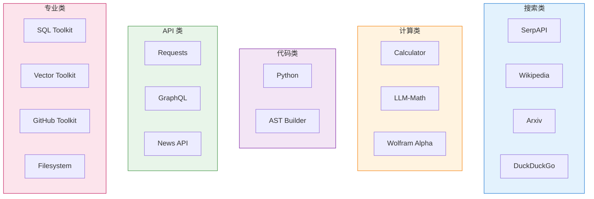
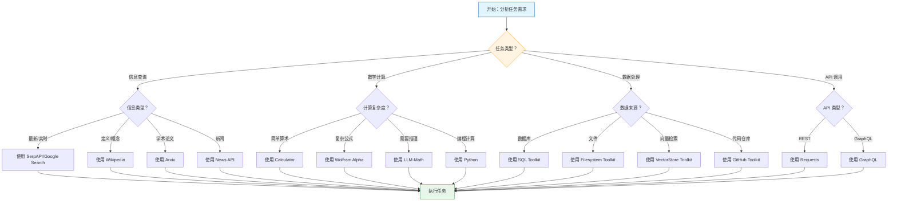

# 工具与工具包

> 工具是 Agent 的"手脚"，决定了 Agent 能做什么。本章将详细介绍 LangChain 的内置工具、工具包以及工具选择策略。

## 什么是工具（Tool）？

在 LangChain 中，**工具（Tool）** 是 Agent 可以调用的独立功能单元。每个工具都有：

- **名称**：用于识别和调用
- **描述**：告诉 Agent 何时以及如何使用该工具
- **函数**：实际执行的代码

```python
from langchain_core.tools import Tool

# 简单的工具示例
def add(a: int, b: int) -> int:
    """两个数相加"""
    return a + b

tool = Tool(
    name="Adder",
    func=add,
    description="将两个数字相加。输入格式：'a,b'，例如 '2,3'"
)
```

💡 **提示**：工具描述的质量直接影响 Agent 的表现。描述应该清晰地说明工具的用途、适用场景和输入格式。

## 内置工具概览

LangChain 提供了丰富的内置工具，可以通过 `load_tools` 快速加载。

### 核心工具列表

```python
from langchain.agents import load_tools
from langchain_openai import ChatOpenAI

llm = ChatOpenAI(model="gpt-4o")

# 加载常用工具
tools = load_tools([
    "serpapi",        # Google 搜索
    "llm-math",       # LLM 数学计算
    "wikipedia",      # Wikipedia 查询
    "arxiv",          # Arxiv 论文搜索
    "wolfram-alpha",  # Wolfram Alpha 计算
], llm=llm)
```

### 工具分类详解

#### 1. 搜索类工具

| 工具名 | 说明 | 使用场景 |
|--------|------|----------|
| `serpapi` | Google 搜索结果 | 查询最新信息、事实核查 |
| `google-search` | Google 搜索（官方 API） | 同上 |
| `bing-search` | Bing 搜索 | 同上 |
| `duckduckgo-search` | DuckDuckGo 搜索 | 隐私保护的搜索 |
| `wikipedia` | Wikipedia 查询 | 查找定义、历史、概念 |
| `arxiv` | Arxiv 论文搜索 | 学术研究、技术论文 |

```python
# Wikipedia 工具示例
from langchain.agents import load_tools

wiki_tool = load_tools(["wikipedia"], llm=llm)

# 使用示例
result = wiki_tool[0].invoke("Python 编程语言")
print(result)
# 输出：Python 是一种高级、解释型的通用编程语言...
```

#### 2. 计算类工具

| 工具名 | 说明 | 使用场景 |
|--------|------|----------|
| `llm-math` | LLM 驱动的数学计算 | 复杂数学问题 |
| `calculator` | 简单计算器 | 基本算术运算 |
| `wolfram-alpha` | Wolfram Alpha | 科学计算、公式求解 |

```python
# LLM-Math 工具示例
llm_math = load_tools(["llm-math"], llm=llm)

# 使用示例
result = llm_math[0].invoke("2 的 10 次方乘以 3 是多少？")
print(result)
# 输出：2^10 = 1024, 1024 * 3 = 3072
```

#### 3. 代码执行工具

| 工具名 | 说明 | 使用场景 |
|--------|------|----------|
| `python` | Python 代码执行 | 数据处理、复杂计算 |
| `ast-builder` | AST 代码构建 | 代码生成和分析 |

```python
# Python 执行工具示例
python_tool = load_tools(["python"], llm=llm)

# 使用示例
result = python_tool[0].invoke("""
import numpy as np
arr = np.array([1, 2, 3, 4, 5])
print(f"平均值：{np.mean(arr)}")
print(f"标准差：{np.std(arr)}")
""")
```

#### 4. API 类工具

| 工具名 | 说明 | 使用场景 |
|--------|------|----------|
| `requests` | HTTP 请求 | 调用 REST API |
| `graphql` | GraphQL 查询 | GraphQL API 调用 |
| `metaphor-search` | Metaphor 搜索 | 语义搜索 |
| `news-api` | NewsAPI | 新闻查询 |

```python
# Requests 工具示例
requests_tool = load_tools(["requests-get"], llm=llm)

# 使用示例
result = requests_tool[0].invoke("https://api.github.com/users/langchain-ai")
print(result)
```

#### 5. 专业领域工具

| 工具名 | 说明 | 使用场景 |
|--------|------|----------|
| `pal-math` | 编程辅助数学 | 复杂数学推理 |
| `pal-colored-objects` | 逻辑推理 | 彩色物体推理问题 |
| `human` | 人类介入 | 需要人类判断的场景 |
| `sleep` | 延迟执行 | 控制执行节奏 |

```python
# Human 工具示例（需要人类输入）
human_tool = load_tools(["human"], llm=llm)

# 当 Agent 需要人类确认时使用
# 输入："请确认这个操作是否可以继续"
```

## 工具使用实战

### 配置 API 密钥

许多工具需要配置 API 密钥：

```python
import os

# 设置环境变量
os.environ["SERPAPI_API_KEY"] = "your_serpapi_key"
os.environ["WOLFRAM_ALPHA_APPID"] = "your_wolfram_key"
os.environ["ARXIV_API_KEY"] = "your_arxiv_key"

# 或者在加载时指定
tools = load_tools(
    ["serpapi", "wolfram-alpha"],
    llm=llm,
    serpapi_api_key="your_key",
    wolfram_alpha_appid="your_appid"
)
```

### 完整工具集示例

```python
from langchain.agents import initialize_agent, load_tools
from langchain_openai import ChatOpenAI

# 初始化 LLM
llm = ChatOpenAI(model="gpt-4o", temperature=0)

# 加载全面工具集
tools = load_tools([
    "serpapi",           # 网络搜索
    "llm-math",          # 数学计算
    "wikipedia",         # 维基百科
    "arxiv",             # 学术论文
    "python",            # 代码执行
    "requests-get",      # HTTP GET 请求
], llm=llm)

# 创建 Agent
from langchain.agents import create_react_agent, AgentExecutor
from langchain import hub

prompt = hub.pull("hwchase17/react")
agent = create_react_agent(llm, tools, prompt)
agent_executor = AgentExecutor(agent=agent, tools=tools, verbose=True)

# 测试复杂查询
result = agent_executor.invoke({
    "input": "查找 2024 年诺贝尔物理学奖得主，并计算他们的年龄总和"
})
print(result["output"])
```

## Toolkit 概念

**Toolkit（工具包）** 是一组相关工具的集合，用于特定领域或场景。使用工具包可以快速获得某个领域的完整工具支持。

### 常用 Toolkit

#### 1. SQL Toolkit

用于数据库查询和分析：

```python
from langchain_community.agent_toolkits import SQLDatabaseToolkit
from langchain_community.utilities import SQLDatabase
from langchain_openai import ChatOpenAI

# 连接数据库
db = SQLDatabase.from_uri("sqlite:///example.db")

# 创建 SQL Toolkit
llm = ChatOpenAI(model="gpt-4o", temperature=0)
toolkit = SQLDatabaseToolkit(db=db, llm=llm)

# 获取工具列表
tools = toolkit.get_tools()

# 查看可用工具
for tool in tools:
    print(f"- {tool.name}: {tool.description}")
```

**SQL Toolkit 包含的工具：**

| 工具名 | 功能 |
|--------|------|
| `sql_db_query` | 执行 SQL 查询 |
| `sql_db_schema` | 获取表结构 |
| `sql_db_list_tables` | 列出所有表 |
| `sql_db_query_checker` | 检查和验证 SQL |

#### 2. VectorStore Toolkit

用于向量数据库操作：

```python
from langchain_community.agent_toolkits import VectorStoreInfo, VectorStoreToolkit
from langchain_community.vectorstores import FAISS
from langchain_openai import OpenAIEmbeddings
from langchain_openai import ChatOpenAI

# 创建向量存储
embeddings = OpenAIEmbeddings()
vectorstore = FAISS.from_texts(
    ["文档 1 内容", "文档 2 内容", "文档 3 内容"],
    embedding=embeddings
)

# 创建 VectorStoreInfo
vectorstore_info = VectorStoreInfo(
    name="文档库",
    description="公司产品文档和技术手册",
    vectorstore=vectorstore
)

# 创建 Toolkit
llm = ChatOpenAI(model="gpt-4o")
toolkit = VectorStoreToolkit(vectorstore_info=vectorstore_info, llm=llm)
tools = toolkit.get_tools()
```

#### 3. GitHub Toolkit

用于 GitHub 仓库操作：

```python
from langchain_community.agent_toolkits import GitHubToolkit
from langchain_community.utilities import GitHubAPIWrapper

# 配置 GitHub API
github = GitHubAPIWrapper(
    github_token="your_github_token"
)

# 创建 Toolkit
toolkit = GitHubToolkit(api_wrapper=github)
tools = toolkit.get_tools()
```

**GitHub Toolkit 功能：**
- 搜索仓库
- 获取Issue
- 获取Pull Request
- 读取文件内容
- 查看用户信息

#### 4. Filesystem Toolkit

用于文件系统操作：

```python
from langchain_community.agent_toolkits import FileManagementToolkit
from pathlib import Path

# 创建工作目录
working_dir = Path.home() / "agent-workspace"
working_dir.mkdir(exist_ok=True)

# 创建 Toolkit
toolkit = FileManagementToolkit(
    root_dir=str(working_dir),
    selected_tools=["read_file", "write_file", "list_directory", "delete_file"]
)

tools = toolkit.get_tools()

# 查看可用工具
for tool in tools:
    print(f"- {tool.name}: {tool.description}")
```

**Filesystem Toolkit 包含的工具：**

| 工具名 | 功能 |
|--------|------|
| `read_file` | 读取文件内容 |
| `write_file` | 写入文件 |
| `list_directory` | 列出目录内容 |
| `delete_file` | 删除文件 |
| `copy_file` | 复制文件 |
| `move_file` | 移动文件 |
| `file_search` | 搜索文件 |

#### 5. Azure Cognitive Services Toolkit

用于 Azure AI 服务：

```python
from langchain_community.agent_toolkits import AzureCognitiveServicesToolkit

# 创建 Toolkit
toolkit = AzureCognitiveServicesToolkit(
    bing_search_endpoint="your_endpoint",
    bing_search_key="your_key",
)

tools = toolkit.get_tools()
```

## 工具对比表

::: v-pre

:::

## 工具选择策略

选择合适的工具是构建高效 Agent 的关键。以下是工具选择的决策框架：

### 决策流程图

::: v-pre

:::

### 选择原则

#### 1. 精确性优先

选择最精确匹配任务需求的工具：

```python
# ❌ 不推荐：用搜索工具做计算
result = search_tool.invoke("234 * 567 等于多少")

# ✅ 推荐：使用计算器
result = calculator_tool.invoke("234 * 567")
```

#### 2. 成本考虑

考虑工具调用的成本：

| 工具 | 成本 | 建议 |
|------|------|------|
| Calculator | 免费 | 优先使用 |
| Python | 免费 | 优先使用 |
| SerpAPI | 付费（有免费额度） | 必要时使用 |
| Wolfram Alpha | 付费 | 复杂计算使用 |

#### 3. 可靠性

选择稳定可靠的工具：

```python
# 为关键工具添加备用方案
tools = [
    Tool(name="PrimarySearch", func=serpapi_search),
    Tool(name="BackupSearch", func=duckduckgo_search),  # 备用
    Tool(name="Calculator", func=calculate),
]
```

#### 4. 组合使用

复杂任务往往需要多个工具配合：

```python
# 示例：市场研究任务
tools = load_tools([
    "serpapi",      # 搜索市场信息
    "wolfram-alpha", # 数据分析
    "python",        # 数据处理
    "llm-math",      # 计算增长率
])
```

### 工具数量控制

💡 **提示**：工具不是越多越好。过多的工具会增加 Agent 的选择负担，降低效率和准确性。

**推荐配置：**

| 场景 | 建议工具数量 |
|------|--------------|
| 简单问答 | 2-3 个 |
| 通用助手 | 5-8 个 |
| 专业领域 | 8-12 个 |
| 复杂系统 | 10-15 个 |

```python
# 精简工具集示例
essential_tools = load_tools([
    "serpapi",        # 搜索
    "llm-math",       # 计算
    "python",         # 代码
], llm=llm)

# 完整工具集（按需加载）
full_tools = load_tools([
    "serpapi", "llm-math", "python",
    "wikipedia", "arxiv", "wolfram-alpha",
    "requests-get", "human"
], llm=llm)
```

## 工具描述的艺术

工具描述的质量直接影响 Agent 的选择准确性。

### 好的描述特征

```python
# ✅ 好的工具描述
good_description = """
当你需要查询以下信息时使用此工具：
- 实时新闻和事件
- 最新的产品信息
- 天气、股票等动态数据
- 人物、地点、概念的事实信息

不适用于：
- 数学计算
- 代码执行
- 主观判断

输入格式：清晰的搜索关键词，尽量具体

示例：
- "2024 年诺贝尔物理学奖"
- "Python 3.12 新特性"
"""
```

### 坏 description 的问题

```python
# ❌ 坏的工具描述
bad_description = "搜索东西"  # 太模糊

# ❌ 缺少使用场景
okay_description = "用于搜索互联网"  # 没有说明什么时候用

# ❌ 没有输入格式说明
incomplete_description = "搜索工具，输入查询"  # 没有说明输入格式
```

### 描述模板

```python
def create_tool_description(
    purpose: str,
    use_cases: list[str],
    not_for: list[str],
    input_format: str,
    examples: list[str] = None
) -> str:
    """创建工具描述模板"""
    desc = f"{purpose}\n\n"
    desc += "适用场景：\n" + "\n".join(f"- {case}" for case in use_cases)
    desc += "\n\n不适用于：\n" + "\n".join(f"- {item}" for item in not_for)
    desc += f"\n\n输入格式：{input_format}"
    if examples:
        desc += "\n\n示例：\n" + "\n".join(f"- {ex}" for ex in examples)
    return desc

# 使用示例
search_description = create_tool_description(
    purpose="搜索互联网获取最新信息",
    use_cases=["查询新闻", "事实核查", "产品信息"],
    not_for=["数学计算", "代码执行"],
    input_format="搜索关键词",
    examples=["2024 奥运会", "特斯拉股价"]
)
```

## 自定义工具开发

虽然 LangChain 提供了丰富的内置工具，但实际项目中往往需要自定义工具。

### 使用 @tool 装饰器

```python
from langchain_core.tools import tool
from typing import Optional

@tool
def get_stock_price(symbol: str, date: Optional[str] = None) -> str:
    """
    获取股票价格。
    
    参数:
        symbol: 股票代码，如 AAPL, GOOGL, TSLA
        date: 可选，查询历史价格，格式 YYYY-MM-DD
    
    返回:
        股票价格信息
    """
    import yfinance as yf
    
    stock = yf.Ticker(symbol)
    if date:
        history = stock.history(start=date, end=date)
        if len(history) > 0:
            return f"{symbol} 在 {date} 的收盘价：{history['Close'].iloc[0]:.2f} USD"
        return "未找到该日期的数据"
    else:
        info = stock.info
        return f"{symbol} 当前价格：{info.get('currentPrice', 'N/A')} USD"

@tool
def analyze_sentiment(text: str) -> dict:
    """
    分析文本情感。
    
    参数:
        text: 要分析的文本
    
    返回:
        包含情感分数的字典
    """
    # 简单的情感分析示例
    positive_words = ["好", "优秀", "喜欢", "爱", "满意"]
    negative_words = ["差", "糟糕", "讨厌", "恨", "不满"]
    
    positive_count = sum(word in text for word in positive_words)
    negative_count = sum(word in text for word in negative_words)
    
    total = positive_count + negative_count
    if total == 0:
        return {"sentiment": "中性", "score": 0.5}
    
    score = positive_count / total
    return {
        "sentiment": "正面" if score > 0.5 else "负面",
        "score": round(score, 2)
    }

# 添加到工具列表
tools = [get_stock_price, analyze_sentiment]
```

### 多参数工具

```python
from langchain_core.tools import tool
import json

@tool
def compare_products(
    product1: str,
    product2: str,
    criteria: str = "价格"
) -> str:
    """
    比较两个产品。
    
    参数:
        product1: 第一个产品名称
        product2: 第二个产品名称
        criteria: 比较标准，如"价格"、"性能"、"评价"
    
    返回:
        比较结果
    """
    # 模拟比较逻辑
    return f"比较 {product1} 和 {product2} 的{criteria}..."

# 使用
result = compare_products.invoke({
    "product1": "iPhone 15",
    "product2": "Samsung S24",
    "criteria": "相机性能"
})
```

### 异步工具

```python
from langchain_core.tools import tool
import aiohttp
import asyncio

@tool
async def fetch_url_content(url: str) -> str:
    """
    异步获取网页内容。
    
    参数:
        url: 网页 URL
    
    返回:
        网页内容
    """
    async with aiohttp.ClientSession() as session:
        async with session.get(url) as response:
            return await response.text()

# 异步工具需要在异步上下文中使用
async def main():
    result = await fetch_url_content.ainvoke({"url": "https://example.com"})
    print(result)

# asyncio.run(main())
```

## 工具测试与调试

### 直接测试工具

```python
# 测试单个工具
from langchain_core.tools import Tool

calculator = Tool(
    name="Calculator",
    func=lambda x: str(eval(x)),
    description="执行数学计算"
)

# 直接调用
result = calculator.invoke("2 + 2 * 3")
print(f"结果：{result}")

# 带错误处理
try:
    result = calculator.invoke("2 + * 3")  # 无效表达式
except Exception as e:
    print(f"错误：{e}")
```

### 在 Agent 中调试

```python
# 开启详细日志
agent_executor = AgentExecutor(
    agent=agent,
    tools=tools,
    verbose=True,
    return_intermediate_steps=True
)

result = agent_executor.invoke({"input": "测试问题"})

# 分析中间步骤
for i, (action, observation) in enumerate(result["intermediate_steps"]):
    print(f"\n步骤 {i+1}:")
    print(f"  工具：{action.tool}")
    print(f"  输入：{action.tool_input}")
    print(f"  输出：{observation[:100]}...")
```

## 常见问题排查

| 问题 | 可能原因 | 解决方案 |
|------|----------|----------|
| 工具调用失败 | 描述不清晰 | 重写工具描述，增加示例 |
| 选择错误工具 | 工具描述相似 | 区分各工具的边界 |
| 参数格式错误 | 输入格式不明确 | 在描述中明确输入格式 |
| 工具执行超时 | 操作太耗时 | 添加超时控制 |
| API 配额耗尽 | 调用太频繁 | 添加缓存和限流 |

## 本章小结

本章深入探讨了 LangChain 的工具和工具包：

1. **内置工具**：搜索、计算、代码、API 等五大类工具
2. **工具包**：SQL、VectorStore、GitHub、Filesystem 等专业工具集
3. **选择策略**：基于任务类型、成本、可靠性的决策框架
4. **描述艺术**：好的工具描述应该清晰、具体、有示例
5. **自定义工具**：使用 @tool 装饰器创建自己的工具

下一章我们将学习如何 **创建自定义工具**，深入理解工具的内部结构。

## 继续学习

- [自定义工具](./custom-tools.md) - 深入自定义工具开发
- [Agent 执行器](./agent-executor.md) - AgentExecutor 详解
- [LCEL 风格 Agent](./lcel-agent.md) - 现代化 Agent 构建
- [Agent 概述](./agent-overview.md) - Agent 基础概念回顾