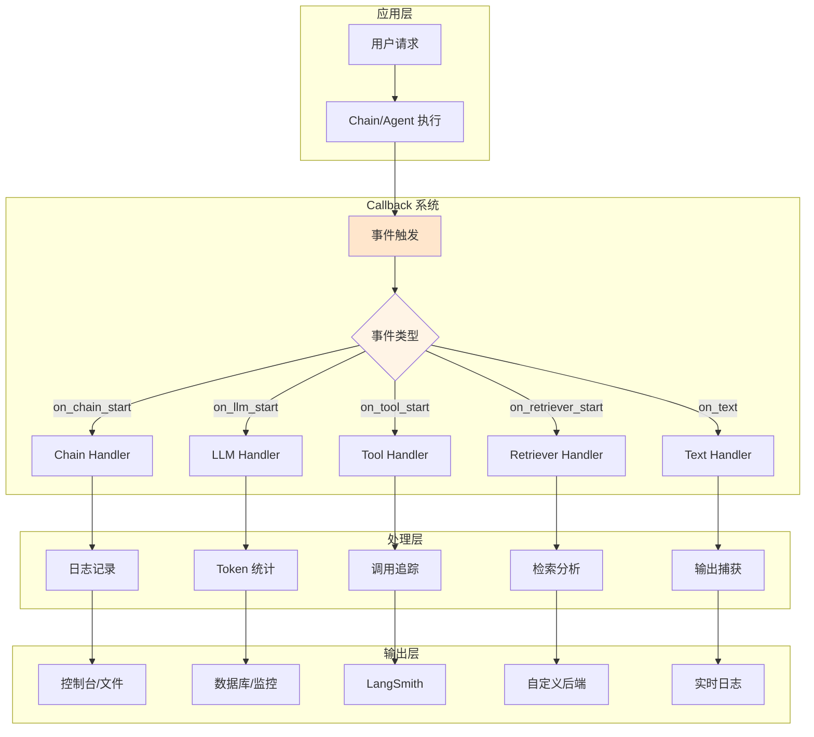
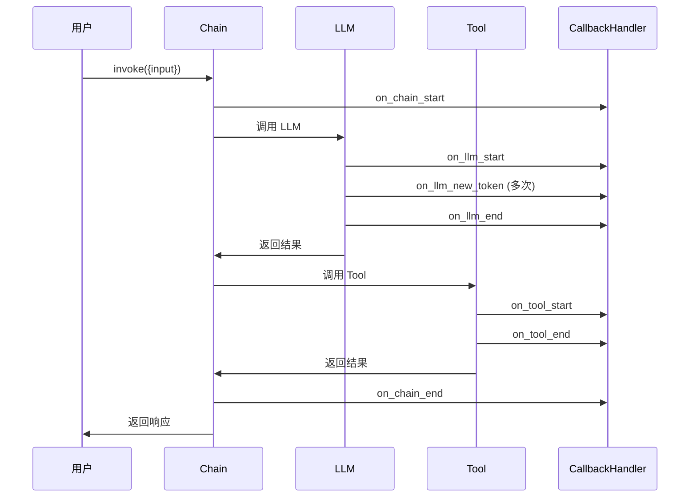
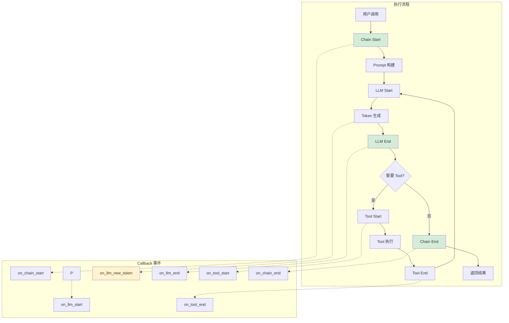

# Callback 系统架构

Callback 系统是 LangChain 的可观测性核心，它允许你在 LLM 应用的各个执行阶段插入自定义逻辑，实现日志记录、监控、追踪等功能。

## 为什么需要 Callback？

### 调试需求

LLM 应用执行复杂，涉及多个组件：
- Prompt 构建
- LLM 调用
- Chain 执行
- Tool 调用
- 向量检索

没有 Callback，很难知道**哪里出了问题**、**耗时多久**、**消耗多少 token**。

### 监控需求

生产环境需要：
- 📊 性能监控（延迟、吞吐量）
- 💰 成本追踪（token 用量）
- 🐛 错误追踪（失败原因）
- 📈 使用分析（热门功能）

## Callback 系统架构

::: v-pre

:::

## CallbackHandler 接口

### 完整接口定义

```python
from langchain_core.callbacks import BaseCallbackHandler
from typing import Any, Dict, List, Optional, Sequence
from uuid import UUID

class BaseCallbackHandler:
    """Callback 处理器基类"""
    
    # ============== Chain 事件 ==============
    def on_chain_start(
        self,
        serialized: Dict[str, Any],
        inputs: Dict[str, Any],
        *,
        run_id: UUID,
        parent_run_id: Optional[UUID] = None,
        tags: Optional[List[str]] = None,
        metadata: Optional[Dict[str, Any]] = None,
        **kwargs: Any,
    ) -> Any:
        """Chain 开始执行时调用"""
        pass
    
    def on_chain_end(
        self,
        outputs: Dict[str, Any],
        *,
        run_id: UUID,
        parent_run_id: Optional[UUID] = None,
        **kwargs: Any,
    ) -> Any:
        """Chain 执行结束时调用"""
        pass
    
    def on_chain_error(
        self,
        error: BaseException,
        *,
        run_id: UUID,
        parent_run_id: Optional[UUID] = None,
        **kwargs: Any,
    ) -> Any:
        """Chain 执行出错时调用"""
        pass
    
    # ============== LLM 事件 ==============
    def on_llm_start(
        self,
        serialized: Dict[str, Any],
        prompts: List[str],
        *,
        run_id: UUID,
        parent_run_id: Optional[UUID] = None,
        tags: Optional[List[str]] = None,
        metadata: Optional[Dict[str, Any]] = None,
        **kwargs: Any,
    ) -> Any:
        """LLM 开始调用时调用"""
        pass
    
    def on_llm_end(
        self,
        response,
        *,
        run_id: UUID,
        parent_run_id: Optional[UUID] = None,
        **kwargs: Any,
    ) -> Any:
        """LLM 调用结束时调用"""
        pass
    
    def on_llm_error(
        self,
        error: BaseException,
        *,
        run_id: UUID,
        **kwargs: Any,
    ) -> Any:
        """LLM 调用出错时调用"""
        pass
    
    def on_llm_new_token(
        self,
        token: str,
        *,
        run_id: UUID,
        parent_run_id: Optional[UUID] = None,
        **kwargs: Any,
    ) -> Any:
        """流式输出时，每生成一个 token 调用"""
        pass
    
    # ============== Tool 事件 ==============
    def on_tool_start(
        self,
        serialized: Dict[str, Any],
        input_str: str,
        *,
        run_id: UUID,
        parent_run_id: Optional[UUID] = None,
        tags: Optional[List[str]] = None,
        metadata: Optional[Dict[str, Any]] = None,
        **kwargs: Any,
    ) -> Any:
        """Tool 开始执行时调用"""
        pass
    
    def on_tool_end(
        self,
        output: Any,
        *,
        run_id: UUID,
        parent_run_id: Optional[UUID] = None,
        **kwargs: Any,
    ) -> Any:
        """Tool 执行结束时调用"""
        pass
    
    def on_tool_error(
        self,
        error: BaseException,
        *,
        run_id: UUID,
        **kwargs: Any,
    ) -> Any:
        """Tool 执行出错时调用"""
        pass
    
    # ============== Retriever 事件 ==============
    def on_retriever_start(
        self,
        serialized: Dict[str, Any],
        query: str,
        *,
        run_id: UUID,
        parent_run_id: Optional[UUID] = None,
        tags: Optional[List[str]] = None,
        metadata: Optional[Dict[str, Any]] = None,
        **kwargs: Any,
    ) -> Any:
        """Retriever 开始检索时调用"""
        pass
    
    def on_retriever_end(
        self,
        documents: Sequence,
        *,
        run_id: UUID,
        parent_run_id: Optional[UUID] = None,
        **kwargs: Any,
    ) -> Any:
        """Retriever 检索结束时调用"""
        pass
    
    # ============== Text 事件 ==============
    def on_text(
        self,
        text: str,
        *,
        run_id: UUID,
        parent_run_id: Optional[UUID] = None,
        **kwargs: Any,
    ) -> Any:
        """生成文本时调用"""
        pass
```

### 事件类型详解

| 事件类型 | 触发时机 | 关键参数 | 典型用途 |
|----------|----------|----------|----------|
| `on_chain_start` | Chain 开始 | `inputs`, `run_id` | 记录输入、开始计时 |
| `on_chain_end` | Chain 结束 | `outputs` | 记录输出、计算耗时 |
| `on_chain_error` | Chain 出错 | `error` | 错误记录、告警 |
| `on_llm_start` | LLM 调用 | `prompts` | 记录 prompt、token 预估 |
| `on_llm_end` | LLM 返回 | `response` | token 统计、响应记录 |
| `on_llm_new_token` | 流式 token | `token` | 实时显示输出 |
| `on_tool_start` | Tool 调用 | `input_str` | 记录 tool 调用 |
| `on_tool_end` | Tool 返回 | `output` | 记录 tool 结果 |
| `on_retriever_start` | 开始检索 | `query` | 记录查询 |
| `on_retriever_end` | 检索结束 | `documents` | 记录检索结果 |
| `on_text` | 文本生成 | `text` | 实时日志 |

## 内置 Handler：StdOutCallbackHandler

### 基础用法

```python
from langchain.callbacks import StdOutCallbackHandler
from langchain_openai import ChatOpenAI
from langchain.chains import ConversationChain

# 创建处理器
handler = StdOutCallbackHandler()

# 方式 1: 在调用时传入
llm = ChatOpenAI(model="gpt-4o")
chain = ConversationChain(llm=llm)

response = chain.invoke(
    {"input": "你好"},
    config={"callbacks": [handler]}
)

# 方式 2: 全局设置
from langchain import globals
globals.set_verbose(True)  # 启用全局详细输出
```

### 输出示例

```
Entering new ConversationChain chain...
Prompt after formatting:
The following is a friendly conversation between a human and an AI...

> Entering new llm chain...
Prompt after formatting:
Human: 你好
AI:

> Finished chain.
> Finished chain.
```

### 配合流式输出

```python
from langchain.callbacks.streaming_stdout import StreamingStdOutCallbackHandler

handler = StreamingStdOutCallbackHandler()

for chunk in llm.stream("写一首诗"):
    pass  # token 会实时打印到控制台
```

## 实战：完整的 Callback 系统

### 多 Handler 组合

```python
from langchain.callbacks import get_openai_callback, StdOutCallbackHandler
from langchain.callbacks.manager import CallbackManager

# 组合多个 handler
manager = CallbackManager([
    StdOutCallbackHandler(),
    # 可以添加自定义 handler
    # CustomLogHandler(),
    # TokenCounterHandler(),
])

response = chain.invoke(
    {"input": "你好"},
    config={"callbacks": manager}
)
```

### 嵌套调用追踪

::: v-pre

:::

```python
from langchain_core.callbacks import BaseCallbackHandler
from uuid import UUID
import time

class ExecutionTracker(BaseCallbackHandler):
    """追踪执行流程"""
    
    def __init__(self):
        self.start_times = {}
        self.run_stack = []
    
    def on_chain_start(self, serialized, inputs, *, run_id, **kwargs):
        self.start_times[run_id] = time.time()
        self.run_stack.append(("chain", serialized.get("name", "Unknown")))
        print(f"▶ Chain 开始：{self.run_stack[-1][1]}")
    
    def on_chain_end(self, outputs, *, run_id, **kwargs):
        duration = time.time() - self.start_times.get(run_id, 0)
        name = self.run_stack.pop()[1]
        print(f"✓ Chain 完成：{name} ({duration:.2f}s)")
    
    def on_llm_start(self, serialized, prompts, *, run_id, **kwargs):
        self.start_times[run_id] = time.time()
        prompt_len = len(prompts[0]) if prompts else 0
        print(f"▶ LLM 调用 (prompt: {prompt_len} chars)")
    
    def on_llm_end(self, response, *, run_id, **kwargs):
        duration = time.time() - self.start_times.get(run_id, 0)
        print(f"✓ LLM 完成 ({duration:.2f}s)")
    
    def on_tool_start(self, serialized, input_str, *, run_id, **kwargs):
        self.start_times[run_id] = time.time()
        print(f"▶ Tool 调用：{serialized.get('name', 'Unknown')}")
    
    def on_tool_end(self, output, *, run_id, **kwargs):
        duration = time.time() - self.start_times.get(run_id, 0)
        print(f"✓ Tool 完成 ({duration:.2f}s)")

# 使用
tracker = ExecutionTracker()
response = agent.invoke(
    {"input": "查询今天天气"},
    config={"callbacks": [tracker]}
)
```

## 事件流图

::: v-pre

:::

## Token 统计

```python
from langchain.callbacks import get_openai_callback

# 方式 1: 上下文管理器
with get_openai_callback() as cb:
    response = chain.invoke({"input": "你好"})
    print(f"Total Tokens: {cb.total_tokens}")
    print(f"Prompt Tokens: {cb.prompt_tokens}")
    print(f"Completion Tokens: {cb.completion_tokens}")
    print(f"Total Cost (USD): ${cb.total_cost}")

# 方式 2: 累加多次调用
total_cost = 0
with get_openai_callback() as cb:
    chain.invoke({"input": "问题 1"})
    total_cost += cb.total_cost

with get_openai_callback() as cb:
    chain.invoke({"input": "问题 2"})
    total_cost += cb.total_cost

print(f"累计消耗：${total_cost:.4f}")
```

## 最佳实践

### ✅ 推荐做法

1. **开发阶段启用详细日志**
   ```python
   from langchain import globals
   globals.set_verbose(True)
   ```

2. **生产阶段选择性记录**
   ```python
   # 只记录错误和关键指标
   class ProductionHandler(BaseCallbackHandler):
       def on_chain_error(self, error, **kwargs):
           log_error(error)
       
       def on_llm_end(self, response, **kwargs):
           record_metrics(response)
   ```

3. **使用异步 Handler 避免阻塞**
   ```python
   import asyncio
   
   class AsyncLogHandler(BaseCallbackHandler):
       async def on_llm_end(self, response, **kwargs):
           await asyncio.create_task(log_to_db(response))
   ```

4. **为不同环境配置不同 Handler**
   ```python
   if ENV == "development":
       callbacks = [StdOutCallbackHandler()]
   elif ENV == "production":
       callbacks = [ProductionHandler(), LangSmithCallbackHandler()]
   ```

### ❌ 避免的问题

1. **不要在 Handler 中做耗时操作**
   ```python
   # 错误：阻塞主线程
   def on_llm_end(self, response, **kwargs):
       time.sleep(5)  # ❌
       write_to_slow_db(response)
   
   # 正确：异步或队列
   def on_llm_end(self, response, **kwargs):
       queue.put(response)  # ✅
   ```

2. **不要忽略异常**
   ```python
   # 错误：吞掉异常
   def on_chain_error(self, error, **kwargs):
       pass  # ❌
   
   # 正确：记录并可能告警
   def on_chain_error(self, error, **kwargs):
       logger.error(f"Chain error: {error}")
       send_alert(error)  # ✅
   ```

## 总结

Callback 系统是 LangChain 可观测性的基石：

- **调试**：了解执行流程
- **监控**：追踪性能和成本
- **扩展**：添加自定义逻辑

下一节我们将学习如何编写自定义 Callback Handler。