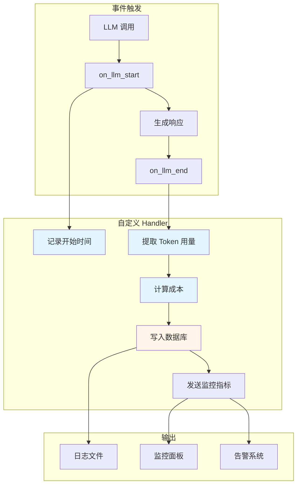

# 自定义 Callback Handler

内置的 Callback Handler 功能有限，实际项目中经常需要自定义 Handler 来实现特定需求，如日志记录、Token 统计、性能监控等。

## 自定义 Handler 基础

### 继承基类

```python
from langchain_core.callbacks import BaseCallbackHandler
from typing import Any, Dict, List, Optional
from uuid import UUID

class CustomHandler(BaseCallbackHandler):
    """自定义 Callback Handler"""
    
    def __init__(self):
        # 初始化状态
        self.run_ids = []
        self.token_counts = []
    
    def on_llm_start(
        self,
        serialized: Dict[str, Any],
        prompts: List[str],
        *,
        run_id: UUID,
        **kwargs: Any
    ) -> None:
        """LLM 开始调用"""
        self.run_ids.append(run_id)
        print(f"LLM 调用开始，run_id: {run_id}")
    
    def on_llm_end(
        self,
        response,
        *,
        run_id: UUID,
        **kwargs: Any
    ) -> None:
        """LLM 调用结束"""
        # 提取 token 信息
        if response.llm_output and "token_usage" in response.llm_output:
            usage = response.llm_output["token_usage"]
            print(f"Token 使用：{usage}")
        
        self.run_ids.remove(run_id)
    
    def on_chain_error(
        self,
        error: BaseException,
        *,
        run_id: UUID,
        **kwargs: Any
    ) -> None:
        """Chain 出错"""
        print(f"错误：{error}")
        # 可以发送告警
```

### 只实现需要的方法

不需要实现所有方法，只覆盖关心的事件：

```python
class SimpleLogger(BaseCallbackHandler):
    """只记录 Chain 开始和结束"""
    
    def on_chain_start(self, serialized, inputs, **kwargs):
        print(f"Chain 开始：{serialized.get('name', 'Unknown')}")
    
    def on_chain_end(self, outputs, **kwargs):
        print(f"Chain 结束，输出：{list(outputs.keys())}")
```

## 日志记录 Handler

### 结构化日志

```python
import json
import logging
from datetime import datetime
from langchain_core.callbacks import BaseCallbackHandler
from uuid import UUID

class StructuredLogHandler(BaseCallbackHandler):
    """结构化日志 Handler"""
    
    def __init__(self, logger_name="langchain"):
        self.logger = logging.getLogger(logger_name)
        self.logger.setLevel(logging.INFO)
        
        # 文件处理器
        file_handler = logging.FileHandler("langchain.log")
        formatter = logging.Formatter(
            '%(asctime)s - %(levelname)s - %(message)s'
        )
        file_handler.setFormatter(formatter)
        self.logger.addHandler(file_handler)
        
        # 运行追踪
        self.run_info = {}
    
    def on_chain_start(
        self,
        serialized: Dict[str, Any],
        inputs: Dict[str, Any],
        *,
        run_id: UUID,
        **kwargs: Any
    ) -> None:
        self.run_info[run_id] = {
            "start_time": datetime.now(),
            "type": "chain",
            "name": serialized.get("name", "Unknown")
        }
        
        log_entry = {
            "event": "chain_start",
            "run_id": str(run_id),
            "name": serialized.get("name"),
            "inputs": self._sanitize(inputs),
            "timestamp": datetime.now().isoformat()
        }
        self.logger.info(json.dumps(log_entry, ensure_ascii=False))
    
    def on_chain_end(
        self,
        outputs: Dict[str, Any],
        *,
        run_id: UUID,
        **kwargs: Any
    ) -> None:
        run_info = self.run_info.get(run_id, {})
        duration = (datetime.now() - run_info.get("start_time")).total_seconds()
        
        log_entry = {
            "event": "chain_end",
            "run_id": str(run_id),
            "duration_seconds": duration,
            "outputs": self._sanitize(outputs),
            "timestamp": datetime.now().isoformat()
        }
        self.logger.info(json.dumps(log_entry, ensure_ascii=False))
        
        # 清理
        self.run_info.pop(run_id, None)
    
    def on_llm_start(
        self,
        serialized: Dict[str, Any],
        prompts: List[str],
        *,
        run_id: UUID,
        **kwargs: Any
    ) -> None:
        self.run_info[run_id] = {
            "start_time": datetime.now(),
            "type": "llm",
            "model": serialized.get("kwargs", {}).get("model_name", "Unknown")
        }
        
        log_entry = {
            "event": "llm_start",
            "run_id": str(run_id),
            "model": self.run_info[run_id]["model"],
            "prompt_length": len(prompts[0]) if prompts else 0,
            "timestamp": datetime.now().isoformat()
        }
        self.logger.info(json.dumps(log_entry, ensure_ascii=False))
    
    def on_llm_end(
        self,
        response,
        *,
        run_id: UUID,
        **kwargs: Any
    ) -> None:
        run_info = self.run_info.get(run_id, {})
        duration = (datetime.now() - run_info.get("start_time")).total_seconds()
        
        # 提取使用量
        token_usage = {}
        if response.llm_output and "token_usage" in response.llm_output:
            token_usage = response.llm_output["token_usage"]
        
        log_entry = {
            "event": "llm_end",
            "run_id": str(run_id),
            "duration_seconds": duration,
            "token_usage": token_usage,
            "completion_length": len(response.generations[0][0].text) if response.generations else 0,
            "timestamp": datetime.now().isoformat()
        }
        self.logger.info(json.dumps(log_entry, ensure_ascii=False))
    
    def on_tool_start(
        self,
        serialized: Dict[str, Any],
        input_str: str,
        *,
        run_id: UUID,
        **kwargs: Any
    ) -> None:
        log_entry = {
            "event": "tool_start",
            "run_id": str(run_id),
            "tool_name": serialized.get("name"),
            "input": input_str[:100],  # 截断长输入
            "timestamp": datetime.now().isoformat()
        }
        self.logger.info(json.dumps(log_entry, ensure_ascii=False))
    
    def on_tool_end(
        self,
        output: Any,
        *,
        run_id: UUID,
        **kwargs: Any
    ) -> None:
        log_entry = {
            "event": "tool_end",
            "run_id": str(run_id),
            "output_preview": str(output)[:100],
            "timestamp": datetime.now().isoformat()
        }
        self.logger.info(json.dumps(log_entry, ensure_ascii=False))
    
    def _sanitize(self, data: Any, max_length: int = 1000) -> Any:
        """清理敏感数据和过长内容"""
        if isinstance(data, str) and len(data) > max_length:
            return data[:max_length] + "..."
        if isinstance(data, dict):
            return {k: self._sanitize(v) for k, v in data.items()}
        if isinstance(data, list):
            return [self._sanitize(v) for v in data[:10]]  # 限制列表长度
        return data

# 使用
log_handler = StructuredLogHandler()
response = chain.invoke(
    {"input": "你好"},
    config={"callbacks": [log_handler]}
)
```

### 日志示例输出

```json
{"event": "chain_start", "run_id": "abc-123", "name": "ConversationChain", "timestamp": "2024-01-15T10:30:00"}
{"event": "llm_start", "run_id": "def-456", "model": "gpt-4o", "prompt_length": 256, "timestamp": "2024-01-15T10:30:01"}
{"event": "llm_end", "run_id": "def-456", "duration_seconds": 1.2, "token_usage": {"total_tokens": 100}, "timestamp": "2024-01-15T10:30:02"}
{"event": "chain_end", "run_id": "abc-123", "duration_seconds": 1.5, "timestamp": "2024-01-15T10:30:02"}
```

## Token 用量统计 Handler

### 实时统计

```python
from langchain_core.callbacks import BaseCallbackHandler
from uuid import UUID
from typing import Dict
from dataclasses import dataclass, field

@dataclass
class TokenStats:
    prompt_tokens: int = 0
    completion_tokens: int = 0
    total_tokens: int = 0
    successful_calls: int = 0
    failed_calls: int = 0

class TokenUsageHandler(BaseCallbackHandler):
    """Token 用量统计 Handler"""
    
    def __init__(self):
        self.stats = TokenStats()
        self.model_stats: Dict[str, TokenStats] = {}
        self.current_calls: Dict[UUID, str] = {}  # run_id -> model_name
    
    def on_llm_start(
        self,
        serialized: Dict[str, Any],
        prompts: List[str],
        *,
        run_id: UUID,
        **kwargs: Any
    ) -> None:
        # 记录模型名称
        model_name = serialized.get("kwargs", {}).get("model_name", "Unknown")
        self.current_calls[run_id] = model_name
        
        # 初始化模型统计
        if model_name not in self.model_stats:
            self.model_stats[model_name] = TokenStats()
    
    def on_llm_end(
        self,
        response,
        *,
        run_id: UUID,
        **kwargs: Any
    ) -> None:
        model_name = self.current_calls.pop(run_id, "Unknown")
        
        # 提取 token 使用
        if response.llm_output and "token_usage" in response.llm_output:
            usage = response.llm_output["token_usage"]
            
            # 更新总体统计
            self.stats.prompt_tokens += usage.get("prompt_tokens", 0)
            self.stats.completion_tokens += usage.get("completion_tokens", 0)
            self.stats.total_tokens += usage.get("total_tokens", 0)
            self.stats.successful_calls += 1
            
            # 更新模型统计
            model_stat = self.model_stats.get(model_name, TokenStats())
            model_stat.prompt_tokens += usage.get("prompt_tokens", 0)
            model_stat.completion_tokens += usage.get("completion_tokens", 0)
            model_stat.total_tokens += usage.get("total_tokens", 0)
            model_stat.successful_calls += 1
    
    def on_llm_error(
        self,
        error: BaseException,
        *,
        run_id: UUID,
        **kwargs: Any
    ) -> None:
        self.stats.failed_calls += 1
        model_name = self.current_calls.pop(run_id, "Unknown")
        if model_name in self.model_stats:
            self.model_stats[model_name].failed_calls += 1
    
    def get_summary(self) -> Dict[str, Any]:
        """获取统计摘要"""
        return {
            "overall": {
                "total_tokens": self.stats.total_tokens,
                "prompt_tokens": self.stats.prompt_tokens,
                "completion_tokens": self.stats.completion_tokens,
                "successful_calls": self.stats.successful_calls,
                "failed_calls": self.stats.failed_calls
            },
            "by_model": {
                model: {
                    "total_tokens": stat.total_tokens,
                    "calls": stat.successful_calls
                }
                for model, stat in self.model_stats.items()
            }
        }
    
    def reset(self):
        """重置统计"""
        self.stats = TokenStats()
        self.model_stats.clear()
        self.current_calls.clear()

# 使用
token_handler = TokenUsageHandler()

# 多次调用
for i in range(5):
    response = chain.invoke(
        {"input": f"问题{i}"},
        config={"callbacks": [token_handler]}
    )

# 查看统计
print(json.dumps(token_handler.get_summary(), indent=2, ensure_ascii=False))
```

### 输出示例

```json
{
  "overall": {
    "total_tokens": 2500,
    "prompt_tokens": 1500,
    "completion_tokens": 1000,
    "successful_calls": 5,
    "failed_calls": 0
  },
  "by_model": {
    "gpt-4o": {
      "total_tokens": 2500,
      "calls": 5
    }
  }
}
```

## 异步 Callback Handler

### 避免阻塞主线程

```python
import asyncio
from concurrent.futures import ThreadPoolExecutor
from langchain_core.callbacks import BaseCallbackHandler

class AsyncLogHandler(BaseCallbackHandler):
    """异步日志 Handler，不阻塞主线程"""
    
    def __init__(self, queue_size=100):
        self.queue = asyncio.Queue(maxsize=queue_size)
        self.executor = ThreadPoolExecutor(max_workers=2)
        self._started = False
    
    async def _start_processor(self):
        """启动后台处理"""
        if not self._started:
            self._started = True
            asyncio.create_task(self._process_queue())
    
    async def _process_queue(self):
        """处理日志队列"""
        while True:
            try:
                event = await self.queue.get()
                # 异步写入数据库/日志系统
                await self._write_log(event)
                self.queue.task_done()
            except Exception as e:
                print(f"日志处理错误：{e}")
    
    async def _write_log(self, event):
        """写入日志（模拟异步 IO）"""
        await asyncio.sleep(0.01)  # 模拟 IO 延迟
        # 实际项目中写入数据库或日志服务
        print(f"[AsyncLog] {event}")
    
    def on_chain_start(self, serialized, inputs, *, run_id, **kwargs):
        asyncio.create_task(self.queue.put({
            "event": "chain_start",
            "run_id": str(run_id),
            "name": serialized.get("name")
        }))
    
    def on_llm_end(self, response, *, run_id, **kwargs):
        asyncio.create_task(self.queue.put({
            "event": "llm_end",
            "run_id": str(run_id),
            "tokens": response.llm_output.get("token_usage") if response.llm_output else None
        }))

# 使用
async_handler = AsyncLogHandler()
```

### 同步版本的异步处理

```python
import threading
import queue

class ThreadedLogHandler(BaseCallbackHandler):
    """使用线程池的同步 Handler"""
    
    def __init__(self):
        self.log_queue = queue.Queue(maxsize=1000)
        self.worker = threading.Thread(target=self._worker, daemon=True)
        self.worker.start()
    
    def _worker(self):
        """后台线程处理日志"""
        while True:
            try:
                event = self.log_queue.get()
                if event is None:
                    break
                # 写入日志
                self._write(event)
            except Exception as e:
                print(f"日志错误：{e}")
    
    def _write(self, event):
        """实际写入逻辑"""
        print(f"[ThreadedLog] {event}")
    
    def on_chain_end(self, outputs, *, run_id, **kwargs):
        self.log_queue.put({
            "event": "chain_end",
            "run_id": str(run_id)
        })
    
    def shutdown(self):
        """关闭处理器"""
        self.log_queue.put(None)
        self.worker.join()

# 使用
threaded_handler = ThreadedLogHandler()
response = chain.invoke({"input": "你好"}, config={"callbacks": [threaded_handler]})
threaded_handler.shutdown()
```

## 自定义 Handler 工作流

::: v-pre

:::

## 完整示例：生产级监控 Handler

```python
import time
import json
from datetime import datetime
from langchain_core.callbacks import BaseCallbackHandler
from uuid import UUID

class ProductionMonitorHandler(BaseCallbackHandler):
    """生产级监控 Handler"""
    
    def __init__(self, metrics_endpoint="https://metrics.example.com"):
        self.metrics_endpoint = metrics_endpoint
        self.active_runs = {}
        self.session_stats = {}
    
    def on_chain_start(self, serialized, inputs, *, run_id, parent_run_id, **kwargs):
        self.active_runs[run_id] = {
            "start_time": time.time(),
            "type": "chain",
            "name": serialized.get("name"),
            "parent": parent_run_id
        }
    
    def on_chain_end(self, outputs, *, run_id, **kwargs):
        run_info = self.active_runs.pop(run_id, {})
        duration = time.time() - run_info.get("start_time", time.time())
        
        # 记录指标
        self._record_metric("chain_duration", duration, {"name": run_info.get("name")})
    
    def on_llm_start(self, serialized, prompts, *, run_id, **kwargs):
        self.active_runs[run_id] = {
            "start_time": time.time(),
            "type": "llm",
            "model": serialized.get("kwargs", {}).get("model_name"),
            "prompt_tokens": self._estimate_tokens(prompts[0]) if prompts else 0
        }
    
    def on_llm_end(self, response, *, run_id, **kwargs):
        run_info = self.active_runs.pop(run_id, {})
        duration = time.time() - run_info.get("start_time", time.time())
        
        # 提取实际 token
        token_usage = {}
        if response.llm_output and "token_usage" in response.llm_output:
            token_usage = response.llm_output["token_usage"]
        
        # 记录指标
        self._record_metric("llm_duration", duration, {"model": run_info.get("model")})
        self._record_metric("llm_tokens", token_usage.get("total_tokens", 0), {"model": run_info.get("model")})
        
        # 计算成本
        cost = self._calculate_cost(token_usage, run_info.get("model"))
        self._record_metric("llm_cost", cost, {"model": run_info.get("model")})
    
    def on_tool_start(self, serialized, input_str, *, run_id, **kwargs):
        self.active_runs[run_id] = {
            "start_time": time.time(),
            "type": "tool",
            "name": serialized.get("name")
        }
    
    def on_tool_end(self, output, *, run_id, **kwargs):
        run_info = self.active_runs.pop(run_id, {})
        duration = time.time() - run_info.get("start_time", time.time())
        
        self._record_metric("tool_duration", duration, {"tool": run_info.get("name")})
        self._record_metric("tool_calls", 1, {"tool": run_info.get("name")})
    
    def on_chain_error(self, error, *, run_id, **kwargs):
        run_info = self.active_runs.pop(run_id, {})
        self._record_metric("errors", 1, {"type": run_info.get("type"), "name": run_info.get("name")})
    
    def _record_metric(self, name, value, tags):
        """记录指标（发送到监控服务）"""
        metric = {
            "metric": name,
            "value": value,
            "tags": tags,
            "timestamp": datetime.now().isoformat()
        }
        # 实际项目中发送到监控后端
        # requests.post(self.metrics_endpoint, json=metric)
        print(f"[Metric] {json.dumps(metric)}")
    
    def _estimate_tokens(self, text: str) -> int:
        """粗略估算 token 数"""
        return len(text) // 4
    
    def _calculate_cost(self, token_usage: dict, model: str) -> float:
        """计算成本（简化）"""
        # 实际项目中使用准确的价格表
        prices = {
            "gpt-4o": {"prompt": 0.000005, "completion": 0.000015},
            "gpt-4o-mini": {"prompt": 0.0000015, "completion": 0.000006},
        }
        price = prices.get(model, {"prompt": 0.000005, "completion": 0.000015})
        return (
            token_usage.get("prompt_tokens", 0) * price["prompt"] +
            token_usage.get("completion_tokens", 0) * price["completion"]
        )

# 使用
monitor = ProductionMonitorHandler()
response = agent.invoke(
    {"input": "查询天气并写报告"},
    config={"callbacks": [monitor]}
)
```

## 总结

自定义 Callback Handler 是构建可观测 LLM 应用的关键：

- **日志记录**：结构化日志便于调试和审计
- **Token 统计**：追踪成本和使用情况
- **异步处理**：避免阻塞主线程
- **生产监控**：集成监控和告警系统

下一节我们将学习 LangSmith 集成，实现自动追踪和调试。