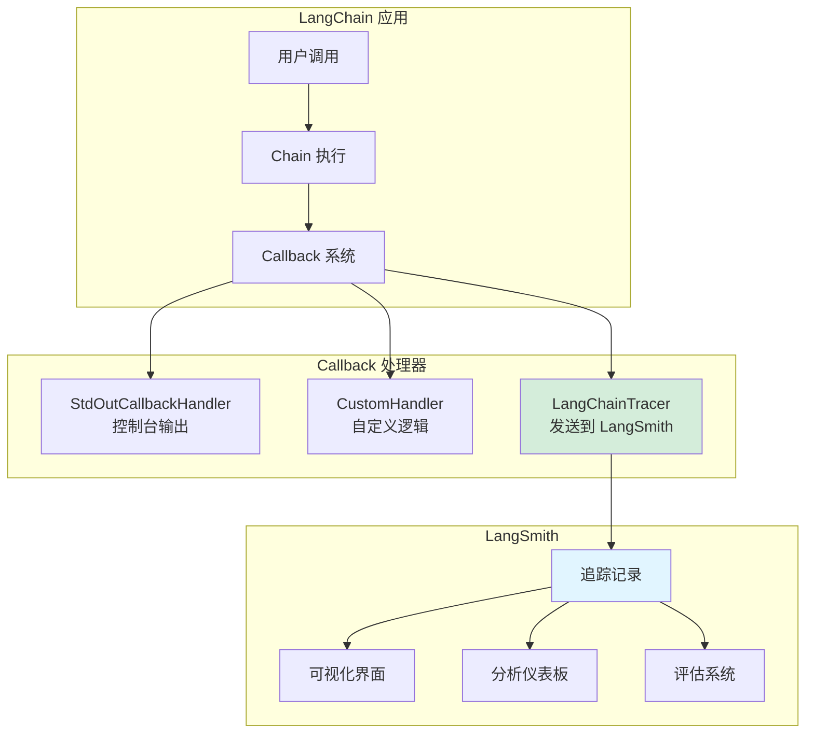
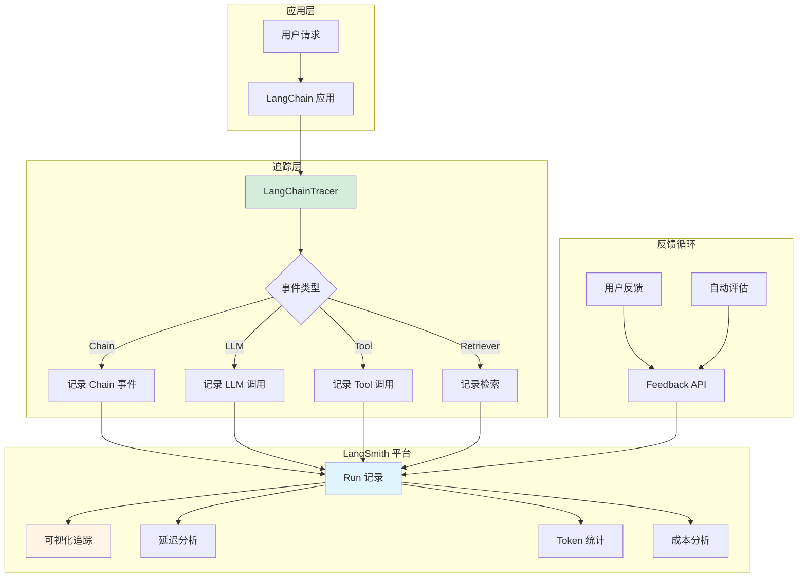

# LangSmith 自动追踪

LangSmith 是 LangChain 官方的可观测性平台，提供自动追踪、调试、评估和监控功能。本节讲解如何集成 LangSmith 到你的应用中。

## 什么是 LangSmith？

LangSmith 提供：
- 🔍 **追踪 (Tracing)**：自动记录每次 LLM 调用
- 🧪 **评估 (Evaluation)**：测试和评估 LLM 应用质量
- 📊 **监控 (Monitoring)**：生产环境性能和使用监控
- 🐛 **调试 (Debugging)**：可视化查看执行流程

## 配置方式

### 环境变量配置

```bash
# 获取 API Key: https://smith.langchain.com
export LANGCHAIN_API_KEY="your_api_key"
export LANGCHAIN_TRACING_V2="true"
export LANGCHAIN_PROJECT="your_project_name"
export LANGCHAIN_ENDPOINT="https://api.smith.langchain.com"
```

### Python 代码配置

```python
import os
from langchain import globals

# 设置追踪
os.environ["LANGCHAIN_API_KEY"] = "your_api_key"
os.environ["LANGCHAIN_TRACING_V2"] = "true"
os.environ["LANGCHAIN_PROJECT"] = "my-langchain-app"

# 启用详细日志
globals.set_verbose(True)

# 现在所有调用都会自动追踪
from langchain_openai import ChatOpenAI
from langchain.chains import ConversationChain

llm = ChatOpenAI(model="gpt-4o")
chain = ConversationChain(llm=llm)

response = chain.invoke({"input": "你好"})
# 访问 https://smith.langchain.com 查看追踪
```

### 使用 context manager

```python
from langchain_sdk import Client
from langchain.callbacks.tracers import LangChainTracer

# 创建 tracer
tracer = LangChainTracer(project_name="my-project")

# 在调用中使用
response = chain.invoke(
    {"input": "你好"},
    config={"callbacks": [tracer]}
)
```

## 自定义 Trace Metadata

### 添加用户信息

```python
from langchain.callbacks.tracers import LangChainTracer
from uuid import uuid4

tracer = LangChainTracer(project_name="production-app")

# 添加用户元数据
response = chain.invoke(
    {"input": "你好"},
    config={
        "callbacks": [tracer],
        "metadata": {
            "user_id": "user_123",
            "session_id": str(uuid4()),
            "environment": "production"
        }
    }
)
```

### 添加标签

```python
response = chain.invoke(
    {"input": "查询天气"},
    config={
        "callbacks": [tracer],
        "tags": ["weather", "customer-facing", "high-priority"]
    }
)

# 在 LangSmith 中可以按 tags 过滤
```

### 添加自定义反馈

```python
from langsmith import Client

client = Client()

# 获取当前 run_id (需要从 tracer 获取)
run_id = get_current_run_id()

# 添加人工反馈
client.create_feedback(
    run_id=run_id,
    key="user_satisfaction",
    score=0.9,  # 0-1 范围
    comment="用户表示满意"
)

# 添加自动反馈（如响应质量评分）
client.create_feedback(
    run_id=run_id,
    key="response_quality",
    score=calculate_quality_score(response)
)
```

## 与 Callback 的关系

::: v-pre

:::

### LangChainTracer 是特殊的 Callback Handler

```python
from langchain.callbacks.tracers import LangChainTracer
from langchain_core.callbacks import BaseCallbackHandler

# LangChainTracer 继承自 BaseCallbackHandler
# 它实现了所有必要的回调方法来记录追踪

# 可以同时使用多个 Handler
tracer = LangChainTracer(project_name="my-project")
custom_handler = CustomLogHandler()

response = chain.invoke(
    {"input": "你好"},
    config={
        "callbacks": [tracer, custom_handler]  # 同时追踪和自定义日志
    }
)
```

## 完整集成示例

### RAG 应用追踪

```python
import os
from langchain_openai import ChatOpenAI, OpenAIEmbeddings
from langchain_community.vectorstores import FAISS
from langchain.chains import RetrievalQA
from langchain.callbacks.tracers import LangChainTracer

# 配置环境变量
os.environ["LANGCHAIN_API_KEY"] = "lsv2_pt_..."
os.environ["LANGCHAIN_TRACING_V2"] = "true"
os.environ["LANGCHAIN_PROJECT"] = "rag-app"

# 创建组件
embeddings = OpenAIEmbeddings()
vectorstore = FAISS.from_texts(["文档内容"], embeddings)
llm = ChatOpenAI(model="gpt-4o")

qa = RetrievalQA.from_chain_type(
    llm=llm,
    retriever=vectorstore.as_retriever()
)

# 创建 tracer
tracer = LangChainTracer(project_name="rag-app")

# 执行查询（自动追踪）
response = qa.invoke(
    {"query": "文档中关于产品的描述是什么？"},
    config={
        "callbacks": [tracer],
        "metadata": {
            "query_type": "product_info",
            "user_id": "customer_001"
        }
    }
)

# 在 LangSmith 中可以看到：
# 1. 完整的检索过程
# 2. 检索到的文档
# 3. LLM 的 prompt 和响应
# 4. 各环节的耗时
```

### Agent 追踪

```python
from langchain.agents import create_tool_calling_agent, AgentExecutor
from langchain_core.tools import tool
from langchain.callbacks.tracers import LangChainTracer

@tool
def search_weather(location: str) -> str:
    """查询天气"""
    return f"{location}今天晴朗，25°C"

@tool
def search_news(topic: str) -> str:
    """搜索新闻"""
    return f"关于{topic}的最新新闻..."

tools = [search_weather, search_news]
agent = create_tool_calling_agent(llm, tools, prompt)
agent_executor = AgentExecutor(agent=agent, tools=tools)

# 追踪 Agent 执行
tracer = LangChainTracer(project_name="agent-demo")

response = agent_executor.invoke(
    {"input": "北京天气怎么样？有什么相关新闻？"},
    config={
        "callbacks": [tracer],
        "tags": ["weather-agent", "multi-tool"]
    }
)

# LangSmith 中会显示：
# - Agent 的思考过程
# - 每次 Tool 调用的输入输出
# - 最终的响应生成
```

## LangSmith Tracing 集成图

::: v-pre

:::

## 高级功能

### 嵌套追踪

```python
from langsmith import traceable

# 使用装饰器标记函数进行追踪
@traceable(name="document_processor")
def process_documents(docs):
    """处理文档"""
    results = []
    for doc in docs:
        # 这个调用也会被追踪
        result = llm.invoke(f"总结：{doc}")
        results.append(result)
    return results

@traceable(name="qa_pipeline")
def qa_pipeline(query):
    """QA 流程"""
    docs = retrieve_documents(query)
    summary = process_documents(docs)
    answer = llm.invoke(f"基于以下信息回答：{summary}\n问题：{query}")
    return answer

# 调用会自动创建嵌套的追踪
response = qa_pipeline("产品有什么功能？")
```

### 批量追踪

```python
from langsmith import Client

client = Client()

# 批量创建 runs
runs_data = [
    {
        "name": "qa_test",
        "inputs": {"query": f"问题{i}"},
        "outputs": {"answer": f"答案{i}"}
    }
    for i in range(100)
]

# 批量上传
for run_data in runs_data:
    client.create_run(
        project_name="batch-tests",
        **run_data
    )
```

### 会话追踪

```python
from langsmith import Client
from uuid import uuid4

client = Client()
session_id = str(uuid4())

# 创建会话
tracer = LangChainTracer(project_name="chat-app")
tracer.session_id = session_id

# 多轮对话会关联到同一会话
for message in conversation:
    response = chain.invoke(
        {"input": message},
        config={"callbacks": [tracer]}
    )

# 在 LangSmith 中可以查看完整会话历史
```

## 查看和分析追踪

### Web 界面

访问 https://smith.langchain.com 查看：
- 📋 **Runs 列表**：所有追踪记录
- 🔍 **搜索过滤**：按 tag、metadata、时间过滤
- 📊 **延迟分析**：各环节耗时分布
- 💰 **成本统计**：Token 使用和成本
- ⭐ **反馈聚合**：用户反馈汇总

### API 访问

```python
from langsmith import Client

client = Client()

# 列出 runs
runs = client.list_runs(project_name="my-project", limit=10)
for run in runs:
    print(f"{run.name}: {run.status}")

# 获取单个 run 详情
run = client.read_run(run_id="...")
print(f"Inputs: {run.inputs}")
print(f"Outputs: {run.outputs}")
print(f"Execution time: {run.end_time - run.start_time}")

# 获取反馈
feedback = client.list_feedback(run_id="...")
for f in feedback:
    print(f"{f.key}: {f.score}")
```

## 最佳实践

### ✅ 推荐做法

1. **生产环境始终启用追踪**
   ```python
   os.environ["LANGCHAIN_TRACING_V2"] = "true"
   ```

2. **添加有意义的 metadata**
   ```python
   config={
       "metadata": {
           "user_segment": "enterprise",
           "feature_flag": "new_rag_v2"
       }
   }
   ```

3. **使用 tags 分类**
   ```python
   config={
       "tags": ["critical-path", "customer-facing"]
   }
   ```

4. **关联反馈**
   ```python
   # 收集用户反馈并关联到 run
   client.create_feedback(run_id, "thumbs", score=1.0)
   ```

### ❌ 避免的问题

1. **不要在 tracing 中记录敏感信息**
   ```python
   # 错误：记录密码等敏感信息
   config={"metadata": {"password": "secret"}}  # ❌
   
   # 正确：脱敏或忽略
   config={"metadata": {"user_id": "user_123"}}  # ✅
   ```

2. **不要过度追踪**
   - 开发/测试环境可以详细追踪
   - 生产环境考虑采样率

3. **不要忽略错误追踪**
   ```python
   # 错误也会自动追踪，便于调试
   ```

## 总结

LangSmith 是 LangChain 应用的必备工具：

- **自动追踪**：无需手动记录
- **可视化调试**：直观查看执行流程
- **质量评估**：内置评估框架
- **生产监控**：性能和成本分析

下一节我们将学习 Langfuse，一个开源的可观测性替代方案。