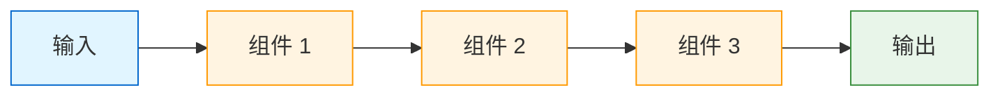
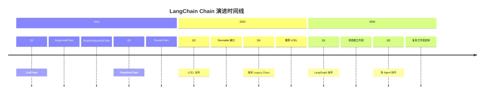

# Chain 基础与演进

> Chain（链）是 LangChain 的核心概念之一。本章将介绍 Chain 的基础概念、演进历史以及常见类型。

## 什么是 Chain？

**Chain（链）** 是 LangChain 中用于组合多个组件、按顺序执行任务的机制。它允许我们将多个处理步骤连接起来，形成一个完整的工作流。

### 核心概念

```
Chain = 组件 + 连接逻辑 + 执行顺序
```

::: v-pre

:::

### 简单示例

```python
from langchain_openai import ChatOpenAI
from langchain_core.prompts import ChatPromptTemplate
from langchain_core.output_parsers import StrOutputParser

# 1. 定义组件
llm = ChatOpenAI(model="gpt-4o")
prompt = ChatPromptTemplate.from_template("翻译以下内容成{language}：{text}")
parser = StrOutputParser()

# 2. 连接成链
chain = prompt | llm | parser

# 3. 执行
result = chain.invoke({
    "language": "英语",
    "text": "你好，世界"
})

print(result)  # 输出：Hello, World
```

💡 **提示**：在 LCEL 出现之前，Chain 是一个具体的类；在 LCEL 之后，任何 Runnable 的组合都可以称为 Chain。

## Chain 的演进历史

### 第一代：Legacy Chain（2022-2023）

早期的 Chain 是具体的 Python 类，如 `LLMChain`、`SequentialChain` 等。

```python
# Legacy 方式（已废弃）
from langchain.chains import LLMChain
from langchain.prompts import PromptTemplate
from langchain.llms import OpenAI

# 这种方式现在已经不推荐使用
prompt = PromptTemplate(
    input_variables=["product"],
    template="给{product}写一个描述"
)

chain = LLMChain(llm=OpenAI(), prompt=prompt)
result = chain.run(product="智能手表")
```

### 第二代：LCEL Chain（2023-2024）

LCEL（LangChain Expression Language）引入了声明式的链构建方式。

```python
# LCEL 方式（推荐）
from langchain_openai import ChatOpenAI
from langchain_core.prompts import ChatPromptTemplate
from langchain_core.output_parsers import StrOutputParser

llm = ChatOpenAI()
prompt = ChatPromptTemplate.from_template("给{product}写一个描述")
parser = StrOutputParser()

chain = prompt | llm | parser
result = chain.invoke({"product": "智能手表"})
```

### 第三代：LangGraph（2024+）

LangGraph 提供了基于图的工作流引擎，支持循环和复杂状态管理。

```python
from langgraph.graph import StateGraph, END

# 定义状态
class State(TypedDict):
    input: str
    output: str

# 创建图
graph = StateGraph(State)
graph.add_node("process", process_node)
graph.set_entry_point("process")
graph.add_edge("process", END)

app = graph.compile()
result = app.invoke({"input": "输入"})
```

## Chain 演进时间线

::: v-pre

:::

## Legacy Chain vs LCEL Chain

### 代码对比

```python
# ==================== Legacy Chain ====================
from langchain.chains import LLMChain, SimpleSequentialChain
from langchain.prompts import PromptTemplate
from langchain.llms import OpenAI

# 步骤 1：创建提示
prompt1 = PromptTemplate(
    input_variables=["product"],
    template="给{product}写一个创意名称"
)

prompt2 = PromptTemplate(
    input_variables=["product_name"],
    template="为{product_name}写一个口号"
)

# 步骤 2：创建链
llm = OpenAI(temperature=0.7)

chain1 = LLMChain(llm=llm, prompt=prompt1, output_key="product_name")
chain2 = LLMChain(llm=llm, prompt=prompt2)

# 步骤 3：组合
overall_chain = SimpleSequentialChain(chains=[chain1, chain2])

# 步骤 4：执行
result = overall_chain.run("智能手表")

# ==================== LCEL Chain ====================
from langchain_openai import ChatOpenAI
from langchain_core.prompts import ChatPromptTemplate
from langchain_core.output_parsers import StrOutputParser
from langchain_core.runnables import RunnablePassthrough

# 步骤 1：创建提示
prompt1 = ChatPromptTemplate.from_template("给{product}写一个创意名称")
prompt2 = ChatPromptTemplate.from_template("为{product_name}写一个口号")

# 步骤 2：创建链
llm = ChatOpenAI(temperature=0.7)

# 方式 1：顺序组合
name_chain = prompt1 | llm | StrOutputParser()
slogan_chain = prompt2 | llm | StrOutputParser()

# 方式 2：带变量传递
full_chain = (
    {"product_name": prompt1 | llm | StrOutputParser()}
    | RunnablePassthrough.assign(output=slogan_chain)
)

# 步骤 3：执行
result = full_chain.invoke({"product": "智能手表"})
```

### 详细对比表

| 维度 | Legacy Chain | LCEL Chain |
|------|--------------|------------|
| **定义方式** | 类实例化 | 操作符组合 |
| **可读性** | 中等 | 高 |
| **灵活性** | 有限 | 极高 |
| **调试难度** | 较高 | 低 |
| **类型安全** | 弱 | 强 |
| **异步支持** | 有限 | 完整 |
| **流式输出** | 复杂 | 简单 |
| **状态管理** | 内置 | 自定义 |
| **学习曲线** | 中等 | 平缓 |

## LLMChain 的废弃与替代

### 为什么废弃 LLMChain？

1. **不够灵活**：硬编码的输入输出处理
2. **难以组合**：与其他组件集成困难
3. **类型不安全**：运行时才能发现错误
4. **异步支持差**：难以实现高效的异步处理

### 迁移指南

#### 场景 1：简单文本生成

```python
# ❌ 旧方式
from langchain.chains import LLMChain
from langchain.prompts import PromptTemplate

prompt = PromptTemplate(
    input_variables=["topic"],
    template="写一篇关于{topic}的短文"
)
chain = LLMChain(llm=llm, prompt=prompt)
result = chain.run(topic="AI")

# ✅ 新方式
from langchain_core.prompts import ChatPromptTemplate
from langchain_core.output_parsers import StrOutputParser

prompt = ChatPromptTemplate.from_template("写一篇关于{topic}的短文")
chain = prompt | llm | StrOutputParser()
result = chain.invoke({"topic": "AI"})
```

#### 场景 2：带输出的链

```python
# ❌ 旧方式
chain = LLMChain(
    llm=llm,
    prompt=prompt,
    output_key="answer"
)
result = chain({"question": "问题"})["answer"]

# ✅ 新方式
from langchain_core.output_parsers import StructuredOutputParser
from langchain_core.prompts import PromptTemplate
from pydantic import BaseModel, Field

class Answer(BaseModel):
    answer: str
    confidence: float

prompt = ChatPromptTemplate.from_template("回答：{question}")
chain = prompt | llm.with_structured_output(Answer)
result = chain.invoke({"question": "问题"})
# result.answer, result.confidence
```

#### 场景 3：多步链

```python
# ❌ 旧方式
from langchain.chains import SequentialChain

chain1 = LLMChain(llm=llm, prompt=prompt1, output_key="summary")
chain2 = LLMChain(llm=llm, prompt=prompt2, input_keys=["summary"])
overall = SequentialChain(chains=[chain1, chain2])

# ✅ 新方式
summary_chain = prompt1 | llm | StrOutputParser()
analyze_chain = prompt2 | llm | StrOutputParser()

overall_chain = summary_chain | analyze_chain
```

## 常见 Chain 类型概览

### 1. 基础 Chain

```python
# 简单链：提示 + LLM + 解析
simple_chain = (
    ChatPromptTemplate.from_template("{input}")
    | llm
    | StrOutputParser()
)
```

### 2. 并行 Chain

```python
from langchain_core.runnables import RunnableParallel

# 同时执行多个独立任务
parallel_chain = RunnableParallel(
    summary=text_chain,
    sentiment=sentiment_chain,
    keywords=keyword_chain,
)

result = parallel_chain.invoke({"text": input_text})
# {summary: "...", sentiment: "...", keywords: "..."}
```

### 3. 条件 Chain

```python
from langchain_core.runnables import RunnableLambda

def route_by_topic(state):
    if "技术" in state["topic"]:
        return tech_chain.invoke(state)
    elif "生活" in state["topic"]:
        return life_chain.invoke(state)
    else:
        return general_chain.invoke(state)

routed_chain = RunnableLambda(route_by_topic)
```

### 4. 记忆 Chain

```python
from langchain.memory import ConversationBufferMemory
from langchain_core.runnables import RunnablePassthrough

memory = ConversationBufferMemory(return_messages=True)

def load_memory(x):
    return {"history": memory.load_memory_variables({})["history"]}

def save_memory(x):
    memory.save_context({"input": x["input"]}, {"output": x["output"]})
    return x

chain_with_memory = (
    RunnablePassthrough.assign(history=load_memory)
    | prompt
    | llm
    | StrOutputParser()
    | RunnableLambda(save_memory)
)
```

### 5. 检索 Chain

```python
from langchain_community.vectorstores import FAISS
from langchain_openai import OpenAIEmbeddings

# 创建检索链
embeddings = OpenAIEmbeddings()
vectorstore = FAISS.from_texts(documents, embeddings)
retriever = vectorstore.as_retriever()

retrieval_chain = (
    {"context": retriever, "question": RunnablePassthrough()}
    | prompt
    | llm
    | StrOutputParser()
)
```

## Chain 组件详解

### 1. Prompt（提示模板）

```python
from langchain_core.prompts import (
    ChatPromptTemplate,
    PromptTemplate,
    FewShotChatMessagePromptTemplate,
)

# 基础模板
template = ChatPromptTemplate.from_template("翻译{input}成{target_language}")

# 带系统消息
template = ChatPromptTemplate.from_messages([
    ("system", "你是一个专业翻译"),
    ("human", "{input}"),
])

# Few-shot 示例
examples = [
    {"input": "你好", "output": "Hello"},
    {"input": "谢谢", "output": "Thank you"},
]

few_shot_prompt = FewShotChatMessagePromptTemplate(
    examples=examples,
    example_prompt=ChatPromptTemplate.from_messages([
        ("human", "{input}"),
        ("ai", "{output}"),
    ]),
    input_variables=["input"],
)
```

### 2. LLM（语言模型）

```python
from langchain_openai import ChatOpenAI, OpenAI
from langchain_anthropic import ChatAnthropic
from langchain_community.llms import HuggingFaceHub

# Chat 模型（推荐）
llm = ChatOpenAI(model="gpt-4o", temperature=0.7)

# 完成模型
llm = OpenAI(model="text-davinci-003")

# 其他提供商
llm = ChatAnthropic(model="claude-3-opus")
llm = HuggingFaceHub(repo_id="bigscience/bloom")

# 本地模型
from langchain_community.llms import Ollama
llm = Ollama(model="llama2")
```

### 3. Output Parser（输出解析器）

```python
from langchain_core.output_parsers import (
    StrOutputParser,
    JsonOutputParser,
    PydanticOutputParser,
    XMLOutputParser,
    CommaSeparatedListOutputParser,
)

# 字符串解析
parser = StrOutputParser()

# JSON 解析
parser = JsonOutputParser()

# 结构化输出（Pydantic）
from pydantic import BaseModel, Field

class Article(BaseModel):
    title: str = Field(description="文章标题")
    content: str = Field(description="文章内容")
    tags: list[str] = Field(description="标签列表")

parser = PydanticOutputParser(pydantic_object=Article)

# 列表解析
parser = CommaSeparatedListOutputParser()
```

### 4. Tool（工具）

```python
from langchain_core.tools import Tool

# 定义工具
calculator = Tool(
    name="calculator",
    func=lambda x: str(eval(x)),
    description="执行数学计算"
)

# 在 Chain 中使用工具
from langchain.agents import create_tool_calling_agent, AgentExecutor

agent = create_tool_calling_agent(llm, [calculator])
executor = AgentExecutor(agent=agent, tools=[calculator])
```

## 实战示例

### 示例 1：内容生成链

```python
from langchain_core.prompts import ChatPromptTemplate
from langchain_core.output_parsers import StrOutputParser
from langchain_openai import ChatOpenAI

# 定义链
content_chain = (
    ChatPromptTemplate.from_template("""
    作为内容专家，请为{topic}生成：
    1. 吸引人的标题（3 个选项）
    2. 大纲结构
    3. 关键要点
    
    目标受众：{audience}
    语调：{tone}
    """)
    | ChatOpenAI(model="gpt-4o")
    | StrOutputParser()
)

# 执行
result = content_chain.invoke({
    "topic": "LangChain 入门",
    "audience": "Python 开发者",
    "tone": "专业但友好"
})
```

### 示例 2：RAG 链

```python
from langchain_community.vectorstores import FAISS
from langchain_openai import OpenAIEmbeddings, ChatOpenAI
from langchain_core.runnables import RunnablePassthrough
from langchain_core.output_parsers import StrOutputParser

# 设置检索
embeddings = OpenAIEmbeddings()
vectorstore = FAISS.from_texts(documents, embeddings)
retriever = vectorstore.as_retriever()

# RAG 链
rag_chain = (
    {"context": retriever, "question": RunnablePassthrough()}
    | ChatPromptTemplate.from_template("""
    基于以下上下文回答问题：
    
    上下文：{context}
    
    问题：{question}
    
    回答：
    """)
    | ChatOpenAI(model="gpt-4o")
    | StrOutputParser()
)

result = rag_chain.invoke("你的问题")
```

### 示例 3：分析链

```python
from langchain_core.runnables import RunnableParallel, RunnableLambda
from pydantic import BaseModel

class Analysis(BaseModel):
    summary: str
    sentiment: str
    keywords: list[str]
    action_items: list[str]

# 并行分析
analysis_chain = RunnableParallel(
    summary=summary_chain,
    sentiment=sentiment_chain,
    keywords=keyword_chain,
) | RunnableLambda(
    lambda x: Analysis(
        summary=x["summary"],
        sentiment=x["sentiment"],
        keywords=x["keywords"],
        action_items=[]
    )
)
```

## 调试技巧

### 1. 打印中间结果

```python
from langchain_core.runnables import RunnableLambda

def debug(x):
    print(f"输入：{x}")
    return x

chain = (
    RunnableLambda(debug)
    | prompt
    | llm
    | RunnableLambda(lambda x: (print(f"输出：{x}"), x)[1])
    | StrOutputParser()
)
```

### 2. 使用 LangSmith

```python
from langchain import hub
from langchain_core.tracers.langchain import LangChainTracer
from langchain_core.runnables import RunnableConfig

# 配置追踪
tracer = LangChainTracer()
config = RunnableConfig(callbacks=[tracer])

result = chain.invoke({"input": "测试"}, config=config)
# 在 LangSmith UI 中查看详细追踪
```

### 3. 类型检查

```python
from typing import TypedDict

class ChainInput(TypedDict):
    topic: str
    audience: str

class ChainOutput(TypedDict):
    content: str
    word_count: int

# 使用类型提示
def process(state: ChainInput) -> ChainOutput:
    result = chain.invoke(state)
    return {"content": result, "word_count": len(result.split())}
```

## 本章小结

本章介绍了 Chain 的基础概念和演进历史：

1. **Chain 定义**：组合多个组件的执行机制
2. **演进历史**：从 Legacy 到 LCEL 再到 LangGraph
3. **对比分析**：Legacy vs LCEL 的详细对比
4. **LLMChain 迁移**：从废弃 API 迁移到 LCEL
5. **常见类型**：基础、并行、条件、记忆、检索链
6. **核心组件**：Prompt、LLM、Parser、Tool

下一章我们将深入学习 **顺序链**，了解如何构建多步骤顺序执行的 Chain。

## 继续学习

- [顺序链](./sequential-chains.md) - 多步骤顺序执行
- [路由链](./router-chain.md) - 条件分支处理
- [迁移到 LCEL](./migrate-to-lcel.md) - 完整迁移指南
- [LCEL 基础](../lcel/) - LCEL 详细教程