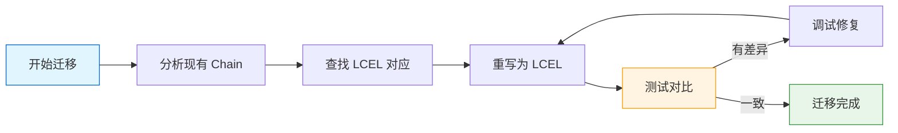

# 迁移到 LCEL

> 从 Legacy Chain 迁移到 LCEL 是使用现代 LangChain 的必经之路。本章提供完整的迁移指南、映射表和实战示例。

## 为什么要迁移到 LCEL？

### Legacy Chain 的问题

1. **灵活性差**
```python
# ❌ Legacy: 硬编码的输入输出处理
chain = LLMChain(llm=llm, prompt=prompt, output_key="answer")
```

2. **难以组合**
```python
# ❌ Legacy: 组合复杂
overall = SequentialChain(chains=[chain1, chain2, chain3], verbose=True)
```

3. **类型不安全**
```python
# ❌ Legacy: 运行时才能发现错误
result = chain.run(product="test")  # 拼写错误？运行时才知道
```

4. **异步支持差**
```python
# ❌ Legacy: 异步 API 不统一
result = await chain.arun(input="test")
```

### LCEL 的优势

```python
# ✅ LCEL: 声明式、灵活、类型安全
chain = prompt | llm | StrOutputParser()
result = chain.invoke({"input": "test"})  # 清晰的输入
```

| 特性 | Legacy | LCEL |
|------|--------|------|
| **定义方式** | 类实例化 | 操作符组合 |
| **组合性** | 有限 | 极高 |
| **类型安全** | 弱 | 强 |
| **异步支持** | 复杂 | 原生 |
| **流式输出** | 困难 | 简单 |
| **学习曲线** | 陡峭 | 平缓 |

## 迁移映射表

::: v-pre
```mermaid
flowchart TB
    subgraph Legacy [Legacy API]
        L1[LLMChain]
        L2[SequentialChain]
        L3[SimpleSequentialChain]
        L4[RouterChain]
        L5[TransformChain]
    end
    
    subgraph LCEL [LCEL Equivalents]
        M1[prompt | llm | parser]
        M2[chain1 | chain2]
        M3[chain_a | chain_b]
        M4[RunnableBranch]
        M5[RunnableLambda]
    end
    
    L1 --> M1
    L2 --> M2
    L3 --> M3
    L4 --> M4
    L5 --> M5
    
    style Legacy fill:#ffebee,stroke:#c62828
    style LCEL fill:#e8f5e9,stroke:#388e3c
```
:::

### 完整映射表

| Legacy Chain | LCEL 等价实现 | 复杂度 |
|--------------|---------------|--------|
| `LLMChain` | `prompt | llm | parser` | 简单 |
| `SimpleSequentialChain` | `chain1 \| chain2` | 简单 |
| `SequentialChain` | `chain1 \| chain2 \| chain3` | 简单 |
| `MultiPromptChain` | `RunnableBranch` | 中等 |
| `RouterChain` | `RunnableLambda(route_fn)` | 中等 |
| `TransformChain` | `RunnableLambda(transform_fn)` | 简单 |
| `ConversationChain` | `prompt \| llm \| parser` + Memory | 中等 |

## 逐个 Chain 类型迁移

### 1. LLMChain 迁移

```python
# ==================== Legacy ====================
from langchain.chains import LLMChain
from langchain.prompts import PromptTemplate
from langchain.llms import OpenAI

legacy_chain = LLMChain(
    llm=OpenAI(temperature=0.7),
    prompt=PromptTemplate(
        input_variables=["product"],
        template="给{product}写一个描述"
    ),
    output_key="description"
)

result = legacy_chain.run(product="智能手表")

# ==================== LCEL ====================
from langchain_openai import ChatOpenAI
from langchain_core.prompts import ChatPromptTemplate
from langchain_core.output_parsers import StrOutputParser

lcel_chain = (
    ChatPromptTemplate.from_template("给{product}写一个描述")
    | ChatOpenAI(temperature=0.7)
    | StrOutputParser()
)

result = lcel_chain.invoke({"product": "智能手表"})
```

### 2. SimpleSequentialChain 迁移

```python
# ==================== Legacy ====================
from langchain.chains import SimpleSequentialChain, LLMChain
from langchain.prompts import PromptTemplate

# 步骤 1
chain1 = LLMChain(
    llm=llm,
    prompt=PromptTemplate(
        input_variables=["topic"],
        template="为{topic}生成标题"
    )
)

# 步骤 2
chain2 = LLMChain(
    llm=llm,
    prompt=PromptTemplate(
        input_variables=["title"],
        template="为标题'{title}'写描述"
    )
)

# 组合
overall = SimpleSequentialChain(chains=[chain1, chain2])
result = overall.run(topic="AI")

# ==================== LCEL ====================
from langchain_core.runnables import RunnablePassthrough

# 方式 1：直接组合（不保留中间结果）
overall = (
    ChatPromptTemplate.from_template("为{topic}生成标题")
    | llm
    | StrOutputParser()
    | (lambda title: f"为标题'{title}'写描述")
    | ChatPromptTemplate.from_template("{input}")
    | llm
    | StrOutputParser()
)

# 方式 2：保留中间结果
overall = (
    {"title": (
        ChatPromptTemplate.from_template("为{topic}生成标题")
        | llm
        | StrOutputParser()
    )}
    | RunnablePassthrough.assign(
        description=(
            ChatPromptTemplate.from_template("为标题'{title}'写描述")
            | llm
            | StrOutputParser()
        )
    )
)

result = overall.invoke({"topic": "AI"})
```

### 3. SequentialChain 迁移

```python
# ==================== Legacy ====================
from langchain.chains import SequentialChain, LLMChain

# 需要指定输入输出变量
chain1 = LLMChain(
    llm=llm,
    prompt=prompt1,
    output_keys=["summary", "keywords"]
)

chain2 = LLMChain(
    llm=llm,
    prompt=prompt2,
    input_keys=["summary", "keywords"]
)

overall = SequentialChain(
    chains=[chain1, chain2],
    input_variables=["document"],
    output_variables=["final_result"]
)

# ==================== LCEL ====================
from langchain_core.runnables import RunnablePassthrough, RunnableParallel

# 清晰的输入输出流
overall = (
    {"document": RunnablePassthrough()}
    | RunnablePassthrough.assign(
        summary=summary_chain,
        keywords=keywords_chain
    )
    | RunnablePassthrough.assign(
        final_result=final_chain
    )
)
```

### 4. MultiPromptChain 迁移

```python
# ==================== Legacy ====================
from langchain.chains import MultiPromptChain

def route(info):
    if "技术" in info["question"]:
        return "tech"
    return "general"

multi_chain = MultiPromptChain(
    llm=llm,
    prompts=[tech_prompt, general_prompt],
    chains=[tech_chain, general_chain],
    route=route
)

# ==================== LCEL ====================
from langchain_core.runnables import RunnableBranch, RunnableLambda

# 方式 1：RunnableBranch
chain = RunnableBranch(
    (lambda x: "技术" in x["question"], tech_chain),
    (lambda x: "健康" in x["question"], health_chain),
    general_chain,  # 默认
)

# 方式 2：LLM 路由
def llm_route(inputs):
    category = router_llm.invoke(inputs["question"])
    return chains[category].invoke(inputs)

chain = RunnableLambda(llm_route)
```

### 5. TransformChain 迁移

```python
# ==================== Legacy ====================
from langchain.chains import TransformChain

def transform(inputs):
    return {"output": inputs["text"].upper()}

transform_chain = TransformChain(
    input_variables=["text"],
    output_variables=["output"],
    transform=transform
)

# ==================== LCEL ====================
from langchain_core.runnables import RunnableLambda

transform_chain = RunnableLambda(lambda x: x["text"].upper())

# 或者组合到链中
full_chain = (
    prompt
    | llm
    | RunnableLambda(lambda x: x.upper())
)
```

### 6. ConversationChain 迁移

```python
# ==================== Legacy ====================
from langchain.chains import ConversationChain
from langchain.memory import ConversationBufferMemory

memory = ConversationBufferMemory()
conversation = ConversationChain(
    llm=llm,
    memory=memory,
    verbose=True
)

response = conversation.predict(input="你好")

# ==================== LCEL ====================
from langchain.memory import ConversationBufferMemory
from langchain_core.runnables import RunnablePassthrough

memory = ConversationBufferMemory(return_messages=True)

def load_memory(x):
    return {"history": memory.load_memory_variables({})["history"]}

def save_memory(x):
    memory.save_context({"input": x["input"]}, {"output": x["output"]})
    return x

conversation_chain = (
    RunnablePassthrough.assign(history=load_memory)
    | ChatPromptTemplate.from_template("""
    {history}
    Human: {input}
    AI: """)
    | llm
    | StrOutputParser()
    | RunnableLambda(save_memory)
)
```

## 常见迁移坑点

### 坑点 1：输出键处理

```python
# ❌ Legacy 使用 output_key
chain = LLMChain(llm=llm, prompt=prompt, output_key="answer")
result = chain["answer"]  # 可以直接按 key 访问

# ✅ LCEL 使用字典
chain = (
    {"answer": answer_chain, "explanation": explanation_chain}
)
result = chain.invoke(inputs)
# result["answer"], result["explanation"]
```

### 坑点 2：输入变量命名

```python
# ❌ Legacy 依赖 input_variables
prompt = PromptTemplate(input_variables=["user_input"], template="...")

# ✅ LCEL 使用模板中的占位符
prompt = ChatPromptTemplate.from_template("...{user_input}...")
```

### 坑点 3：链式调用顺序

```python
# ❌ 错误顺序
wrong_chain = llm | prompt  # LLM 在 prompt 之前！

# ✅ 正确顺序
correct_chain = prompt | llm | parser  # prompt → llm → parser
```

### 坑点 4：返回值处理

```python
# ❌ Legacy 返回可能是 dict 或 string
result = chain.run(input="test")  # string
result = chain({"input": "test"})  # dict

# ✅ LCEL 返回值类型一致
result = chain.invoke({"input": "test"})  # 取决于最后一个组件
```

### 坑点 5：异步处理

```python
# ❌ Legacy 异步不一致
result = await chain.arun(input="test")

# ✅ LCEL 统一的异步 API
result = await chain.ainvoke({"input": "test"})

# 批量异步
results = await chain.abatch([inputs1, inputs2, inputs3])
```

## 迁移路径图

::: v-pre

:::

### 步骤 1：分析现有 Chain

```python
# 列出所有使用的 Chain 类型
from langchain.chains import LLMChain, SequentialChain, RouterChain

# 示例分析
# - LLMChain: 3 处
# - SequentialChain: 1 处
# - RouterChain: 1 处
```

### 步骤 2：查找 LCEL 对应

参考上面的映射表，确定每个 Legacy Chain 的 LCEL 等价实现。

### 步骤 3：逐个迁移

```python
# 推荐逐个文件迁移，而不是一次性全部迁移
# 迁移一个，测试一个
```

### 步骤 4:并行测试

```python
# 同时保留新旧实现进行测试对比
legacy_result = legacy_chain.run(input="test")
lcel_result = lcel_chain.invoke({"input": "test"})

print(f"Legacy: {legacy_result}")
print(f"LCEL: {lcel_result}")
# 确认结果一致
```

## 完整迁移示例

### 示例：内容生成系统迁移

```python
# ==================== Legacy 版本 ====================
from langchain.chains import (
    LLMChain, SequentialChain, SimpleSequentialChain
)
from langchain.prompts import PromptTemplate
from langchain.llms import OpenAI
from langchain.memory import ConversationBufferMemory

llm = OpenAI(temperature=0.7)

# 步骤 1：生成标题
title_chain = LLMChain(
    llm=llm,
    prompt=PromptTemplate(
        input_variables=["topic"],
        template="为{topic}生成 3 个标题选项，用|分隔"
    ),
    output_key="titles"
)

# 步骤 2：生成大纲
outline_chain = LLMChain(
    llm=llm,
    prompt=PromptTemplate(
        input_variables=["topic", "titles"],
        template="为主题'{topic}'生成详细大纲，选用标题：{titles}"
    ),
    output_key="outline"
)

# 步骤 3：生成内容
content_chain = LLMChain(
    llm=llm,
    prompt=PromptTemplate(
        input_variables=["topic", "outline"],
        template="根据以下大纲撰写文章：\n主题：{topic}\n大纲：{outline}"
    ),
    output_key="content"
)

# 组合
overall = SequentialChain(
    chains=[title_chain, outline_chain, content_chain],
    input_variables=["topic"],
    output_variables=["titles", "outline", "content"]
)

# ==================== LCEL 版本 ====================
from langchain_openai import ChatOpenAI
from langchain_core.prompts import ChatPromptTemplate
from langchain_core.output_parsers import StrOutputParser
from langchain_core.runnables import RunnablePassthrough

llm = ChatOpenAI(temperature=0.7, model="gpt-4o")

# 定义各步骤
title_step = (
    ChatPromptTemplate.from_template("为{topic}生成 3 个标题选项，用 | 分隔")
    | llm
    | StrOutputParser()
)

outline_step = (
    ChatPromptTemplate.from_template(
        "为主题'{topic}'生成详细大纲，选用标题：{titles}"
    )
    | llm
    | StrOutputParser()
)

content_step = (
    ChatPromptTemplate.from_template(
        "根据以下大纲撰写文章：\n主题：{topic}\n大纲：{outline}"
    )
    | llm
    | StrOutputParser()
)

# 组合（保留所有中间结果）
overall = (
    {"topic": RunnablePassthrough()}
    | RunnablePassthrough.assign(titles=title_step)
    | RunnablePassthrough.assign(outline=outline_step)
    | RunnablePassthrough.assign(content=content_step)
)

# 使用对比
topic = "人工智能入门"

print("=== Legacy 方式 ===")
legacy_result = overall.run(topic=topic)
print(f"标题：{legacy_result['titles']}")

print("\n=== LCEL 方式 ===")
lcel_result = overall.invoke({"topic": topic})
print(f"标题：{lcel_result['titles']}")
```

## 迁移检查清单

### 代码更改

- [ ] 所有 `PromptTemplate` → `ChatPromptTemplate`
- [ ] 所有 `LLMChain` → `prompt | llm | parser`
- [ ] 所有 `SequentialChain` → `chain1 | chain2`
- [ ] 所有 `.run()` → `.invoke()`
- [ ] 所有 `.arun()` → `.ainvoke()`
- [ ] 导入语句更新为 `langchain_core` 和 `langchain_openai`

### 功能测试

- [ ] 输入输出格式一致
- [ ] 结果质量无下降
- [ ] 错误处理正常
- [ ] 性能可接受

### 代码质量

- [ ] 添加类型提示
- [ ] 更新文档字符串
- [ ] 添加单元测试
- [ ] 移除废弃警告

## 性能对比

```python
import time

# Legacy 性能测试
start = time.time()
for _ in range(10):
    legacy_chain.run(input="test")
legacy_time = time.time() - start

# LCEL 性能测试
start = time.time()
for _ in range(10):
    lcel_chain.invoke({"input": "test"})
lcel_time = time.time() - start

print(f"Legacy: {legacy_time:.2f}s")
print(f"LCEL: {lcel_time:.2f}s")
print(f"提升：{(legacy_time - lcel_time) / legacy_time * 100:.1f}%")
```

## 最佳实践

### ✅ 迁移建议

1. **增量迁移**：不要一次性迁移所有代码
2. **保留旧代码**：迁移完成前不要删除 Legacy 代码
3. **充分测试**：确保新旧版本结果一致
4. **更新文档**：迁移后更新相关文档
5. **团队培训**：确保团队了解 LCEL

### ❌ 避免事项

1. **大爆炸式迁移**：一次性迁移所有代码
2. **跳过测试**：不测试就直接替换
3. **混合使用**：不要新旧代码混用

## 本章小结

本章提供了完整的 Legacy 到 LCEL 迁移指南：

1. **迁移动机**：理解为什么要迁移
2. **映射表**：Legacy → LCEL 对照表
3. **逐个迁移**：各类型 Chain 的具体迁移方法
4. **常见坑点**：避免常见错误
5. **完整示例**：实际项目迁移示例

完成迁移后，你将获得更灵活、更易维护的 LangChain 代码。

## 继续学习

- [Chain 基础](./chain-basics.md) - Chain 概念回顾
- [顺序链](./sequential-chains.md) - 顺序链实践
- [路由链](./router-chain.md) - 路由链实践
- [LCEL 基础](../lcel/) - LCEL 完整教程