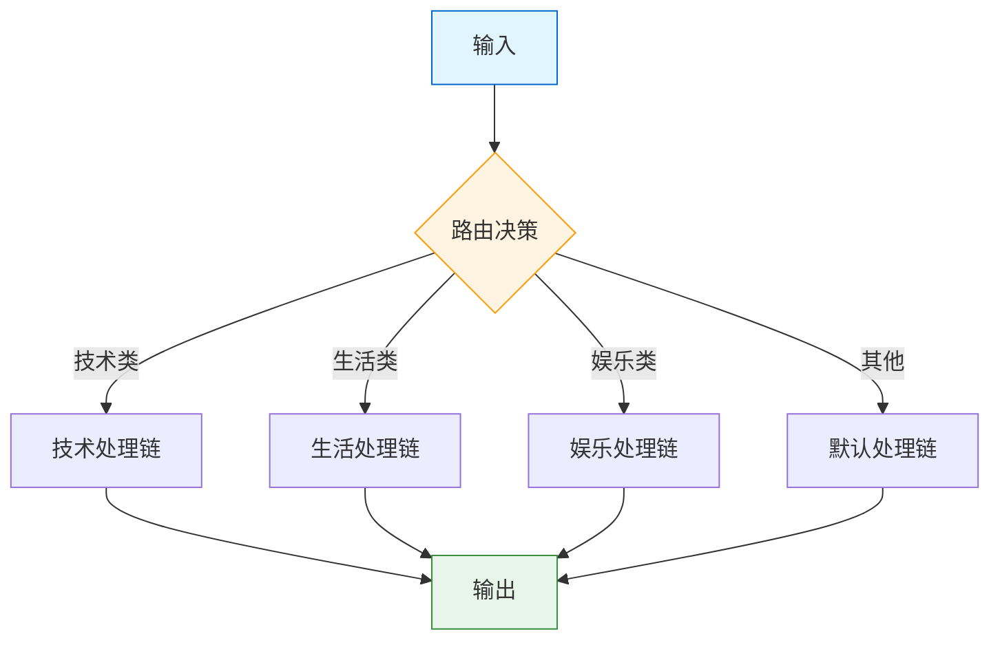
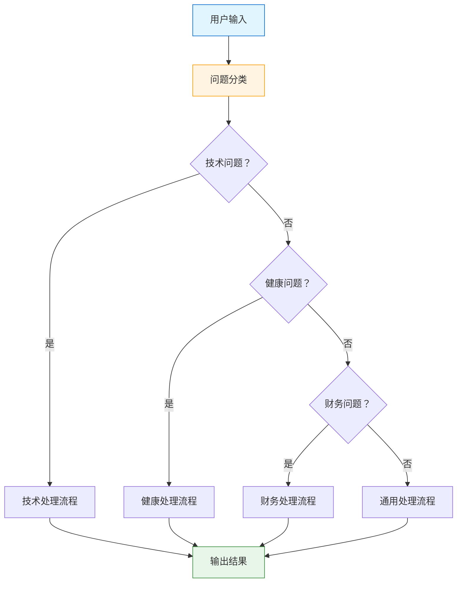

# 路由链

> 路由链根据输入内容动态选择不同的处理路径。本章将介绍 Router Chain、MultiPromptChain 以及 LCEL 实现方式。

## 什么是路由链？

**路由链（Router Chain）** 是一种根据输入内容自动选择执行路径的链。它像一个智能交通系统，将不同的请求引导到最合适的处理流程。

::: v-pre

:::

### 适用场景

- **多领域问答系统**：根据问题类型选择不同专家
- **智能客服**：根据问题分类路由到不同处理流程
- **内容处理**：根据内容类型选择不同分析策略
- **多语言支持**：根据语言选择不同处理管道

## Router Chain 原理

Router Chain 的核心是一个**路由函数**，它分析输入并决定使用哪个分支。

```python
# 路由函数的基本结构
def router(inputs: dict) -> str:
    """
    根据输入决定使用哪个链
    
    返回：链的名称（如 "tech_chain", "life_chain", "default_chain"）
    """
    if "技术" in inputs["input"] or "代码" in inputs["input"]:
        return "tech_chain"
    elif "生活" in inputs["input"]:
        return "life_chain"
    else:
        return "default_chain"
```

## MultiPromptChain

**MultiPromptChain** 是 LangChain 提供的内置路由链实现，它根据问题类型选择不同的提示模板。

### Legacy 方式（已废弃）

```python
# ❌ 旧方式（不推荐使用）
from langchain.chains import MultiPromptChain, LLMChain
from langchain.prompts import PromptTemplate

# 定义不同领域的提示
tech_prompt = PromptTemplate(
    input_variables=["question"],
    template="""作为技术专家，请回答以下问题：
问题：{question}
回答："""
)

life_prompt = PromptTemplate(
    input_variables=["question"],
    template="""作为生活顾问，请回答以下问题：
问题：{question}
回答："""
)

# 创建链
tech_chain = LLMChain(llm=llm, prompt=tech_prompt, output_key="answer")
life_chain = LLMChain(llm=llm, prompt=life_prompt, output_key="answer")

# 定义路由
def route(info):
    if "技术" in info["question"].lower() or "代码" in info["question"].lower():
        return "tech_chain"
    elif "生活" in info["question"].lower():
        return "life_chain"
    else:
        return None  # 使用默认链

# 创建多提示链
multi_chain = MultiPromptChain(
    llm=llm,
    prompts=[tech_prompt, life_prompt],
    chains=[tech_chain, life_chain],
    route=route,
    default_chain=life_chain
)
```

### LCEL 方式（推荐）

```python
# ✅ LCEL 方式
from langchain_core.prompts import ChatPromptTemplate
from langchain_core.output_parsers import StrOutputParser
from langchain_core.runnables import RunnableLambda, RunnablePassthrough
from langchain_openai import ChatOpenAI

llm = ChatOpenAI(model="gpt-4o")

# 定义不同领域的提示
tech_prompt = ChatPromptTemplate.from_template("""
作为技术专家，请专业地回答以下技术问题：
问题：{question}
回答：""")

life_prompt = ChatPromptTemplate.from_template("""
作为生活顾问，请友好地回答以下生活问题：
问题：{question}
回答：""")

general_prompt = ChatPromptTemplate.from_template("""
请回答以下问题：
问题：{question}
回答：""")

# 创建各个领域的链
tech_chain = tech_prompt | llm | StrOutputParser()
life_chain = life_prompt | llm | StrOutputParser()
general_chain = general_prompt | llm | StrOutputParser()

# 定义路由函数
def route(inputs):
    question = inputs["question"].lower()
    
    tech_keywords = ["代码", "编程", "技术", "软件", "开发", "api", "python", "java"]
    life_keywords = ["健康", "饮食", "运动", "生活", "健身", "减肥"]
    
    if any(kw in question for kw in tech_keywords):
        return tech_chain.invoke(inputs)
    elif any(kw in question for kw in life_keywords):
        return life_chain.invoke(inputs)
    else:
        return general_chain.invoke(inputs)

# 创建路由链
router_chain = RunnableLambda(route)

# 使用
result = router_chain.invoke({"question": "Python 如何实现异步编程？"})
print(result)
```

## LCEL 实现路由

### 基础路由

```python
from langchain_core.runnables import RunnableLambda, RunnableBranch

# 方式 1：RunnableBranch（推荐）
from langchain_core.runnables import RunnableBranch

# 定义条件判断函数
def is_tech_question(x):
    return "技术" in x["question"] or "代码" in x["question"]

def is_life_question(x):
    return "生活" in x["question"] or "健康" in x["question"]

# 创建分支路由
branch_route = RunnableBranch(
    (is_tech_question, tech_chain),
    (is_life_question, life_chain),
    general_chain,  # 默认分支
)

result = branch_route.invoke({"question": "如何学习 Python？"})
```

### 使用 LLM 进行路由

```python
# 让 LLM 来决定路由
from langchain_core.output_parsers import StrOutputParser
from typing import Literal

# 路由分类提示
router_prompt = ChatPromptTemplate.from_template("""
请分析以下问题属于哪个类别：
问题：{question}

类别选项：
- tech: 技术、编程、软件相关
- health: 健康、医疗、运动相关
- finance: 金融、投资、理财相关
- general: 其他一般问题

只返回类别名称（tech/health/finance/general）：""")

# 路由分类器
router_llm = ChatOpenAI(model="gpt-3.5-turbo", temperature=0)
classifier = router_prompt | router_llm | StrOutputParser()

# 路由分发函数
def dispatch(inputs):
    category = classifier.invoke(inputs).strip().lower()
    
    chains = {
        "tech": tech_chain,
        "health": health_chain,
        "finance": finance_chain,
    }
    
    selected_chain = chains.get(category, general_chain)
    return selected_chain.invoke(inputs)

# 完整路由链
llm_router_chain = RunnableLambda(dispatch)
```

### 带置信度的路由

```python
from pydantic import BaseModel, Field
from typing import Literal

class RouteDecision(BaseModel):
    category: Literal["tech", "health", "finance", "general"] = Field(
        description="问题类别"
    )
    confidence: float = Field(
        description="置信度 0-1"
    )
    reasoning: str = Field(
        description="选择理由"
    )

# 结构化路由决策
router_llm = ChatOpenAI(model="gpt-4o", temperature=0).with_structured_output(RouteDecision)

router_prompt = ChatPromptTemplate.from_template("""
分析问题并决定路由：
问题：{question}

可用类别：
- tech: 技术问题
- health: 健康问题  
- finance: 财务问题
- general: 其他

请分析并输出 JSON 格式的路由决策。""")

structured_router = router_prompt | router_llm

def routed_dispatch(inputs):
    decision = structured_router.invoke(inputs)
    
    print(f"路由决策：{decision}")
    print(f"理由：{decision.reasoning}")
    
    chains = {
        "tech": tech_chain,
        "health": health_chain,
        "finance": finance_chain,
    }
    
    selected_chain = chains.get(decision.category, general_chain)
    return selected_chain.invoke(inputs)
```

## 语义路由

语义路由使用向量相似度来决定路由，而不是关键词匹配。

```python
from langchain_community.vectorstores import FAISS
from langchain_openai import OpenAIEmbeddings
from langchain_core.documents import Document

# 1. 准备示例文档（每个类别）
category_examples = {
    "tech": [
        Document("Python 编程问题", metadata={"category": "tech"}),
        Document("API 接口调用", metadata={"category": "tech"}),
        Document("数据库优化", metadata={"category": "tech"}),
    ],
    "health": [
        Document("健康饮食建议", metadata={"category": "health"}),
        Document("运动健身计划", metadata={"category": "health"}),
        Document("心理健康咨询", metadata={"category": "health"}),
    ],
    "finance": [
        Document("投资理财建议", metadata={"category": "finance"}),
        Document "股票分析方法", metadata={"category": "finance"}),
        Document("税务规划", metadata={"category": "finance"}),
    ],
}

# 2. 创建向量存储
embeddings = OpenAIEmbeddings()

# 为每个类别创建向量存储
category_stores = {}
for category, docs in category_examples.items():
    store = FAISS.from_documents(docs, embeddings)
    category_stores[category] = store

# 3. 语义路由函数
def semantic_route(question: str, threshold: float = 0.7):
    """基于语义相似度路由"""
    question_embedding = embeddings.embed_query(question)
    
    best_category = None
    best_score = 0
    
    for category, store in category_stores.items():
        # 计算与每个类别的相似度
        results = store.similarity_search_with_score(question, k=1)
        if results:
            doc, score = results[0]
            # score 越小越相似
            if score < best_score or best_category is None:
                best_score = score
                best_category = category
    
    # 检查置信度
    if best_score > threshold:
        return "general"  # 置信度低，使用默认类别
    
    return best_category

# 4. 完整路由链
def semantic_dispatch(inputs):
    category = semantic_route(inputs["question"])
    
    chains = {
        "tech": tech_chain,
        "health": health_chain,
        "finance": finance_chain,
        "general": general_chain,
    }
    
    return chains[category].invoke(inputs)

semantic_router_chain = RunnableLambda(semantic_dispatch)
```

## 路由决策图

::: v-pre

:::

## 实战案例

### 案例 1：智能客服路由

```python
from langchain_core.runnables import RunnableBranch, RunnableLambda

# 定义各处理链
complaint_chain = (
    ChatPromptTemplate.from_template("""
    处理客户投诉：
    问题：{question}
    
    请以同理心回应，提供解决方案，并道歉。
    """)
    | llm
    | StrOutputParser()
)

inquiry_chain = (
    ChatPromptTemplate.from_template("""
    回答客户咨询：
    问题：{question}
    
    请提供准确、详细的信息。
    """)
    | llm
    | StrOutputParser()
)

feedback_chain = (
    ChatPromptTemplate.from_template("""
    感谢客户反馈：
    内容：{question}
    
    请表达感谢并表示会改进。
    """)
    | llm
    | StrOutputParser()
)

billing_chain = (
    ChatPromptTemplate.from_template("""
    处理账单问题：
    问题：{question}
    
    请专业地解释账单细节。
    """)
    | llm
    | StrOutputParser()
)

# 路由分类器
def classify_inquiry(question):
    question = question.lower()
    
    complaint_words = ["投诉", "不满", "失望", "生气", "差评", "退款"]
    inquiry_words = ["怎么", "如何", "什么", "哪里", "什么时候", "请问"]
    feedback_words = ["建议", "反馈", "希望", "觉得", "意见"]
    billing_words = ["账单", "付款", "扣费", "价格", "收费"]
    
    scores = {
        "complaint": sum(1 for w in complaint_words if w in question),
        "inquiry": sum(1 for w in inquiry_words if w in question),
        "feedback": sum(1 for w in feedback_words if w in question),
        "billing": sum(1 for w in billing_words if w in question),
    }
    
    best = max(scores, key=scores.get)
    if scores[best] == 0:
        return "default"
    return best

# 路由链
customer_service_router = RunnableBranch(
    (lambda x: classify_inquiry(x["question"]) == "complaint", complaint_chain),
    (lambda x: classify_inquiry(x["question"]) == "billing", billing_chain),
    (lambda x: classify_inquiry(x["question"]) == "feedback", feedback_chain),
    (lambda x: classify_inquiry(x["question"]) == "inquiry", inquiry_chain),
    general_chain,  # 默认
)

# 使用
result = customer_service_router.invoke({
    "question": "我对你们的服务很失望，要求退款！"
})
```

### 案例 2：多语言路由

```python
# 语言检测
def detect_language(text: str) -> str:
    """检测输入文本的语言"""
    import re
    
    # 简单语言检测（实际应使用 langdetect 等库）
    if re.search(r'[\u4e00-\u9fff]', text):
        return "zh"
    elif re.search(r'[a-zA-Z]', text) and len(text) > 10:
        return "en"
    elif re.search(r'[\u3040-\u309f\u30a0-\u30ff]', text):
        return "ja"
    else:
        return "unknown"

# 各语言处理链
zh_chain = (
    ChatPromptTemplate.from_template("用中文回答：{question}")
    | llm
    | StrOutputParser()
)

en_chain = (
    ChatPromptTemplate.from_template("Answer in English: {question}")
    | llm
    | StrOutputParser()
)

ja_chain = (
    ChatPromptTemplate.from_template("日本語で答えてください：{question}")
    | llm
    | StrOutputParser()
)

# 语言路由
def language_route(inputs):
    lang = detect_language(inputs["question"])
    
    chains = {
        "zh": zh_chain,
        "en": en_chain,
        "ja": ja_chain,
    }
    
    selected_chain = chains.get(lang, en_chain)
    return selected_chain.invoke(inputs)

language_router = RunnableLambda(language_route)
```

### 案例 3：复杂度路由

```python
# 根据问题复杂度路由
complexity_prompt = ChatPromptTemplate.from_template("""
评估以下问题的复杂度（1-10 分）：
问题：{question}

只需要返回数字：""")

complexity_scorer = complexity_prompt | llm | StrOutputParser()

def route_by_complexity(inputs):
    complexity = complexity_scorer.invoke(inputs)
    
    try:
        score = int(complexity.strip())
    except:
        score = 5
    
    if score >= 8:
        # 复杂问题：使用详细分析链
        return detailed_analysis_chain.invoke(inputs)
    elif score >= 5:
        # 中等复杂度
        return standard_chain.invoke(inputs)
    else:
        # 简单问题
        return quick_answer_chain.invoke(inputs)

complexity_router = RunnableLambda(route_by_complexity)
```

## 高级路由模式

### 级联路由

```python
# 多级路由：先粗分类，再细分类
def cascade_route(inputs):
    question = inputs["question"]
    
    # 第一级：领域分类
    if "技术" in question or "代码" in question:
        domain = "tech"
    elif "健康" in question or "医疗" in question:
        domain = "health"
    else:
        domain = "general"
    
    # 第二级：紧急程度分类
    if "紧急" in question or "急" in question:
        priority = "urgent"
    else:
        priority = "normal"
    
    # 组合路由键
    route_key = f"{domain}_{priority}"
    
    routes = {
        "tech_urgent": tech_urgent_chain,
        "tech_normal": tech_normal_chain,
        "health_urgent": health_urgent_chain,
        "health_normal": health_normal_chain,
        "general_urgent": urgent_chain,
        "general_normal": general_chain,
    }
    
    selected = routes.get(route_key, general_chain)
    return selected.invoke(inputs)
```

### 并行路由

```python
from langchain_core.runnables import RunnableParallel

# 并行执行多个路由，然后合并结果
parallel_router = RunnableParallel(
    answer=question_chain,
    related_questions=(
        ChatPromptTemplate.from_template("基于{question}生成 3 个相关问题")
        | llm
        | StrOutputParser()
    ),
    summary=(
        ChatPromptTemplate.from_template("用一句话总结：{question}")
        | llm
        | StrOutputParser()
    ),
)
```

### 带回退的路由

```python
def route_with_fallback(inputs):
    """路由失败时回退到默认链"""
    try:
        category = classifier.invoke(inputs).strip()
        chain = chains.get(category)
        
        if chain is None:
            raise ValueError(f"Unknown category: {category}")
        
        return chain.invoke(inputs)
    except Exception as e:
        print(f"路由失败：{e}，使用默认链")
        return default_chain.invoke(inputs)
```

## 调试技巧

```python
def debug_router(inputs):
    """带调试信息的路由"""
    print(f"输入：{inputs}")
    
    category = classifier.invoke(inputs).strip()
    print(f"路由到：{category}")
    
    chain = chains.get(category, default_chain)
    result = chain.invoke(inputs)
    
    print(f"输出：{result[:100]}...")
    return result
```

## 最佳实践

### ✅ 推荐

1. **清晰的路由条件**：确保各类别之间不重叠
2. **合理的默认值**：总是提供默认处理链
3. **日志记录**：记录路由决策便于分析
4. **置信度阈值**：低置信度时使用默认链

### ❌ 避免

1. **过度细分**：类别太多会降低准确性
2. **硬编码规则**：使用 LLM 进行智能路由
3. **忽略边缘情况**：考虑所有可能的输入

## 本章小结

本章深入探讨了路由链：

1. **Router Chain 原理**：基于条件选择处理路径
2. **MultiPromptChain**：多提示路由实现
3. **LCEL 路由**：RunnableBranch、LLM 路由、语义路由
4. **实战案例**：客服路由、多语言路由、复杂度路由
5. **高级模式**：级联、并行、回退路由

下一章我们将学习如何**从 Legacy Chain 迁移到 LCEL**。

## 继续学习

- [迁移到 LCEL](./migrate-to-lcel.md) - 完整迁移指南
- [顺序链](./sequential-chains.md) - 顺序链详解
- [Chain 基础](./chain-basics.md) - Chain 概念回顾
- [LCEL 基础](../lcel/lcel-basics.md) - LCEL 详细教程