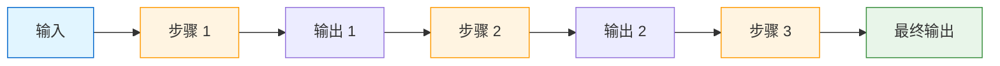
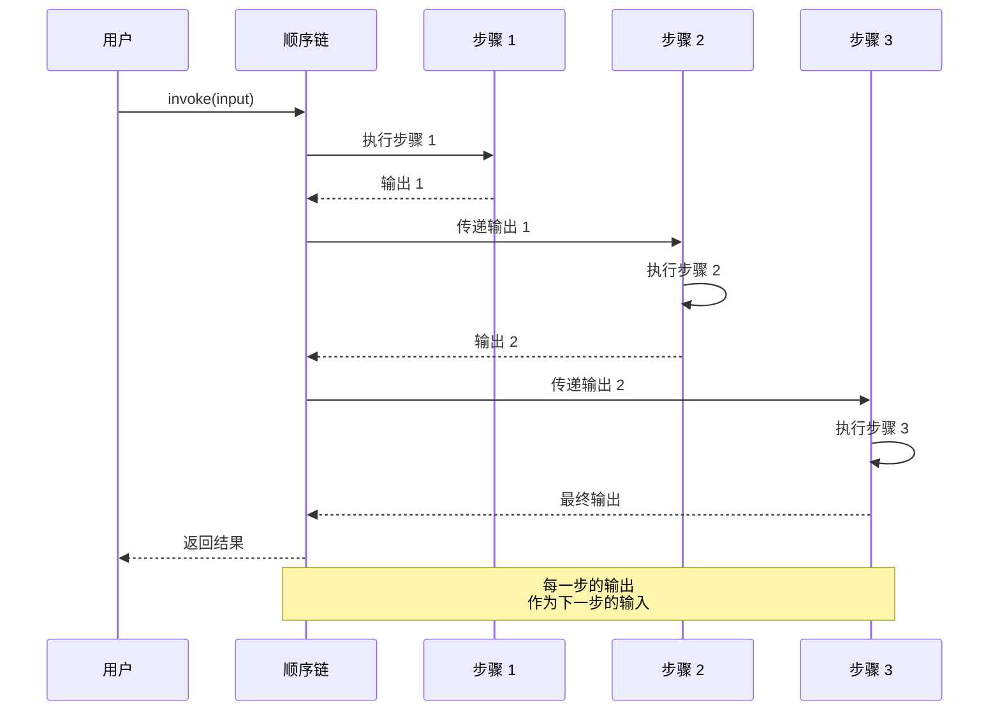

# 顺序链

> 顺序链用于按固定顺序执行多个处理步骤。本章将介绍 SequentialChain、SimpleSequentialChain 以及 LCEL 实现方式。

## 什么是顺序链？

**顺序链（Sequential Chain）** 是 LangChain 中最基础的链类型之一，它将多个处理步骤按顺序连接，前一个步骤的输出作为后一个步骤的输入。

::: v-pre

:::

### 适用场景

- 多步骤内容生成（大纲 → 段落 → 润色）
- 数据处理流水线（清洗 → 转换 → 分析）
- 文档处理（摘要 → 提取 → 分类）
- 翻译工作流（翻译 → 校对 → 本地化）

## SimpleSequentialChain

**SimpleSequentialChain** 是最简单的顺序链，每个步骤只有一个输入和一个输出。

### Legacy 方式（已废弃）

```python
# ❌ 旧方式（不要使用）
from langchain.chains import SimpleSequentialChain, LLMChain
from langchain.prompts import PromptTemplate

# 步骤 1：生成标题
title_prompt = PromptTemplate(
    input_variables=["topic"],
    template="为{topic}生成一个吸引人的标题"
)
title_chain = LLMChain(llm=llm, prompt=title_prompt)

# 步骤 2：生成描述
desc_prompt = PromptTemplate(
    input_variables=["title"],
    template="为标题'{title}'写一段描述"
)
desc_chain = LLMChain(llm=llm, prompt=desc_prompt)

# 组合
overall_chain = SimpleSequentialChain(chains=[title_chain, desc_chain])
result = overall_chain.run("人工智能")
```

### LCEL 方式（推荐）

```python
# ✅ 新方式
from langchain_core.prompts import ChatPromptTemplate
from langchain_core.output_parsers import StrOutputParser
from langchain_openai import ChatOpenAI

llm = ChatOpenAI(model="gpt-4o")

# 定义各个步骤
title_chain = (
    ChatPromptTemplate.from_template("为{topic}生成一个吸引人的标题")
    | llm
    | StrOutputParser()
)

desc_chain = (
    ChatPromptTemplate.from_template("为标题'{title}'写一段 100 字左右的描述")
    | llm
    | StrOutputParser()
)

# 组合成顺序链
overall_chain = title_chain | desc_chain

# 执行
result = overall_chain.invoke({"topic": "人工智能"})
print(result)
```

### 查看中间结果

```python
# 如果需要在中间步骤获取结果
from langchain_core.runnables import RunnablePassthrough

# 保留中间结果的链
chain_with_intermediate = (
    {"title": title_chain}
    | RunnablePassthrough.assign(description=desc_chain)
)

result = chain_with_intermediate.invoke({"topic": "人工智能"})
print(f"标题：{result['title']}")
print(f"描述：{result['description']}")
```

## SequentialChain

**SequentialChain** 支持更复杂的场景，可以处理多个输入输出变量。

### Legacy 方式

```python
# ❌ 旧方式
from langchain.chains import SequentialChain, LLMChain

# 第一个链输出多个变量
chain1 = LLMChain(
    llm=llm,
    prompt=prompt1,
    output_keys=["summary", "keywords"]  # 多个输出
)

# 第二个链使用前面的输出
chain2 = LLMChain(
    llm=llm,
    prompt=prompt2,
    input_keys=["summary", "keywords"]  # 多个输入
)

overall_chain = SequentialChain(
    chains=[chain1, chain2],
    input_variables=["document"],
    output_variables=["final_output"]
)
```

### LCEL 方式

```python
# ✅ LCEL 方式
from langchain_core.runnables import RunnableParallel, RunnablePassthrough

# 步骤 1：生成摘要和关键词
step1 = (
    ChatPromptTemplate.from_template("总结以下文档并提取关键词：{document}")
    | llm
    | StrOutputParser()
)

# 步骤 2：基于摘要生成回答
step2 = (
    ChatPromptTemplate.from_template("""
    基于以下摘要生成详细回答：
    摘要：{summary}
    问题：{question}
    """)
    | llm
    | StrOutputParser()
)

# 组合（保持中间结果）
full_chain = (
    {"document": RunnablePassthrough()}
    | RunnablePassthrough.assign(summary=step1)
    | RunnablePassthrough.assign(answer=step2)
)

result = full_chain.invoke({
    "document": "长篇文档内容...",
    "question": "这个文档讲了什么？"
})

print(f"摘要：{result['summary']}")
print(f"回答：{result['answer']}")
```

## LCEL 实现顺序链

LCEL 提供了更灵活、更易读的方式来实现顺序链。

### 基础组合

```python
from langchain_core.prompts import ChatPromptTemplate
from langchain_core.output_parsers import StrOutputParser
from langchain_openai import ChatOpenAI

llm = ChatOpenAI(model="gpt-4o")

# 最简单的顺序组合
chain = (
    ChatPromptTemplate.from_template("优化这段文字：{text}")
    | llm
    | StrOutputParser()
    | (lambda x: x.upper())  # 可以添加任意 Python 函数
    | StrOutputParser()
)
```

### 多步骤流水线

```python
# 内容生成流水线
content_pipeline = (
    # 步骤 1：生成大纲
    ChatPromptTemplate.from_template("为{topic}生成详细大纲")
    | llm
    | StrOutputParser()
    
    # 步骤 2：基于大纲生成内容
    | (lambda outline: f"基于以下大纲撰写完整文章：\n{outline}")
    | ChatPromptTemplate.from_template("{input}")
    | llm
    | StrOutputParser()
    
    # 步骤 3：润色
    | (lambda content: f"润色以下内容，使其更流畅：\n{content}")
    | ChatPromptTemplate.from_template("{input}")
    | llm
    | StrOutputParser()
)

result = content_pipeline.invoke({"topic": "LangChain 入门教程"})
```

### 带状态传递

```python
from langchain_core.runnables import RunnablePassthrough

# 每一步都保留之前的结果
stateful_chain = (
    {"topic": RunnablePassthrough()}
    
    # 步骤 1：生成标题
    | RunnablePassthrough.assign(
        title=(
            ChatPromptTemplate.from_template("为{topic}生成标题")
            | llm
            | StrOutputParser()
        )
    )
    
    # 步骤 2：生成大纲（使用标题）
    | RunnablePassthrough.assign(
        outline=(
            ChatPromptTemplate.from_template("为'{title}'生成详细大纲")
            | llm
            | StrOutputParser()
        )
    )
    
    # 步骤 3：生成内容（使用标题和大纲）
    | RunnablePassthrough.assign(
        content=(
            ChatPromptTemplate.from_template(
                "基于标题'{title}'和以下大纲撰写文章：\n{outline}"
            )
            | llm
            | StrOutputParser()
        )
    )
)

result = stateful_chain.invoke({"topic": "Python 异步编程"})
print(f"标题：{result['title']}")
print(f"大纲：{result['outline'][:100]}...")
print(f"内容：{result['content'][:200]}...")
```

## 输入输出传递

### 单输入单输出

```python
# 最简单的情况
simple_chain = (
    ChatPromptTemplate.from_template("{input}")
    | llm
    | StrOutputParser()
)

result = simple_chain.invoke({"input": "问题"})
```

### 单输入多输出

```python
from langchain_core.runnables import RunnableParallel

# 从一个输入生成多个输出
multi_output_chain = RunnableParallel(
    summary=(
        ChatPromptTemplate.from_template("总结：{input}")
        | llm
        | StrOutputParser()
    ),
    keywords=(
        ChatPromptTemplate.from_template("提取关键词：{input}")
        | llm
        | StrOutputParser()
    ),
    sentiment=(
        ChatPromptTemplate.from_template("分析情感：{input}")
        | llm
        | StrOutputParser()
    ),
)

result = multi_output_chain.invoke({"input": "一段文本"})
# {summary: "...", keywords: "...", sentiment: "..."}
```

### 多输入单输出

```python
# 多个输入合并成一个输出
multi_input_chain = (
    ChatPromptTemplate.from_template("""
    基于以下信息生成产品描述：
    产品名称：{name}
    产品特点：{features}
    目标用户：{audience}
    """)
    | llm
    | StrOutputParser()
)

result = multi_input_chain.invoke({
    "name": "智能手表",
    "features": "心率监测、GPS、防水",
    "audience": "运动爱好者"
})
```

### 多输入多输出

```python
# 复杂的输入输出处理
complex_chain = (
    RunnablePassthrough.assign(
        # 步骤 1：分析
        analysis=(
            ChatPromptTemplate.from_template("分析以下产品：{name} - {features}")
            | llm
            | StrOutputParser()
        )
    )
    | RunnablePassthrough.assign(
        # 步骤 2：基于分析生成内容
        description=(
            ChatPromptTemplate.from_template("""
            基于以下分析生成产品描述：
            {analysis}
            目标用户：{audience}
            """)
            | llm
            | StrOutputParser()
        ),
        # 步骤 3：生成标签
        tags=(
            ChatPromptTemplate.from_template("为以下产品生成标签：{name}")
            | llm
            | StrOutputParser()
        )
    )
)

result = complex_chain.invoke({
    "name": "智能手表",
    "features": "心率监测、GPS、防水",
    "audience": "运动爱好者"
})
```

## 顺序链执行图

::: v-pre

:::

## 实战案例

### 案例 1：文章生成流水线

```python
from langchain_core.prompts import ChatPromptTemplate
from langchain_core.output_parsers import StrOutputParser
from langchain_openai import ChatOpenAI
from langchain_core.runnables import RunnablePassthrough

llm = ChatOpenAI(model="gpt-4o")

# 完整的文章生成流水线
article_pipeline = (
    {"topic": RunnablePassthrough()}
    
    # 步骤 1：生成标题（3 个选项）
    | RunnablePassthrough.assign(
        titles=(
            ChatPromptTemplate.from_template("为'{topic}'生成 3 个吸引人的标题，用|分隔")
            | llm
            | StrOutputParser()
        )
    )
    
    # 步骤 2：生成大纲
    | RunnablePassthrough.assign(
        outline=(
            ChatPromptTemplate.from_template("""
            为以下主题生成详细文章大纲：
            主题：{topic}
            选用标题：{titles}
            
            要求：
            - 包含引言、主体、结论
            - 主体部分分 3-5 个小节
            """)
            | llm
            | StrOutputParser()
        )
    )
    
    # 步骤 3：撰写正文
    | RunnablePassthrough.assign(
        content=(
            ChatPromptTemplate.from_template("""
            根据以下大纲撰写完整文章：
            
            主题：{topic}
            标题：{titles}
            大纲：
            {outline}
            
            要求：
            - 2000 字左右
            - 语言流畅专业
            - 包含具体例子
            """)
            | llm
            | StrOutputParser()
        )
    )
    
    # 步骤 4：生成摘要
    | RunnablePassthrough.assign(
        summary=(
            ChatPromptTemplate.from_template("为以下文章生成 200 字摘要：\n{content}")
            | llm
            | StrOutputParser()
        )
    )
)

# 执行
result = article_pipeline.invoke({"topic": "大语言模型的应用与发展"})

print("=" * 50)
print(f"标题选项：{result['titles']}")
print("=" * 50)
print(f"大纲：\n{result['outline']}")
print("=" * 50)
print(f"摘要：\n{result['summary']}")
print("=" * 50)
print(f"正文：\n{result['content'][:500]}...")
```

### 案例 2：数据处理流水线

```python
from langchain_core.runnables import RunnableLambda
import json

# 数据清洗和分析流水线
data_pipeline = (
    # 步骤 1：解析输入
    RunnableLambda(lambda x: json.loads(x) if isinstance(x, str) else x)
    
    # 步骤 2：数据清洗
    | RunnableLambda(lambda data: {
        k: v.strip() if isinstance(v, str) else v
        for k, v in data.items()
        if v is not None
    })
    
    # 步骤 3：提取关键信息
    | RunnablePassthrough.assign(
        analysis=(
            ChatPromptTemplate.from_template("""
            分析以下数据并提取关键洞察：
            {data}
            """)
            | llm
            | StrOutputParser()
        )
    )
    
    # 步骤 4：生成报告
    | RunnablePassthrough.assign(
        report=(
            ChatPromptTemplate.from_template("""
            基于以下数据和分析生成报告：
            原始数据：{data}
            分析结果：{analysis}
            
            报告格式：
            1. 概述
            2. 关键发现
            3. 建议
            """)
            | llm
            | StrOutputParser()
        )
    )
)

# 使用示例
input_data = """
{
    "sales_q1": "  100 万 ",
    "sales_q2": "120 万  ",
    "sales_q3": null,
    "notes": "  第三季度数据缺失  "
}
"""

result = data_pipeline.invoke(input_data)
print(result["report"])
```

### 案例 3：翻译工作流

```python
# 专业翻译流水线（翻译 + 校对 + 本地化）
translation_pipeline = (
    {"text": RunnablePassthrough(), "target": RunnablePassthrough()}
    
    # 步骤 1：初译
    | RunnablePassthrough.assign(
        draft=(
            ChatPromptTemplate.from_template("将以下{text}翻译成{target}")
            | llm
            | StrOutputParser()
        )
    )
    
    # 步骤 2：校对
    | RunnablePassthrough.assign(
        reviewed=(
            ChatPromptTemplate.from_template("""
            校对以下翻译，修正错误和不自然之处：
            原文：{text}
            译文：{draft}
            目标语言：{target}
            """)
            | llm
            | StrOutputParser()
        )
    )
    
    # 步骤 3：本地化
    | RunnablePassthrough.assign(
        localized=(
            ChatPromptTemplate.from_template("""
            将以下翻译进行本地化优化，使其更符合{target}的表达习惯：
            {reviewed}
            """)
            | llm
            | StrOutputParser()
        )
    )
)

result = translation_pipeline.invoke({
    "text": "我们的产品在市场上具有很强的竞争力",
    "target": "英语"
})

print(f"初译：{result['draft']}")
print(f"校对：{result['reviewed']}")
print(f"本地化：{result['localized']}")
```

## 错误处理

```python
from langchain_core.runnables import RunnableLambda

def safe_execute(chain, fallback="处理失败"):
    """安全执行链，失败时返回默认值"""
    def _safe(inputs):
        try:
            return chain.invoke(inputs)
        except Exception as e:
            print(f"链执行失败：{e}")
            return fallback
    return RunnableLambda(_safe)

# 使用
robust_chain = (
    step1_chain
    | safe_execute(step2_chain, fallback="步骤 2 失败")
    | safe_execute(step3_chain, fallback="步骤 3 失败")
)
```

## 性能优化

### 1. 批量处理

```python
# 批量处理多个输入
inputs = [
    {"topic": "主题 1"},
    {"topic": "主题 2"},
    {"topic": "主题 3"},
]

# 批量执行
results = chain.batch(inputs)

# 或者异步批量
results = await chain.abatch(inputs)
```

### 2. 流式输出

```python
# 流式获取结果
for chunk in chain.stream({"topic": "长文章主题"}):
    print(chunk, end="", flush=True)
```

### 3. 缓存中间结果

```python
from functools import lru_cache

@lru_cache(maxsize=100)
def cached_step1(topic: str) -> str:
    return step1_chain.invoke({"topic": topic})

# 使用缓存的步骤
optimized_chain = (
    RunnableLambda(lambda x: cached_step1(x["topic"]))
    | step2_chain
)
```

## 调试技巧

```python
from langchain_core.runnables import RunnableLambda

# 添加调试日志
def debug_log(x, name="步骤"):
    print(f"=== {name} 输入 ===")
    print(x)
    return x

debug_chain = (
    RunnableLambda(lambda x: debug_log(x, "输入"))
    | step1_chain
    | RunnableLambda(lambda x: debug_log(x, "步骤 1 输出"))
    | step2_chain
    | RunnableLambda(lambda x: debug_log(x, "步骤 2 输出"))
)
```

## 常见问题

### Q1: 如何处理长链中的错误？

**A**: 使用 try-except 包装每个步骤，或设置合理的 fallback：

```python
def with_fallback(chain, fallback):
    def _wrapped(inputs):
        try:
            return chain.invoke(inputs)
        except:
            return fallback
    return RunnableLambda(_wrapped)
```

### Q2: 如何在中间步骤修改数据？

**A**: 使用 RunnableLambda 添加转换步骤：

```python
chain = (
    step1
    | RunnableLambda(lambda x: {**x, "new_field": process(x["output"])})
    | step2
)
```

### Q3: 如何并行执行某些步骤？

**A**: 使用 RunnableParallel：

```python
parallel_chain = RunnableParallel(
    step2a=step2a_chain,
    step2b=step2b_chain,
)
```

## 本章小结

本章深入探讨了顺序链：

1. **SimpleSequentialChain**：最简单的一对一顺序链
2. **SequentialChain**：支持多输入输出的顺序链
3. **LCEL 实现**：更灵活的组合方式
4. **输入输出传递**：单/多输入输出的各种组合
5. **实战案例**：文章生成、数据处理、翻译工作流
6. **错误处理**：构建健壮的链

下一章我们将学习 **路由链**，了解如何实现条件分支和语义路由。

## 继续学习

- [路由链](./router-chain.md) - 条件分支处理
- [迁移到 LCEL](./migrate-to-lcel.md) - Legacy 迁移指南
- [Chain 基础](./chain-basics.md) - Chain 概念回顾
- [LCEL 基础](../lcel/) - LCEL 详细教程