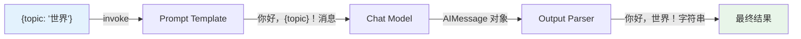
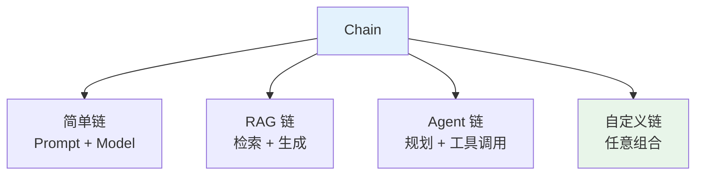
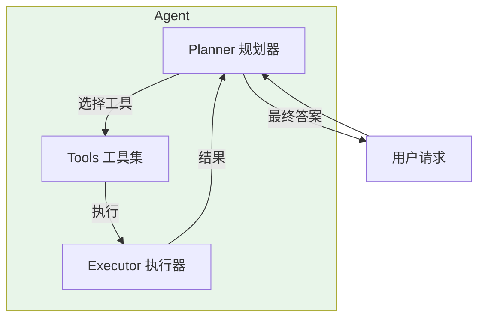
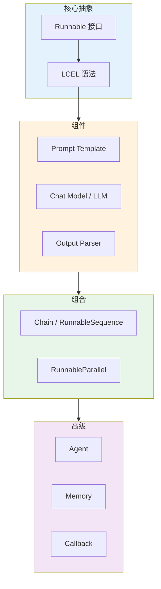

# 核心概念

在深入学习 LangChain 之前，我们需要掌握一些核心概念。这些概念是理解整个框架的基础。

## LCEL（LangChain Expression Language）

**LCEL** 是 LangChain Expression Language 的缩写，它是 LangChain 的声明式编排语言。

### 设计哲学

LCEL 的核心设计理念可以概括为：

1. **组合性（Composability）**: 组件应该像乐高积木一样可以自由组合
2. **一致性（Consistency）**: 所有组件遵循统一的接口规范
3. **流式优先（Streaming First）**: 流式输出是原生能力，不是事后添加
4. **异步友好（Async Friendly）**: 异步操作是一等公民

### 基本语法

```python
from langchain_core.prompts import ChatPromptTemplate
from langchain_openai import ChatOpenAI
from langchain_core.output_parsers import StrOutputParser

# 三个基本组件
prompt = ChatPromptTemplate.from_template("你好，{topic}！")
llm = ChatOpenAI(model="gpt-4o")
parser = StrOutputParser()

# 使用 pipe 操作符组合
chain = prompt | llm | parser

# 执行
result = chain.invoke({"topic": "世界"})
print(result)  # 你好，世界！
```

### Pipe 操作符的魔力

`|` 操作符是 LCEL 的核心，它将前一个组件的输出自动连接到后一个组件的输入：

::: v-pre

:::

## Runnable 接口

**Runnable** 是 LangChain 中所有组件的统一接口。任何实现了 Runnable 接口的对象都可以参与 LCEL 组合。

### Runnable 核心方法

```python
from typing import Any, Optional, AsyncIterator, Iterator
from langchain_core.runnables import Runnable, RunnableConfig

class MyComponent(Runnable[dict, str]):
    """自定义 Runnable 组件"""
    
    def invoke(self, input: dict, config: Optional[RunnableConfig] = None) -> str:
        """同步调用"""
        return f"处理：{input}"
    
    async def ainvoke(self, input: dict, config: Optional[RunnableConfig] = None) -> str:
        """异步调用"""
        return f"异步处理：{input}"
    
    def stream(self, input: dict, config: Optional[RunnableConfig] = None) -> Iterator[str]:
        """流式输出"""
        for char in f"处理：{input}":
            yield char
    
    async def astream(self, input: dict, config: Optional[RunnableConfig] = None) -> AsyncIterator[str]:
        """异步流式输出"""
        for char in f"异步处理：{input}":
            yield char
```

### Runnable 实现者

LangChain 中以下组件都实现了 Runnable 接口：

| 组件类型 | 示例类 | Input | Output |
|---------|--------|-------|--------|
| **Prompt Template** | `ChatPromptTemplate` | dict | List[BaseMessage] |
| **Chat Model** | `ChatOpenAI` | List[BaseMessage] | AIMessage |
| **LLM** | `OpenAI` | str | str |
| **Output Parser** | `StrOutputParser` | AIMessage | str |
| **Retriever** | `VectorStoreRetriever` | str | List[Document] |
| **Tool** | `@tool` | dict | Any |
| **Chain** | `RunnableSequence` | Any | Any |

## Runnable 变体

### RunnableLambda

将普通函数包装成 Runnable：

```python
from langchain_core.runnables import RunnableLambda

def normalize_text(text: str) -> str:
    return text.strip().lower()

# 包装成 Runnable
normalizer = RunnableLambda(normalize_text)

# 可以在链中使用
chain = prompt | llm | RunnableLambda(normalize_text) | parser
```

### RunnablePassthrough

透传输入，用于分支或添加额外字段：

```python
from langchain_core.runnables import RunnablePassthrough

# 透传原始输入
chain = (
    RunnablePassthrough()  # 输入原样输出
    | RunnableLambda(lambda x: f"处理：{x}")
)

# 添加额外字段
chain = (
    RunnablePassthrough.assign(
        extra=lambda x: "额外信息"
    )
    | RunnableLambda(lambda x: f"{x['input']} + {x['extra']}")
)
```

### RunnableParallel

并行执行多个分支：

```python
from langchain_core.runnables import RunnableParallel, RunnableLambda

def branch_a(x):
    return f"A: {x}"

def branch_b(x):
    return f"B: {x}"

# 并行执行两个分支
parallel = RunnableParallel(
    branch_a=RunnableLambda(branch_a),
    branch_b=RunnableLambda(branch_b),
)

result = parallel.invoke("input")
# {'branch_a': 'A: input', 'branch_b': 'B: input'}
```

### RunnableSequence

多个 Runnable 的顺序组合（pipe 操作符的内部实现）：

```python
from langchain_core.runnables import RunnableSequence

# 这两种写法等价
chain1 = prompt | llm | parser
chain2 = RunnableSequence(prompt, llm, parser)
```

## Chain（链）

**Chain** 是多个组件按顺序组合的执行单元。在 LCEL 时代，任何 `RunnableSequence` 都可以称为 Chain。

### Chain 的类型

::: v-pre

:::

### 创建自定义 Chain

```python
from langchain_core.runnables import RunnableSerializable, RunnableLambda
from pydantic import BaseModel

class CustomChainInput(BaseModel):
    question: str
    context: list[str]

class CustomChainOutput(BaseModel):
    answer: str
    sources: list[str]

class RAGChain(RunnableSerializable[CustomChainInput, CustomChainOutput]):
    """自定义 RAG 链"""
    
    def invoke(self, input: CustomChainInput, config = None) -> CustomChainOutput:
        context_text = "\n".join(input.context)
        prompt = f"基于以下信息回答问题:\n{context_text}\n\n问题：{input.question}"
        # 调用 LLM...
        return CustomChainOutput(answer="答案", sources=input.context)

# 使用
chain = RAGChain()
result = chain.invoke(
    CustomChainInput(question="...", context=["文档 1", "文档 2"])
)
```

## Agent（智能体）

**Agent** 是能够自主推理、规划和使用工具完成复杂任务的 LLM 应用。

### Agent 的核心组件

::: v-pre

:::

### Agent vs Chain

| 特性 | Chain | Agent |
|-----|-------|-------|
| **执行方式** | 预定义流程 | 动态规划 |
| **灵活性** | 固定 | 自适应 |
| **可预测性** | 高 | 中等 |
| **适用场景** | 结构化任务 | 开放任务 |

### Agent 示例

```python
from langchain.agents import create_tool_calling_agent, AgentExecutor
from langchain_openai import ChatOpenAI
from langchain_community.tools import DuckDuckGoSearchRun

# 定义工具
search = DuckDuckGoSearchRun()
tools = [search]

# 创建 Agent
llm = ChatOpenAI(model="gpt-4o")
agent = create_tool_calling_agent(llm, tools, prompt)

# 创建执行器
executor = AgentExecutor(agent=agent, tools=tools)

# 执行
result = executor.invoke({"input": "今天北京天气如何？"})
```

## Memory（记忆）

**Memory** 用于在对话中维护历史上下文，让 LLM 能够"记住"之前的交流。

### Memory 的类型

| 类型 | 说明 | 适用场景 |
|-----|------|---------|
| **Buffer Memory** | 存储完整历史 | 短对话 |
| **Window Memory** | 只保留最近 N 轮 | 长对话 |
| **Summary Memory** | 自动摘要历史 | 超长对话 |
| **Vector Memory** | 向量检索相关历史 | 知识密集型对话 |

### Memory 示例

```python
from langchain.memory import ConversationBufferWindowMemory

memory = ConversationBufferWindowMemory(
    k=5,              # 保留最近 5 轮
    return_messages=True,
    memory_key="chat_history"
)

# 保存记忆
memory.save_context(
    {"input": "你好"},
    {"output": "你好！有什么可以帮助你的？"}
)

# 获取历史
history = memory.load_memory_variables({})
```

## Callback（回调）

**Callback** 系统提供对 LLM 应用执行过程的细粒度观察和控制。

### Callback 用途

- 📊 **监控**: 收集执行指标（延迟、token 数等）
- 🔍 **调试**: 查看中间步骤和输出
- 📝 **日志**: 记录执行历史
- 🔔 **通知**: 在特定事件时触发通知

### 自定义 Callback Handler

```python
from langchain.callbacks.base import BaseCallbackHandler

class MyHandler(BaseCallbackHandler):
    def on_llm_start(self, serialized, prompts, **kwargs):
        print(f"开始调用 LLM: {prompts[0][:50]}...")
    
    def on_llm_end(self, response, **kwargs):
        print(f"LLM 调用完成：{len(response.generations)} 个结果")
    
    def on_tool_start(self, serialized, input_str, **kwargs):
        print(f"使用工具：{serialized['name']}")

# 使用
chain = prompt | llm | parser
result = chain.invoke(
    {"question": "..."},
    config={"callbacks": [MyHandler()]}
)
```

## 概念关系图

::: v-pre

:::

## 总结

| 概念 | 一句话定义 | 关键作用 |
|-----|-----------|---------|
| **LCEL** | 声明式编排语言 | 统一组合语法 |
| **Runnable** | 标准接口 | 所有组件的统一抽象 |
| **Chain** | 组件序列 | 执行单元 |
| **Agent** | 自主推理 | 复杂任务处理 |
| **Memory** | 历史维护 | 对话上下文 |
| **Callback** | 事件钩子 | 可观测性和控制 |

---

## 下一步

- 📖 继续 [快速上手](./quick-start.md)
- 📚 查看 [术语表](./glossary.md)
- ⚡ 深入学习 [LCEL 基础](/lcel/lcel-basics.md)