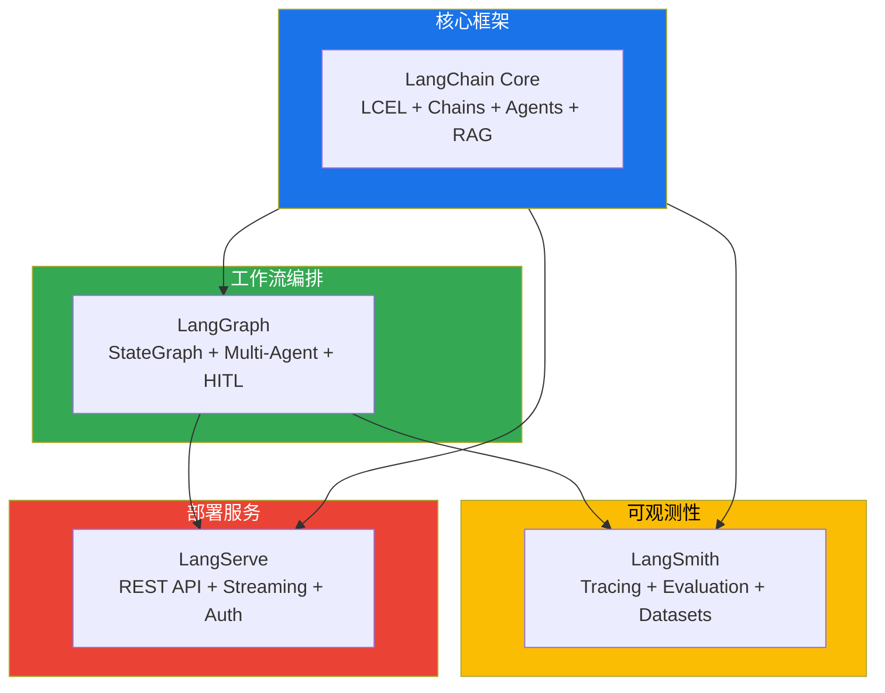
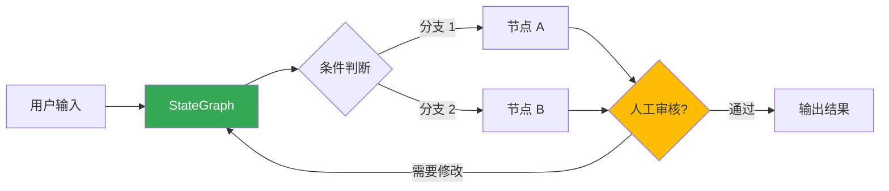
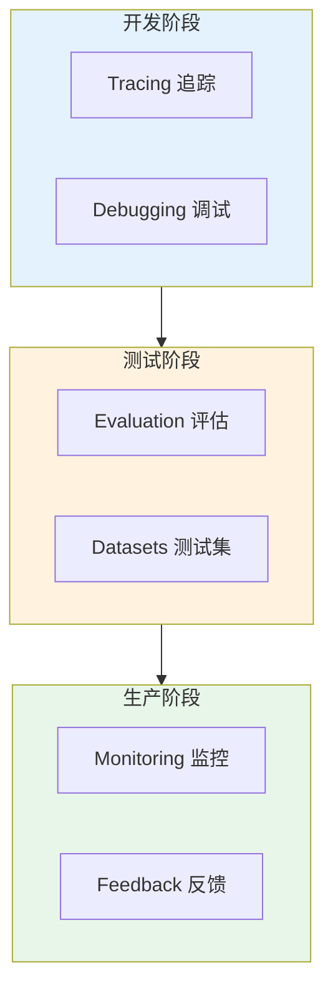
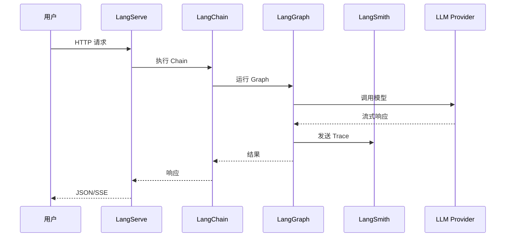
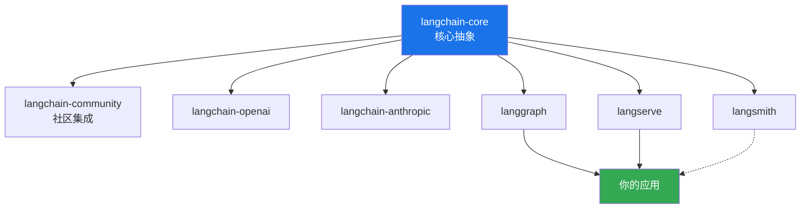
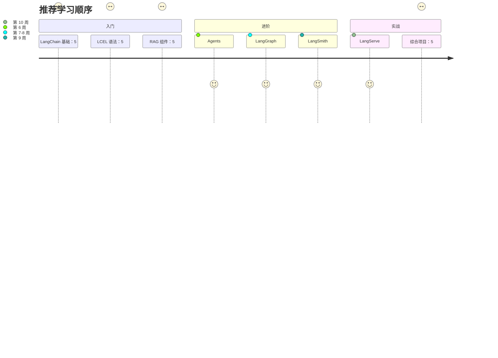

```mermaid
gantt
    title LLM 应用开发流程
    dateFormat  X
    axisFormat  阶段
    
    section 开发
    LangChain 原型   :a1, 0, 3d
    LangGraph 编排   :a2, after a1, 2d
    
    section 测试
    LangSmith 评估   :b1, after a2, 2d
    迭代优化         :b2, after b1, 3d
    
    section 部署
    LangServe 发布   :c1, after b2, 1d
    生产监控         :c2, after c1, 7d
```

# LangChain 全家桶生态图

全面了解 LangChain 生态系统的整体架构和各组件的关系。

## 生态全景图

::: v-pre

:::

## 四大核心组件详解

### 1️⃣ LangChain Core（核心框架）

**定位**: LLM 应用开发的基础框架

**核心能力**:

| 能力域 | 组件 | 说明 |
|-------|------|------|
| **Model I/O** | Chat Models, LLMs | 统一的模型接口 |
| | Prompt Templates | 结构化 Prompt 生成 |
| | Output Parsers | 输出格式化 |
| **数据层** | Document Loaders | 多格式文档加载 |
| | Text Splitters | 智能文本切分 |
| | Embeddings | 文本向量化 |
| | Vector Stores | 向量存储与索引 |
| | Retrievers | 检索策略 |
| **应用层** | Chains | 组件编排 |
| | Agents | 工具调用 |
| | Memory | 对话记忆 |
| **工具** | Callbacks | 事件钩子 |
| | Tools | 外部功能集成 |

**适用场景**:
- 构建问答系统
- 开发 RAG 应用
- 创建工具调用 Agent

---

### 2️⃣ LangGraph（工作流编排）

**定位**: 基于图的状态机工作流引擎

**核心价值**:

::: v-pre

:::

**核心能力**:

| 特性 | 说明 | 示例 |
|-----|------|------|
| **StateGraph** | 有状态的工作流定义 | 订单处理流程 |
| **条件路由** | 动态分支决策 | 意图分类路由 |
| **循环** | 迭代执行 | 反思优化循环 |
| **Human-in-the-Loop** | 人工审核断点 | 关键决策审核 |
| **Multi-Agent** | 多智能体协作 | 规划 + 执行分工 |
| **Persistence** | 状态检查点 | 长任务恢复 |

**适用场景**:
- 多步骤复杂工作流
- 需要人工审核的场景
- 多智能体协作系统

---

### 3️⃣ LangSmith（可观测性平台）

**定位**: LLM 应用开发运维平台

**核心能力**:

::: v-pre

:::

| 功能 | 说明 | 价值 |
|-----|------|------|
| **Tracing** | 完整调用链追踪 | 问题定位效率提升 3 倍 |
| **Evaluation** | 自动化评估 | 质量量化，持续改进 |
| **Datasets** | 测试集管理 | 回归测试，版本对比 |
| **Prompt Hub** | Prompt 版本管理 | 可追溯，可回滚 |
| **Analytics** | 使用分析 | 优化决策支持 |

**适用场景**:
- 生产环境监控
- 模型性能评估
- Prompt 迭代优化

---

### 4️⃣ LangServe（部署服务）

**定位**: LLM 应用一键部署

**核心能力**:

| 功能 | 说明 | 示例 |
|-----|------|------|
| **REST API** | 快速发布 Chain | `/invoke` 端点 |
| **Streaming** | SSE 流式输出 | 实时响应 |
| **Playground** | 内置测试界面 | 无需额外工具 |
| **Authentication** | API Key 认证 | 生产安全 |
| **Rate Limiting** | 请求限流 | 防止滥用 |

**部署流程**:

```python
from fastapi import FastAPI
from langserve import add_routes

app = FastAPI()
add_routes(app, chain)  # 一行代码部署
```

**适用场景**:
- 快速发布 API 服务
- 前端应用后端支持
- 微服务架构集成

---

## 生态关系详解

### 数据流关系

::: v-pre

:::

### 开发阶段使用关系

::: v-pre

:::

---

## 组件对比

### LangChain vs LangGraph

| 维度 | LangChain | LangGraph |
|-----|-----------|-----------|
| **编排方式** | 线性/管道 | 图状/状态机 |
| **适用场景** | 简单 Pipeline | 复杂工作流 |
| **状态管理** | 隐式 | 显式 StateSchema |
| **循环支持** | 有限 | ✅ 完整支持 |
| **人机协同** | ❌ | ✅ 断点/恢复 |

### LangChain vs LangSmith

| 维度 | LangChain | LangSmith |
|-----|-----------|-----------|
| **定位** | 开发框架 | 可观测性平台 |
| **功能** | 构建应用 | 监控、评估、调试 |
| **部署** | 本地运行 | 云端服务 |
| **成本** | 免费开源 | 免费额度 + 付费 |

### 与其他生态对比

| 生态 | 开发框架 | 编排 | 可观测性 | 部署 |
|-----|---------|------|---------|------|
| **LangChain** | LangChain | LangGraph | LangSmith | LangServe |
| **LlamaIndex** | LlamaIndex | ❌ | 第三方 | 第三方 |
| **Haystack** | Haystack | Pipeline | 有限 | Haystack API |
| **自建** | 自研 | 自研 | 自研（复杂） | 自研 |

---

## 包依赖关系

::: v-pre

:::

### 安装指南

```bash
# 必装：核心包
pip install langchain-core langchain-community

# 按需：模型 Provider
pip install langchain-openai
pip install langchain-anthropic

# 按需：LangGraph
pip install langgraph

# 按需：LangSmith
pip install langsmith

# 按需：LangServe
pip install langserve sse-starlette
```

---

## 典型技术栈组合

### 场景 1: 企业知识库问答

```
LangChain (RAG 组件)
    ↓
LangSmith (追踪 + 评估)
    ↓
LangServe (API 部署)
```

### 场景 2: 多智能体协作系统

```
LangChain (基础组件)
    ↓
LangGraph (Multi-Agent 编排)
    ↓
LangSmith (Agent 追踪)
    ↓
LangServe (服务发布)
```

### 场景 3: 复杂工作流

```
LangChain (Model I/O)
    ↓
LangGraph (StateGraph)
    ↓
LangSmith (评估优化)
```

---

## 学习路径建议

::: v-pre

:::

---

## 总结

| 组件 | 一句话定位 | 核心价值 |
|-----|-----------|---------|
| **LangChain** | LLM 应用开发框架 | 组件化、可组合 |
| **LangGraph** | 工作流编排引擎 | 复杂流程、多智能体 |
| **LangSmith** | 可观测性平台 | 追踪、评估、优化 |
| **LangServe** | 部署服务 | 快速发布 API |

> 💡 **关键洞察**: 四个组件各司其职，LangChain 是基础，LangGraph 处理复杂编排，LangSmith 保障质量，LangServe 负责部署。

---

<Badge type="info" text="LangChain 全家桶" />
<Badge type="success" text="2026 最新版" />