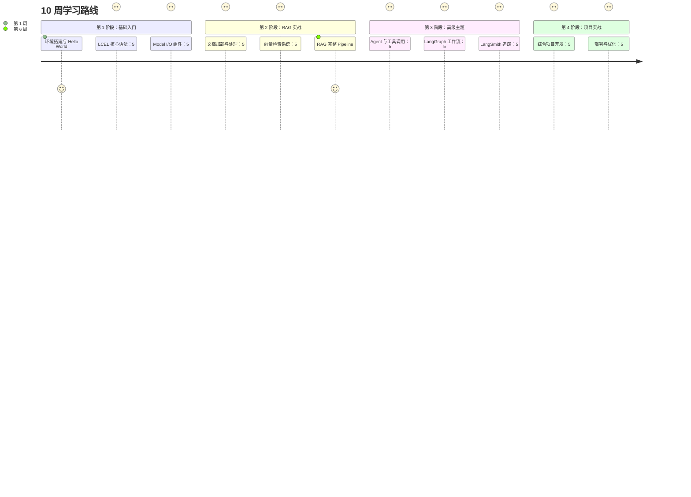

# 学习路径：10 周掌握 LangChain 全家桶

## 总体概览

::: v-pre

:::

## 详细学习计划

### 第 1 周：环境搭建与 Hello World

**目标**: 完成开发环境配置，运行第一个 LangChain 程序

**学习内容**:
- Python 环境配置
- LangChain 安装与版本管理
- API Key 配置
- Hello World 示例
- LCEL 基础语法

**实践项目**:
1. 创建虚拟环境并安装依赖
2. 配置 OpenAI/DashScope API
3. 编写第一个 Chain
4. 实现流式输出

**产出物**: hello_world.py 示例代码

---

### 第 2 周：LCEL 核心语法

**目标**: 深入理解 LCEL 声明式编排

**学习内容**:
- Runnable 接口详解
- pipe 操作符
- RunnableLambda
- RunnableParallel
- RunnablePassthrough

**产出物**: LCEL 语法速查表

---

### 第 3 周：Model I/O 组件

**目标**: 掌握 LLM 交互核心组件

**学习内容**:
- Chat Models (OpenAI, Anthropic, 国内模型)
- Prompt Templates
- Output Parsers
- 结构化输出

**产出物**: Model I/O 组件库

---

### 第 4 周：文档加载与处理

**目标**: 掌握 RAG 数据预处理

**学习内容**:
- Document Loaders (PDF, Web, DB)
- Text Splitters 策略
- Embeddings 模型选型

**产出物**: 文档处理 Pipeline

---

### 第 5 周：向量检索系统

**目标**: 构建向量检索核心能力

**学习内容**:
- 向量数据库选型
- 向量存储与索引
- Retriever 配置
- 混合检索策略

**产出物**: 向量检索服务

---

### 第 6 周：RAG 完整 Pipeline

**目标**: 实现端到端 RAG 系统

**学习内容**:
- RAG 架构设计
- 检索优化策略
- Prompt 工程
- 结果评估

**产出物**: 知识库问答系统

---

### 第 7 周：Agent 与工具调用

**目标**: 掌握 Agent 开发能力

**学习内容**:
- Agent 架构原理
- Tool 设计与实现
- Tool Calling
- AgentExecutor

**产出物**: 工具调用 Agent

---

### 第 8 周：LangGraph 工作流

**目标**: 掌握复杂工作流编排

**学习内容**:
- StateGraph 基础
- 节点与边定义
- 条件路由
- 人机协同

**产出物**: 复杂工作流引擎

---

### 第 9 周：LangSmith 追踪

**目标**: 建立可观测性体系

**学习内容**:
- Tracing 配置
- 评估体系
- Dataset 管理
- Prompt 版本管理

**产出物**: 可观测性 Dashboard

---

### 第 10 周：项目实战与部署

**目标**: 完成综合项目并部署

**学习内容**:
- 项目整合
- LangServe 部署
- 性能优化
- 生产最佳实践

**产出物**: 生产级应用

---

## 学习建议

### ✅ 应该做的

1. **每天编码**: 保持手感，至少 30 分钟
2. **做笔记**: 记录关键概念和代码片段
3. **参与社区**: Discord、GitHub Issues
4. **构建项目**: 学完每个模块都做个小项目
5. **教别人**: 写作或分享巩固理解

### ❌ 应该避免的

1. **只看不练**: LLM 开发是实践技能
2. **过早优化**: 先跑起来，再优化
3. **忽视文档**: 官方文档是最好资源
4. **单打独斗**: 遇到问题及时提问

---

## 技能检验清单

完成 10 周学习后，你应该能够：

### 基础能力
- [ ] 解释 LCEL 的设计哲学
- [ ] 使用 pipe 构建 Chain
- [ ] 配置 Chat Models
- [ ] 创建 Prompt Templates

### 进阶能力
- [ ] 构建完整的 RAG Pipeline
- [ ] 实现自定义 Document Loader
- [ ] 选择合适的 Text Splitter
- [ ] 配置 Vector Store 和 Retriever

### 高级能力
- [ ] 使用 LangGraph 构建工作流
- [ ] 实现 Human-in-the-Loop
- [ ] 使用 LangSmith 进行追踪
- [ ] 使用 LangServe 部署 API

---

<Badge type="success" text="10 周完成" />
<Badge type="tip" text="实践至上" />