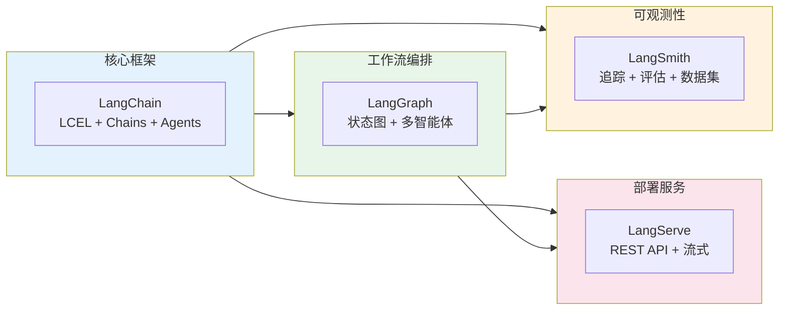
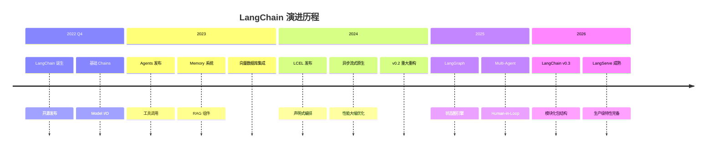
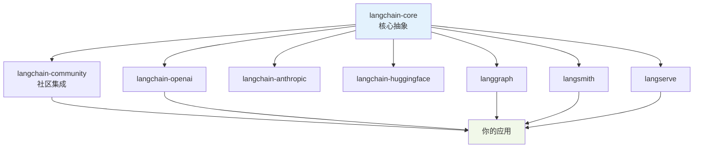
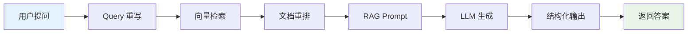
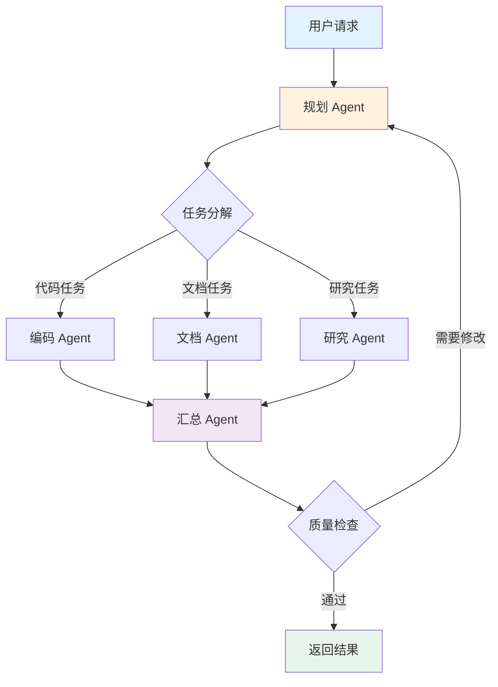
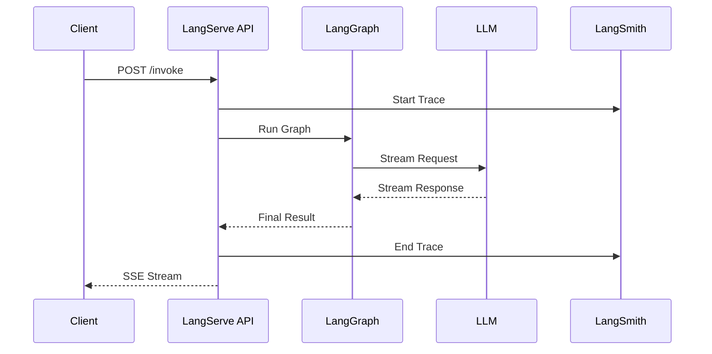
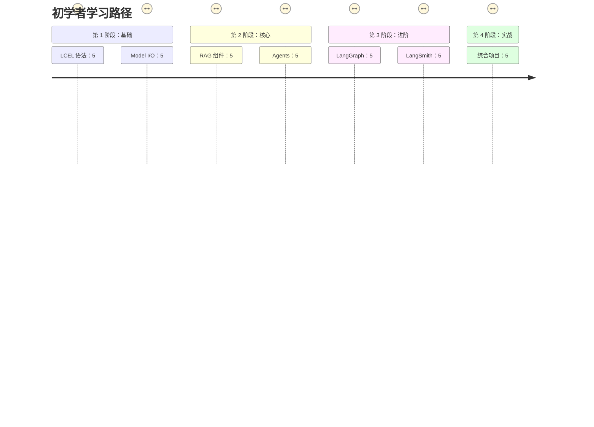

# LangChain 生态概览

欢迎来到 LangChain 全家桶学习指南！在本章中，我们将全面了解 LangChain 生态系统的整体架构和各组件的定位。

## LangChain 是什么？

**LangChain** 是一个用于开发由语言模型驱动的应用程序的框架。它的核心设计理念是**组合性**——通过将不同的组件连接起来，构建复杂的 LLM 应用。

### 核心价值主张

| 价值 | 说明 | 解决的问题 |
|-----|------|-----------|
| **组件化** | 提供标准化的 LLM 组件抽象 | 避免重复造轮子 |
| **可组合** | 组件可以像乐高一样自由组合 | 灵活构建复杂应用 |
| **可扩展** | 轻松集成新的模型、工具和数据源 | 适应快速变化的生态 |
| **生产就绪** | 提供追踪、评估、部署等生产工具 | 从原型到生产的平滑过渡 |

## LangChain 全家桶成员

::: v-pre

:::

### 1️⃣ LangChain（核心框架）

**定位**: LLM 应用开发的基础框架

**核心能力**:
- 📦 **Model I/O**: 统一的模型接口（Chat Models, LLMs）
- 📝 **Prompt Management**: Prompt 模板和Few-shot学习
- 🔗 **LCEL**: 声明式编排语言（LangChain Expression Language）
- 📚 **RAG**: 文档加载、切分、嵌入、检索完整链路
- 🤖 **Agents**: 工具调用和自主推理
- 💾 **Memory**: 对话记忆管理

**适用场景**:
- 构建问答系统
- 开发 RAG 应用
- 创建工具调用 Agent
- 实现对话机器人

### 2️⃣ LangGraph

**定位**: 基于图的状态机工作流引擎

**核心能力**:
- 🕸️ **StateGraph**: 有状态的工作流定义
- 🔄 **循环与分支**: 支持复杂控制流
- 👥 **Multi-Agent**: 多智能体协作编排
- 🛑 **Human-in-the-Loop**: 人机协同断点
- 💾 **Persistence**: 检查点和状态恢复

**适用场景**:
- 多步骤复杂工作流
- 需要人工审核的场景
- 多智能体协作系统
- 需要状态管理的长时任务

### 3️⃣ LangSmith

**定位**: LLM 应用可观测性平台

**核心能力**:
- 🔍 **Tracing**: 完整的请求追踪
- 📊 **Evaluation**: 自动化评估框架
- 📁 **Datasets**: 测试集管理
- 📝 **Prompt Hub**: Prompt 版本控制
- 🐛 **Debugging**: 问题诊断工具

**适用场景**:
- 生产环境监控
- 模型性能评估
- Prompt 迭代优化
- 问题排查调试

### 4️⃣ LangServe

**定位**: LLM 应用部署服务

**核心能力**:
- 🚀 **快速部署**: 一键将 Chain 转为 REST API
- 📡 **Streaming**: 原生 SSE 流式输出
- 🔐 **认证鉴权**: 生产级安全控制
- 📈 **限流**: 请求速率限制
- 📝 ** Playground**: 内置测试界面

**适用场景**:
- 快速发布 API 服务
- 前端应用后端支持
- 微服务架构集成
- 原型快速验证

## LangChain 技术演进

::: v-pre

:::

### 各版本关键特性

| 版本 | 发布时间 | 核心特性 | 意义 |
|-----|---------|---------|------|
| v0.0.x | 2022 Q4 | 基础 Chains, Model I/O | 框架诞生 |
| v0.1.x | 2023 Q1 | Agents, Memory, RAG | 功能完备 |
| v0.2.x | 2024 Q1 | LCEL, 异步流式 | 性能革命 |
| v0.3.x | 2026 Q1 | 模块化包结构 | 生态成熟 |

## 包结构说明（v0.3+）

从 v0.3 开始，LangChain 采用模块化包结构：

```bash
# 核心抽象（必装）
pip install langchain-core

# 社区集成（按需）
pip install langchain-community

# 特定 provider（按需）
pip install langchain-openai
pip install langchain-anthropic
pip install langchain-huggingface

# 生态工具
pip install langgraph        # 工作流编排
pip install langsmith        # 可观测性
pip install langserve        # 部署服务
```

### 包依赖关系

::: v-pre

:::

## 核心设计理念

### 1. 组合优于继承

LangChain  favor composition over inheritance. 每个组件都是独立可测试的单元，通过组合而非继承来构建复杂功能。

```python
# ❌ 不好的做法：创建庞大的单体类
class MonolithicQAChain:
    def __init__(self):
        # 1000 行代码...
        pass

# ✅ 好的做法：组合小组件
chain = (
    prompt_template
    | chat_model
    | output_parser
)
```

### 2. 声明式优于命令式

LCEL 的声明式语法让代码更清晰、更易维护：

```python
# ❌ 命令式（旧风格）
def run_chain(question):
    prompt = template.format(question=question)
    response = llm.generate(prompt)
    parsed = parser.parse(response)
    return parsed

# ✅ 声明式（LCEL 风格）
chain = template | llm | parser
result = chain.invoke({"question": question})
```

### 3. 流式优先

所有组件原生支持流式输出：

```python
# 同步流式
for token in chain.stream(input):
    print(token, end="")

# 异步流式
async for token in chain.astream(input):
    print(token, end="")

# 事件流
async for event in chain.astream_events(input):
    if event["event"] == "on_chat_model_stream":
        print(event["data"]["chunk"].content, end="")
```

### 4. 类型安全

使用 Pydantic 和 Python 类型提示：

```python
from pydantic import BaseModel, Field

class Answer(BaseModel):
    """结构化的答案"""
    question: str = Field(description="原始问题")
    answer: str = Field(description="答案内容")
    confidence: float = Field(description="置信度 0-1")
    sources: list[str] = Field(description="参考来源")

# 直接输出结构化结果
chain = prompt | llm.with_structured_output(Answer)
result: Answer = chain.invoke({"question": "..."})
```

## 典型应用场景

### 场景 1: 企业知识库问答



**涉及组件**:
- Document Loaders（文档加载）
- Text Splitters（文本切分）
- Embeddings（向量化）
- Vector Stores（向量存储）
- Retrievers（检索器）
- Chat Models（对话模型）
- Output Parsers（输出解析）

### 场景 2: 多智能体协作系统



**涉及组件**:
- LangGraph StateGraph
- Multi-Agent 编排
- Tools & Toolkits
- Human-in-the-Loop
- LangSmith 追踪

### 场景 3: 生产级 API 服务



**涉及组件**:
- LangServe
- FastAPI
- LangSmith Tracing
- Streaming Output
- Authentication & Rate Limiting

## 学习路径推荐

### 🟢 初学者路线（0 基础）



### 🟡 进阶路线（有 LLM 开发经验）

1. 快速浏览入门篇，理解 LCEL
2. 深入学习 LangGraph 篇
3. 实战篇项目实践
4. 面试篇巩固提升

### 🔴 专家路线（LangChain 老用户）

1. 关注 v0.3 迁移指南
2. 学习 LangGraph 新特性
3. 掌握 Multi-Agent 模式
4. 参与社区贡献

## 社区与资源

### 官方资源

| 资源 | 链接 | 说明 |
|-----|------|------|
| 官方文档 | https://python.langchain.com/ | 完整 API 文档 |
| LangGraph 文档 | https://langchain-ai.github.io/langgraph/ | 工作流编排 |
| LangSmith 文档 | https://docs.smith.langchain.com/ | 可观测性平台 |
| GitHub | https://github.com/langchain-ai/langchain | 源码与 Issue |
| Discord | LangChain Discord | 社区讨论 |

### 中文资源

- LangChain 中文网
- AI 工程化实践（公众号）
- 知乎 LangChain 专栏

## 总结

LangChain 生态系统提供了一套完整的工具链，覆盖了从开发、调试到部署、监控的完整生命周期：

| 阶段 | 工具 | 核心价值 |
|-----|------|---------|
| **开发** | LangChain Core | 组件化、可组合 |
| **编排** | LangGraph | 复杂工作流、多智能体 |
| **调试** | LangSmith | 追踪、评估、测试 |
| **部署** | LangServe | 快速发布 API |

在后续章节中，我们将深入每一个组件，通过大量代码示例和实践项目，帮助你全面掌握 LangChain 全家桶。

---

## 下一步

- 📖 继续阅读 [为什么选择 LangChain](./why-langchain.md)
- 🚀 直接上手 [快速入门](./quick-start.md)
- 📚 查看 [核心概念](./core-concepts.md) 了解 LCEL