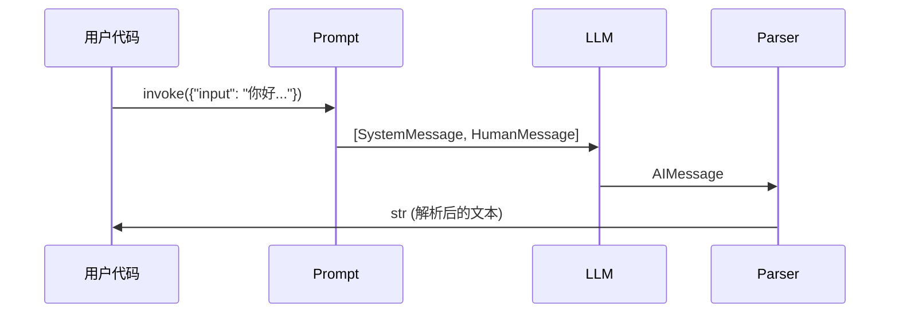
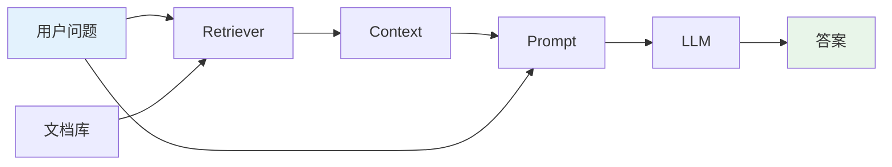

# 快速上手

欢迎来到 LangChain 的世界！本章将带你快速上手，在 10 分钟内构建你的第一个 LangChain 应用。

## 安装与配置

### 基础安装

```bash
# 创建虚拟环境（推荐）
python -m venv venv
source venv/bin/activate  # Mac/Linux
# 或
venv\Scripts\activate     # Windows

# 安装核心包
pip install langchain-core langchain-community langchain-openai
```

### 可选组件

```bash
# LangGraph - 工作流编排
pip install langgraph

# LangSmith - 可观测性
pip install langsmith

# LangServe - 部署服务
pip install langserve sse-starlette

# 向量数据库
pip install chromadb faiss-cpu

# 文档处理
pip install pypdf beautifulsoup4
```

### 环境配置

创建 `.env` 文件：

```bash
# OpenAI API Key
OPENAI_API_KEY=sk-xxxxxxxxxxxxxxxxxxxxxxxxxxxxxxxx

# （可选）LangSmith
LANGCHAIN_TRACING_V2=true
LANGCHAIN_PROJECT=my-project
LANGCHAIN_API_KEY=lsv2_xxxxxxxxxxxxxxxx

# （可选）国内模型
DASHSCOPE_API_KEY=sk-xxxxxxxxxxx  # 通义千问
ZHIPUAI_API_KEY=xxxxxxxx.xxxxxxxx  # 智谱 AI
```

加载环境变量：

```python
from dotenv import load_dotenv
load_dotenv()  # 自动加载 .env 文件
```

## Hello World

### 最简单的 Chain

```python
from langchain_openai import ChatOpenAI
from langchain_core.prompts import ChatPromptTemplate
from langchain_core.output_parsers import StrOutputParser

# 1. 初始化模型
llm = ChatOpenAI(model="gpt-4o", temperature=0)

# 2. 创建 Prompt 模板
prompt = ChatPromptTemplate.from_messages([
    ("system", "你是一个友好的助手。"),
    ("user", "{input}")
])

# 3. 创建输出解析器
parser = StrOutputParser()

# 4. 组合成 Chain（使用 LCEL pipe 语法）
chain = prompt | llm | parser

# 5. 执行
response = chain.invoke({"input": "你好，请介绍一下自己！"})
print(response)
```

**输出示例**:
```
你好！我是你的 AI 助手，很高兴为你服务。
我可以帮助你回答问题、提供建议、协助创作等。
有什么我可以帮助你的吗？
```

### 执行流程可视化

::: v-pre

:::

## 核心模式

### 1. 简单问答

```python
from langchain_openai import ChatOpenAI
from langchain_core.messages import HumanMessage

llm = ChatOpenAI(model="gpt-4o")

# 直接调用
response = llm.invoke([HumanMessage(content="什么是人工智能？")])
print(response.content)
```

### 2. 带 Prompt 模板

```python
from langchain_core.prompts import ChatPromptTemplate

prompt = ChatPromptTemplate.from_template(
    "请用{style}的风格解释{topic}。"
)

chain = prompt | llm | StrOutputParser()

response = chain.invoke({
    "style": "幽默",
    "topic": "量子力学"
})
print(response)
```

### 3. 结构化输出

```python
from pydantic import BaseModel, Field

class Answer(BaseModel):
    question: str = Field(description="原始问题")
    answer: str = Field(description("答案内容")
    confidence: float = Field(description="置信度 0-1")

chain = prompt | llm.with_structured_output(Answer)

result: Answer = chain.invoke({"question": "地球是圆的吗？"})
print(f"答案：{result.answer}, 置信度：{result.confidence}")
```

### 4. 流式输出

```python
# 同步流式
print("回答：", end="", flush=True)
for chunk in chain.stream({"input": "讲一个笑话"}):
    print(chunk, end="", flush=True)
print()

# 异步流式
async for chunk in chain.astream({"input": "什么是 RAG"}):
    print(chunk, end="", flush=True)
```

### 5. 异步调用

```python
import asyncio

async def main():
    # 并行执行多个请求
    tasks = [
        chain.ainvoke({"input": f"问题{i}"})
        for i in range(5)
    ]
    results = await asyncio.gather(*tasks)
    for i, result in enumerate(results):
        print(f"问题{i}: {result}")

asyncio.run(main())
```

## 第一个 RAG 示例

构建一个简单的文档问答系统：

```python
from langchain_openai import OpenAIEmbeddings, ChatOpenAI
from langchain_community.document_loaders import TextLoader
from langchain.text_splitter import RecursiveCharacterTextSplitter
from langchain_chroma import Chroma
from langchain_core.runnables import RunnableParallel, RunnableLambda
from langchain_core.output_parsers import StrOutputParser

# 1. 加载文档
loader = TextLoader("./data/example.txt", encoding="utf-8")
documents = loader.load()

# 2. 切分文本
text_splitter = RecursiveCharacterTextSplitter(
    chunk_size=1000,
    chunk_overlap=200
)
chunks = text_splitter.split_documents(documents)

# 3. 创建向量存储
embeddings = OpenAIEmbeddings()
vectorstore = Chroma.from_documents(
    documents=chunks,
    embedding=embeddings,
    persist_directory="./chroma_db"
)

# 4. 创建检索器
retriever = vectorstore.as_retriever(search_kwargs={"k": 3})

# 5. 构建 RAG Chain
prompt = ChatPromptTemplate.from_template(
    """基于以下信息回答问题:

{context}

问题：{question}

如果信息不足，请诚实地说你不知道。
回答："""
)

llm = ChatOpenAI(model="gpt-4o", temperature=0)

rag_chain = (
    RunnableParallel({
        "context": retriever,  # 检索相关文档
        "question": lambda x: x["question"]  # 透传问题
    })
    | prompt
    | llm
    | StrOutputParser()
)

# 6. 执行查询
response = rag_chain.invoke({
    "question": "文档的主要内容是什么？"
})
print(response)
```

### RAG 流程可视化

::: v-pre

:::

## 第一个 Agent 示例

创建一个可以搜索网络的 Agent：

```python
from langchain_openai import ChatOpenAI
from langchain_community.tools import DuckDuckGoSearchRun
from langchain.agents import create_tool_calling_agent, AgentExecutor
from langchain_core.prompts import ChatPromptTemplate

# 1. 定义工具
search = DuckDuckGoSearchRun()
tools = [search]

# 2. 初始化模型
llm = ChatOpenAI(model="gpt-4o")

# 3. 创建 Agent Prompt
prompt = ChatPromptTemplate.from_messages([
    ("system", "你是一个有用的助手，可以使用工具获取信息。"),
    ("human", "{input}"),
    ("placeholder", "{agent_scratchpad}"),
])

# 4. 创建 Agent
agent = create_tool_calling_agent(llm, tools, prompt)

# 5. 创建执行器
agent_executor = AgentExecutor(
    agent=agent,
    tools=tools,
    verbose=True,
    handle_parsing_errors=True
)

# 6. 执行
response = agent_executor.invoke({
    "input": "2026 年最新的 AI 新闻有哪些？"
})
print(response["output"])
```

## 调试技巧

### 1. 启用详细日志

```python
# 方法 1: 执行器 verbose
agent_executor = AgentExecutor(..., verbose=True)

# 方法 2: Callback
from langchain.callbacks import StdOutCallbackHandler

chain.invoke(
    input,
    config={"callbacks": [StdOutCallbackHandler()]}
)
```

### 2. 检查中间结果

```python
from langchain_core.runnables import RunnablePassthrough

# 添加中间输出
chain = (
    prompt
    | RunnablePassthrough.assign(debug=lambda x: print(f"Prompt: {x}"))
    | llm
    | parser
)
```

### 3. 使用 LangSmith（推荐）

```python
import os
os.environ["LANGCHAIN_TRACING_V2"] = "true"
os.environ["LANGCHAIN_PROJECT"] = "my-first-project"

# 所有调用自动追踪到 LangSmith 平台
# 访问 https://smith.langchain.com 查看详细追踪
```

## 常见问题

### Q1: 如何选择合适的模型？

| 需求 | 推荐模型 | 说明 |
|-----|---------|------|
| **最佳质量** | GPT-4o, Claude 3.5 | 复杂推理、代码生成 |
| **性价比** | GPT-4o-mini | 日常问答、文本处理 |
| **低成本** | GPT-3.5-turbo | 简单任务、大量调用 |
| **中文场景** | 通义千问、智谱 AI | 中文理解更好 |

### Q2: Token 超出限制怎么办？

```python
# 方法 1: 减小 chunk 大小
text_splitter = RecursiveCharacterTextSplitter(
    chunk_size=500,  # 减小
    chunk_overlap=50
)

# 方法 2: 限制返回数量
retriever = vectorstore.as_retriever(
    search_kwargs={"k": 3}  # 减少 k 值
)

# 方法 3: 使用支持长上下文的模型
llm = ChatOpenAI(model="gpt-4o-128k")  # 128k 上下文
```

### Q3: 如何降低成本？

```python
# 1. 使用缓存
from langchain.globals import set_llm_cache
from langchain.cache import InMemoryCache
set_llm_cache(InMemoryCache())

# 2. 选择合适模型
llm = ChatOpenAI(model="gpt-4o-mini")  # 更便宜

# 3. 限制最大 token
llm = ChatOpenAI(max_tokens=500)  # 限制输出长度

# 4. 批量处理
from langchain_core.runnables import RunnableConfig
config = RunnableConfig(max_concurrency=10)  # 并发控制
```

## 下一步行动

完成本章后，你应该能够：

- [x] 安装并配置 LangChain 环境
- [x] 编写第一个 Hello World
- [x] 理解 LCEL pipe 语法
- [x] 构建简单的 RAG 示例
- [x] 创建基础的 Agent

### 继续学习

1. 📖 深入学习 [LCEL 基础](/lcel/lcel-basics.md)
2. 📚 探索 [RAG 组件](/rag/document-loaders.md)
3. 🤖 研究 [Agent 开发](/agent/agent-overview.md)
4. 🕸️ 尝试 [LangGraph](/langgraph/langgraph-basics.md)

## 资源

### 官方文档

- [LangChain Python 文档](https://python.langchain.com/)
- [API 参考](https://api.python.langchain.com/)

### 示例代码

- [官方示例库](https://github.com/langchain-ai/langchain/tree/master/libs/langchain/tests)
- [LangChain Cookbook](https://python.langchain.com/docs/cookbook/)

### 社区

- [LangChain Discord](https://discord.gg/langchain)
- [LangChain Twitter](https://twitter.com/LangChainAI)

---

<Badge type="success" text="完成！" />
恭喜完成快速入门！现在你已经具备了继续深入学习的基础。