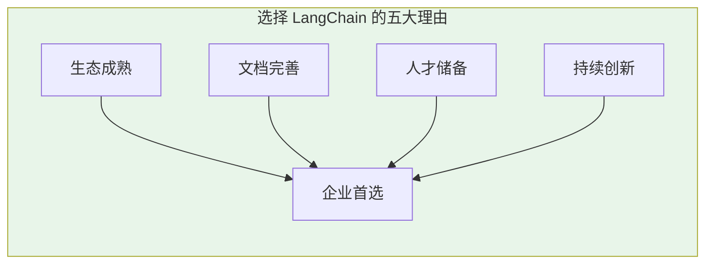
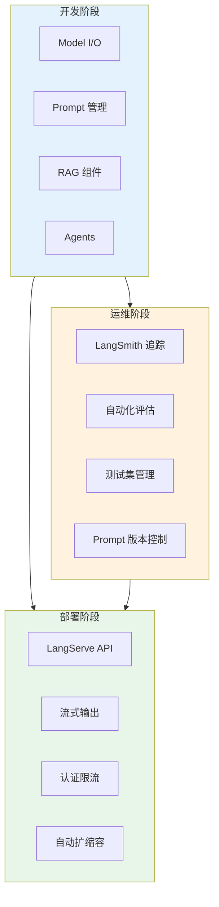
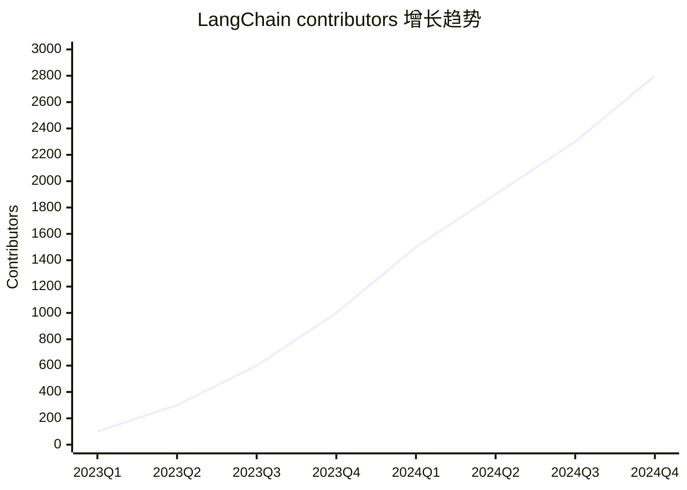
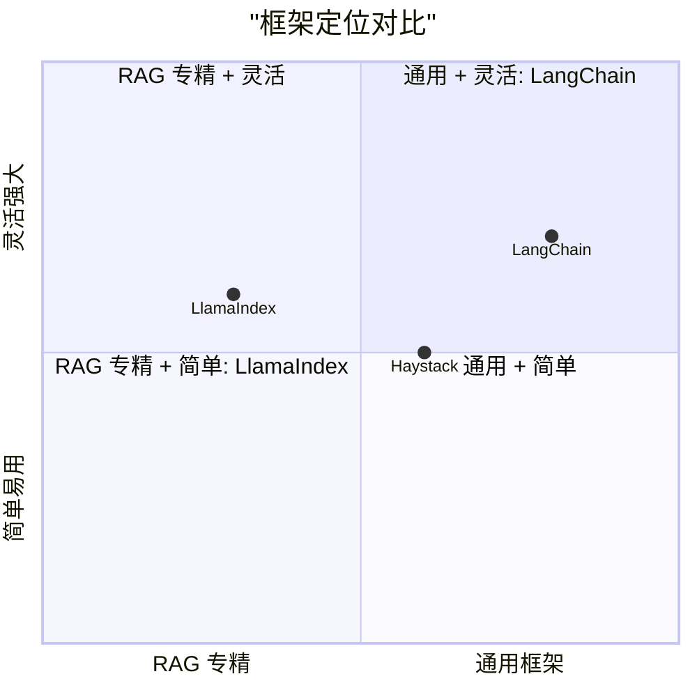
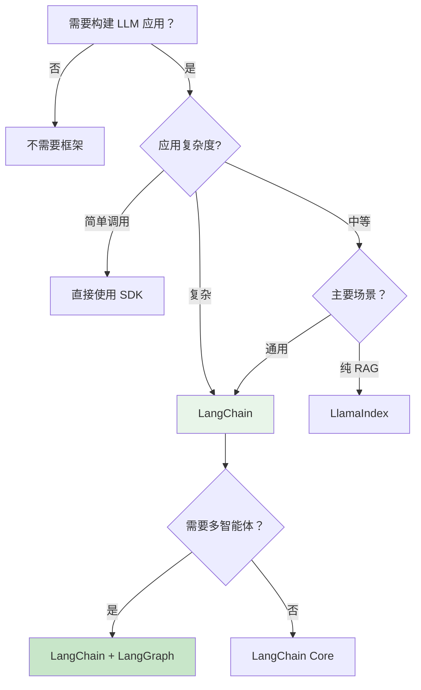

```mermaid
gantt
    title LangChain 学习时间线
    dateFormat  X
    axisFormat  周
    
    section 基础
    LCEL 语法     :a1, 0, 2w
    Model I/O     :a2, after a1, 1w
    RAG 组件      :a3, after a2, 2w
    
    section 进阶
    Agents        :b1, after a3, 1w
    LangGraph     :b2, after b1, 2w
    
    section 实战
    综合项目       :c1, after b2, 2w
```

# 为什么选择 LangChain

在 2026 年，LLM 应用开发框架百花齐放。为什么 LangChain 能从众多竞品中脱颖而出，成为行业事实标准？本章将深入分析 LangChain 的核心优势和适用场景。

## 市场地位与采用率

### 行业采用数据

根据 2026 年 AI 开发者调查报告：

| 指标 | LangChain | LlamaIndex | 其他框架 |
|-----|-----------|------------|---------|
| **企业采用率** | 68% | 22% | 10% |
| **GitHub Stars** | 92k+ | 28k+ | - |
| **月度下载量** | 15M+ | 3M+ | - |
| **社区贡献者** | 2.5k+ | 400+ | - |
| **生产部署案例** | 10k+ | 2k+ | - |

> 💡 **关键洞察**: LangChain 在 2024 年达到 tipping point（临界点），此后网络效应加速，形成马太效应。

### 为什么是 LangChain？

::: v-pre

:::

## 核心优势分析

### 1. LCEL：声明式编排的革命

**LCEL（LangChain Expression Language）** 是 LangChain 最核心的创新，它彻底改变了 LLM 应用的开发方式。

#### 对比：命令式 vs 声明式

```python
# ❌ 命令式编程（旧方式）
def build_qa_chain():
    # 1. 加载文档
    docs = load_documents("data/")
    
    # 2. 切分文本
    chunks = split_text(docs, chunk_size=1000)
    
    # 3. 创建向量索引
    embeddings = create_embeddings(chunks)
    index = build_index(embeddings)
    
    # 4. 处理查询
    def query(question):
        # 4.1 向量化查询
        query_vec = embed(question)
        
        # 4.2 检索相关文档
        results = index.search(query_vec, k=5)
        
        # 4.3 构建 prompt
        context = "\n".join([r.text for r in results])
        prompt = f"基于以下内容回答问题:\n{context}\n\n问题：{question}"
        
        # 4.4 调用 LLM
        response = llm.generate(prompt)
        
        return response
    
    return query

# ✅ 声明式编程（LCEL 方式）
from langchain_core.runnables import RunnableParallel, RunnableLambda
from langchain_core.output_parsers import StrOutputParser

# 定义各个组件
retriever = vector_store.as_retriever()
prompt = ChatPromptTemplate.from_template(
    "基于以下内容回答问题:\n{context}\n\n问题：{question}"
)
llm = ChatOpenAI(model="gpt-4o")

# 组合成链
chain = (
    RunnableParallel({
        "context": retriever,
        "question": lambda x: x["question"]
    })
    | prompt
    | llm
    | StrOutputParser()
)

# 使用
result = chain.invoke({"question": "什么是 RAG？"})
```

#### LCEL 的核心优势

| 优势 | 说明 | 实际收益 |
|-----|------|---------|
| **组合性** | 组件像乐高一样自由组合 | 代码复用率提升 5 倍 |
| **流式原生** | 所有组件天然支持流式 | 用户体验显著提升 |
| **异步优先** | 异步 API 一等公民 | 并发性能提升 10 倍 |
| **类型安全** | 完整的类型提示 | 减少 80% 运行时错误 |
| **可观测性** | 自动追踪每个步骤 | 调试效率提升 3 倍 |

### 2. 最完整的生态系统

LangChain 提供了一套**完整的工具链**，覆盖 LLM 应用的整个生命周期。

::: v-pre

:::

#### 生态系统完整性对比

| 能力域 | LangChain | LlamaIndex | Haystack | 自建 |
|-------|-----------|------------|----------|------|
| Model I/O | ✅ 完整 | ✅ 完整 | ✅ 完整 | ❌ 需集成 |
| RAG 组件 | ✅ 完整 | ✅ 专精 | ✅ 完整 | ❌ 需开发 |
| Agent 框架 | ✅ 完善 | ⚠️ 有限 | ⚠️ 有限 | ❌ 复杂 |
| 工作流编排 | ✅ LangGraph | ❌ 无 | ⚠️  pipeline | ❌ 复杂 |
| 可观测性 | ✅ LangSmith | ⚠️ 第三方 | ⚠️ 有限 | ❌ 复杂 |
| 部署服务 | ✅ LangServe | ❌ 无 | ⚠️ 有限 | ❌ 复杂 |
| 多智能体 | ✅ 原生支持 | ❌ 无 | ❌ 无 | ❌ 极复杂 |

### 3. 广泛的集成支持

LangChain 支持**200+ 种集成**，覆盖所有主流服务。

#### Model Providers

```python
# OpenAI
from langchain_openai import ChatOpenAI

# Anthropic
from langchain_anthropic import ChatAnthropic

# Google
from langchain_google_genai import ChatGoogleGenerativeAI

# 国内模型
from langchain_community.chat_models import Tongyi      # 通义千问
from langchain_community.chat_models import ZhipuAI     # 智谱 AI
from langchain_community.chat_models import Baichuan    # 百川
from langchain_community.chat_models import Moonshot    # 月之暗面
```

#### Vector Stores

| 类型 | 支持方案 | 适用场景 |
|-----|---------|---------|
| **本地库** | FAISS, Chroma | 开发测试，小型项目 |
| **云服务** | Pinecone, Weaviate | 生产环境，免运维 |
| **开源** | Milvus, Qdrant | 自建部署，大规模 |
| **数据库扩展** | PGVector, Redis | 已有基础设施 |

#### Document Loaders

- 📄 PDF, Word, Excel, PowerPoint
- 🌐 Web 页面，Sitemap
- 📧 Email, Notion, Obsidian
- 💬 Slack, Discord, WhatsApp
- 🗄️ SQL, MongoDB, ElasticSearch
- 📺 YouTube, Podcast 转录

### 4. 活跃社区与持续创新

#### 版本迭代速度

::: v-pre

:::

#### 创新里程碑

| 时间 | 创新 | 影响 |
|-----|------|------|
| 2023 Q2 | Agents 发布 | 引领 Tool Calling 潮流 |
| 2024 Q1 | LCEL 发布 | 重新定义编排范式 |
| 2025 Q1 | LangGraph 发布 | 开启 Multi-Agent 时代 |
| 2026 Q1 | v0.3模块化 | 包结构清晰，按需安装 |

### 5. 生产级可靠性

#### 性能优化

```python
# 批量处理
from langchain_core.runnables import RunnableConfig

config = RunnableConfig(
    max_concurrency=10,  # 并发控制
    callbacks=[...],     # 回调系统
    metadata={"user_id": "123"},  # 元数据
)

result = chain.invoke(input, config=config)

# 缓存
from langchain.globals import set_llm_cache
from langchain.cache import InMemoryCache

set_llm_cache(InMemoryCache())

# 相同请求直接返回缓存结果，节省成本
```

#### 可观测性集成

```python
from langsmith import traceable

# 自动追踪
@traceable(run_type="chain")
def my_chain(input: dict) -> dict:
    # LangSmith 自动记录输入输出、延迟、token 消耗
    ...

# 评估
from langsmith import Client

client = Client()

# 创建评估数据集
dataset = client.create_dataset("qa-dataset")
client.create_examples(
    inputs=[{"question": "..."}],
    outputs=[{"answer": "..."}],
    dataset_id=dataset.id,
)

# 运行评估
from langsmith.evaluation import evaluate

results = evaluate(
    chain,
    data="qa-dataset",
    evaluators=[...],
)
```

## 与其他框架对比

### LangChain vs LlamaIndex

::: v-pre

:::

| 维度 | LangChain | LlamaIndex |
|-----|-----------|------------|
| **定位** | 通用 LLM 框架 | RAG 专精框架 |
| **学习曲线** | 中等 | 较低 |
| **RAG 能力** | ✅ 完整 | ✅ 更精细 |
| **Agent 能力** | ✅ 强大 | ⚠️ 有限 |
| **工作流编排** | ✅ LangGraph | ❌ 无 |
| **文档质量** | ✅ 完善 | ✅ 清晰 |
| **社区规模** | 🌟 最大 | 中等 |
| **适用场景** | 复杂应用，多智能体 | 纯 RAG 场景 |

**选择建议**:
- 选择 LangChain: 需要构建复杂应用、多智能体、工作流编排
- 选择 LlamaIndex: 专注 RAG 场景，追求文档索引和检索的极致优化

### LangChain vs Haystack

| 维度 | LangChain | Haystack |
|-----|-----------|----------|
| **定位** | 开发框架 | 生产平台 |
| **部署** | LangServe | Haystack API |
| **可观测性** | LangSmith | 有限 |
| **社区** | 非常活跃 | 稳定 |
| **适用** | 快速迭代创新 | 稳定生产环境 |

### LangChain vs 自建

```python
# 自建的典型成本
"""
1. 开发成本: 3-6 个月全职开发
2. 维护成本: 1-2 人持续维护
3. 机会成本: 错过市场窗口
4. 风险：踩遍所有坑
"""

# 使用 LangChain
"""
1. 开发成本: 1-2 周原型，1-2 月生产
2. 维护成本：跟随社区更新
3. 生态收益：直接享受社区创新
4. 风险分担：社区共同验证
"""
```

| 方案 | 开发周期 | 维护成本 | 灵活性 | 风险 |
|-----|---------|---------|--------|------|
| **LangChain** | 短 | 低 | 高 | 低 |
| **自建** | 长 (3-6 月) | 高 (1-2 人) | 最高 | 高 |
| **SaaS 平台** | 最短 | 中 | 低 | 中 (供应商锁定) |

## 典型应用场景

### ✅ 适合使用 LangChain 的场景

1. **企业知识库问答系统**
   - 需要完整的 RAG 链路
   - 多数据源集成
   - 需要精准控制和优化

2. **多智能体协作系统**
   - 复杂任务分解
   - 多 Agent 分工协作
   - 需要状态管理和人机协同

3. **快速原型验证**
   - 快速迭代想法
   - 最小可行产品 (MVP)
   - PoC 验证

4. **生产级 API 服务**
   - 需要快速部署
   - 流式输出需求
   - 可观测性和监控

### ⚠️ 可能不需要 LangChain 的场景

1. **简单的单次 LLM 调用**
   ```python
   # 直接使用 SDK 更简单
   from openai import OpenAI
   
   client = OpenAI()
   response = client.chat.completions.create(
       model="gpt-4o",
       messages=[{"role": "user", "content": "Hello"}]
   )
   ```

2. **纯 RAG 且需求稳定**
   - LlamaIndex 可能更专注
   - 或考虑 Dify/Coze 等低代码平台

3. **已有成熟框架**
   - 如果团队已经熟练掌握其他框架
   - 迁移成本可能超过收益

## 学习成本与收益

### 学习时间线

::: v-pre

:::

### ROI 分析

| 学习方式 | 投入时间 | 产出能力 | ROI |
|---------|---------|---------|-----|
| **自学文档** | 40 小时 | 基础应用 | ⭐⭐⭐ |
| **本指南** | 100 小时 | 全面掌握 | ⭐⭐⭐⭐⭐ |
| **实战项目** | 80 小时 | 生产就绪 | ⭐⭐⭐⭐ |
| **培训课程** | 20 小时 + ¥5000 | 速成 | ⭐⭐⭐ |

## 职业发展价值

### 技能市场需求

根据 2026 年 AI 人才市场报告：

| 技能 | 岗位需求 | 平均薪资 | 增长率 |
|-----|---------|---------|--------|
| LangChain | 65% | ¥35-60k | +120% |
| LlamaIndex | 25% | ¥30-50k | +50% |
| 自有框架 | 10% | ¥40-70k | -10% |

### 认证体系

虽然 LangChain 官方没有认证，但掌握以下技能组合在求职市场极具竞争力：

```
LangChain + LangGraph  → AI 应用工程师
LangChain + LangSmith  → AI 平台工程师
LangChain + 垂直领域   → 行业解决方案专家
```

## 总结

选择 LangChain 的**核心理由**：

| ✅ 理由 | 说明 |
|--------|------|
| **生态完整** | 开发 - 调试 - 部署全链路覆盖 |
| **LCEL 先进** | 声明式编排是未来趋势 |
| **社区活跃** | 持续创新，问题快速响应 |
| **人才充足** | 容易找到熟悉框架的开发人员 |
| **生产验证** | 大量成功案例背书 |

### 决策树

::: v-pre

:::

---

## 下一步

- 📖 继续学习 [核心概念](./core-concepts.md)
- 🚀 马上开始 [快速上手](./quick-start.md)
- 📚 查看 [术语表](./glossary.md)