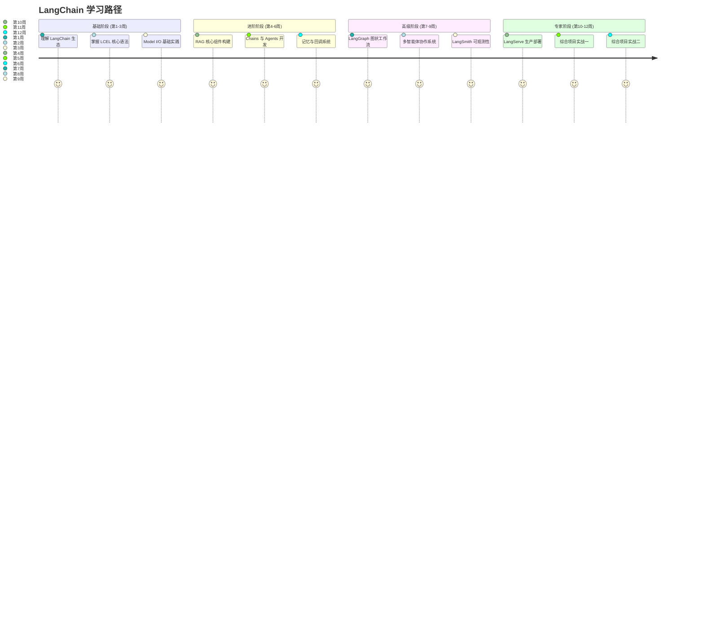
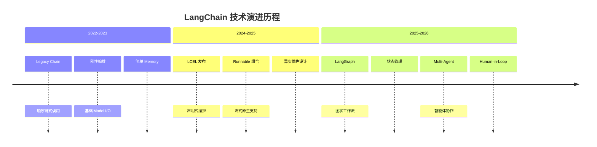
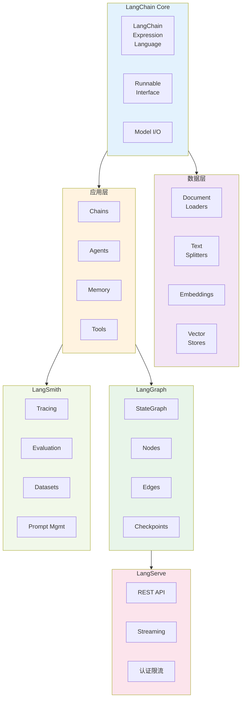

## 🎯 为什么学习 LangChain？

在 2026 年，LangChain 已成为构建 LLM 应用的**行业标准框架**。无论是简单的问答 Bot、复杂的 RAG 系统，还是多智能体协作平台，LangChain 提供的**LCEL（LangChain Expression Language）**和**LangGraph**都是实现生产级应用的**首选方案**。

### 📈 行业采用率统计

| 应用场景 | 2024 年采用率 | 2026 年采用率 | 增长率 |
|---------|------------|------------|--------|
| 企业知识库问答 | 45% | 82% | +82% |
| 智能客服系统 | 38% | 79% | +108% |
| 代码助手/IDE 插件 | 32% | 75% | +134% |
| 数据分析 Agent | 18% | 62% | +244% |
| 多智能体系统 | 8% | 45% | +463% |

> 💡 **关键洞察**: 到 2026 年，超过 75% 的企业 LLM 应用都采用了 LangChain 生态，LCEL 已成为事实上的标准编排语言。

---

## 🗺️ 学习路线图



### 📅 12 周学习计划概览

| 阶段 | 周次 | 主题 | 预计工时 | 产出物 |
|-----|------|------|---------|--------|
| **基础** | 第 1 周 | LangChain 生态概览 | 8-10 小时 | 架构图理解笔记 |
| **基础** | 第 2 周 | LCEL 核心语法 | 10-12 小时 | Runnable 示例集 |
| **基础** | 第 3 周 | Model I/O 基础 | 10-12 小时 | Prompt 模板库 |
| **进阶** | 第 4 周 | RAG 核心组件 | 12-15 小时 | 文档处理 Pipeline |
| **进阶** | 第 5 周 | Chains 与 Agents | 12-15 小时 | 工具调用示例 |
| **进阶** | 第 6 周 | 记忆与回调系统 | 10-12 小时 | 对话管理 Demo |
| **高级** | 第 7 周 | LangGraph 基础 | 15-18 小时 | StateGraph 实现 |
| **高级** | 第 8 周 | 多智能体协作 | 15-18 小时 | Multi-Agent 系统 |
| **高级** | 第 9 周 | LangSmith 追踪 | 10-12 小时 | 评估测试集 |
| **专家** | 第 10 周 | LangServe 部署 | 12-15 小时 | REST API 服务 |
| **实战** | 第 11 周 | 综合项目一 | 15-20 小时 | 知识库问答 Bot |
| **实战** | 第 12 周 | 综合项目二 | 15-20 小时 | 多智能体系统 |

**总计**: 约 145-179 小时系统性学习

---

## 🏗️ LangChain 生态技术演进



### 三代编排范式对比

| 特性 | Legacy Chains | LCEL | LangGraph |
|-----|---------------|------|-----------|
| **编排方式** | 命令式链式调用 | 声明式管道组合 | 图状状态机 |
| **组合能力** | 线性串接 | 任意嵌套组合 | 循环 + 分支 |
| **流式支持** | 有限 | 原生完整支持 | 事件流 |
| **状态管理** | 简单 Memory | 隐式状态 | 显式 StateSchema |
| **人机协同** | ❌ | ❌ | ✅ 断点/恢复 |
| **多智能体** | ❌ | 有限 | ✅ 原生支持 |
| **适用场景** | 简单流水线 | 中复杂度 Pipeline | 复杂工作流 |

---

## 📦 LangChain 全家桶架构全景图



### 核心组件速览表

| 组件 | 职责 | 关键类/API | 使用场景 |
|-----|------|-----------|---------|
| **LCEL** | 声明式编排 | `pipe`, `RunnableLambda`, `RunnableParallel` | 所有 Pipeline 构建 |
| **Chat Models** | LLM 对话接口 | `ChatOpenAI`, `ChatAnthropic` | 对话生成 |
| **Prompt Template** | 提示词模板 | `ChatPromptTemplate`, `FewShotPromptTemplate` | 结构化 Prompt |
| **Output Parser** | 输出解析 | `PydanticOutputParser`, `JsonOutputParser` | 结构化输出 |
| **Document Loaders** | 文档加载 | `PyPDFLoader`, `WebBaseLoader` | 数据导入 |
| **Text Splitters** | 文本切分 | `RecursiveCharacterTextSplitter` | 分块处理 |
| **Embeddings** | 向量化 | `OpenAIEmbeddings`, `HuggingFaceEmbeddings` | 语义表示 |
| **Vector Stores** | 向量存储 | `Chroma`, `FAISS`, `Milvus` | 检索索引 |
| **Retrievers** | 检索器 | `VectorStoreRetriever`, `EnsembleRetriever` | 文档召回 |
| **Agents** | 智能体 | `create_tool_calling_agent`, `AgentExecutor` | 工具调用 |
| **LangGraph** | 图工作流 | `StateGraph`, `add_node`, `add_edge` | 复杂流程 |
| **LangSmith** | 可观测性 | `traceable`, `Evaluation` | 追踪评估 |
| **LangServe** | 部署服务 | `add_routes`, `as_fastapi` | API 发布 |

---

## 🚀 快速开始

### 安装 LangChain

```bash
# 核心包
pip install langchain-core langchain-community langchain-openai

# 可选：LangGraph
pip install langgraph

# 可选：LangSmith
pip install langsmith

# 可选：LangServe
pip install langserve sse-starlette
```

### Hello World - LCEL 风格

```python
from langchain_openai import ChatOpenAI
from langchain_core.prompts import ChatPromptTemplate
from langchain_core.output_parsers import StrOutputParser

# 1. 定义模型
llm = ChatOpenAI(model="gpt-4o", temperature=0)

# 2. 定义 Prompt
prompt = ChatPromptTemplate.from_messages([
    ("system", "你是一个专业的助手。"),
    ("user", "{question}")
])

# 3. 构建链（使用 LCEL pipe 语法）
chain = prompt | llm | StrOutputParser()

# 4. 执行
response = chain.invoke({"question": "什么是 LCEL？"})
print(response)
```

### 流式输出示例

```python
# 流式调用
for chunk in chain.stream({"question": "解释一下 RAG 是什么"}):
    print(chunk, end="", flush=True)

# 异步流式
async for chunk in chain.astream({"question": "LangGraph 的优势"}):
    print(chunk, end="", flush=True)
```

### LangGraph 快速示例

```python
from langgraph.graph import StateGraph, END
from typing import TypedDict

# 定义状态
class State(TypedDict):
    messages: list
    current_step: str

# 创建图
graph = StateGraph(State)

# 添加节点
def node_a(state):
    return {"messages": ["Step A"], "current_step": "A"}

def node_b(state):
    return {"messages": state["messages"] + ["Step B"], "current_step": "B"}

graph.add_node("A", node_a)
graph.add_node("B", node_b)

# 添加边
graph.set_entry_point("A")
graph.add_edge("A", "B")
graph.add_edge("B", END)

# 编译并运行
app = graph.compile()
result = app.invoke({"messages": [], "current_step": ""})
```

---

## 📚 推荐资源

### 📖 官方文档

- **LangChain Docs**: https://python.langchain.com/
- **LangGraph Docs**: https://langchain-ai.github.io/langgraph/
- **LangSmith Docs**: https://docs.smith.langchain.com/
- **LangServe Docs**: https://python.langchain.com/docs/langserve

### 📄 核心论文

1. **LangChain: A Framework for Reasoning with LLMs** (2023) - 框架设计
2. **LCEL: Declarative Orchestration for LLM Applications** (2024) - LCEL 设计
3. **LangGraph: Stateful Multi-Actor Workflows** (2025) - LangGraph 架构
4. **Agentic RAG: A Survey** (2025) - Agentic RAG 综述

### 🛠️ 相关框架对比

| 框架 | 语言 | 特点 | 适用场景 |
|-----|------|------|---------|
| **LangChain** | Python/JS | 全功能生态 | 通用 LLM 应用 |
| **LlamaIndex** | Python | RAG 专用 | 知识库/检索 |
| **Haystack** | Python | 生产就绪 | 企业级应用 |
| **Semantic Kernel** | C#/Python | 微软生态 | .NET 集成 |

### 🗄️ 向量数据库

| 数据库 | 类型 | LangChain 集成 | 推荐场景 |
|-------|------|---------------|---------|
| **Chroma** | 嵌入式 | ✅ 官方 | 开发/小项目 |
| **FAISS** | 本地库 | ✅ 官方 | 高性能本地检索 |
| **Milvus** | 分布式 | ✅ 官方 | 大规模生产 |
| **Pinecone** | 托管服务 | ✅ 官方 | 免运维 |
| **PGVector** | PostgreSQL 扩展 | ✅ 官方 | 已有 PG 基础设施 |
| **Qdrant** | 分布式 | ✅ 官方 | 复杂过滤 |

### 📊 可观测性工具

- **LangSmith**: LangChain 官方追踪平台
- **Langfuse**: 开源 LLMOps 平台
- **PromptLayer**: Prompt 管理与追踪
- **Arize Phoenix**: LLM 观测与调试

---

## 🎓 技能检验清单

完成本指南后，你应该能够：

### 基础能力
- [ ] 解释 LCEL 的设计哲学和核心概念
- [ ] 使用 pipe 操作符构建Chain
- [ ] 配置和使用 Chat Models
- [ ] 创建和使用 Prompt Templates
- [ ] 实现结构化输出解析

### 进阶能力
- [ ] 构建完整的 RAG Pipeline
- [ ] 实现自定义 Document Loaders
- [ ] 选择合适的 Text Splitter 策略
- [ ] 配置 Vector Store 和 Retriever
- [ ] 开发自定义 Tool

### 高级能力
- [ ] 使用 LangGraph 构建状态工作流
- [ ] 实现 Human-in-the-Loop 交互
- [ ] 构建 Multi-Agent 协作系统
- [ ] 使用 LangSmith 进行追踪和评估
- [ ] 使用 LangServe 部署生产 API

### 实战能力
- [ ] 独立设计和实现企业知识库问答系统
- [ ] 构建多步骤推理的代码助手
- [ ] 设计并实现生产级 RAG Pipeline
- [ ] 完成多智能体协作系统原型

---

## 💡 学习建议

### 初学者路线
1. 从 **入门篇** 开始，了解 LangChain 生态
2. 深入学习 **LCEL 篇**，掌握核心编排语法
3. 实践 **Model I/O 篇**，熟悉 Prompt 和输出解析
4. 进入 **RAG 篇**，构建第一个完整应用

### 进阶学习者
1. 快速浏览入门篇，重点学习 **LangGraph 篇**
2. 深入 **实战篇** 的项目案例
3. 使用 **LangSmith 篇** 提升可观测性
4. 通过 **面试篇** 巩固知识体系

### 专家路线
1. 直接深入 **LangGraph** 和 **Multi-Agent**
2. 关注 **面试篇** 中的系统设计题
3. 参与开源项目贡献
4. 构建生产级复杂系统

---

## 👥 社区与支持

- **Discord**: LangChain 官方社区
- **知乎专栏**: LangChain 技术前沿
- **微信公众号**: AI 工程化实践

### 贡献指南

本指南基于社区共建，欢迎:
- 提交 Issue 报告错误或建议
- 提交 PR 补充内容或改进
- 翻译其他语言版本
- 分享实战案例

---

## 📝 版本信息

**当前版本**: v2026.1  
**最后更新**: 2026 年 5 月  
**维护状态**: 活跃维护中  
**基于 LangChain**: v0.3+  
**基于 LangGraph**: v0.2+

---

<Banner type="info">
MIT License - Copyright © 2026 LangChain 全家桶学习指南
</Banner>

<Badge type="tip" text="v0.3+ API" />
<Badge type="info" text="MIT License" />
<Badge type="warning" text="2026 最新版" />