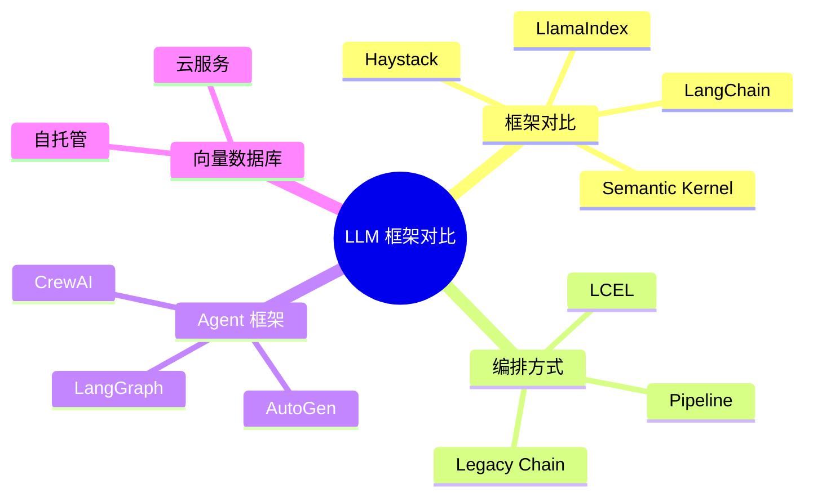
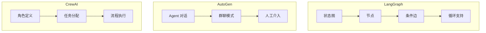
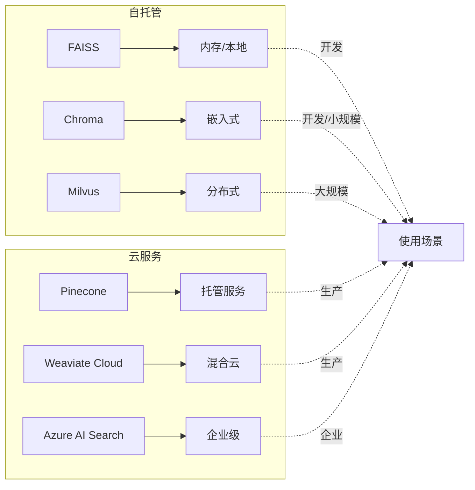
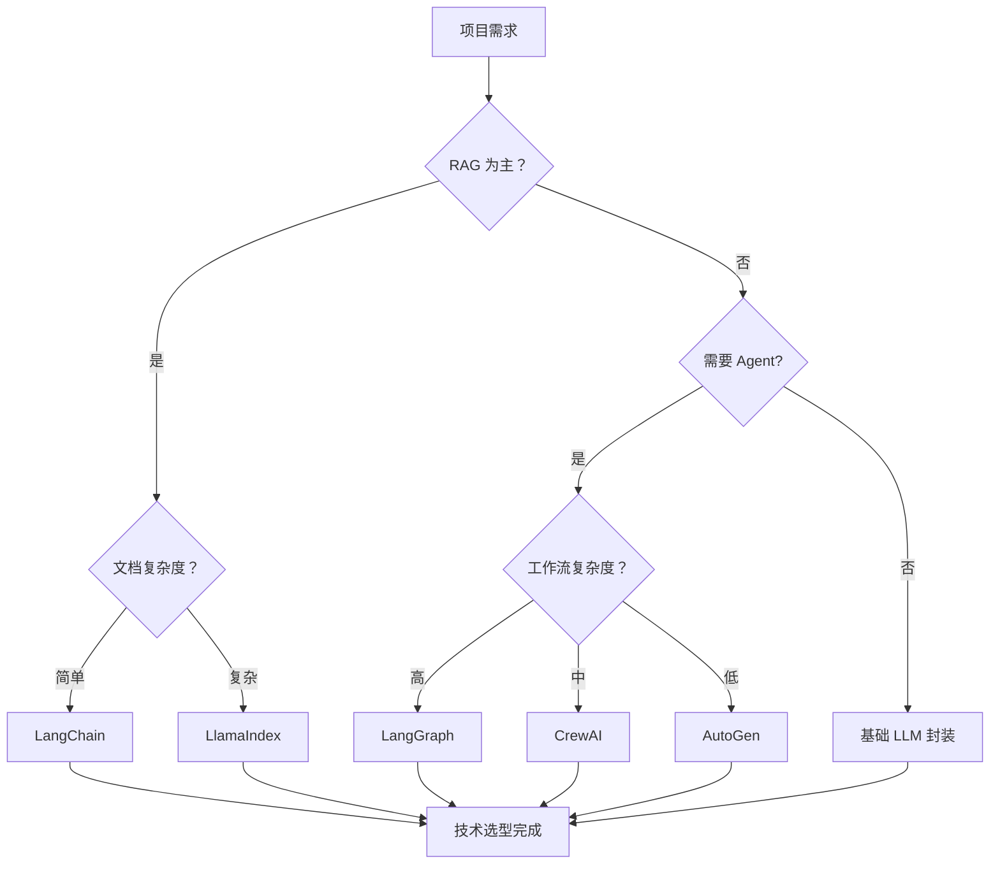

# 对比辨析题

本章节整理了主流 LLM 框架的对比分析，帮助理解各框架的特点和适用场景，为技术选型提供参考。

## 知识对比总览

::: v-pre

:::

## 一、框架综合对比

### LangChain vs LlamaIndex vs Haystack vs Semantic Kernel

#### 1. 定位对比

| 维度 | LangChain | LlamaIndex | Haystack | Semantic Kernel |
|------|-----------|------------|----------|-----------------|
| **出品方** | LangChain AI | LlamaIndex | deepset | Microsoft |
| **发布时间** | 2022.10 | 2022.11 | 2020.06 | 2023.04 |
| **主要语言** | Python/JS | Python | Python | Python/C# |
| **核心定位** | 通用应用框架 | RAG 专用 | 生产级 NLP | 微软生态集成 |
| **学习曲线** | 中等 | 较陡 | 中等 | 较陡 |

#### 2. 功能对比

| 功能 | LangChain | LlamaIndex | Haystack | Semantic Kernel |
|------|-----------|------------|----------|-----------------|
| **RAG 支持** | ✅ 完整 | ✅✅ 最强 | ✅ 完整 | ✅ 基础 |
| **Agent 支持** | ✅✅ 最强 | ⚠️ 有限 | ⚠️ 基础 | ✅ 完整 |
| **记忆管理** | ✅✅ 丰富 | ⚠️ 基础 | ✅ 完整 | ⚠️ 基础 |
| **向量数据库** | 50+ 集成 | 30+ 集成 | 20+ 集成 | 15+ 集成 |
| **可观测性** | ✅ LangSmith | ✅ LlamaCloud | ✅ Haystack UI | ⚠️ Application Insights |
| **流式输出** | ✅ 原生 | ✅ 支持 | ✅ 支持 | ✅ 支持 |
| **多模态** | ✅ 支持 | ⚠️ 有限 | ⚠️ 有限 | ✅ 支持 |

#### 3. 代码风格对比

**相同任务：构建 RAG 管道**

**LangChain:**
```python
from langchain.chains import RetrievalQA

qa = RetrievalQA.from_chain_type(
    llm=llm,
    retriever=vectorstore.as_retriever()
)
result = qa.invoke({"query": "问题"})
```

**LlamaIndex:**
```python
from llama_index.core import QueryEngine

query_engine = index.as_query_engine(llm=llm)
result = query_engine.query("问题")
```

**Haystack:**
```python
from haystack.pipelines import ExtractiveQAPipeline

pipeline = ExtractiveQAPipeline(reader, retriever)
result = pipeline.run(query="问题", params={...})
```

**Semantic Kernel:**
```python
from semantic_kernel import Kernel

kernel = Kernel()
kernel.add_plugin(...)
result = await kernel.invoke(plugin_name, "问题")
```

#### 4. 生态系统对比

| 维度 | LangChain | LlamaIndex | Haystack | Semantic Kernel |
|------|-----------|------------|----------|-----------------|
| **GitHub Stars** | 90K+ | 25K+ | 15K+ | 20K+ |
| **社区活跃度** | ⭐⭐⭐⭐⭐ | ⭐⭐⭐⭐ | ⭐⭐⭐ | ⭐⭐⭐⭐ |
| **文档质量** | ⭐⭐⭐⭐ | ⭐⭐⭐ | ⭐⭐⭐⭐ | ⭐⭐⭐ |
| **企业采用** | 广泛 | 中等 | 中等 | 微软生态 |
| **插件/工具** | 100+ | 50+ | 30+ | 50+ |

#### 5. 适用场景

| 框架 | 推荐场景 | 不推荐场景 |
|------|----------|------------|
| **LangChain** | 快速原型、Agent 应用、多工具集成 | 极致性能、简单 RAG |
| **LlamaIndex** | 复杂 RAG、长文档处理、数据索引 | Agent 应用、多模态 |
| **Haystack** | 生产环境、企业级 NLP、可扩展性 | 快速原型、Agent |
| **Semantic Kernel** | 微软技术栈、Azure 集成、C# 项目 | 纯 Python 项目 |

---

### 7+ 维度对比表

::: v-pre
```mermaid
radarChart
    title LangChain vs LlamaIndex vs Haystack
    "RAG 能力" : [4, 5, 4]
    "Agent 支持" : [5, 2, 2]
    "易用性" : [4, 3, 3]
    "性能" : [3, 4, 4]
    "生态" : [5, 3, 2]
    "文档" : [4, 3, 3]
    "社区" : [5, 3, 2]
    
    jar
    LangChain
    LlamaIndex
    Haystack
```
:::

**详细对比表：**

| 维度 | LangChain | LlamaIndex | Haystack | 权重建议 |
|------|-----------|------------|----------|----------|
| **RAG 能力** | 4/5 | 5/5 | 4/5 | 25% |
| **Agent 支持** | 5/5 | 2/5 | 2/5 | 20% |
| **易用性** | 4/5 | 3/5 | 3/5 | 15% |
| **性能** | 3/5 | 4/5 | 4/5 | 15% |
| **生态系统** | 5/5 | 3/5 | 2/5 | 10% |
| **文档质量** | 4/5 | 3/5 | 3/5 | 10% |
| **社区支持** | 5/5 | 3/5 | 2/5 | 5% |
| **综合得分** | **4.3** | **3.3** | **2.9** | - |

---

## 二、LCEL vs Legacy Chain

### 架构对比

::: v-pre
```mermaid
graph TB
    subgraph Legacy["Legacy Chain (传统方式)"]
        A1[ConversationChain] --> A2[内置 Memory]
        A2 --> A3[隐式 Session]
        A3 --> A4[难以组合]
    end
    
    subgraph LCEL["LCEL (现代方式)"]
        B1[Runnable[prompt | llm]] --> B2[RunnableWithMessageHistory]
        B2 --> B3[显式 Session ID]
        B3 --> B4[自由组合]
    end
```
:::

### 详细对比表

| 维度 | Legacy Chain | LCEL |
|------|--------------|------|
| **语法风格** | 命令式 | 声明式 |
| **组合方式** | 有限支持 | 管道 (`\|`) 组合 |
| **流式输出** | 部分支持 | 原生支持 |
| **异步支持** | 有限 | 完整异步/await |
| **类型安全** | 弱类型 | 强类型提示 |
| **可观测性** | 基础 Callback | 原生 LangSmith |
| **记忆管理** | 内置自动 | 显式工厂函数 |
| **测试友好** | 较难 Mock | 易于单元测试 |
| **学习曲线** | 较低 | 中等 |
| **推荐度** | ❌ 遗留 | ✅ 推荐 |

### 代码对比

**创建对话链：**

```python
# Legacy
chain = ConversationChain(llm=llm, memory=memory)

# LCEL
chain = (
    RunnableWithMessageHistory(
        prompt | llm,
        get_session_history=lambda sid: memory
    )
)
```

**添加中间处理：**

```python
# Legacy (困难)
# 需要自定义 Chain 类

# LCEL (简单)
chain = (
    RunnableLambda(preprocess)
    | prompt
    | llm
    | RunnableLambda(postprocess)
)
```

**流式输出：**

```python
# Legacy (有限)
for chunk in chain.stream(...):  # 部分 Chain 支持
    ...

# LCEL (原生)
for chunk in chain.stream(...):  # 所有 Runnable 支持
    ...
```

### 迁移建议

**应该迁移到 LCEL 的情况：**
- ✅ 新项目
- ✅ 需要复杂组合
- ✅ 需要流式支持
- ✅ 需要异步处理

**可以继续使用 Legacy 的情况：**
- ⚠️ 现有项目稳定运行
- ⚠️ 简单场景无需复杂功能
- ⚠️ 团队不熟悉 LCEL

---

## 三、Agent 框架对比

### LangGraph vs AutoGen vs CrewAI

::: v-pre

:::

### 详细对比

| 维度 | LangGraph | AutoGen | CrewAI |
|------|-----------|---------|--------|
| **出品方** | LangChain AI | Microsoft | CrewAI |
| **核心理念** | 状态图编排 | 多 Agent 对话 | 角色任务驱动 |
| **编程模型** | Graph/State | Conversational | Role/Task |
| **学习曲线** | 中等 | 较陡 | 较低 |
| **灵活性** | ⭐⭐⭐⭐⭐ | ⭐⭐⭐⭐ | ⭐⭐⭐ |
| **易用性** | ⭐⭐⭐⭐ | ⭐⭐⭐ | ⭐⭐⭐⭐⭐ |
| **多 Agent 对话** | 需手动实现 | ✅ 原生 | ⚠️ 有限 |
| **人工介入** | ✅ 支持 | ✅ 原生 | ⚠️ 有限 |
| **状态管理** | ✅ 显式 State | ⚠️ 隐式 | ⚠️ 隐式 |
| **可观测性** | ✅ LangSmith | ⚠️ 基础 | ⚠️ 基础 |
| **适用场景** | 复杂工作流 | 研究对话 | 结构化任务 |

### 代码风格对比

**LangGraph:**
```python
from langgraph.graph import StateGraph

class State(TypedDict):
    messages: list
    current_step: str

workflow = StateGraph(State)
workflow.add_node("research", researcher_node)
workflow.add_node("write", writer_node)
workflow.add_conditional_edges("research", route_function)
workflow.compile()
```

**AutoGen:**
```python
from autogen import AssistantAgent, UserProxyAgent

assistant = AssistantAgent("assistant", llm_config=...)
user_proxy = UserProxyAgent("user", ...)

user_proxy.initiate_chat(
    assistant,
    message="帮我写一份报告"
)
```

**CrewAI:**
```python
from crewai import Agent, Task, Crew

researcher = Agent(role="研究员", goal="收集信息", ...)
writer = Agent(role="作家", goal="撰写报告", ...)

task = Task(description="写报告", agent=writer)
crew = Crew(agents=[researcher, writer], tasks=[task])
crew.kickoff()
```

### 选型决策指南

**选择 LangGraph 如果：**
- ✅ 需要精确控制工作流程
- ✅ 需要循环和条件分支
- ✅ 需要显式状态管理
- ✅ 已在 LangChain 生态

**选择 AutoGen 如果：**
- ✅ 研究多 Agent 对话
- ✅ 需要灵活的人工介入
- ✅ 探索性项目
- ✅ 微软技术栈

**选择 CrewAI 如果：**
- ✅ 结构化任务流程
- ✅ 快速原型
- ✅ 团队不熟悉复杂编排
- ✅ 角色分工明确

---

## 四、向量数据库对比

### 自托管 vs 云服务

::: v-pre

:::

### 详细对比表

| 数据库 | 类型 | 优点 | 缺点 | 适用场景 |
|--------|------|------|------|----------|
| **FAISS** | 自托管 | 快速、简单、免费 | 仅内存、无持久化 | 开发、原型 |
| **Chroma** | 自托管 | 易部署、持久化 | 性能一般 | 小规模项目 |
| **Qdrant** | 自托管/云 | 性能好、功能全 | 复杂度中等 | 中型项目 |
| **Weaviate** | 自托管/云 | 模块化、GraphQL | 学习曲线 | 企业级 |
| **Pinecone** | 云 | 易用、可扩展 | 成本高 | 生产环境 |
| **Milvus** | 自托管/云 | 高性能、分布式 | 部署复杂 | 大规模 |

### 选型决策树

```
需要向量数据库？
    ↓
是否生产环境？
    ├─ 否 → 开发/测试？
    │         ├─ 是 → FAISS/Chroma (快速上手)
    │         └─ 否 → Qdrant (平衡性能和易用)
    │
    └─ 是 → 数据规模？
              ├─ 小规模 (<100 万) → Qdrant/Weaviate 自托管
              ├─ 中规模 (100 万 -1 亿) → Pinecone/Weaviate Cloud
              └─ 大规模 (>1 亿) → Milvus/企业级方案
                  
预算充足？
    ├─ 是 → 云服务 (Pinecone/Weaviate Cloud)
    └─ 否 → 自托管 (Qdrant/Milvus)
```

---

## 五、嵌入模型对比

### 主流嵌入模型

| 模型 | 提供商 | 维度 | 成本 | 性能 | 适用场景 |
|------|--------|------|------|------|----------|
| **text-embedding-3-small** | OpenAI | 1536 | $ | ⭐⭐⭐⭐ | 通用 |
| **text-embedding-3-large** | OpenAI | 3072 | $$ | ⭐⭐⭐⭐⭐ | 高精度 |
| **bge-large-zh** | BAAI | 1024 | 免费 | ⭐⭐⭐⭐⭐ | 中文 |
| **m3e-base** | Moka | 768 | 免费 | ⭐⭐⭐⭐ | 中文 |
| **multilingual-e5** | Microsoft | 1024 | 免费 | ⭐⭐⭐⭐ | 多语言 |

### 选型建议

**中文场景：**
- 首选：bge-large-zh (免费、中文优化)
- 备选：text-embedding-3-small (性价比高)

**多语言场景：**
- 首选：multilingual-e5
- 备选：text-embedding-3-large

**成本敏感：**
- 本地部署：bge/m3e
- API：text-embedding-3-small

---

## 六、选型决策指南

### 综合决策框架

::: v-pre

:::

### 快速决策表

| 项目类型 | 推荐框架 | 关键理由 |
|----------|----------|----------|
| **知识库问答** | LangChain/LlamaIndex | RAG 支持完整 |
| **客服系统** | LangChain | Agent+ 记忆管理 |
| **代码助手** | LangChain | 工具调用丰富 |
| **数据分析** | LangChain | 多工具集成 |
| **内容创作** | LangGraph/CrewAI | 多 Agent 协作 |
| **文档处理** | LlamaIndex | 索引优化 |
| **企业 NLP** | Haystack | 生产级特性 |
| **微软生态** | Semantic Kernel | Azure 集成 |

### 成本对比（月活 10 万）

| 方案 | 向量库 | LLM | 月成本估算 |
|------|--------|-----|------------|
| **低成本** | FAISS(自) | gpt-4o-mini | $500-1000 |
| **平衡型** | Qdrant(云) | gpt-4o | $2000-5000 |
| **企业级** | Pinecone | gpt-4o + 缓存 | $5000-10000+ |

---

## 七、常见误区

### ❌ 误区 1："最新的就是最好的"

**纠正：**
- 选择**适合**的，不是最新的
- 稳定 > 新颖（生产环境）
- 考虑团队技术栈

### ❌ 误区 2："功能越多越好"

**纠正：**
- 功能多 = 复杂度高
- 80% 场景只需 20% 功能
- 简单够用最好

### ❌ 误区 3："自建一定更省钱"

**纠正：**
- 考虑运维成本
- 云服务可能有免费额度
- 小规模自建更贵

### ❌ 误区 4："可以随意切换框架"

**纠正：**
- 切换成本很高
- 早期选择很重要
- 考虑长期维护

---

## 总结

**LangChain 生态：**
- ✅ 功能最全面
- ✅ 社区最活跃
- ✅ 文档最完善
- ⚠️ 学习曲线中等

**选择建议：**
1. **新手入门**：LangChain (资料多)
2. **RAG 专精**：LlamaIndex (索引强)
3. **生产环境**：Haystack (稳定性)
4. **微软生态**：Semantic Kernel (集成好)
5. **Agent 应用**：LangGraph (灵活)
6. **快速原型**：CrewAI (简单)

**关键原则：**
- 先确定核心需求
- 评估团队能力
- 考虑长期维护
- 预留切换空间