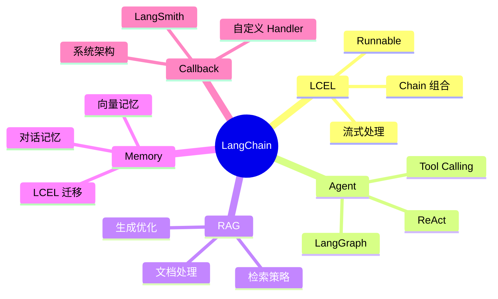
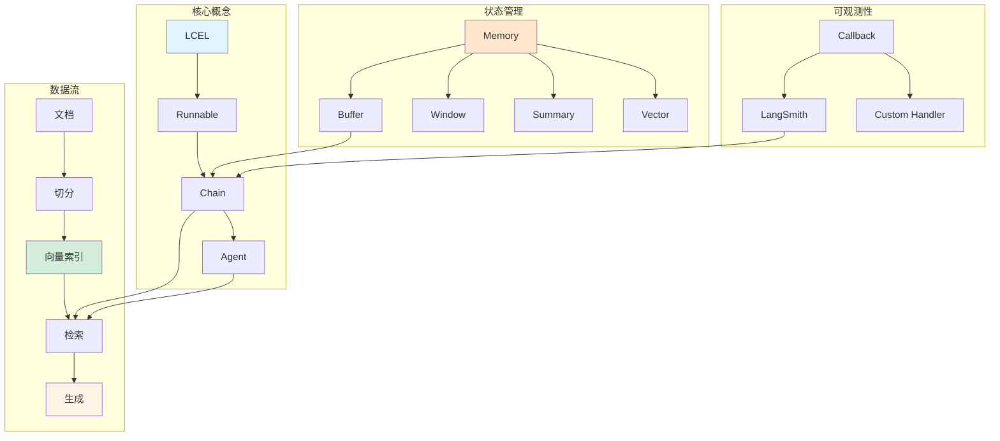

# LangChain 高频面试题 30+

本章节整理了 LangChain 相关的高频面试题目，涵盖 LCEL、Agent、RAG、Memory 等核心知识点，每道题都配有详细解答。

## 知识体系总览

::: v-pre

:::

## 一、LCEL 相关 (8 题)

### Q1: 什么是 LCEL？相比传统 Chain 有什么优势？

**解答：**

LCEL (LangChain Expression Language) 是 LangChain 的声明式编排语言。

**核心优势：**

| 维度 | 传统 Chain | LCEL |
|------|-----------|------|
| **语法** | 命令式 | 声明式 |
| **组合性** | 有限 | 高度可组合 |
| **流式支持** | 部分 | 原生支持 |
| **异步** | 有限 | 完整支持 |
| **类型安全** | 弱 | 强类型 |
| **可观测性** | 基础 | 原生 LangSmith |

**代码对比：**
```python
# 传统方式
chain = ConversationChain(llm=llm, memory=memory)

# LCEL 方式
chain = (
    {"input": lambda x: x["input"]} 
    | prompt 
    | llm 
    | StrOutputParser()
)
```

---

### Q2: RunnableSequence 的工作原理是什么？

**解答：**

RunnableSequence 是 LCEL 的核心，通过管道 (`|`) 连接多个 Runnable。

**工作流程：**
```
输入 → Runnable1 → 输出1 → Runnable2 → 输出2 → ... → 最终输出
```

**关键特性：**
1. **惰性执行**：定义时不执行，invoke 时才执行
2. **类型传递**：前一个的输出作为后一个的输入
3. **自动批处理**：batch 调用时自动优化
4. **异常传播**：任何节点失败，整个序列失败

**示例：**
```python
chain = (
    RunnableLambda(lambda x: x["question"])  # 提取问题
    | retriever                               # 检索
    | RunnableLambda(format_docs)             # 格式化
    | prompt                                  # 构建 prompt
    | llm                                     # 生成
    | StrOutputParser()                       # 解析
)
```

---

### Q3: 如何在 LCEL 中添加记忆功能？

**解答：**

使用 `RunnableWithMessageHistory` 包装链。

**实现步骤：**
```python
from langchain_core.runnables.history import RunnableWithMessageHistory
from langchain.memory import ConversationBufferMemory

# 1. 定义基础链
chain = prompt | llm

# 2. 定义 session 工厂
def get_history(session_id: str):
    return ConversationBufferMemory(
        memory_key="history",
        return_messages=True
    )

# 3. 包装
chain_with_history = RunnableWithMessageHistory(
    chain,
    get_session_history=get_history,
    input_messages_key="input",
    history_messages_key="history"
)

# 4. 调用时传入 session_id
response = chain_with_history.invoke(
    {"input": "你好"},
    config={"configurable": {"session_id": "user_123"}}
)
```

---

### Q4: LCEL 如何实现流式输出？

**解答：**

LCEL 原生支持流式，通过 `stream()` 方法实现。

**示例：**
```python
# 同步流式
for chunk in chain.stream({"input": "写一首诗"}):
    print(chunk, end="", flush=True)

# 异步流式
async for chunk in chain.astream({"input": "写一首诗"}):
    print(chunk, end="", flush=True)
```

**内部机制：**
1. LLM 逐 token 生成
2. 通过生成器传递
3. 每个 Runnable 支持流式转换

---

### Q5: 什么是 RunnablePassthrough？什么时候使用？

**解答：**

`RunnablePassthrough` 透传输入，用于保持原始输入在链中传递。

**使用场景：**

**场景 1：需要原始输入和中间结果**
```python
chain = {
    "original": RunnablePassthrough(),  # 保留原始输入
    "translated": translator,            # 翻译结果
}
# 输出：{"original": "...", "translated": "..."}
```

**场景 2：多路处理**
```python
chain = {
    "summary": summarizer,
    "keywords": keyword_extractor,
    "original": RunnablePassthrough()
}
```

---

### Q6: 如何在 LCEL 中处理异常？

**解答：**

使用 `RunnableLambda` 包装异常处理逻辑。

**示例：**
```python
from langchain_core.runnables import RunnableLambda

def safe_invoke(func):
    def wrapper(input):
        try:
            return func(input)
        except Exception as e:
            return f"错误：{str(e)}"
    return wrapper

chain = (
    prompt 
    | llm 
    | RunnableLambda(safe_invoke(parse_output))
)
```

---

### Q7: LCEL 的 batch 方法有什么优势？

**解答：**

`batch()` 可以并行处理多个输入，提高效率。

**优势：**
1. **并行执行**：同时处理多个请求
2. **自动批处理**：LLM API 支持批量调用
3. **进度追踪**：支持回调显示进度

**示例：**
```python
results = chain.batch(
    [{"input": q} for q in questions],
    config={"max_concurrency": 5}  # 最大并发数
)
```

---

### Q8: 如何调试 LCEL 链？

**解答：**

**方法 1：Verbose 模式**
```python
from langchain import globals
globals.set_verbose(True)
```

**方法 2：LangSmith 追踪**
```python
os.environ["LANGCHAIN_TRACING_V2"] = "true"
```

**方法 3：中间结果查看**
```python
chain = {
    "step1": RunnableLambda(log_step("step1")) | step1_func,
    "step2": RunnableLambda(log_step("step2")) | step2_func,
}
```

---

## 二、RAG 相关 (10 题)

### Q9: RAG 的基本原理是什么？

**解答：**

RAG (Retrieval-Augmented Generation) 检索增强生成。

**流程：**
```
用户问题 → 检索相关文档 → 构建 Prompt → LLM 生成 → 答案
```

**核心优势：**
1. 减少幻觉（基于事实）
2. 扩展知识（访问外部数据）
3. 可追溯（标注来源）
4. 成本低（小模型 + 外部知识）

---

### Q10: 文本切分有哪些策略？如何选择？

**解答：**

**策略对比：**

| 策略 | 优点 | 缺点 | 适用场景 |
|------|------|------|----------|
| **固定长度** | 简单 | 可能切断语义 | 短文本 |
| **递归字符** | 保留结构 | 参数调优 | 通用 |
| **语义切分** | 语义完整 | 成本高 | 长文档 |
| **按段落** | 自然分段 | 大小不一 | 结构化文档 |

**代码示例：**
```python
# 递归字符切分（推荐）
splitter = RecursiveCharacterTextSplitter(
    chunk_size=500,
    chunk_overlap=50,
    separators=["\n\n", "\n", "。", "！", "？", "；", "，", " ", ""]
)
```

---

### Q11: 什么是混合检索？为什么需要它？

**解答：**

混合检索结合**稀疏检索**（BM25）和**稠密检索**（向量）。

**为什么需要：**
- **BM25**：擅长精确匹配关键词
- **向量**：擅长语义相似度
- **混合**：互补优势，提高召回率

**融合方法：**
```python
# RRF (Reciprocal Rank Fusion)
def rrf_fusion(dense, sparse, k=60):
    scores = defaultdict(float)
    for rank, doc in enumerate(dense):
        scores[doc.id] += 1 / (k + rank + 1)
    for rank, doc in enumerate(sparse):
        scores[doc.id] += 1 / (k + rank + 1)
    return sorted(scores.items(), key=lambda x: -x[1])
```

---

### Q12: 什么是重排序 (Rerank)？有必要吗？

**解答：**

重排序是对检索结果进行二次排序，提高精度。

**必要性：**
- **粗排**（检索）：快速召回大量候选（高召回率）
- **精排**（重排序）：精细排序少量候选（高精度）

**方法：**
1. **Cross-Encoder**：精度高，速度慢
2. **LLM Rerank**：灵活，成本高
3. **规则重排**：快，效果有限

**示例：**
```python
# Cross-Encoder Rerank
from sentence_transformers import CrossEncoder
model = CrossEncoder('BAAI/bge-reranker-v2-m3')
pairs = [[query, doc.text] for doc in docs]
scores = model.predict(pairs)
reranked = sorted(zip(docs, scores), key=lambda x: -x[1])
```

---

### Q13: 如何处理长文档 RAG？

**解答：**

**策略 1：Map-Reduce**
```python
# 分别处理每个 chunk，然后汇总
map_chain = prompt | llm
reduce_chain = summary_prompt | llm

# Map
partial_results = [map_chain.invoke({"doc": c}) for c in chunks]

# Reduce
final = reduce_chain.invoke({"summaries": partial_results})
```

**策略 2：Refine**
```python
# 增量更新摘要
current_summary = ""
for chunk in chunks:
    current_summary = refine_prompt.invoke({
        "existing": current_summary,
        "new": chunk
    })
```

**策略 3：分层检索**
```python
# 先检索段落，再检索句子
paragraphs = retriever.invoke(query)
sentences = fine_retriever.invoke(query, context=paragraphs)
```

---

### Q14: 如何评估 RAG 系统的质量？

**解答：**

**评估维度：**

| 维度 | 指标 | 评估方法 |
|------|------|----------|
| **检索质量** | Recall@K, MRR | 人工标注相关性 |
| **生成质量** | 准确性、流畅度 | LLM-as-a-Judge |
| **端到端** | 答案正确率 | 黄金测试集 |
| **性能** | 延迟、吞吐量 | 压力测试 |

**LangSmith 评估：**
```python
from langsmith.evaluation import evaluate

results = evaluate(
    rag_pipeline,
    data="test-dataset",
    evaluators=["accuracy", "relevance", "faithfulness"]
)
```

---

### Q15: RAG 常见的幻觉问题如何解决？

**解答：**

**原因：**
1. 检索到不相关内容
2. LLM 忽略上下文
3. 模型知识冲突

**解决方案：**

**方法 1：Prompt 约束**
```python
prompt = """基于以下资料回答，如果资料中没有相关信息，直接说"不知道"。

资料：{context}

问题：{question}
"""
```

**方法 2：引用强制**
```python
prompt = """回答时必须标注信息来源，如[来源 1]。
如果无法从资料中找到答案，说"资料中没有相关信息"。
"""
```

**方法 3：置信度阈值**
```python
docs, scores = retriever.invoke(query)
if max(scores) < threshold:
    return "信息不足，无法回答"
```

---

### Q16: 向量数据库如何选择？

**解答：**

**选择因素：**

| 数据库 | 特点 | 适用场景 |
|--------|------|----------|
| **FAISS** | 内存、快速 | 开发、小规模 |
| **Chroma** | 持久化、简单 | 中小项目 |
| **Pinecone** | 托管、可扩展 | 生产环境 |
| **Weaviate** | 多云、功能全 | 企业级 |
| **Milvus** | 高性能、分布式 | 大规模 |

**建议：**
- 开发：FAISS/Chroma
- 生产：Pinecone/Weaviate/Milvus

---

### Q17: 查询重写有什么作用？

**解答：**

**作用：**
1. 提高检索召回率
2. 解决表述差异
3. 补充隐含信息

**方法：**

**方法 1：Query Expansion**
```python
# 生成多个变体
variants = llm.invoke(f"生成'{query}'的 3 个同义问法")
all_results = [retriever.invoke(v) for v in variants]
```

**方法 2：HyDE (Hypothetical Document Embeddings)**
```python
# 生成假设性答案，用答案检索
hypothesis = llm.invoke(f"假设性回答：{query}")
docs = retriever.invoke(hypothesis)
```

---

### Q18: 如何实现多轮对话 RAG？

**解答：**

**关键：结合对话历史和检索**

```python
from langchain.memory import ConversationBufferWindowMemory

# 1. 维护对话历史
memory = ConversationBufferWindowMemory(k=5)

# 2. 结合历史和当前问题
def build_query(question, history):
    return f"""历史对话：
{history}

当前问题：{question}

请理解问题的完整意图。"""

# 3. 检索时考虑上下文
contextual_query = rewrite_chain.invoke({
    "question": question,
    "history": memory.load_memory_variables({})["history"]
})
docs = retriever.invoke(contextual_query)
```

---

## 三、Agent 相关 (8 题)

### Q19: Agent 的基本原理是什么？

**解答：**

Agent = LLM + 规划 + 工具使用

**核心循环 (ReAct):**
```
思考 → 行动 → 观察 → 思考 → ... → 最终答案
```

**组件：**
1. **LLM**：决策和推理
2. **Tools**：执行具体任务
3. **Memory**：保持状态
4. **Planner**：任务分解

---

### Q20: Tool Calling 是如何工作的？

**解答：**

**流程：**
```
用户输入 → LLM 决定调用工具 → 解析参数 → 执行工具 → 返回结果 → LLM 生成回答
```

**示例：**
```python
from langchain_core.tools import tool

@tool
def search(query: str) -> str:
    """搜索信息"""
    return f"关于{query}的结果"

@tool
def calculator(expr: str) -> float:
    """计算表达式"""
    return eval(expr)

# Agent 自动决定调用哪个工具
agent = create_tool_calling_agent(llm, [search, calculator], prompt)
```

---

### Q21: ReAct 和 Tool Calling 有什么区别？

**解答：**

| 维度 | ReAct | Tool Calling |
|------|-------|--------------|
| **实现** | Prompt 工程 | 模型原生支持 |
| **解析** | 正则解析 | 结构化输出 |
| **可靠性** | 较低 | 高 |
| **模型要求** | 任意 LLM | 支持 Function Calling |
| **灵活性** | 高 | 中 |

**建议：**
- 新模型（GPT-4、Claude）：用 Tool Calling
- 老模型或自定义：用 ReAct

---

### Q22: 如何自定义 Agent 的 Prompt？

**解答：**

**关键要素：**
1. 角色定义
2. 可用工具说明
3. 输出格式要求
4. 示例示范

**示例：**
```python
prompt = ChatPromptTemplate.from_messages([
    ("system", """你是一个客服助手。
你可以使用以下工具：
- search_knowledge: 搜索知识库
- check_order: 查询订单

回答要求：
1. 先理解用户问题
2. 必要时使用工具
3. 基于工具结果回答
4. 不知道就说不知道
"""),
    MessagesPlaceholder(variable_name="chat_history"),
    ("human", "{input}"),
    MessagesPlaceholder(variable_name="agent_scratchpad")
])
```

---

### Q23: 如何处理 Agent 的死循环？

**解答：**

**原因：**
1. 工具返回不明确
2. Prompt 指令不清
3. 任务太复杂

**解决方案：**

**方法 1：设置最大迭代次数**
```python
agent_executor = AgentExecutor(
    agent=agent,
    tools=tools,
    max_iterations=5,  # 最多 5 次
    max_execution_time=60  # 最多 60 秒
)
```

**方法 2：添加停止条件**
```python
prompt = """
如果已经获得足够信息，直接回答，不要继续调用工具。
"""
```

**方法 3：添加回退机制**
```python
try:
    response = agent_executor.invoke({...})
except Exception as e:
    response = {"output": "处理遇到一些问题，请人工协助。"}
```

---

### Q24: 什么是 LangGraph？适用场景？

**解答：**

LangGraph 是基于图的 Agent 编排框架。

**核心概念：**
- **Node**：处理单元
- **Edge**：连接和路由
- **State**：共享状态
- **Graph**：完整的图

**适用场景：**
1. 多 Agent 协作
2. 复杂工作流程
3. 需要状态管理
4. 条件分支逻辑

**示例：**
```python
from langgraph.graph import StateGraph, END

workflow = StateGraph(State)
workflow.add_node("researcher", researcher_node)
workflow.add_node("writer", writer_node)
workflow.add_edge("researcher", "writer")
workflow.add_edge("writer", END)
workflow.set_entry_point("researcher")
app = workflow.compile()
```

---

### Q25: 多智能体系统如何设计？

**解答：**

**设计模式：**

**模式 1：Supervisor-Worker**
```
Supervisor → [Worker1, Worker2, Worker3] → 汇总
```

**模式 2：Pipeline**
```
Agent1 → Agent2 → Agent3 → 输出
```

**模式 3：Hierarchical**
```
          Manager
         /   |   \
    Team1  Team2  Team3
```

**关键考虑：**
1. 明确每个 Agent 职责
2. 定义清晰的接口
3. 处理冲突和错误
4. 追踪执行过程

---

### Q26: Agent 如何记忆历史对话？

**解答：**

**方法 1：对话记忆**
```python
memory = ConversationBufferWindowMemory(k=10)
agent = create_tool_calling_agent(llm, tools, prompt, memory=memory)
```

**方法 2：状态图记忆**
```python
class State(TypedDict):
    messages: Annotated[List, add_messages]
    context: dict

# 每次执行更新状态
def node(state: State):
    new_messages = [...]
    return {"messages": new_messages}
```

---

## 四、Memory 相关 (6 题)

### Q27: LangChain 有哪些 Memory 类型？

**解答：**

| 类型 | 特点 | 适用场景 |
|------|------|----------|
| **Buffer** | 完整历史 | 短对话 |
| **BufferWindow** | 最近 k 轮 | 中等对话 |
| **Summary** | 历史摘要 | 长对话 |
| **Vector** | 向量检索 | 长期记忆 |
| **Combined** | 组合使用 | 复杂场景 |

---

### Q28: ConversationBufferWindowMemory 的 k 参数如何选择？

**解答：**

**考虑因素：**
1. **对话复杂度**：复杂对话需要更多上下文
2. **Token 成本**：k 越大成本越高
3. **模型上下文窗口**：不能超过限制

**推荐值：**
- 简单问答：k=2~3
- 客服对话：k=5~10
- 技术咨询：k=10~15
- 心理咨询：使用完整 Buffer

---

### Q29: 如何将 Legacy Memory 迁移到 LCEL？

**解答：**

**传统方式：**
```python
chain = ConversationChain(llm=llm, memory=memory)
```

**LCEL 方式：**
```python
chain = RunnableWithMessageHistory(
    prompt | llm,
    get_session_history=lambda sid: memory,
    input_messages_key="input",
    history_messages_key="history"
)
```

---

### Q30: 向量记忆相比传统记忆有什么优势？

**解答：**

**优势：**
1. **可扩展**：不受轮数限制
2. **智能化**：检索最相关记忆
3. **成本效益**：只传输相关内容

**劣势：**
1. 实现复杂
2. 检索可能不准确
3. 需要向量数据库

---

### Q31: 如何实现跨 session 的长期记忆？

**解答：**

**方法 1：持久化存储**
```python
import pickle

def save_memory(user_id, memory):
    with open(f"memory_{user_id}.pkl", "wb") as f:
        pickle.dump(memory, f)

def load_memory(user_id):
    with open(f"memory_{user_id}.pkl", "rb") as f:
        return pickle.load(f)
```

**方法 2：向量数据库**
```python
# 将重要信息存入向量库
vectorstore.add_texts([important_fact], [{"user_id": user_id}])

# 下次会话时检索
relevant = vectorstore.similarity_search(f"user:{user_id}")
```

---

### Q32: Memory 的 token 成本如何优化？

**解答：**

**策略 1：使用窗口记忆**
```python
# 从 Buffer 改为 Window
memory = ConversationBufferWindowMemory(k=5)  # 限制 5 轮
```

**策略 2：使用摘要记忆**
```python
# 长对话使用摘要
memory = ConversationSummaryMemory(llm=llm)
```

**策略 3：混合策略**
```python
# 近期用窗口，远期用摘要
memory = ConversationSummaryBufferMemory(
    llm=llm,
    max_token_limit=2000
)
```

---

## 知识点关联图

::: v-pre

:::

## 总结

掌握这些高频问题，你将能够：

✅ 理解 LangChain 核心概念
✅ 设计合理的 RAG 架构
✅ 构建实用的 Agent 应用
✅ 优化 Memory 和性能
✅ 回答面试中的技术问题

**建议：**
1. 理解原理，不只是背答案
2. 结合项目经验回答
3. 展示解决问题的思路
4. 保持持续学习