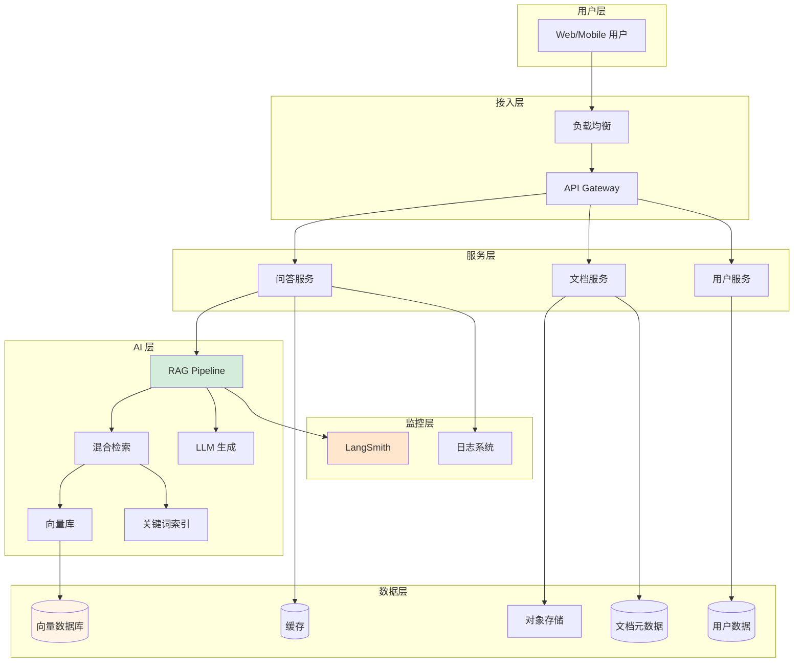
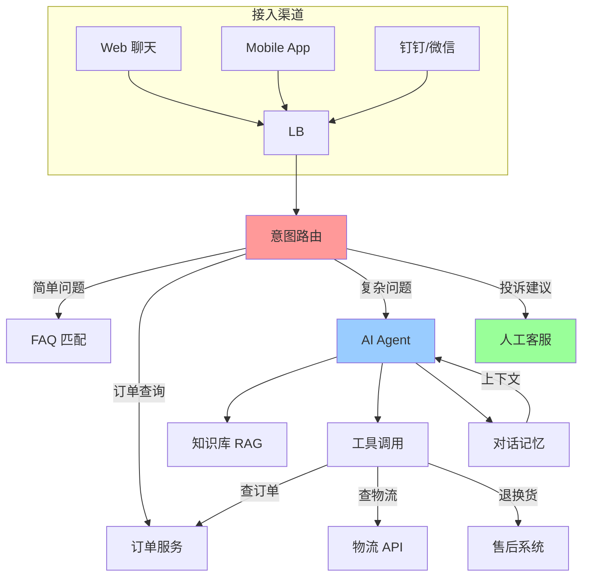
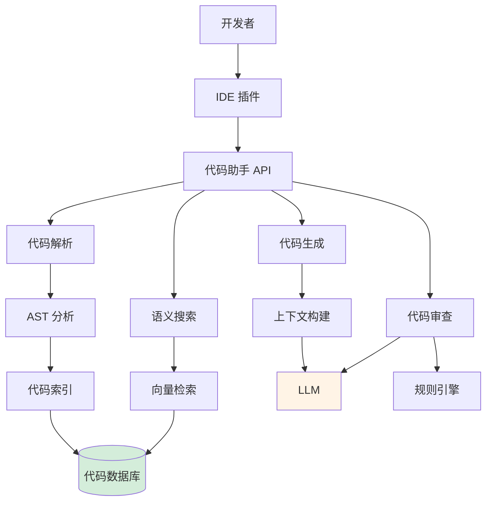
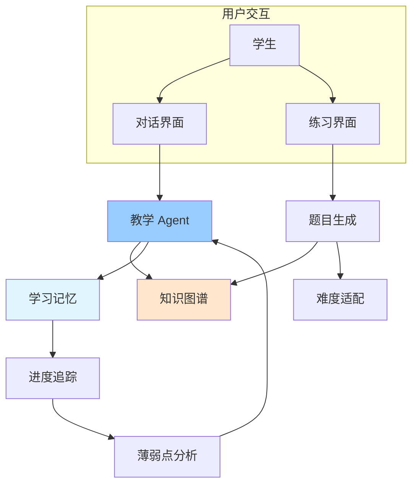

# 系统设计题 5-8 道

本章节整理了 LLM 应用系统设计的面试题目，每题包含需求分析、架构设计、技术选型和代码框架。

## 设计题 1：企业知识库问答系统

### 需求分析

**业务需求：**
- 员工可查询公司制度、流程、文档
- 支持多轮对话，理解上下文
- 答案需标注来源，便于验证
- 支持多种文档格式（PDF、Word、PPT）
- 日活用户 1000+，响应时间<3 秒

**功能需求：**
- 文档上传和管理
- 智能问答
- 答案来源引用
- 用户反馈收集
- 访问统计

### 架构设计

::: v-pre

:::

### 技术选型

| 组件 | 选型 | 理由 |
|------|------|------|
| **向量数据库** | Weaviate | 支持混合检索、可扩展 |
| **LLM** | GPT-4o | 准确度高、支持 Function Calling |
| **嵌入模型** | text-embedding-3-small | 性价比高 |
| **缓存** | Redis | 热门查询缓存 |
| **文档存储** | AWS S3 | 可靠、成本低 |
| **API 框架** | FastAPI | 异步、性能好 |
| **监控** | LangSmith | 完整的 LLM 可观测性 |

### 代码框架

```python
# services/qa_service.py
from fastapi import HTTPException
from src.rag import RAGPipeline
from src.cache import Cache
from langsmith import Client

class QAService:
    def __init__(self):
        self.pipeline = RAGPipeline()
        self.cache = Cache()
        self.langsmith = Client()
    
    async def ask(self, user_id: str, question: str) -> dict:
        # 1. 检查缓存
        cache_key = f"qa:{hash(question)}"
        cached = await self.cache.get(cache_key)
        if cached:
            return cached
        
        # 2. RAG 处理
        try:
            result = await self.pipeline.query(
                question=question,
                user_id=user_id
            )
        except Exception as e:
            raise HTTPException(status_code=500, detail=str(e))
        
        # 3. 缓存结果
        await self.cache.set(cache_key, result, ttl=3600)
        
        # 4. 记录追踪
        self.langsmith.create_feedback(
            run_id=result["run_id"],
            key="user_query",
            score=1.0
        )
        
        return result

# api/routes.py
from fastapi import APIRouter, Depends
from services.qa_service import QAService

router = APIRouter()
qa_service = QAService()

@router.post("/ask")
async def ask_question(
    request: AskRequest,
    user: User = Depends(get_current_user)
):
    result = await qa_service.ask(user.id, request.question)
    return {
        "answer": result["answer"],
        "sources": result["sources"],
        "latency_ms": result["latency"]
    }

@router.post("/feedback")
async def submit_feedback(request: FeedbackRequest):
    # 收集用户反馈用于优化
    langsmith_client.create_feedback(
        run_id=request.run_id,
        key="user_satisfaction",
        score=request.score
    )
    return {"status": "ok"}
```

### 关键问题解答

**Q1: 如何处理并发查询？**
```python
# 使用异步和连接池
class RAGPipeline:
    def __init__(self):
        self.embeddings = OpenAIEmbeddings()
        # 向量库连接池
        self.vectorstore = Weaviate(
            url=WEAVIATE_URL,
            auth_client_secret=...
        )
    
    async def query(self, question: str):
        # 异步检索
        docs = await asyncio.gather(
            self.dense_search(question),
            self.sparse_search(question)
        )
        # 融合、重排序、生成
        ...
```

**Q2: 如何保证答案准确性？**
1. 混合检索提高召回率
2. Cross-Encoder 重排序
3. Prompt 约束"不知道就说不知道"
4. 置信度阈值过滤
5. 人工审核关键答案

---

## 设计题 2：智能客服系统

### 需求分析

**业务场景：**电商客服
- 处理售前咨询、售后问题、订单查询
- 7x24 小时服务
- 复杂问题转人工
- 日咨询量 10 万 +

**关键指标：**
- 自动解决率 > 70%
- 平均响应时间 < 2 秒
- 用户满意度 > 4.5/5

### 架构设计

::: v-pre

:::

### 技术选型

| 组件 | 选型 | 理由 |
|------|------|------|
| **意图识别** | BERT 分类 | 准确、快速 |
| **FAQ 匹配** | Elasticsearch | 快速检索 |
| **对话 Agent** | LangGraph | 多轮对话管理 |
| **记忆存储** | Redis | 低延迟 |
| **人工接入** | WebSocket | 实时通信 |

### 代码框架

```python
# agent/customer_agent.py
from langgraph.graph import StateGraph, END
from typing import TypedDict, Annotated, List

class CustomerState(TypedDict):
    messages: List
    intent: str
    order_id: str
    resolution: str
    escalate: bool

class CustomerAgent:
    def __init__(self):
        self.graph = self._build_graph()
    
    def _build_graph(self):
        workflow = StateGraph(CustomerState)
        
        # 节点
        workflow.add_node("intent", self.classify_intent)
        workflow.add_node("faq", self.faq_match)
        workflow.add_node("order", self.handle_order)
        workflow.add_node("agent", self.ai_assist)
        workflow.add_node("escalate", self.escalate_to_human)
        
        # 路由
        workflow.add_conditional_edges(
            "intent",
            self.route_by_intent,
            {
                "faq": "faq",
                "order": "order",
                "complex": "agent",
                "complaint": "escalate"
            }
        )
        
        workflow.add_edge("faq", END)
        workflow.add_edge("order", END)
        workflow.add_edge("agent", END)
        workflow.add_edge("escalate", END)
        
        workflow.set_entry_point("intent")
        return workflow.compile()
    
    def classify_intent(self, state: CustomerState):
        # 使用轻量模型分类意图
        message = state["messages"][-1]
        intent = intent_classifier.predict(message)
        return {"intent": intent}
    
    def route_by_intent(self, state: CustomerState):
        return state["intent"]
    
    def handle_order(self, state: CustomerState):
        # 提取订单号并查询
        order_id = extract_order_id(state["messages"])
        order_info = order_service.query(order_id)
        return {"resolution": format_order_info(order_info)}
    
    async def chat(self, history: List, user_message: str):
        result = self.graph.invoke({
            "messages": history + [user_message],
            "intent": "",
            "resolution": "",
            "escalate": False
        })
        
        if result["escalate"]:
            return {
                "type": "escalate",
                "message": "正在转接人工客服..."
            }
        
        return {
            "type": "response",
            "message": result["resolution"]
        }
```

### 关键问题解答

**Q1: 如何降低误转人工率？**
1. 准确的意图分类（>95% 准确率）
2. Agent 自动判断置信度
3. 用户确认机制
4. 持续优化训练数据

**Q2: 如何保证对话连贯性？**
```python
# 维护对话状态
class ConversationMemory:
    def __init__(self, user_id: str):
        self.redis = Redis()
        self.user_id = user_id
    
    def save(self, messages: List):
        self.redis.setex(
            f"conversation:{self.user_id}",
            3600,  # 1 小时过期
            json.dumps(messages[-10:])  # 保留最近 10 轮
        )
    
    def load(self) -> List:
        data = self.redis.get(f"conversation:{self.user_id}")
        return json.loads(data) if data else []
```

---

## 设计题 3：代码助手系统

### 需求分析

**目标用户：** 软件开发团队
**核心功能：**
- 代码解释
- 代码生成
- Bug 诊断
- 代码审查

**非功能需求：**
- 代码隐私保护
- 低延迟（<5 秒）
- 支持多语言

### 架构设计

::: v-pre

:::

### 技术选型

| 组件 | 选型 | 理由 |
|------|------|------|
| **代码解析** | Tree-sitter | 多语言、快速 |
| **向量模型** | CodeBERT | 代码专用 |
| **向量库** | Qdrant | 高性能 |
| **代码 LLM** | StarCoder2 | 代码生成优化 |
| **IDE 集成** | LSP | 标准协议 |

### 代码框架

```python
# services/code_service.py
class CodeAssistantService:
    def __init__(self):
        self.indexer = CodeIndexer()
        self.searcher = CodeSearcher()
        self.generator = CodeGenerator()
    
    async def explain(self, file_path: str, selection: dict):
        # 提取代码上下文
        code = self.indexer.get_context(file_path, selection)
        
        # 查找相关依赖
        related = self.searcher.find_related(code)
        
        # 生成解释
        explanation = await self.generator.explain(
            code=code,
            context=related
        )
        
        return explanation
    
    async def generate(self, requirement: str, context_files: List[str]):
        # 分析现有代码风格
        style = self.analyze_style(context_files)
        
        # 生成代码
        code = await self.generator.generate(
            requirement=requirement,
            style=style,
            context=context_files
        )
        
        # 代码校验
        errors = await self.validate(code)
        
        return {"code": code, "errors": errors}
```

---

## 设计题 4：个人学习助手

### 需求分析

**场景：** 个性化学习辅导
**功能：**
- 知识点讲解
- 练习题生成
- 学习进度追踪
- 薄弱点诊断

**用户群体：** 学生、终身学习者

### 架构设计

::: v-pre

:::

### 核心模块

```python
# agent/tutor_agent.py
class TutorAgent:
    def __init__(self):
        self.knowledge_graph = KnowledgeGraph()
        self.student_model = StudentModel()
        self.llm = ChatOpenAI(model="gpt-4o")
    
    async def teach(self, topic: str, student_level: str):
        # 获取知识图谱路径
        learning_path = self.knowledge_graph.get_path(
            topic=topic,
            from_level=student_level
        )
        
        # 生成教学内容
        content = await self.generate_lesson(learning_path)
        
        return content
    
    async def assess(self, student_id: str):
        # 分析学习数据
        history = self.get_learning_history(student_id)
        
        # 识别薄弱点
        weak_points = self.analyze_weakness(history)
        
        # 生成针对性练习
        exercises = await self.generate_exercises(weak_points)
        
        return exercises
```

---

## 设计题 5：会议助手系统

### 需求分析

**功能：**
- 会议录音转文字
- 自动总结要点
- 提取行动项
- 跟进提醒

**集成：** 钉钉、飞书、Teams

### 架构设计

```
会议录音 → 语音识别 → 文字稿
              ↓
        摘要生成 → 会议总结
              ↓
        行动项提取 → 任务分配
              ↓
        集成日历/待办 → 跟进提醒
```

### 关键技术点

1. **语音识别**：Whisper API
2. **说话人分离**：PyAnnote
3. **摘要生成**：LLM + 结构化输出
4. **行动项提取**：NER + 规则
5. **集成对接**：各平台 Open API

---

## 设计评价标准

面试官通常从以下维度评价系统设计：

| 维度 | 考察点 | 权重 |
|------|--------|------|
| **需求理解** | 是否准确把握业务需求 | 15% |
| **架构合理性** | 分层、模块划分 | 25% |
| **技术选型** | 选型理由和技术理解 | 20% |
| **可扩展性** | 是否考虑未来发展 | 15% |
| **问题预判** | 能否预见并解决潜在问题 | 15% |
| **沟通表达** | 思路清晰、表达准确 | 10% |

---

## 总结

系统设计题的核心是展示：

1. **结构化思维**：从需求到架构到实现
2. **技术广度**：了解多种技术方案
3. **权衡能力**：理解 trade-off
4. **实战经验**：基于真实场景思考

**建议：**
- 多阅读技术架构博客
- 了解大厂开源项目
- 动手构建完整项目
- 练习表达和沟通