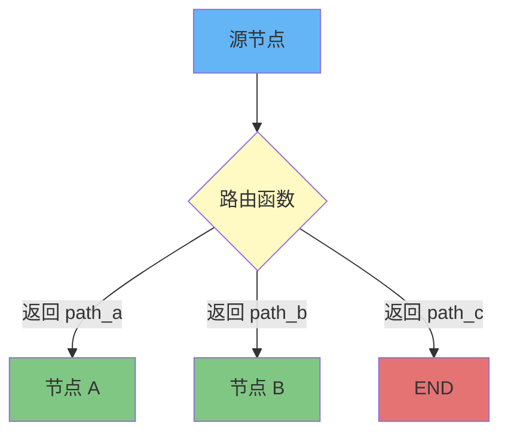
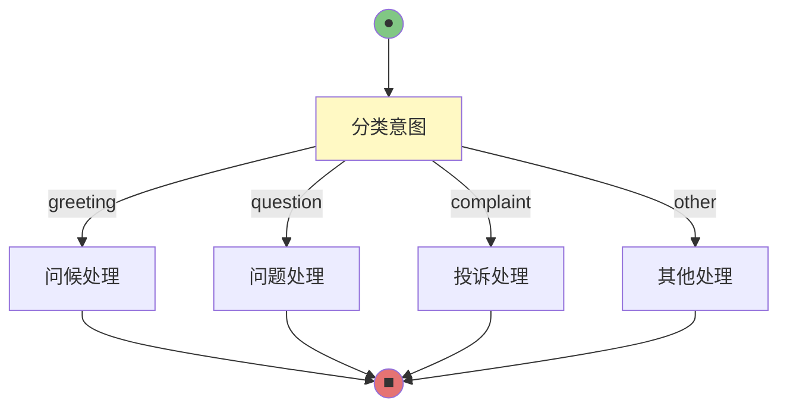
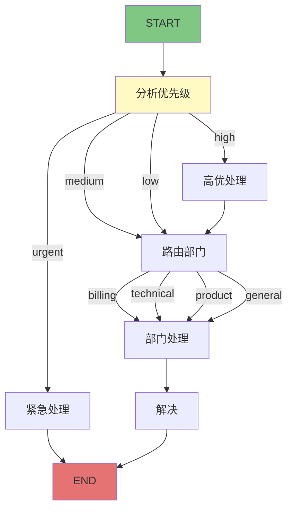

# 条件路由

## add_conditional_edges 基础

条件路由是 LangGraph 的核心特性之一，它允许根据运行时的状态动态选择执行路径，而不是预先固定的线性流程。

### 基本语法

```python
from langgraph.graph import StateGraph

builder = StateGraph(State)

# 添加条件边
builder.add_conditional_edges(
    source="source_node",           # 源节点
    conditional_edges=route_function,  # 路由函数
    conditional_edge_mapping={      # 路由映射
        "path_a": "node_a",
        "path_b": "node_b",
        "path_c": END,
    }
)
```

::: v-pre

:::

### 路由函数签名

路由函数接收当前状态，返回一个字符串（路径名称）：

```python
def route_function(state: State) -> str:
    """返回下一个要执行的路径名称"""
    if state["score"] > 80:
        return "high_score_path"
    elif state["score"] > 50:
        return "medium_score_path"
    else:
        return "low_score_path"
```

## 使用案例：分类路由

### 意图分类器

```python
from typing import TypedDict, Literal
from langgraph.graph import StateGraph, END

class State(TypedDict):
    user_input: str
    intent: str
    response: str

def classify_intent(state: State) -> Literal["greeting", "question", "complaint", "other"]:
    """根据用户输入分类意图"""
    input_lower = state["user_input"].lower()
    
    if any(word in input_lower for word in ["你好", "hello", "hi"]):
        return "greeting"
    elif "?" in state["user_input"] or "怎么" in input_lower:
        return "question"
    elif any(word in input_lower for word in ["投诉", "不满", "difficult"]):
        return "complaint"
    else:
        return "other"

def handle_greeting(state):
    return {"response": "您好！有什么可以帮助您的吗？"}

def handle_question(state):
    return {"response": "我来帮您解答这个问题..."}

def handle_complaint(state):
    return {"response": "很抱歉给您带来不便，我会为您转接客服..."}

def handle_other(state):
    return {"response": "我明白了，我会尽力帮助您。"}

# 构建图
builder = StateGraph(State)

# 添加处理节点
builder.add_node("classify", classify_intent)
builder.add_node("greeting", handle_greeting)
builder.add_node("question", handle_question)
builder.add_node("complaint", handle_complaint)
builder.add_node("other", handle_other)

# 设置入口
builder.set_entry_point("classify")

# 添加条件路由
builder.add_conditional_edges(
    source="classify",
    conditional_edges=classify_intent,
    conditional_edge_mapping={
        "greeting": "greeting",
        "question": "question",
        "complaint": "complaint",
        "other": "other",
    }
)

# 所有处理节点都流向 END
builder.add_edge("greeting", END)
builder.add_edge("question", END)
builder.add_edge("complaint", END)
builder.add_edge("other", END)

graph = builder.compile()
```

::: v-pre

:::

## 基于状态的条件分支

### 多条件判断

```python
from typing import TypedDict, Literal

class OrderState(TypedDict):
    order_status: str
    payment_status: str
    inventory_status: str
    next_step: str

def determine_next_step(state: OrderState) -> Literal[
    "confirm_payment",
    "wait_inventory",
    "ship_order",
    "cancel_order",
    "notify_customer"
]:
    """根据订单状态确定下一步"""
    
    # 优先级 1: 检查是否需要取消
    if state["payment_status"] == "failed" and state["inventory_status"] == "out_of_stock":
        return "cancel_order"
    
    # 优先级 2: 检查支付
    if state["payment_status"] == "pending":
        return "confirm_payment"
    
    # 优先级 3: 检查库存
    if state["inventory_status"] == "checking":
        return "wait_inventory"
    
    # 优先级 4: 准备发货
    if state["payment_status"] == "completed" and state["inventory_status"] == "available":
        return "ship_order"
    
    # 默认：通知客户
    return "notify_customer"

builder = StateGraph(OrderState)

builder.add_node("router", determine_next_step)
builder.add_node("confirm_payment", lambda s: {"next_step": "payment_confirmed"})
builder.add_node("wait_inventory", lambda s: {"next_step": "inventory_ready"})
builder.add_node("ship_order", lambda s: {"next_step": "shipped"})
builder.add_node("cancel_order", lambda s: {"next_step": "cancelled"})
builder.add_node("notify_customer", lambda s: {"next_step": "notified"})

builder.set_entry_point("router")

builder.add_conditional_edges(
    "router",
    determine_next_step,
    {
        "confirm_payment": "confirm_payment",
        "wait_inventory": "wait_inventory",
        "ship_order": "ship_order",
        "cancel_order": "cancel_order",
        "notify_customer": "notify_customer",
    }
)

# 所有节点完成后回到 router 或结束
for node in ["confirm_payment", "wait_inventory", "ship_order", "cancel_order", "notify_customer"]:
    builder.add_edge(node, END)
```

### 带 LLM 的条件路由

```python
from langchain_core.prompts import ChatPromptTemplate
from langchain_core.output_parsers import StrOutputParser

# 使用 LLM 进行分类
llm = ...  # 初始化的 LLM

router_prompt = ChatPromptTemplate.from_messages([
    ("system", "你是一个分类助手。将用户问题分类为：technical, billing, general"),
    ("user", "{input}")
])

def llm_router(state: State) -> str:
    """使用 LLM 进行智能路由"""
    chain = router_prompt | llm | StrOutputParser()
    category = chain.invoke({"input": state["user_input"]})
    
    # 标准化输出
    category_map = {
        "technical": "tech_support",
        "technology": "tech_support",
        "billing": "billing_support",
        "payment": "billing_support",
        "general": "general_support",
    }
    
    return category_map.get(category.lower(), "general_support")

builder.add_node("classify", llm_router)
builder.add_conditional_edges(
    "classify",
    llm_router,
    {
        "tech_support": "technical_node",
        "billing_support": "billing_node",
        "general_support": "general_node",
    }
)
```

## 多路分支与默认路径

### 处理未映射的路径

```python
def complex_router(state: State) -> str:
    """复杂路由逻辑"""
    # ... 分类逻辑
    return category

builder.add_conditional_edges(
    source="router",
    conditional_edges=complex_router,
    conditional_edge_mapping={
        "category_a": "handler_a",
        "category_b": "handler_b",
        "category_c": "handler_c",
        # 显式处理未知路径
        "__default__": "fallback_handler",  # 自定义默认处理
    }
)
```

::: tip 💡
LangGraph 本身不直接支持 `__default__` 路径，需要在路由函数内部处理兜底逻辑，或在 mapping 中包含所有可能的返回值。
:::

### 完整的默认路径示例

```python
from typing import TypedDict, Literal

class State(TypedDict):
    input: str
    category: str
    result: str

CATEGORIES = Literal["news", "weather", "sports", "unknown"]

def router(state: State) -> CATEGORIES:
    """路由函数：确保总是返回有效类别"""
    input_lower = state["input"].lower()
    
    if "新闻" in input_lower or "news" in input_lower:
        return "news"
    elif "天气" in input_lower or "weather" in input_lower:
        return "weather"
    elif "体育" in input_lower or "sports" in input_lower:
        return "sports"
    else:
        # 默认路径
        return "unknown"

builder = StateGraph(State)

builder.add_node("router", router)
builder.add_node("news_handler", lambda s: {"result": "新闻内容..."})
builder.add_node("weather_handler", lambda s: {"result": "天气信息..."})
builder.add_node("sports_handler", lambda s: {"result": "体育资讯..."})
builder.add_node("unknown_handler", lambda s: {"result": "我不太明白您的问题..."})

builder.set_entry_point("router")

builder.add_conditional_edges(
    "router",
    router,
    {
        "news": "news_handler",
        "weather": "weather_handler",
        "sports": "sports_handler",
        "unknown": "unknown_handler",  # 默认/兜底路径
    }
)

builder.add_edge("news_handler", END)
builder.add_edge("weather_handler", END)
builder.add_edge("sports_handler", END)
builder.add_edge("unknown_handler", END)
```

## 路由函数设计最佳实践

### 1. 使用 Literal 类型约束返回值

```python
from typing import Literal

# ✅ 推荐：明确的类型约束
RouteType = Literal["path_a", "path_b", "path_c", END]

def route(state: State) -> RouteType:
    ...

# ❌ 避免：返回任意字符串
def bad_route(state: State) -> str:
    return "any_string"  # 类型检查无法捕获错误
```

### 2. 路由函数保持纯净

```python
# ✅ 推荐：纯函数，无副作用
def pure_route(state: State) -> str:
    if state["score"] > 80:
        return "high"
    return "low"

# ❌ 避免：路由函数中调用外部 API
def bad_route(state: State) -> str:
    # 不应该在这里调用外部服务！
    result = call_external_api(state["id"])
    return result["category"]
```

### 3. 日志记录路由决策

```python
import logging

logger = logging.getLogger(__name__)

def logged_route(state: State) -> str:
    """带日志的路由函数"""
    decision = "path_a" if state["value"] > 50 else "path_b"
    logger.info(f"路由决策：{state['id']} -> {decision}")
    return decision
```

### 4. 处理边界情况

```python
def safe_route(state: State) -> str:
    """安全的路由函数，处理各种边界情况"""
    
    # 空状态处理
    if not state.get("data"):
        return "error_empty"
    
    # 异常值处理
    if state["value"] is None:
        return "invalid"
    
    # 正常路由
    if state["value"] > 100:
        return "high"
    elif state["value"] > 0:
        return "medium"
    else:
        return "low"
```

## 条件路由完整示例：智能客服

```python
from typing import TypedDict, Literal, Annotated, List
from langchain_core.messages import add_messages, HumanMessage, AIMessage

class CustomerServiceState(TypedDict):
    messages: Annotated[List[dict], add_messages]
    priority: Literal["low", "medium", "high", "urgent"]
    department: str
    resolved: bool

def analyze_priority(state: CustomerServiceState) -> Literal["low", "medium", "high", "urgent"]:
    """分析问题优先级"""
    last_msg = state["messages"][-1]["content"].lower()
    
    urgent_keywords = ["紧急", "urgent", "立即", "immediately", "投诉", "complaint"]
    high_keywords = ["重要", "important", "尽快", "asap"]
    
    if any(kw in last_msg for kw in urgent_keywords):
        return "urgent"
    elif any(kw in last_msg for kw in high_keywords):
        return "high"
    elif "?" in last_msg:
        return "medium"
    else:
        return "low"

def route_to_department(state: CustomerServiceState) -> str:
    """根据问题类型路由到对应部门"""
    msg = state["messages"][-1]["content"].lower()
    
    if any(kw in msg for kw in ["账单", "billing", "付款", "payment"]):
        return "billing"
    elif any(kw in msg for kw in ["技术", "technical", "bug", "错误"]):
        return "technical"
    elif any(kw in msg for kw in ["产品", "product", "功能", "feature"]):
        return "product"
    else:
        return "general"

def urgent_handler(state):
    """紧急问题处理"""
    return {"messages": [AIMessage(content="检测到紧急问题，正在为您转接高级客服...")]}

def high_handler(state):
    """高优先级处理"""
    return {"messages": [AIMessage(content="收到您的高优先级请求...")]}

def normal_handler(state):
    """正常优先级处理"""
    return {"messages": [AIMessage(content="感谢您的咨询...")]}

def department_handler(state):
    """部门专业处理"""
    dept = state["department"]
    if dept == "billing":
        return {"messages": [AIMessage(content="账单部门为您服务...")]}
    elif dept == "technical":
        return {"messages": [AIMessage(content="技术部门为您服务...")]}
    else:
        return {"messages": [AIMessage(content="客服为您服务...")]}

def resolve(state):
    return {"resolved": True, "messages": [AIMessage(content="问题已解决！")]}

# 构建智能客服图
builder = StateGraph(CustomerServiceState)

builder.add_node("analyze_priority", analyze_priority)
builder.add_node("route_dept", route_to_department)
builder.add_node("urgent", urgent_handler)
builder.add_node("high", high_handler)
builder.add_node("normal", normal_handler)
builder.add_node("dept", department_handler)
builder.add_node("resolve", resolve)

# 优先级路由
builder.set_entry_point("analyze_priority")
builder.add_conditional_edges(
    "analyze_priority",
    lambda s: analyze_priority(s),
    {
        "urgent": "urgent",
        "high": "high",
        "medium": "route_dept",
        "low": "route_dept",
    }
)

# 部门路由
builder.add_conditional_edges(
    "route_dept",
    lambda s: route_to_department(s),
    {
        "billing": "dept",
        "technical": "dept",
        "product": "dept",
        "general": "dept",
    }
)

# 汇聚和结束
builder.add_edge("urgent", END)
builder.add_edge("high", "route_dept")
builder.add_edge("dept", "resolve")
builder.add_edge("resolve", END)

graph = builder.compile()
```

::: v-pre

:::

## 💡 提示

> **路由函数应该快速**：路由函数在每次节点执行后都会调用，避免在其中进行耗时操作（如网络请求、复杂计算）。

> **使用类型约束**：用 `Literal` 明确定义所有可能的路由路径，这有助于 IDE 自动补全和类型检查。

> **处理所有分支**：确保路由函数的所有可能返回值都在 `conditional_edge_mapping` 中有对应项，避免运行时错误。

## 总结

条件路由让 LangGraph 具备强大的流程控制能力：

1. **动态决策**：根据运行时状态选择执行路径
2. **多路分支**：支持复杂的多条件判断
3. **默认路径**：兜底处理未知情况
4. **类型安全**：使用 Literal 约束路由返回值

掌握条件路由后，你可以构建真正智能的、自适应的 LLM 应用流程。