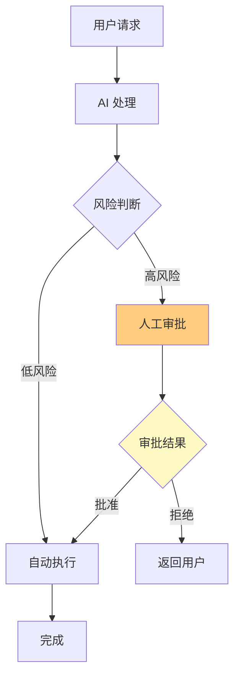
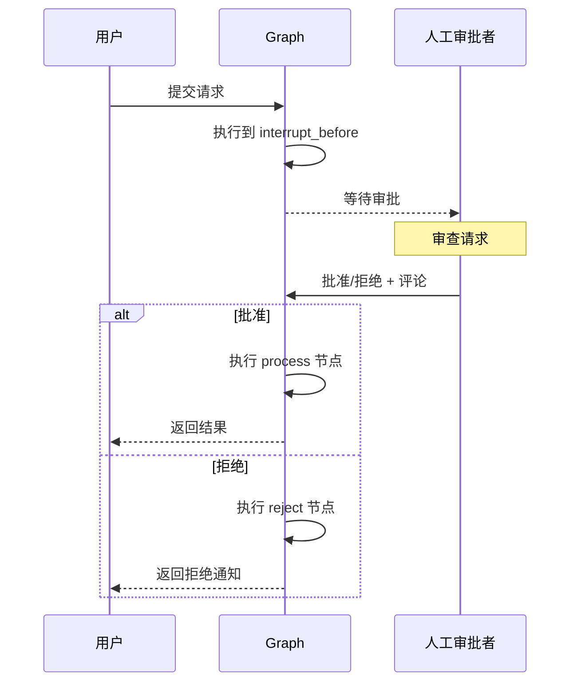
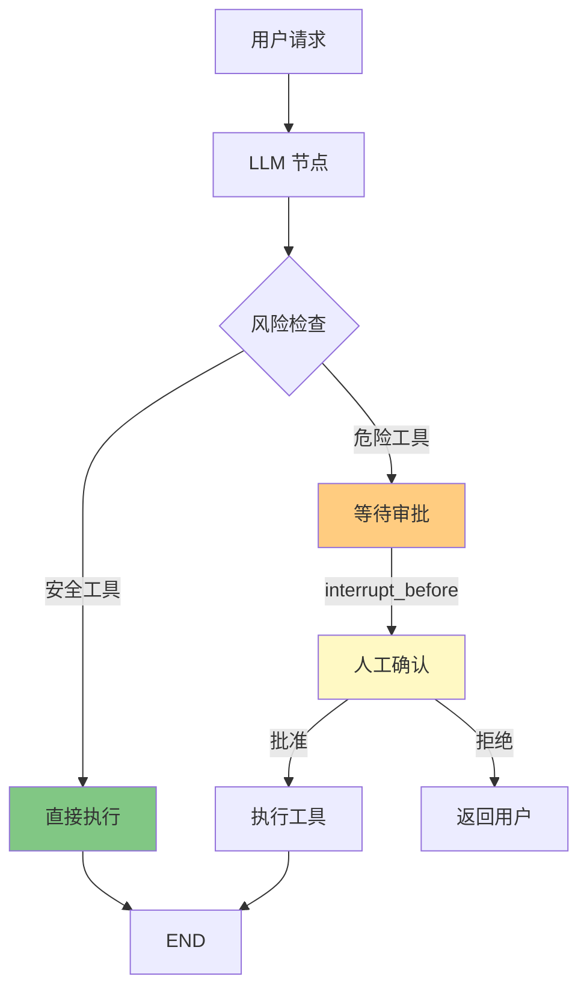
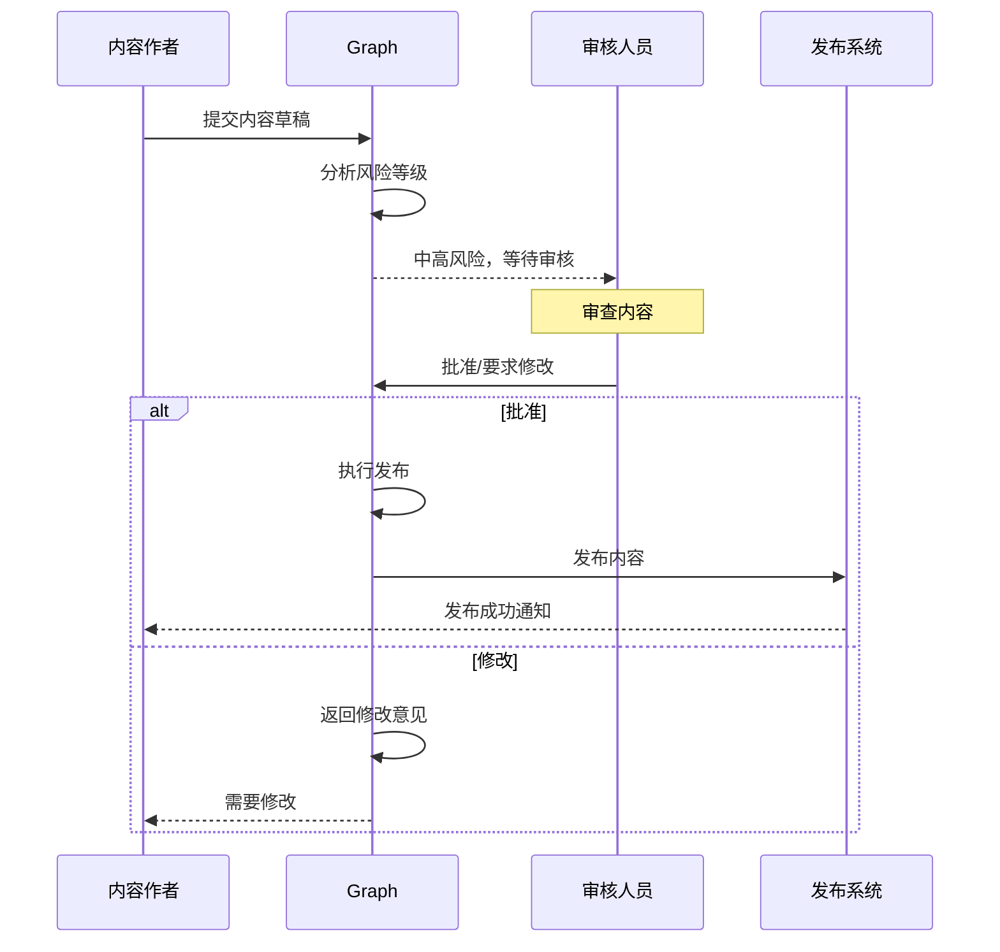

# 人机协同

## Human-in-the-Loop 概念

**人机协同（Human-in-the-Loop）** 是指在自动化流程中引入人工干预点，让人类在关键时刻参与决策、审批或修正。这对于构建可靠的企业级 LLM 应用至关重要。

### 为什么需要人机协同？

| 场景 | 风险 | 人机协同方案 |
|------|------|--------------|
| 金融交易 | 错误转账造成损失 | 大额交易前人工审批 |
| 医疗建议 | 错误诊断危害健康 | 医生审核 AI 建议 |
| 内容发布 | 不当内容损害品牌 | 编辑审核后再发布 |
| 代码部署 | Bug 导致生产事故 | 人工 Code Review |
| 客服升级 | 复杂问题 AI 无法处理 | 转接人工客服 |

::: v-pre

:::

## interrupt_before 与 interrupt_after

LangGraph 提供两种打断机制：

### interrupt_before（执行前打断）

在节点**执行之前**暂停，等待人工确认后再继续。

```python
from langgraph.graph import StateGraph

builder = StateGraph(State)

builder.add_node("draft_email", draft_function)
builder.add_node("send_email", send_function)

# 在 send_email 执行前打断
builder.add_edge("draft_email", "send_email")

graph = builder.compile(
    interrupt_before=["send_email"]  # 在执行 send_email 前暂停
)

# 运行到打断点
result = graph.invoke({"input": "给客户写一封邮件"})
# 此时状态停在 send_email 之前

# 人工确认后可以继续
result = graph.invoke(None, config={"configurable": {"thread_id": "123"}})
# 从打断点继续执行
```

### interrupt_after（执行后打断）

在节点**执行之后**暂停，允许人工检查结果后再决定是否继续。

```python
graph = builder.compile(
    interrupt_after=["generate_report"]  # 在 generate_report 执行后暂停
)

# 运行后会停在 generate_report 完成时
# 可以检查生成的报告，决定是否继续
```

### 两种打断的对比

| 特性 | interrupt_before | interrupt_after |
|------|------------------|-----------------|
| 打断时机 | 节点执行前 | 节点执行后 |
| 适用场景 | 审批危险操作 | 审核生成内容 |
| 状态隔离 | 节点未执行 | 节点已执行 |
| 回滚成本 | 低 | 高（需要撤销节点操作） |

::: tip 💡
**选择建议**：如果操作不可逆（如发送邮件、执行交易），使用 `interrupt_before`；如果是内容生成（如报告、文案），使用 `interrupt_after` 便于审核修改。
:::

## 审批流程实现

### 简单的二元审批

```python
from typing import TypedDict, Literal
from langgraph.graph import StateGraph, END

class ApprovalState(TypedDict):
    request: str
    amount: float
    status: Literal["pending", "approved", "rejected"]
    approver_comment: str

def review_request(state: ApprovalState):
    """审查请求（需要人工介入）"""
    # 这个节点会触发 interrupt_before
    # 人工可以在这里 approve 或 reject
    return {}

def process_approved(state: ApprovalState):
    """处理已批准的请求"""
    return {"status": "approved", "result": f"处理：{state['request']}"}

def handle_rejected(state: ApprovalState):
    """处理被拒绝的请求"""
    return {"status": "rejected", "result": "请求已拒绝"}

builder = StateGraph(ApprovalState)

builder.add_node("review", review_request)
builder.add_node("process", process_approved)
builder.add_node("reject", handle_rejected)

builder.set_entry_point("review")
builder.add_edge("review", "process")
builder.add_edge("process", END)
builder.add_edge("reject", END)

# 在 review 节点前打断，等待人工审批
graph = builder.compile(interrupt_before=["review"])

# 使用示例
# 1. 提交请求
thread_config = {"configurable": {"thread_id": "approval-001"}}
result = graph.invoke({
    "request": "采购办公设备的申请",
    "amount": 50000,
    "status": "pending",
    "approver_comment": ""
}, config=thread_config)

# 2. 此时流程暂停在 review 节点前
# 人工审查后，设置状态并继续
graph.update_state(thread_config, {
    "status": "approved",  # 或 "rejected"
    "approver_comment": "同意采购"
})

# 3. 继续执行
result = graph.invoke(None, config=thread_config)
```

::: v-pre

:::

## 工具调用前的人工确认

这是人机协同最常见的场景：在 AI 调用敏感工具（如发送邮件、执行交易、删除数据）前，要求人工确认。

### 完整示例：安全工具调用

```python
from typing import TypedDict, Annotated, List, Literal
from langchain_core.messages import HumanMessage, AIMessage, ToolMessage, add_messages
from langchain_core.tools import tool

class ToolCallState(TypedDict):
    messages: Annotated[List[dict], add_messages]
    tool_calls: List[dict]
    pending_tool_call: dict
    approval_status: Literal["pending", "approved", "rejected"]

@tool
def send_email(to: str, subject: str, body: str):
    """发送邮件"""
    return f"邮件已发送到 {to}"

@tool
def delete_record(record_id: str):
    """删除记录（危险操作）"""
    return f"记录 {record_id} 已删除"

@tool
def query_database(query: str):
    """查询数据库（安全操作）"""
    return f"查询结果：{query}"

def llm_node(state: ToolCallState):
    """LLM 决定调用什么工具"""
    # 简化：实际应调用 LLM
    messages = state["messages"]
    
    # 模拟 LLM 返回工具调用
    if "邮件" in str(messages):
        return {
            "pending_tool_call": {
                "name": "send_email",
                "args": {"to": "user@example.com", "subject": "Hello", "body": "Hi"}
            }
        }
    elif "删除" in str(messages):
        return {
            "pending_tool_call": {
                "name": "delete_record",
                "args": {"record_id": "123"}
            }
        }
    else:
        return {
            "pending_tool_call": {
                "name": "query_database",
                "args": {"query": "SELECT * FROM users"}
            }
        }

def check_tool_risk(state: ToolCallState) -> Literal["safe", "requires_approval"]:
    """检查工具是否需要审批"""
    pending = state.get("pending_tool_call", {})
    risky_tools = ["send_email", "delete_record", "transfer_money"]
    
    if pending.get("name") in risky_tools:
        return "requires_approval"
    return "safe"

def execute_tool(state: ToolCallState):
    """执行工具调用"""
    pending = state["pending_tool_call"]
    # 模拟执行
    return {
        "messages": [{"role": "tool", "content": f"已执行：{pending['name']}"}],
        "pending_tool_call": None
    }

def execute_safe_tool(state: ToolCallState):
    """直接执行安全工具"""
    return execute_tool(state)

# 构建图
builder = StateGraph(ToolCallState)

builder.add_node("llm", llm_node)
builder.add_node("execute", execute_tool)
builder.add_node("execute_safe", execute_safe_tool)

builder.set_entry_point("llm")
builder.add_edge("llm", "check_risk")

# 条件路由：根据风险等级选择路径
builder.add_conditional_edges(
    "llm",
    check_tool_risk,
    {
        "safe": "execute_safe",
        "requires_approval": "execute",  # 会触发 interrupt_before
    }
)

builder.add_edge("execute_safe", END)
builder.add_edge("execute", END)

# 在危险工具执行前打断
graph = builder.compile(interrupt_before=["execute"])

# === 使用流程 ===

# 1. 用户请求
config = {"configurable": {"thread_id": "tool-call-001"}}
result = graph.invoke({
    "messages": [{"role": "user", "content": "删除记录 123"}],
    "tool_calls": [],
    "pending_tool_call": {},
    "approval_status": "pending"
}, config=config)

# 2. 此时暂停，等待人工确认 pending_tool_call
print(f"待确认的工具调用：{result['pending_tool_call']}")

# 3. 人工确认后继续
graph.update_state(config, {"approval_status": "approved"})
result = graph.invoke(None, config=config)
```

::: v-pre

:::

## 状态检查与修改

在打断期间，人工可以检查和修改状态，然后再继续执行。

### 检查当前状态

```python
from langgraph.graph import StateGraph

graph = builder.compile(interrupt_before=["sensitive_op"])

# 运行到打断点
config = {"configurable": {"thread_id": "check-001"}}
graph.invoke(initial_state, config=config)

# 获取当前状态
current_state = graph.get_state(config)
print(f"当前状态：{current_state.values}")
print(f"下一个节点：{current_state.next}")  # 查看将要执行的节点
```

### 修改状态后继续

```python
# 查看状态
state = graph.get_state(config)
print(f"待发送邮件：{state.values['email_draft']}")

# 人工修改内容
graph.update_state(config, {
    "email_draft": "修改后的邮件内容...",
    "recipient": "corrected@example.com"
})

# 从打断点继续
result = graph.invoke(None, config=config)
```

### 状态版本历史

```python
# 获取状态历史（用于审计）
history = graph.get_state_history(config)

for snapshot in history:
    print(f"时间：{snapshot.created_at}")
    print(f"状态：{snapshot.values}")
    print("---")
```

## 完整示例：内容发布审批流

```python
from typing import TypedDict, Annotated, List, Literal
from langchain_core.messages import add_messages
from datetime import datetime

class ContentPublishState(TypedDict):
    content_type: Literal["article", "social_post", "announcement"]
    draft: str
    target_audience: str
    risk_level: Literal["low", "medium", "high"]
    approval_status: Literal["pending", "approved", "rejected", "needs_revision"]
    reviewer_comments: str
    publish_time: str
    messages: Annotated[List[dict], add_messages]

def analyze_risk(state: ContentPublishState) -> Literal["low", "medium", "high"]:
    """分析内容风险等级"""
    draft = state["draft"].lower()
    
    # 敏感词检测（简化示例）
    high_risk_words = ["机密", "confidential", "内部", "internal"]
    medium_risk_words = ["即将发布", "预告", "preview"]
    
    if any(w in draft for w in high_risk_words):
        return "high"
    elif any(w in draft for w in medium_risk_words):
        return "medium"
    return "low"

def auto_publish_low_risk(state):
    """低风险内容自动发布"""
    return {
        "approval_status": "approved",
        "messages": [{"role": "assistant", "content": "低风险内容，已自动发布"}]
    }

def prepare_for_review(state):
    """准备人工审核"""
    return {
        "messages": [{
            "role": "assistant",
            "content": f"内容风险等级：{state['risk_level']}，等待人工审核"
        }]
    }

def publish_content(state):
    """正式发布内容"""
    return {
        "messages": [{
            "role": "assistant",
            "content": f"内容已发布，目标受众：{state['target_audience']}"
        }],
        "publish_time": datetime.now().isoformat()
    }

def request_revision(state):
    """请求修改"""
    return {
        "approval_status": "needs_revision",
        "messages": [{"role": "assistant", "content": "需要修改后重新提交"}]
    }

# 构建内容发布流程
builder = StateGraph(ContentPublishState)

builder.add_node("analyze", analyze_risk)
builder.add_node("auto_publish", auto_publish_low_risk)
builder.add_node("prepare_review", prepare_for_review)
builder.add_node("publish", publish_content)
builder.add_node("revision", request_revision)

builder.set_entry_point("analyze")

# 根据风险等级路由
builder.add_conditional_edges(
    "analyze",
    lambda s: s["risk_level"],
    {
        "low": "auto_publish",
        "medium": "prepare_review",
        "high": "prepare_review",
    }
)

builder.add_edge("auto_publish", END)

# 中高风险需要人工审批
builder.add_edge("prepare_review", "publish")

# 在发布前打断，等待审批
graph = builder.compile(interrupt_before=["publish"])

# === 使用示例 ===

# 提交内容
config = {"configurable": {"thread_id": "content-001"}}
result = graph.invoke({
    "content_type": "announcement",
    "draft": "公司即将发布重要产品...",
    "target_audience": "all_employees",
    "risk_level": "high",
    "approval_status": "pending",
    "reviewer_comments": "",
    "publish_time": "",
    "messages": []
}, config=config)

# 此时暂停，等待审核人员审查
# 审核人员可以：
# 1. 查看 draft 内容
# 2. 添加 reviewer_comments
# 3. 决定 approve 或 reject

# 批准后继续
graph.update_state(config, {"approval_status": "approved"})
result = graph.invoke(None, config=config)
```

::: v-pre

:::

## 💡 提示

> **明确打断点**：在编译时使用描述性的节点名称作为 `interrupt_before` 参数，这让人一眼就能理解在哪里需要人工介入。

> **提供足够上下文**：在需要审批的节点前，确保状态中包含所有必要的信息（如操作详情、风险评估、影响范围），帮助审批者做出正确决策。

> **记录审批历史**：每次审批决定都应记录到状态中，便于后续审计和追溯。

## 总结

人机协同是企业级 LLM 应用的关键特性：

1. **interrupt_before/after**：在合适的时机引入人工干预
2. **状态检查与修改**：允许人工审查和修正
3. **工具调用审批**：确保敏感操作的安全性
4. **审批流程**：构建完整的审批链路

通过人机协同，你可以在享受 AI 自动化的同时，保持对关键决策的控制。