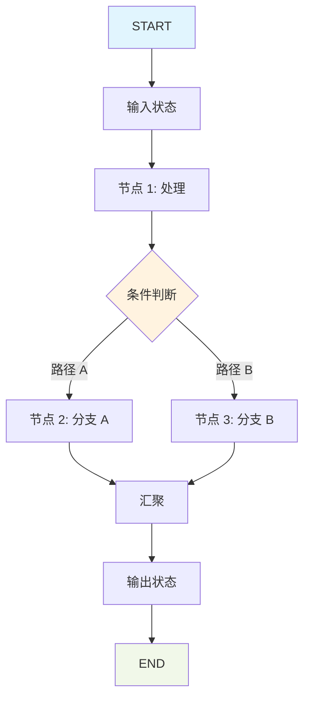
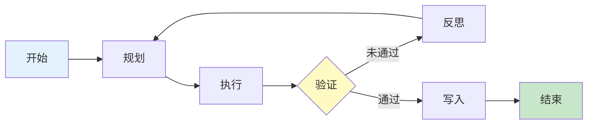
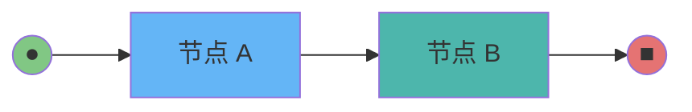
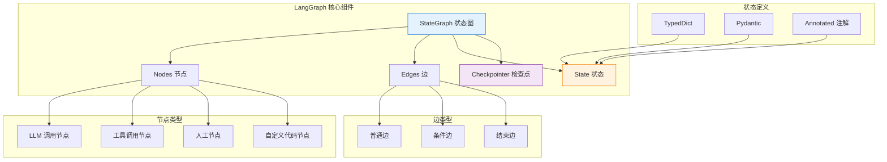

# LangGraph 基础

## LangGraph 是什么

LangGraph 是一个基于图的状态机框架，专门用于构建**有状态的多参与者 LLM 应用**。它是 LangChain 生态系统的重要组成部分，为复杂的 Agent 工作流提供了结构化的编排能力。

### 核心理念

LangGraph 将 LLM 应用建模为一个**状态图（State Graph）**：

- **节点（Nodes）**：执行具体操作的函数（如调用 LLM、调用工具、处理数据）
- **边（Edges）**：定义节点之间的执行流程和状态流转
- **状态（State）**：在整个图执行过程中累积和传递的数据

::: v-pre

:::

## 为什么需要 LangGraph

### 传统 Chain 的局限性

LangChain 的 SequentialChain 和 RouterChain 适合线性流程，但在处理复杂 Agent 场景时存在明显不足：

| 特性 | LangChain Chain | LangGraph |
|------|-----------------|-----------|
| 循环支持 | ❌ 不支持 | ✅ 原生支持 |
| 分支逻辑 | ⚠️ 有限的 Router | ✅ 灵活的条件路由 |
| 状态管理 | 隐式传递 | 显式 TypedDict/Pydantic |
| 人机协同 | ❌ 难以实现 | ✅ interrupt_before/after |
| 多 Agent 协作 | ❌ 困难 | ✅ 原生支持 |
| 可调试性 | 低 | 高（可视化图结构） |

### LangGraph 解决的三大核心问题

#### 1. Agent 中的循环与分支

现实世界的 Agent 任务往往不是线性的。例如，一个研究助手可能需要：
- 多次搜索 → 分析 → 再搜索的循环
- 根据中间结果决定下一步行动
- 在某些条件下重试或回退

::: v-pre

:::

#### 2. 状态管理

在多轮对话或多步骤任务中，状态需要：
- 在节点间累积（如消息历史）
- 保持不可变性（便于调试和回滚）
- 支持结构化更新（而非简单覆盖）

#### 3. 人机协同

企业级应用经常需要人工审批：
- 工具调用前的人工确认
- 关键决策点的打断与审查
- 状态检查与手动修改

## LangGraph vs LangChain Agent 的本质区别

### 架构对比

**LangChain Agent（ReAct 模式）**：
```
用户输入 → AgentExecutor → [LLM 思考 → 工具调用 → LLM 观察] × N → 最终回答
```
这是一个**黑盒循环**，内部逻辑由 LLM 决定，开发者控制力弱。

**LangGraph StateGraph**：
```
用户输入 → StateGraph → [节点 A → 条件路由 → 节点 B → ...] → 最终输出
```
这是一个**白盒图**，每个节点、每条边都显式定义，完全可控。

### 代码对比

**LangChain Agent 示例**：
```python
from langchain.agents import AgentExecutor, create_react_agent

# 黑盒：内部循环逻辑不透明
agent = create_react_agent(llm, tools, prompt)
executor = AgentExecutor(agent=agent, tools=tools)
response = executor.invoke({"input": "用户问题"})
```

**LangGraph 示例**：
```python
from langgraph.graph import StateGraph, END
from typing import TypedDict, Annotated
from langchain_core.messages import add_messages

class State(TypedDict):
    messages: Annotated[list, add_messages]

graph = StateGraph(State)
graph.add_node("agent", call_agent)
graph.add_node("tools", call_tools)
graph.add_edge("agent", "tools")
graph.add_edge("tools", "agent")
graph.set_entry_point("agent")
app = graph.compile()
```

### 何时选择 LangGraph

| 场景 | 推荐方案 |
|------|----------|
| 简单问答 | LangChain Chain |
| 单次工具调用 | LangChain Agent |
| 多轮工具调用 + 循环 | ✅ LangGraph |
| 多 Agent 协作 | ✅ LangGraph |
| 需要人工审批 | ✅ LangGraph |
| 复杂状态管理 | ✅ LangGraph |
| 需要调试和可视化 | ✅ LangGraph |

## 安装与第一个 StateGraph

### 安装

```bash
pip install langgraph langchain-core langchain-openai
```

### Hello World：一个简单的状态图

让我们创建一个最简单的 StateGraph，它接受用户输入，经过一个处理节点，然后输出：

```python
from typing import TypedDict
from langgraph.graph import StateGraph, END

# 1. 定义状态
class State(TypedDict):
    input: str
    output: str

# 2. 定义节点函数
def process_node(state: State) -> State:
    """处理节点：将输入转换为大写"""
    return {"output": state["input"].upper()}

# 3. 创建图
graph = StateGraph(State)

# 4. 添加节点
graph.add_node("processor", process_node)

# 5. 设置入口点
graph.set_entry_point("processor")

# 6. 添加边到结束
graph.add_edge("processor", END)

# 7. 编译
app = graph.compile()

# 8. 运行
result = app.invoke({"input": "hello langgraph"})
print(result)  # {'input': 'hello langgraph', 'output': 'HELLO LANGGRAPH'}
```

### 状态累积示例

更实际的例子：消息累积图

```python
from typing import TypedDict, Annotated, List
from langchain_core.messages import BaseMessage, add_messages

class State(TypedDict):
    messages: Annotated[List[BaseMessage], add_messages]

def node_a(state: State):
    return {"messages": [("user", "来自节点 A 的消息")]}

def node_b(state: State):
    return {"messages": [("assistant", "来自节点 B 的回复")]}

graph = StateGraph(State)
graph.add_node("A", node_a)
graph.add_node("B", node_b)
graph.add_edge("A", "B")
graph.set_entry_point("A")
graph.add_edge("B", END)

app = graph.compile()
result = app.invoke({"messages": []})
print(result["messages"])  # 累积了两条消息
```

::: v-pre

:::

## LangGraph 核心架构图

::: v-pre

:::

## 💡 提示

> **从简单开始**：不要一开始就设计复杂的图。先创建一个能运行的最小 StateGraph，然后逐步添加节点和边。

> **状态设计是关键**：花时间在 State 的定义上。好的状态设计能让后续的节点和边逻辑变得简单。使用 TypedDict 或 Pydantic 来保证类型安全。

> **可视化你的图**：使用 `app.get_graph().draw_mermaid()` 来可视化你的图结构，这有助于理解流程和调试问题。

## 总结

LangGraph 是构建复杂 LLM 应用的强大工具：

1. **基于图的状态机**：提供清晰的控制流和状态管理
2. **解决 LangChain 的局限**：支持循环、复杂分支、人机协同
3. **完全可控**：每个节点、每条边都显式定义
4. **可调试可维护**：图结构清晰，便于理解和修改

在后续章节中，我们将深入探讨：
- 状态图的详细定义
- 节点与边的使用
- 条件路由
- 人机协同
- 多 Agent 协作
- 持久化与子图

现在你已经掌握了 LangGraph 的基础知识，让我们继续深入！