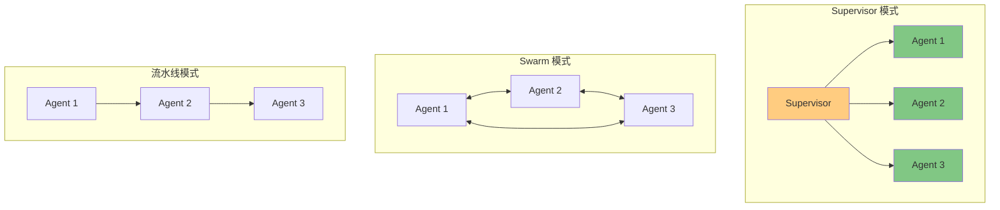
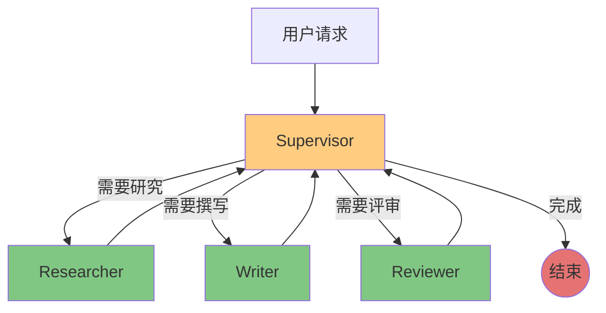
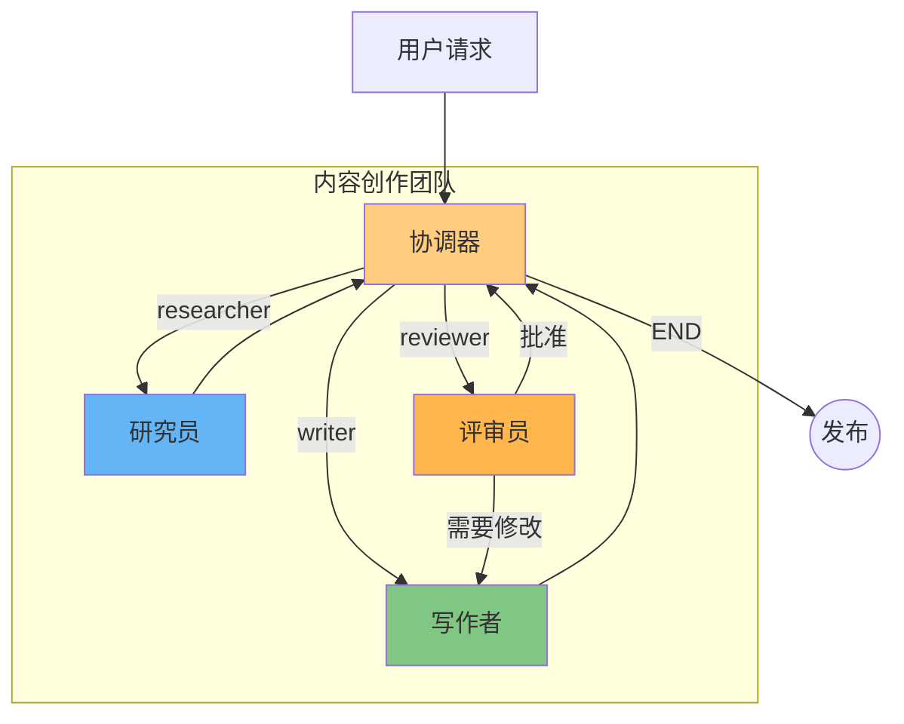

# 多 Agent 协作

## Multi-Agent 协作架构

复杂任务往往需要多个专业 Agent 协同完成。LangGraph 提供了强大的多 Agent 编排能力，支持多种协作模式。

### 为什么需要多 Agent？

| 场景 | 单 Agent 问题 | 多 Agent 方案 |
|------|-------------|-------------|
| 研究写作 | 角色混淆，质量不稳定 | Researcher + Writer 分离 |
| 代码开发 | 缺乏评审，容易出错 | Developer + Reviewer |
| 客服系统 | 通用回答，不够专业 | 按领域路由到专家 Agent |
| 数据分析 | 分析角度单一 | 分析师 + 可视化专家 |

### 多 Agent 架构模式

::: v-pre

:::

## Supervisor 模式

**Supervisor（监督者）模式**：一个中心化的 Agent 负责协调和分配任务给其他专业 Agent。

### Supervisor 架构

```
用户请求 → Supervisor → 分析任务 → 分配给合适的 Worker Agent
                              ↓
                         收集结果 → 整合输出
```

### 完整实现

```python
from typing import TypedDict, Annotated, List, Literal
from langchain_core.messages import HumanMessage, AIMessage, add_messages
from langgraph.graph import StateGraph, END

# 定义共享状态
class TeamState(TypedDict):
    messages: Annotated[List[dict], add_messages]
    next: str  # Supervisor 决定下一个执行的 Agent
    result: str

# Worker Agent 1: 研究员
def researcher(state: TeamState):
    """负责信息搜集和研究"""
    msg = state["messages"][-1]["content"]
    research_result = f"[Research] 研究了：{msg}"
    return {"messages": [AIMessage(content=research_result)], "next": "supervisor"}

# Worker Agent 2: 写作者
def writer(state: TeamState):
    """负责内容撰写"""
    msg = state["messages"][-1]["content"]
    written_content = f"[Writer] 撰写内容：{msg}"
    return {"messages": [AIMessage(content=written_content)], "next": "supervisor"}

# Worker Agent 3: 评审员
def reviewer(state: TeamState):
    """负责质量评审"""
    msg = state["messages"][-1]["content"]
    review_result = f"[Reviewer] 评审意见：{msg}"
    return {"messages": [AIMessage(content=review_result)], "next": "supervisor"}

# Supervisor: 决策下一个 Agent
def supervisor(state: TeamState) -> Literal["researcher", "writer", "reviewer", "END"]:
    """根据对话历史决定下一个执行哪个 Agent"""
    messages = state["messages"]
    
    if len(messages) < 2:
        return "researcher"  # 首先需要研究
    
    last_msg = messages[-1]["content"].lower()
    
    # 简单的路由逻辑（实际应该用 LLM）
    if "研究" in last_msg or "research" in last_msg or len(messages) == 2:
        return "researcher"
    elif "写" in last_msg or "write" in last_msg:
        return "writer"
    elif "评审" in last_msg or "review" in last_msg:
        return "reviewer"
    elif "完成" in last_msg or "done" in last_msg:
        return "END"
    else:
        return "writer"

# 构建多 Agent 系统
builder = StateGraph(TeamState)

# 添加所有 Agent 节点
builder.add_node("researcher", researcher)
builder.add_node("writer", writer)
builder.add_node("reviewer", reviewer)
builder.add_node("supervisor", lambda s: {"next": supervisor(s)})

# 设置入口为 supervisor
builder.set_entry_point("supervisor")

# Supervisor 根据条件路由到不同的 Worker
builder.add_conditional_edges(
    "supervisor",
    lambda x: x["next"],
    {
        "researcher": "researcher",
        "writer": "writer",
        "reviewer": "reviewer",
        "END": END,
    }
)

# 所有 Worker 完成后回到 Supervisor
builder.add_edge("researcher", "supervisor")
builder.add_edge("writer", "supervisor")
builder.add_edge("reviewer", "supervisor")

graph = builder.compile()

# 运行
result = graph.invoke({
    "messages": [{"role": "user", "content": "帮我写一篇关于 AI 的文章"}],
    "next": "",
    "result": ""
})

print(result["messages"])
```

::: v-pre

:::

## Swarm 模式

**Swarm（群体）模式**：多个平等的 Agent 相互协作，没有中心化控制，通过局部交互达成全局目标。

### Swarm 架构特点

- 去中心化：没有单一的 Supervisor
- 自组织：Agent 自主决定何时参与
- 弹性：单个 Agent 失效不影响整体
- 涌现：整体行为超越个体能力之和

### Swarm 实现示例

```python
from typing import TypedDict, Annotated, List, Literal
from langchain_core.messages import add_messages, AIMessage

class SwarmState(TypedDict):
    messages: Annotated[List[dict], add_messages]
    current_agent: str
    task_status: Literal["ongoing", "completed"]

# Agent 1: 创意生成者
def creative_agent(state: SwarmState):
    content = state["messages"][-1]["content"]
    if "创意" in content or "idea" in content.lower():
        return {
            "messages": [AIMessage(content="[创意] 我有一个想法...")],
            "current_agent": "refiner"  # 传递给细化 Agent
        }
    return {"current_agent": "researcher"}

# Agent 2: 研究支持
def researcher_agent(state: SwarmState):
    content = state["messages"][-1]["content"]
    return {
        "messages": [AIMessage(content="[研究] 找到了相关资料...")],
        "current_agent": "creative_agent"  # 传递回创意 Agent
    }

# Agent 3: 内容细化
def refiner_agent(state: SwarmState):
    content = state["messages"][-1]["content"]
    # 判断是否完成
    if len([m for m in state["messages"] if m["role"] == "assistant"]) >= 5:
        return {
            "messages": [AIMessage(content="[细化] 内容已完善，可以提交了")],
            "task_status": "completed",
            "current_agent": "END"
        }
    return {
        "messages": [AIMessage(content="[细化] 让我进一步完善...")],
        "current_agent": "creative_agent"
    }

# 路由决策
def swarm_router(state: SwarmState) -> str:
    """根据当前 Agent 决定下一个"""
    current = state.get("current_agent", "creative_agent")
    return current

builder = StateGraph(SwarmState)

builder.add_node("creative_agent", creative_agent)
builder.add_node("researcher_agent", researcher_agent)
builder.add_node("refiner_agent", refiner_agent)

builder.set_entry_point("creative_agent")

# 动态路由
builder.add_conditional_edges(
    "creative_agent",
    lambda s: creative_agent(s)["current_agent"],
    {
        "refiner": "refiner_agent",
        "researcher": "researcher_agent",
        "creative_agent": "creative_agent",
    }
)

builder.add_conditional_edges(
    "researcher_agent",
    lambda s: researcher_agent(s)["current_agent"],
    {
        "creative_agent": "creative_agent",
    }
)

builder.add_conditional_edges(
    "refiner_agent",
    lambda s: refiner_agent(s)["current_agent"],
    {
        "creative_agent": "creative_agent",
        "END": END,
    }
)

graph = builder.compile()
```

## Agent 间通信与状态共享

在多 Agent 系统中，Agent 之间需要通过共享状态进行通信。

### 共享状态设计

```python
from typing import TypedDict, Annotated, List, Any
from operator import add
from langchain_core.messages import add_messages

class SharedState(TypedDict):
    # 消息历史（所有 Agent 可见）
    messages: Annotated[List[dict], add_messages]
    
    # 任务队列（FIFO）
    task_queue: Annotated[List[str], add]
    
    # 共享知识库
    knowledge_base: Annotated[dict, lambda a, b: {**a, **b}]
    
    # 协作日志
    collaboration_log: Annotated[List[str], add]
    
    # 当前工作项
    current_task: str
    
    # Agent 状态
    agent_states: dict  # {"agent_name": "idle"|"working"|"done"}
```

### Agent 间传递信息的模式

```python
# 模式 1: 通过消息历史传递
def agent_a(state: SharedState):
    return {
        "messages": [AIMessage(content="给 Agent B 的信息...")]
    }

def agent_b(state: SharedState):
    # 读取 Agent A 的消息
    last_msg = state["messages"][-1]
    # 处理信息
    pass

# 模式 2: 通过专用字段传递
def agent_a(state: SharedState):
    return {
        "handoff_data": {"type": "research", "content": "..."}
    }

def agent_b(state: SharedState):
    handoff = state.get("handoff_data", {})
    # 处理交接数据
    pass

# 模式 3: 通过任务队列传递
def coordinator(state: SharedState):
    return {
        "task_queue": ["task_1:research", "task_2:write"]
    }

def worker(state: SharedState):
    if state["task_queue"]:
        task = state["task_queue"][0]
        # 执行任务
        pass
```

## 完整的多 Agent 示例：Researcher + Writer + Reviewer

这是一个实用的多 Agent 系统，用于高质量内容生成。

```python
from typing import TypedDict, Annotated, List, Literal
from langchain_core.messages import HumanMessage, AIMessage, add_messages
from langgraph.graph import StateGraph, END

class ContentTeamState(TypedDict):
    messages: Annotated[List[dict], add_messages]
    topic: str
    research_notes: List[str]
    draft: str
    review_comments: List[str]
    final_content: str
    current_step: str
    iteration_count: int

# ==================== Agent 定义 ====================

def researcher(state: ContentTeamState):
    """研究 Agent：搜集和整理资料"""
    topic = state["topic"]
    
    # 模拟研究过程（实际应调用搜索/知识库）
    research_notes = [
        f"关于 {topic} 的核心概念",
        f"{topic} 的最新发展趋势",
        f"{topic} 的典型案例",
        f"{topic} 的争议点",
    ]
    
    return {
        "research_notes": research_notes,
        "messages": [AIMessage(content=f"已完成关于 '{topic}' 的研究，找到 {len(research_notes)} 个关键点")],
        "current_step": "writer"
    }

def writer(state: ContentTeamState):
    """写作 Agent：根据研究笔记撰写初稿"""
    notes = state.get("research_notes", [])
    topic = state["topic"]
    
    # 模拟写作过程
    draft = f"""# {topic}

## 核心概念
{notes[0] if len(notes) > 0 else ''}

## 发展趋势
{notes[1] if len(notes) > 1 else ''}

## 典型案例
{notes[2] if len(notes) > 2 else ''}

## 争议与讨论
{notes[3] if len(notes) > 3 else ''}
"""
    
    return {
        "draft": draft,
        "messages": [AIMessage(content="初稿已完成，等待评审")],
        "current_step": "reviewer"
    }

def reviewer(state: ContentTeamState):
    """评审 Agent：审查草稿并提出修改意见"""
    draft = state.get("draft", "")
    iteration = state.get("iteration_count", 0)
    
    # 模拟评审（实际应调用 LLM 进行审核）
    comments = []
    
    if len(draft) < 500:
        comments.append("内容过短，需要扩充")
    
    if "案例" not in draft:
        comments.append("缺少具体案例")
    
    # 多次迭代后自动通过
    if iteration >= 2:
        comments.append("批准发布")
        return {
            "review_comments": comments,
            "final_content": draft,
            "messages": [AIMessage(content="评审通过，内容已发布")],
            "current_step": "END"
        }
    
    return {
        "review_comments": comments,
        "messages": [AIMessage(content=f"需要修改：{', '.join(comments)}")],
        "current_step": "writer",
        "iteration_count": iteration + 1
    }

def coordinator(state: ContentTeamState):
    """协调 Agent：决定下一步"""
    current = state.get("current_step", "researcher")
    
    if current == "END":
        return {"current_step": "END"}
    
    return {"current_step": current}

# ==================== 路由函数 ====================

def step_router(state: ContentTeamState) -> Literal["researcher", "writer", "reviewer", "END"]:
    """根据当前步骤路由到对应 Agent"""
    return state.get("current_step", "researcher")

# ==================== 构建多 Agent 系统 ====================

builder = StateGraph(ContentTeamState)

# 添加所有 Agent 节点
builder.add_node("researcher", researcher)
builder.add_node("writer", writer)
builder.add_node("reviewer", reviewer)
builder.add_node("coordinator", coordinator)

# 设置入口
builder.set_entry_point("coordinator")

# 协调器根据步骤路由
builder.add_conditional_edges(
    "coordinator",
    step_router,
    {
        "researcher": "researcher",
        "writer": "writer",
        "reviewer": "reviewer",
        "END": END,
    }
)

# 完成后回到协调器
builder.add_edge("researcher", "coordinator")
builder.add_edge("writer", "coordinator")
builder.add_edge("reviewer", "coordinator")

# 编译
content_team = builder.compile()

# ==================== 运行示例 ====================

result = content_team.invoke({
    "messages": [HumanMessage(content="请帮我写一篇关于人工智能的文章")],
    "topic": "人工智能在医疗领域的应用",
    "research_notes": [],
    "draft": "",
    "review_comments": [],
    "final_content": "",
    "current_step": "researcher",
    "iteration_count": 0
})

print(f"最终内容：{result['final_content'][:500]}...")
print(f"评审意见：{result['review_comments']}")
```

::: v-pre

:::

## 💡 提示

> **状态设计是关键**：多 Agent 系统的状态需要包含所有 Agent 共享的信息。设计良好的状态结构能让 Agent 间协作更顺畅。

> **避免循环死锁**：确保路由逻辑不会导致无限循环。设置最大迭代次数或终止条件。

> **日志记录**：在多 Agent 系统中，记录每个 Agent 的决策过程对于调试和优化至关重要。

> **可扩展性**：使用 Supervisor 模式更容易添加新的 Worker Agent，只需在路由映射中添加新选项。

## 总结

多 Agent 协作是 LangGraph 的强大应用场景：

1. **Supervisor 模式**：中心化协调，适合任务分解和分配
2. **Swarm 模式**：去中心化协作，适合复杂创意任务
3. **状态共享**：通过共享状态实现 Agent 间通信
4. **实用案例**：Researcher + Writer + Reviewer 协作流程

掌握多 Agent 协作后，你可以构建更复杂、更强大的 LLM 应用系统。