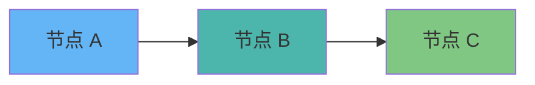
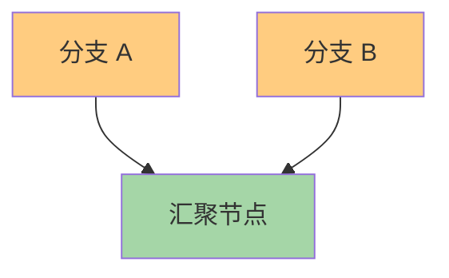
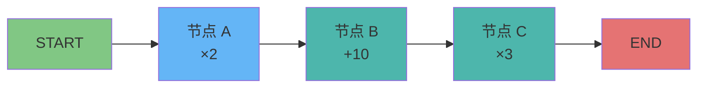
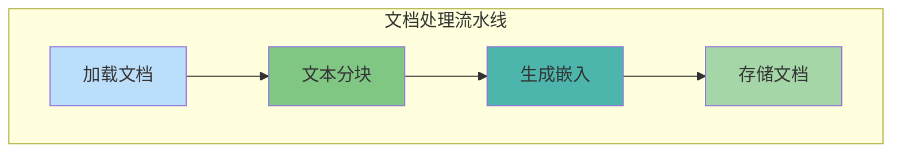

# 节点与边

## 添加节点 add_node

节点是 StateGraph 中的基本执行单元。每个节点是一个函数，接收当前状态并返回状态更新。

### 节点函数的基本形式

```python
from typing import TypedDict
from langgraph.graph import StateGraph

class State(TypedDict):
    value: int

def my_node(state: State) -> State:
    """节点函数：接收状态，返回更新"""
    return {"value": state["value"] + 1}

# 创建图并添加节点
builder = StateGraph(State)
builder.add_node("increment", my_node)
```

### 节点签名类型

LangGraph 支持多种节点函数签名：

```python
# 类型 1: 接收完整状态，返回完整状态
def node_v1(state: State) -> State:
    return {"value": state["value"] * 2}

# 类型 2: 接收完整状态，返回部分更新
def node_v2(state: State) -> State:
    return {"value": 100}  # 只更新 value 字段

# 类型 3: 异步节点
async def node_async(state: State) -> State:
    await some_async_operation()
    return {"status": "done"}

# 类型 4: 带配置的节点（通过闭包）
def create_node(config: dict):
    def node(state: State) -> State:
        # 使用 config 中的配置
        return {"result": config["multiplier"] * state["value"]}
    return node
```

### 节点 naming 最佳实践

```python
# ✅ 清晰的命名
builder.add_node("retrieve_documents", retrieve_docs)
builder.add_node("generate_answer", generate_answer)
builder.add_node("validate_output", validate)

# ❌ 避免模糊命名
builder.add_node("node1", func1)  # 不清楚做什么
builder.add_node("a", func_a)     # 难以调试
```

## 添加边 add_edge

边定义节点之间的执行顺序。`add_edge(start_node, end_node)` 表示从 start_node 执行完后流向 end_node。

### 基本边

```python
builder = StateGraph(State)

builder.add_node("A", node_a)
builder.add_node("B", node_b)
builder.add_node("C", node_c)

# 定义顺序：A → B → C
builder.add_edge("A", "B")
builder.add_edge("B", "C")
```

::: v-pre

:::

### 边的类型

| 类型 | 方法 | 描述 |
|------|------|------|
| 普通边 | `add_edge()` | 固定的节点间连接 |
| 条件边 | `add_conditional_edges()` | 根据状态动态选择下一条边 |
| 入口边 | `set_entry_point()` | 指定图的起始节点 |
| 结束边 | `add_edge(node, END)` | 流向图的终点 |

### 多对一边的汇聚

```python
# 多个节点汇聚到一个节点
builder.add_node("branch_a", func_a)
builder.add_node("branch_b", func_b)
builder.add_node("merge", merge_func)

builder.add_edge("branch_a", "merge")
builder.add_edge("branch_b", "merge")  # 两个分支汇聚
```

::: v-pre

:::

## 起始节点与结束节点

### 设置入口点

```python
# 方法 1: 使用 set_entry_point（推荐）
builder.set_entry_point("first_node")

# 方法 2: 使用 add_edge from START
from langgraph.graph import START
builder.add_edge(START, "first_node")
```

### 设置结束点

```python
from langgraph.graph import END

# 显式结束
builder.add_edge("last_node", END)

# 或者编译时自动推断（最后一个没有出边的节点）
```

### 完整示例：线性流程

```python
from langgraph.graph import StateGraph, START, END

class State(TypedDict):
    query: str
    result: str

def search(state):
    return {"result": f"搜索：{state['query']}"}

def process(state):
    return {"result": f"处理：{state['result']}"}

def format_output(state):
    return {"result": f"格式化：{state['result']}"}

# 构建图
builder = StateGraph(State)

builder.add_node("search", search)
builder.add_node("process", process)
builder.add_node("format", format_output)

# 定义流程
builder.set_entry_point("search")
builder.add_edge("search", "process")
builder.add_edge("process", "format")
builder.add_edge("format", END)

graph = builder.compile()
result = graph.invoke({"query": "LangGraph 教程"})
```

## 多节点协作

### 并行节点（Fan-out）

虽然 LangGraph 主要是顺序执行，但可以通过条件路由实现逻辑上的并行分支：

```python
def parallel_branch_a(state):
    return {"data_a": process_a(state["input"])}

def parallel_branch_b(state):
    return {"data_b": process_b(state["input"])}

def merge_results(state):
    # 合并两个分支的结果
    combined = combine(state["data_a"], state["data_b"])
    return {"final": combined}

builder = StateGraph(State)
builder.add_node("branch_a", parallel_branch_a)
builder.add_node("branch_b", parallel_branch_b)
builder.add_node("merge", merge_results)

# 注意：实际执行是顺序的，需要条件路由来控制
builder.set_entry_point("branch_a")
builder.add_edge("branch_a", "branch_b")
builder.add_edge("branch_b", "merge")
builder.add_edge("merge", END)
```

### 节点间状态传递示例

```python
from typing import TypedDict, Annotated, List
from operator import add

class State(TypedDict):
    steps: Annotated[List[str], add]  # 累积步骤记录
    current_value: int

def step_a(state: State):
    return {
        "current_value": state["current_value"] * 2,
        "steps": ["步骤 A 完成"]
    }

def step_b(state: State):
    return {
        "current_value": state["current_value"] + 10,
        "steps": ["步骤 B 完成"]
    }

def step_c(state: State):
    return {
        "steps": ["步骤 C 完成"],
        "current_value": state["current_value"] * 3
    }

# 构建流程
builder = StateGraph(State)
builder.add_node("A", step_a)
builder.add_node("B", step_b)
builder.add_node("C", step_c)

builder.set_entry_point("A")
builder.add_edge("A", "B")
builder.add_edge("B", "C")
builder.add_edge("C", END)

graph = builder.compile()

# 运行
result = graph.invoke({"steps": ["开始"], "current_value": 1})
# 结果：steps 累积了所有步骤，current_value 经过三次变换
```

::: v-pre

:::

## 节点编排模式

### 模式 1: 线性流水线

```
输入 → 节点 A → 节点 B → 节点 C → 输出
```

适用于：数据处理流水线、多步转换

### 模式 2: 条件分支

```
          → 分支 A →
输入 → 判断 → 分支 B → 汇聚 → 输出
          → 分支 C →
```

适用于：分类处理、路由决策

### 模式 3: 循环迭代

```
输入 → 初始化 → 循环体 → 判断 → 结束
              ↑_________|
```

适用于：重试逻辑、多轮对话、迭代优化

### 模式 4: 并行收集

```
       → 节点 A →
输入 →  节点 B   → 汇聚 → 输出
       → 节点 C →
```

适用于：多源数据收集、聚合分析

## 完整示例：文档处理流水线

```python
from typing import TypedDict, List, Annotated
from langchain_core.documents import Document
from operator import add

class DocumentState(TypedDict):
    raw_text: str
    chunks: List[str]
    embeddings: List[List[float]]
    processed_docs: Annotated[List[dict], add]
    status: str

def load_document(state: DocumentState):
    """加载原始文档"""
    # 模拟文档加载
    return {
        "raw_text": "这是文档内容...",
        "status": "loaded"
    }

def chunk_text(state: DocumentState):
    """文本分块"""
    text = state["raw_text"]
    chunks = [text[i:i+500] for i in range(0, len(text), 500)]
    return {"chunks": chunks, "status": "chunked"}

def embed_chunks(state: DocumentState):
    """生成嵌入向量"""
    # 模拟嵌入
    embeddings = [[0.1] * 128 for _ in state["chunks"]]
    return {"embeddings": embeddings, "status": "embedded"}

def store_docs(state: DocumentState):
    """存储处理后的文档"""
    docs = [
        {"chunk": chunk, "embedding": emb}
        for chunk, emb in zip(state["chunks"], state["embeddings"])
    ]
    return {
        "processed_docs": docs,
        "status": "stored"
    }

# 构建处理流水线
builder = StateGraph(DocumentState)

builder.add_node("load", load_document)
builder.add_node("chunk", chunk_text)
builder.add_node("embed", embed_chunks)
builder.add_node("store", store_docs)

builder.set_entry_point("load")
builder.add_edge("load", "chunk")
builder.add_edge("chunk", "embed")
builder.add_edge("embed", "store")
builder.add_edge("store", END)

pipeline = builder.compile()

# 运行
result = pipeline.invoke({
    "raw_text": "",
    "chunks": [],
    "embeddings": [],
    "processed_docs": [],
    "status": "pending"
})

print(f"处理状态：{result['status']}")
print(f"文档块数：{len(result['chunks'])}")
```

::: v-pre

:::

## 💡 提示

> **节点职责单一**：每个节点应该只做一件事。复杂的逻辑应该拆分成多个节点，这样更易于测试、调试和复用。

> **边要显式**：即使是明显的流程，也要显式添加边。这使图结构更清晰，也便于可视化。

> **节点命名即文档**：使用描述性的节点名称，让其他人（和未来的你）一看就知道节点的作用。

## 节点与边调试技巧

```python
# 可视化图结构
graph = builder.compile()
print(graph.get_graph().draw_mermaid())

# 查看节点列表
print(graph.get_graph().nodes)

# 查看边列表
print(graph.get_graph().edges)

# 单步调试：使用 stream 查看每个节点的输出
for chunk in graph.stream({"input": "test"}):
    print(f"节点输出：{chunk}")
```

## 总结

节点和边是构建 LangGraph 的基础：

1. **节点**：执行单元，接收状态返回更新
2. **边**：连接节点，定义执行顺序
3. **入口/出口**：明确指定起点和终点
4. **编排模式**：线性、分支、循环、并行

掌握这些基础后，我们可以进一步学习条件路由，实现更复杂的流程控制。