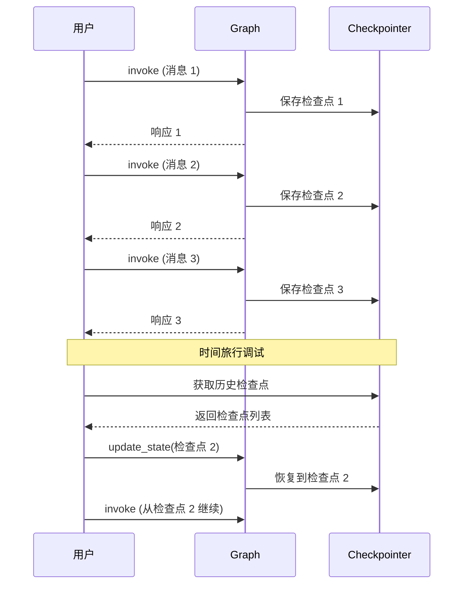
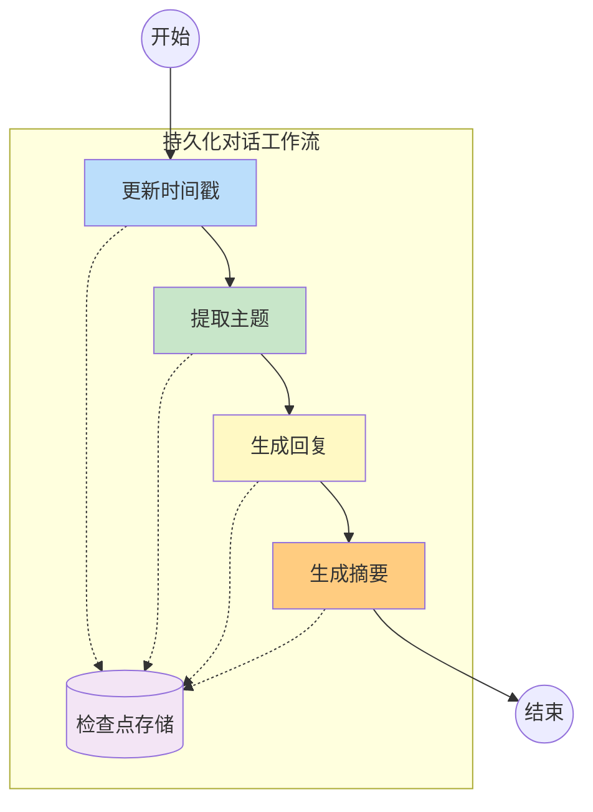

# 持久化与检查点

## 持久化与 Checkpointer 概念

**持久化（Persistence）** 是指将 LangGraph 的执行状态保存到持久化存储中，使得：

- 应用重启后能恢复之前的状态
- 支持长时间运行的对话（如数天或数周）
- 实现"时间旅行"调试功能
- 支持多设备/多会话同步

**检查点（Checkpointer）** 是 LangGraph 中实现持久化的核心机制，它在每个节点执行后保存状态快照。

::: v-pre
```mermaid
graph TB
    subgraph "无持久化"
        A1[节点 1] --> A2[节点 2]
        A2 --> A3[节点 3]
        A3 -.x.> A4[重启后丢失]
    end
    
    subgraph "有持久化"
        B1[节点 1] --> CP1[(检查点 1)]
        CP1 --> B2[节点 2]
        B2 --> CP2[(检查点 2)]
        CP2 --> B3[节点 3]
        B3 --> CP3[(检查点 3)]
        CP3 -.-> B3[可从 CP3 恢复]
    end
    
    style CP1 fill:#fff9c4
    style CP2 fill:#fff9c4
    style CP3 fill:#fff9c4
```
:::

### 为什么需要持久化？

| 场景 | 无持久化问题 | 持久化解决方案 |
|------|-------------|---------------|
| 长对话 | 服务重启对话丢失 | 从上次检查点恢复 |
| 人机协同 | 等待审批期间状态丢失 | 保存审批中间状态 |
| 长时间任务 | 超时导致任务失败 | 分段保存，断点续传 |
| 多设备同步 | 状态无法跨设备 | 共享存储后端 |
| 审计追踪 | 无法追溯历史 | 保留完整状态历史 |

## MemorySaver 内存检查点

`MemorySaver` 是最简单的检查点实现，将状态保存在内存中。适合开发和测试，但不适合生产（重启后数据丢失）。

### 基本使用

```python
from langgraph.graph import StateGraph, END
from langgraph.checkpoint.memory import MemorySaver
from typing import TypedDict, Annotated, List
from langchain_core.messages import add_messages, HumanMessage, AIMessage

class State(TypedDict):
    messages: Annotated[List[dict], add_messages]
    step: int

def node_a(state):
    return {"messages": [AIMessage(content="节点 A 执行完成")], "step": 1}

def node_b(state):
    return {"messages": [AIMessage(content="节点 B 执行完成")], "step": 2}

# 构建图
builder = StateGraph(State)
builder.add_node("A", node_a)
builder.add_node("B", node_b)
builder.set_entry_point("A")
builder.add_edge("A", "B")
builder.add_edge("B", END)

# 创建内存检查点
memory = MemorySaver()

# 编译时传入 checkpointer
graph = builder.compile(checkpointer=memory)

# 使用 config 指定 thread_id
config = {"configurable": {"thread_id": "conversation-001"}}

# 第一次运行
result1 = graph.invoke({"messages": [HumanMessage(content="你好")], "step": 0}, config=config)
print(result1)

# 第二次运行（从上次状态继续）
result2 = graph.invoke(None, config=config)  # None 表示继续
print(result2)
```

### 多会话支持

```python
# 同一时刻可以维护多个独立会话
config_1 = {"configurable": {"thread_id": "user-123-session-1"}}
config_2 = {"configurable": {"thread_id": "user-456-session-1"}}

# 会话 1
graph.invoke({"messages": [HumanMessage(content="用户 1 的消息")], "step": 0}, config=config_1)

# 会话 2
graph.invoke({"messages": [HumanMessage(content="用户 2 的消息")], "step": 0}, config=config_2)

# 两个会话的状态互不影响
```

## SqliteSaver 与 AsyncSqliteSaver

`SqliteSaver` 将检查点保存到 SQLite 数据库，支持持久化存储。

### SqliteSaver（同步版本）

```python
from langgraph.checkpoint.sqlite import SqliteSaver

# 创建 SQLite 检查点（保存到文件）
sqlite_saver = SqliteSaver.from_conn_string("checkpoints.sqlite")

# 使用
graph = builder.compile(checkpointer=sqlite_saver)

config = {"configurable": {"thread_id": "persistent-001"}}
result = graph.invoke({"messages": [HumanMessage(content="开始对话")], "step": 0}, config=config)

# 即使程序重启，状态也会保留
```

### AsyncSqliteSaver（异步版本）

```python
from langgraph.checkpoint.aiosqlite import AsyncSqliteSaver

async def run_async_graph():
    # 异步 SQLite 检查点
    async with AsyncSqliteSaver.from_conn_string("checkpoints.sqlite") as saver:
        graph = builder.compile(checkpointer=saver)
        
        config = {"configurable": {"thread_id": "async-001"}}
        result = await graph.ainvoke({
            "messages": [HumanMessage(content="异步对话")],
            "step": 0
        }, config=config)
        
        return result

# 运行
import asyncio
asyncio.run(run_async_graph())
```

### 多后端支持

LangGraph 支持多种存储后端：

| 检查点类型 | 存储介质 | 适用场景 |
|------------|---------|---------|
| `MemorySaver` | 内存 | 开发/测试 |
| `SqliteSaver` | SQLite 文件 | 小型应用/单机 |
| `AsyncSqliteSaver` | SQLite 文件 | 异步应用 |
| `PostgresSaver` | PostgreSQL | 生产级应用 |
| `RedisSaver` | Redis | 高性能/分布式 |
| `DynamoDbSaver` | AWS DynamoDB | 云原生应用 |

::: tip 💡
对于生产环境，强烈建议使用 Postgres 或 Redis 作为存储后端，它们提供更好的可靠性和扩展性。
:::

## 状态恢复与时间旅行调试

### 恢复上次状态

```python
from langgraph.checkpoint.memory import MemorySaver

memory = MemorySaver()
graph = builder.compile(checkpointer=memory)

config = {"configurable": {"thread_id": "recover-001"}}

# 运行多次
graph.invoke({"messages": [HumanMessage(content="第一轮")], "step": 0}, config=config)
graph.invoke(None, config=config)
graph.invoke(None, config=config)

# 恢复到最后一次状态
last_state = graph.get_state(config)
print(f"最后状态：{last_state.values}")
```

### 时间旅行：获取历史状态

```python
# 获取所有历史状态
history = graph.get_state_history(config)

for snapshot in history:
    print(f"时间：{snapshot.created_at}")
    print(f"状态：{snapshot.values}")
    print(f"检查点 ID: {snapshot.config['configurable']['checkpoint_id']}")
    print("---")
```

### 恢复到任意历史点

```python
# 获取历史
history = list(graph.get_state_history(config))

# 选择要恢复的时间点（比如倒数第三个）
target_checkpoint = history[2]  # 第三个检查点

# 更新到该历史状态
graph.update_state(
    target_checkpoint.config,  # 使用历史检查点的 config
    {"messages": [...]}  # 可选：修改状态
)

# 从该点继续执行
result = graph.invoke(None, config=target_checkpoint.config)
```

::: v-pre

:::

### 完整调试示例

```python
from langgraph.checkpoint.memory import MemorySaver
from langchain_core.messages import HumanMessage, AIMessage
from typing import TypedDict, Annotated, List
from operator import add

class DebugState(TypedDict):
    messages: Annotated[List[dict], add_messages]
    counter: int

def node_1(state):
    return {"messages": [AIMessage(content="节点 1")], "counter": 1}

def node_2(state):
    return {"messages": [AIMessage(content="节点 2")], "counter": 2}

def node_3(state):
    return {"messages": [AIMessage(content="节点 3")], "counter": 3}

builder = StateGraph(DebugState)
builder.add_node("1", node_1)
builder.add_node("2", node_2)
builder.add_node("3", node_3)
builder.set_entry_point("1")
builder.add_edge("1", "2")
builder.add_edge("2", "3")
builder.add_edge("3", END)

memory = MemorySaver()
graph = builder.compile(checkpointer=memory)

config = {"configurable": {"thread_id": "debug-session"}}

# 运行
result = graph.invoke({"messages": [HumanMessage(content="开始")], "counter": 0}, config=config)
print(f"最终结果：{result}")

# 调试：查看所有检查点
print("\n=== 检查点历史 ===")
for i, snapshot in enumerate(graph.get_state_history(config)):
    print(f"\n检查点 {i}:")
    print(f"  时间：{snapshot.created_at}")
    print(f"  节点：{snapshot.metadata.get('step', 'unknown')}")
    print(f"  状态：{snapshot.values}")
    if i == 0:
        print(f"  下次执行：{snapshot.next}")

# 恢复到特定检查点
snapshots = list(graph.get_state_history(config))
second_checkpoint = snapshots[1]

print(f"\n=== 恢复到检查点 1 ===")
state_at_checkpoint = graph.get_state(second_checkpoint.config)
print(f"状态：{state_at_checkpoint.values}")
```

## 持久化工作流完整示例

```python
from langgraph.checkpoint.memory import MemorySaver
from langgraph.graph import StateGraph, END
from langchain_core.messages import HumanMessage, AIMessage, add_messages
from typing import TypedDict, Annotated, List, Optional
from datetime import datetime

class ConversationState(TypedDict):
    messages: Annotated[List[dict], add_messages]
    user_id: str
    session_start: str
    last_active: str
    topic: Optional[str]
    summary: Optional[str]

def update_timestamps(state: ConversationState):
    """更新活动时间戳"""
    now = datetime.now().isoformat()
    return {
        "last_active": now,
        "session_start": state.get("session_start") or now
    }

def extract_topic(state: ConversationState):
    """从对话中提取主题"""
    # 简化：实际应调用 LLM
    last_msg = state["messages"][-1]["content"]
    topic = "general"
    if "技术" in last_msg or "代码" in last_msg:
        topic = "technology"
    elif "生活" in last_msg or "日常" in last_msg:
        topic = "lifestyle"
    return {"topic": topic}

def generate_response(state: ConversationState):
    """生成回复"""
    topic = state.get("topic", "general")
    response = f"关于{topic}的话题，我来帮您..."
    return {"messages": [AIMessage(content=response)]}

def summarize(state: ConversationState):
    """生成对话摘要"""
    # 当对话足够长时生成摘要
    if len(state["messages"]) >= 6:
        summary = f"对话主题：{state['topic']}"
        return {"summary": summary}
    return {}

# 构建对话图
builder = StateGraph(ConversationState)

builder.add_node("timestamps", update_timestamps)
builder.add_node("topic", extract_topic)
builder.add_node("response", generate_response)
builder.add_node("summarize", summarize)

builder.set_entry_point("timestamps")
builder.add_edge("timestamps", "topic")
builder.add_edge("topic", "response")
builder.add_edge("response", "summarize")
builder.add_edge("summarize", END)

# 添加持久化
memory = MemorySaver()
conversation_graph = builder.compile(checkpointer=memory)

# === 使用示例 ===

# 用户会话
user_config = {"configurable": {"thread_id": "user-123"}}

# 多轮对话
for i, msg in enumerate(["你好", "我想问技术问题", "关于 Python 的问题", "谢谢"]):
    result = conversation_graph.invoke(
        {
            "messages": [HumanMessage(content=msg)] if i == 0 else None,
            "user_id": "user-123",
            "session_start": None,
            "last_active": None,
            "topic": None,
            "summary": None,
        },
        config=user_config
    )
    print(f"轮次 {i+1}: {result['messages'][-1]['content']}")

# 查看持久化的状态
final_state = conversation_graph.get_state(user_config)
print(f"\n对话主题：{final_state.values['topic']}")
print(f"会话开始：{final_state.values['session_start']}")
print(f"最后活跃：{final_state.values['last_active']}")
```

::: v-pre

:::

## 💡 提示

> **选择合适的存储后端**：开发用 MemorySaver，测试用 SqliteSaver，生产用 PostgresSaver 或 RedisSaver。

> **合理设置 thread_id**：确保每个独立会话有唯一的 thread_id，避免状态混淆。可以使用用户 ID + 会话 ID 的组合。

> **定期清理旧检查点**：对于长期运行的应用，定期检查点会占用大量存储。实现清理策略，保留最近 N 个检查点或最近 N 天的检查点。

> **使用 get_state_history 调试**：当出现问题时，获取状态历史可以帮助理解问题是如何发生的。

## 总结

持久化是生产级 LangGraph 应用的必备特性：

1. **MemorySaver**：简单快捷，适合开发测试
2. **SqliteSaver**：文件存储，适合小型应用
3. **AsyncSqliteSaver**：异步支持
4. **状态恢复**：支持从任意检查点继续
5. **时间旅行**：完整的历史追溯和调试能力

掌握持久化后，你可以构建可靠、可扩展的长期对话应用。