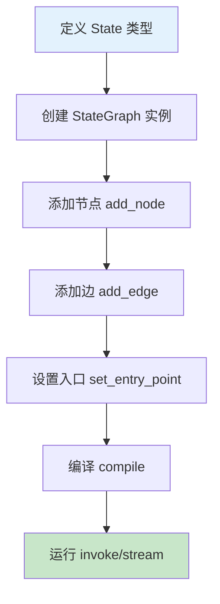
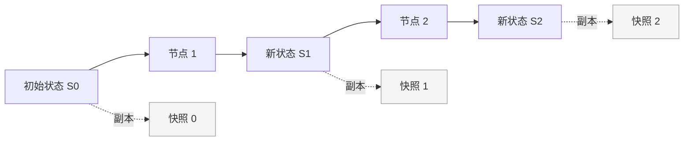

# StateGraph 状态图

## StateGraph 的创建

`StateGraph` 是 LangGraph 的核心类，它定义了整个应用的状态结构和执行流程。创建一个 StateGraph 需要以下步骤：

```python
from langgraph.graph import StateGraph, END
from typing import TypedDict

# 步骤 1: 定义状态结构
class State(TypedDict):
    messages: list
    current_step: str

# 步骤 2: 创建 StateGraph 实例
builder = StateGraph(State)

# 步骤 3: 添加节点
builder.add_node("step_1", my_function)
builder.add_node("step_2", another_function)

# 步骤 4: 定义边
builder.set_entry_point("step_1")
builder.add_edge("step_1", "step_2")
builder.add_edge("step_2", END)

# 步骤 5: 编译
graph = builder.compile()
```

### StateGraph 构造参数

```python
StateGraph(
    state_schema: Type[State],      # 状态类型定义（必需）
    input_schema: Optional[Type] = None,  # 输入类型（可选）
    output_schema: Optional[Type] = None,  # 输出类型（可选）
    config_schema: Optional[Type] = None,  # 配置类型（可选）
)
```

::: v-pre

:::

## 使用 TypedDict 定义 State

### 基础 TypedDict

```python
from typing import TypedDict, List, Annotated
from langchain_core.messages import BaseMessage

class AgentState(TypedDict):
    """Agent 的状态定义"""
    messages: List[BaseMessage]           # 消息历史
    user_input: str                        # 用户输入
    next_action: str                       # 下一步动作
    iterations: int                        # 迭代次数
```

### 为什么需要 TypedDict？

| 特性 | TypedDict | 普通 dict |
|------|-----------|-----------|
| 类型检查 | ✅ Mypy 支持 | ❌ 无 |
| IDE 自动补全 | ✅ 支持 | ❌ 无 |
| 文档清晰 | ✅ 字段明确 | ❌ 运行时才知道 |
| 默认值 | ⚠️ 需要额外处理 | ✅ 直接赋值 |

## 使用 Pydantic 定义 State

Pydantic 提供更强大的验证和默认值支持：

```python
from pydantic import BaseModel, Field
from typing import List, Optional
from langchain_core.messages import HumanMessage, AIMessage

class ChatState(BaseModel):
    """使用 Pydantic 定义状态"""
    messages: List[dict] = Field(default_factory=list)
    user_id: Optional[str] = None
    session_id: str
    temperature: float = Field(default=0.7, ge=0, le=2)
    max_iterations: int = Field(default=10, ge=1)
    
    class Config:
        extra = "forbid"  # 禁止额外字段

# 使用 Pydantic State 创建图
graph = StateGraph(ChatState)
```

### TypedDict vs Pydantic 对比

| 特性 | TypedDict | Pydantic |
|------|-----------|----------|
| 运行时验证 | ❌ 无 | ✅ 自动验证 |
| 默认值 | ❌ 不支持 | ✅ 支持 |
| 字段约束 | ❌ 无 | ✅ 支持（ge, le, regex 等） |
| 序列化 | ⚠️ 需手动处理 | ✅ 内置支持 |
| 性能 | ✅ 轻量 | ⚠️ 略重 |
| 推荐场景 | 简单状态 | 复杂验证需求 |

::: tip 💡
对于大多数 LangGraph 应用，**TypedDict + Annotated** 是推荐组合，因为它轻量且与 LangGraph 的 reducer 机制完美配合。
:::

## Annotated 状态更新函数

LangGraph 使用 `Annotated` 类型来定义**状态的累积方式**（reducer function）。

### add_messages：消息累积

```python
from typing import TypedDict, Annotated, List
from langchain_core.messages import BaseMessage
from langgraph.graph.message import add_messages

class State(TypedDict):
    # messages 字段使用 add_messages 作为 reducer
    # 新消息会追加到现有列表，而不是覆盖
    messages: Annotated[List[BaseMessage], add_messages]
```

### add_messages 的工作原理

```python
# 当节点返回 {"messages": [new_message]} 时：
# 如果 state["messages"] = [msg1, msg2]
# 则新状态为 [msg1, msg2, new_message]
# 而不是 [new_message]（覆盖）
```

::: v-pre
```mermaid
sequenceDiagram
    participant S as State
    participant N as Node
    participant R as Reducer
    
    S->>N: 传入 state {messages: [m1, m2]}
    N->>N: 处理并返回 {messages: [m3]}
    N->>R: add_messages([m1,m2], [m3])
    R->>S: 新 state {messages: [m1,m2,m3]}
    
    style S fill:#e3f2fd
    style R fill:#fff3e0
```
:::

### 自定义 Reducer 函数

除了 `add_messages`，你还可以定义自己的 reducer：

```python
from typing import TypedDict, Annotated, List

def append_reducer(existing: List, new: List) -> List:
    """自定义累积函数：只在 new 非空时追加"""
    if new:
        return existing + new
    return existing

def max_reducer(current: int, new: int) -> int:
    """取最大值的 reducer"""
    return max(current, new)

class State(TypedDict):
    events: Annotated[List[str], append_reducer]
    max_score: Annotated[int, max_reducer]
    count: Annotated[int, lambda c, n: c + n]  # 累加
```

### 内置 Reducer 函数

```python
from langgraph.graph.message import add_messages
from langgraph.graph import add_annotations

# 常见的内置 reducer
reducer_map = {
    "append": lambda curr, new: curr + new,      # 列表追加
    "add": lambda curr, new: curr + new,         # 数值相加
    "max": lambda curr, new: max(curr, new),     # 取最大
    "min": lambda curr, new: min(curr, new),     # 取最小
    "replace": lambda curr, new: new,            # 覆盖（默认）
}
```

## 状态的不可变性与更新机制

### 核心原则：状态是不可变的

LangGraph 遵循**函数式编程原则**：状态在每次更新时都会创建新副本，而不是原地修改。

```python
# ❌ 错误：原地修改
def bad_node(state: State) -> State:
    state["messages"].append(new_msg)  # 原地修改！
    return state

# ✅ 正确：返回新状态
def good_node(state: State) -> State:
    new_messages = state["messages"] + [new_msg]
    return {"messages": new_messages}
```

### 为什么需要不可变性？

| 优势 | 说明 |
|------|------|
| 可追溯性 | 每个状态快照都可保留 |
| 调试友好 | 可以回溯到任意历史点 |
| 并发安全 | 无共享可变状态 |
| 时间旅行 | 支持恢复到之前的状态 |

### 状态更新模式

```python
# 模式 1: 完整返回（推荐）
def node_v1(state: State) -> State:
    return {
        "messages": state["messages"] + [new_msg],
        "step": "completed"
    }

# 模式 2: 部分更新（只返回变化的字段）
def node_v2(state: State) -> State:
    return {"step": "completed"}  # 其他字段保持不变

# 模式 3: 条件更新
def node_v3(state: State) -> State:
    if should_update:
        return {"messages": new_msgs}
    return {}  # 空 dict 表示无变化
```

::: v-pre

:::

## 完整示例：客服对话状态机

```python
from typing import TypedDict, Annotated, List, Literal
from langchain_core.messages import HumanMessage, AIMessage, add_messages
from langgraph.graph import StateGraph, END

# 定义状态
class CustomerServiceState(TypedDict):
    messages: Annotated[List[dict], add_messages]
    customer_id: str
    issue_type: str
    priority: Literal["low", "medium", "high"]
    assigned_to: str
    resolved: bool

# 定义节点
def classify_issue(state: CustomerServiceState):
    # 模拟分类逻辑
    issue_types = {"billing": "billing", "technical": "technical", "other": "general"}
    return {"issue_type": issue_types.get("billing", "general")}

def assign_priority(state: CustomerServiceState):
    # 根据问题类型分配优先级
    priority_map = {"billing": "high", "technical": "medium", "general": "low"}
    return {"priority": priority_map.get(state["issue_type"], "low")}

def assign_agent(state: CustomerServiceState):
    # 分配客服
    agents = {"high": "senior", "medium": "standard", "low": "junior"}
    return {"assigned_to": agents[state["priority"]]}

def resolve(state: CustomerServiceState):
    return {
        "resolved": True,
        "messages": [AIMessage(content="问题已解决，感谢您的反馈！")]
    }

# 构建图
builder = StateGraph(CustomerServiceState)

builder.add_node("classify", classify_issue)
builder.add_node("prioritize", assign_priority)
builder.add_node("assign", assign_agent)
builder.add_node("resolve", resolve)

# 定义流程
builder.set_entry_point("classify")
builder.add_edge("classify", "prioritize")
builder.add_edge("prioritize", "assign")
builder.add_edge("assign", "resolve")
builder.add_edge("resolve", END)

# 编译并运行
graph = builder.compile()

result = graph.invoke({
    "messages": [{"role": "user", "content": "我的账单有问题"}],
    "customer_id": "CUST001",
    "issue_type": "",
    "priority": "low",
    "assigned_to": "",
    "resolved": False
})

print(result)
```

## 💡 提示

> **状态字段命名**：使用清晰、描述性的字段名。避免单字母命名，这会让后续维护变得困难。

> **Reducer 选择**：对于消息历史，始终使用 `add_messages`；对于计数器，使用累加 reducer；对于覆盖型字段（如当前步骤），使用默认替换。

> **状态验证**：在复杂应用中，考虑在节点入口处验证状态完整性，这有助于早期发现问题。

## 总结

StateGraph 是 LangGraph 的基石：

1. **状态定义**：使用 TypedDict 或 Pydantic 明确定义状态结构
2. **状态更新**：通过 Annotated 和 reducer 函数控制状态累积方式
3. **不可变性**：每次更新创建新状态，支持时间旅行和调试
4. **类型安全**：静态类型检查帮助避免运行时错误

理解状态的创建和更新机制是掌握 LangGraph 的关键。在下一章中，我们将学习如何添加节点和边来构建完整的执行流程。