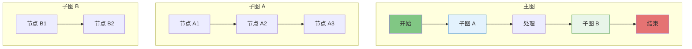
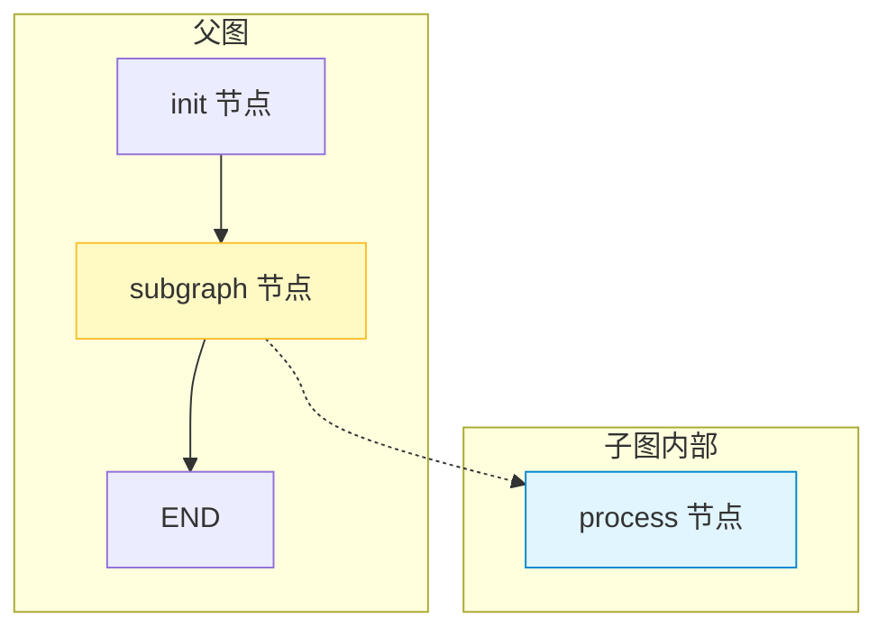
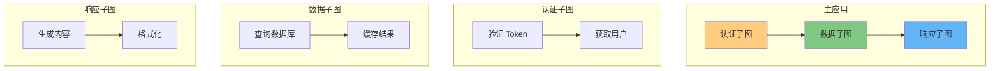
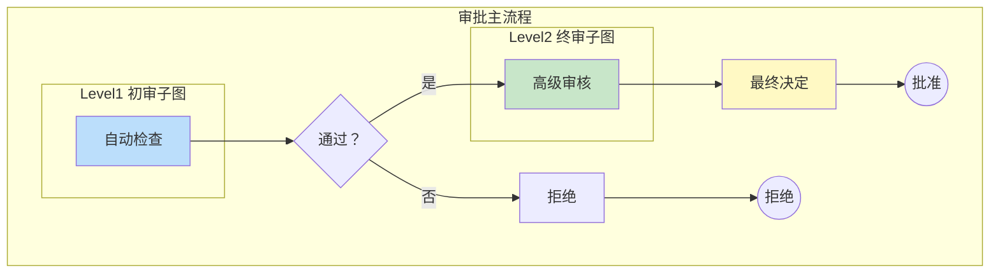

# 子图

## 子图的概念与用途

**子图（Subgraph）** 是 LangGraph 中用于模块化设计的强大特性。它允许你在一个大图中嵌套一个小图，实现复杂的层级化流程设计。

### 为什么需要子图？

| 问题 | 无子图方案 | 子图方案 |
|------|-----------|---------|
| 代码复用 | 复制粘贴节点逻辑 | 一次定义，多处使用 |
| 模块化 | 所有节点平铺，难以理解 | 功能分组，层次清晰 |
| 测试 | 必须测试整个图 | 独立测试子图 |
| 团队协作 | 容易冲突 | 各自维护子图 |
| 复杂度 | 单图节点过多 | 分层抽象 |

 ::: v-pre

:::

### 子图的核心价值

1. **封装复杂性**：将复杂流程封装成黑盒子图
2. **接口清晰**：定义了明确的输入/输出契约
3. **独立演化**：子图可以独立修改，不影响主图
4. **状态隔离**：子图内部状态不污染父图

## 创建与组合子图

### 创建子图

```python
from langgraph.graph import StateGraph, END, START
from typing import TypedDict, Annotated, List
from langchain_core.messages import add_messages, HumanMessage, AIMessage

# 定义子图的状态
class SubGraphState(TypedDict):
    messages: Annotated[List[dict], add_messages]
    processed: bool

# 创建子图
def process_node(state: SubGraphState):
    return {
        "messages": [AIMessage(content="子图处理完成")],
        "processed": True
    }

subgraph_builder = StateGraph(SubGraphState)
subgraph_builder.add_node("process", process_node)
subgraph_builder.add_edge(START, "process")
subgraph_builder.add_edge("process", END)

# 编译子图
subgraph = subgraph_builder.compile()
```

### 将子图作为节点添加到父图

```python
# 定义父图状态（可以包含子图状态的所有字段）
class ParentState(TypedDict):
    messages: Annotated[List[dict], add_messages]
    processed: bool
    parent_data: str

# 创建父图
parent_builder = StateGraph(ParentState)

# 添加普通节点
def init_node(state: ParentState):
    return {"messages": [HumanMessage(content="初始化")], "parent_data": "数据"}

parent_builder.add_node("init", init_node)

# 添加子图作为节点
parent_builder.add_node("subgraph", subgraph)

# 连接
parent_builder.add_edge(START, "init")
parent_builder.add_edge("init", "subgraph")
parent_builder.add_edge("subgraph", END)

parent_graph = parent_builder.compile()

# 运行
result = parent_graph.invoke({
    "messages": [],
    "processed": False,
    "parent_data": ""
})
print(result)
```

::: v-pre

:::

## 父子图状态传递

### 状态兼容性

子图和父图的状态需要兼容。有两种方式：

1. **完全兼容**：子图状态的字段是父图状态的子集
2. **使用 add_messages 等 reducer**：自动兼容列表字段

```python
# 子图状态
class EmailState(TypedDict):
    to: str
    subject: str
    body: str
    status: str

# 父图状态（包含子图所有字段 + 额外字段）
class WorkflowState(TypedDict):
    to: str
    subject: str
    body: str
    status: str
    workflow_id: str
    created_at: str
    cc_list: list

# 这样父图可以直接传递给子图
```

### 状态转换节点

当子图和父图状态不完全兼容时，使用转换节点：

```python
# 状态不完全兼容的情况
class SubState(TypedDict):
    input: str
    output: str

class ParentState(TypedDict):
    user_input: str
    result: str
    metadata: dict

# 转换节点：父状态 → 子状态
def to_subgraph_state(state: ParentState):
    return {"input": state["user_input"], "output": ""}

# 转换节点：子状态 → 父状态
def from_subgraph_state(state: SubState):
    return {"result": state["output"]}

# 在父图中使用
parent_builder.add_node("to_sub", to_subgraph_state)
parent_builder.add_node("subgraph", subgraph)  # 子图
parent_builder.add_node("from_sub", from_subgraph_state)

parent_builder.add_edge("init", "to_sub")
parent_builder.add_edge("to_sub", "subgraph")
parent_builder.add_edge("subgraph", "from_sub")
parent_builder.add_edge("from_sub", END)
```

### 完整示例：带状态转换的子图

```python
from typing import TypedDict, Annotated, List
from langchain_core.messages import add_messages, AIMessage

# ===== 子图：邮件处理流程 =====

class EmailSubState(TypedDict):
    content: str
    sentiment: str
    processed: bool

def analyze_sentiment(state: EmailSubState):
    # 模拟情感分析
    sentiment = "positive"  # 实际应调用 LLM
    return {"sentiment": sentiment}

def template_response(state: EmailSubState):
    # 根据情感生成模板回复
    templates = {
        "positive": "感谢您的积极反馈！",
        "neutral": "收到您的消息，我们会尽快处理。",
        "negative": "非常抱歉给您带来不便..."
    }
    response = templates.get(state["sentiment"], "感谢您的来信")
    return {
        "content": response,
        "processed": True
    }

email_subgraph = StateGraph(EmailSubState)
email_subgraph.add_node("analyze", analyze_sentiment)
email_subgraph.add_node("respond", template_response)
email_subgraph.add_edge("analyze", "respond")
email_subgraph.set_entry_point("analyze")
email_subgraph.add_edge("respond", END)

email_graph = email_subgraph.compile()

# ===== 父图：完整工作流 =====

class WorkflowState(TypedDict):
    raw_email: str
    response: str
    customer_id: str
    priority: str

def extract_content(state: WorkflowState):
    return {"content": state["raw_email"]}

def categorize(state: WorkflowState):
    # 根据内容判断优先级
    return {"priority": "high" if "紧急" in state["raw_email"] else "normal"}

def format_response(state: WorkflowState):
    return {
        "response": f"[{state['customer_id']}] {state.get('response', '无回复')}",
        "raw_email": ""  # 清理临时数据
    }

workflow_builder = StateGraph(WorkflowState)

workflow_builder.add_node("extract", extract_content)
workflow_builder.add_node("email_subgraph", email_graph)
workflow_builder.add_node("categorize", categorize)
workflow_builder.add_node("format", format_response)

workflow_builder.set_entry_point("extract")
workflow_builder.add_edge("extract", "email_subgraph")
workflow_builder.add_edge("email_subgraph", "categorize")
workflow_builder.add_edge("categorize", "format")
workflow_builder.add_edge("format", END)

workflow_graph = workflow_builder.compile()

# 运行
result = workflow_graph.invoke({
    "raw_email": "产品很好用，非常感谢！",
    "response": "",
    "customer_id": "CUST001",
    "priority": ""
})

print(f"回复：{result['response']}")
print(f"优先级：{result['priority']}")
```

## 模块化图设计

### 按功能模块划分子图

```python
# ===== 模块 1：用户认证子图 =====

def verify_token(state):
    return {"authenticated": True}

def fetch_user_info(state):
    return {"user_info": {"id": "123", "name": "用户"}}

auth_graph = StateGraph(AuthState)
auth_graph.add_node("verify", verify_token)
auth_graph.add_node("fetch", fetch_user_info)
auth_graph.set_entry_point("verify")
auth_graph.add_edge("verify", "fetch")
auth_graph.add_edge("fetch", END)
auth_compiled = auth_graph.compile()

# ===== 模块 2：数据获取子图 =====

def query_database(state):
    return {"data": [...]}

def cache_result(state):
    return {"cached": True}

data_graph = StateGraph(DataState)
data_graph.add_node("query", query_database)
data_graph.add_node("cache", cache_result)
data_graph.set_entry_point("query")
data_graph.add_edge("query", "cache")
data_graph.add_edge("cache", END)
data_compiled = data_graph.compile()

# ===== 模块 3：响应生成子图 =====

def generate_content(state):
    return {"content": "生成的内容"}

def format_output(state):
    return {"formatted": state["content"]}

response_graph = StateGraph(ResponseState)
response_graph.add_node("generate", generate_content)
response_graph.add_node("format", format_output)
response_graph.set_entry_point("generate")
response_graph.add_edge("generate", "format")
response_graph.add_edge("format", END)
response_compiled = response_graph.compile()

# ===== 主图：组合所有模块 =====

class AppState(TypedDict):
    # 包含所有子图需要的字段
    token: str
    authenticated: bool
    user_info: dict
    data: list
    cached: bool
    content: str
    formatted: str

main_builder = StateGraph(AppState)

main_builder.add_node("auth", auth_compiled)
main_builder.add_node("data", data_compiled)
main_builder.add_node("response", response_compiled)

main_builder.set_entry_point("auth")
main_builder.add_edge("auth", "data")
main_builder.add_edge("data", "response")
main_builder.add_edge("response", END)

main_graph = main_builder.compile()
```

::: v-pre

:::

### 配置传递

子图可以接收父图的配置：

```python
# 父图编译时传入配置
parent_graph = builder.compile(
    checkpointer=memory,
)

# 运行时配置会自动传递给子图
result = parent_graph.invoke(
    state,
    config={
        "configurable": {
            "thread_id": "main-thread",
            "custom_param": "value",  # 子图也可以访问
        }
    }
)
```

## 完整示例：多阶段审批系统

```python
from typing import TypedDict, Annotated, List, Literal
from langchain_core.messages import add_messages, AIMessage, HumanMessage

# ==================== 子图 1：初审流程 ====================

class Level1State(TypedDict):
    application: dict
   初审意见：str
    level1_passed: bool
    comments: str

def auto_check(state: Level1State):
    """自动初审检查"""
    app = state["application"]
    issues = []
    
    if app.get("amount", 0) > 1000000:
        issues.append("金额超限")
    if not app.get("documents", []):
        issues.append("缺少文档")
    
    passed = len(issues) == 0
    return {
        "初审意见": "通过" if passed else "不通过",
        "comments": ", ".join(issues) if issues else "自动检查通过",
        "level1_passed": passed
    }

level1_graph = StateGraph(Level1State)
level1_graph.add_node("auto_check", auto_check)
level1_graph.set_entry_point("auto_check")
level1_graph.add_edge("auto_check", END)
level1_compiled = level1_graph.compile()

# ==================== 子图 2：终审流程 ====================

class Level2State(TypedDict):
    application: dict
    终审意见：str
    level2_passed: bool
    final_comments: str

def senior_review(state: Level2State):
    """高级审核"""
    # 实际应调用人工审核或 LLM
    return {
        "终审意见": "批准",
        "final_comments": "终审通过",
        "level2_passed": True
    }

level2_graph = StateGraph(Level2State)
level2_graph.add_node("senior_review", senior_review)
level2_graph.set_entry_point("senior_review")
level2_graph.add_edge("senior_review", END)
level2_compiled = level2_graph.compile()

# ==================== 主图：组合审批流程 ====================

class ApprovalState(TypedDict):
    application: dict
    初审意见：str
    终审意见：str
    level1_passed: bool
    level2_passed: bool
    final_status: Literal["approved", "rejected", "pending"]
    comments: str

def route_after_level1(state: ApprovalState) -> Literal["level2", "reject"]:
    """根据初审结果路由"""
    return "level2" if state["level1_passed"] else "reject"

def final_decision(state: ApprovalState):
    """最终决定"""
    if state["level2_passed"]:
        return {"final_status": "approved"}
    return {"final_status": "rejected"}

approval_builder = StateGraph(ApprovalState)

# 添加子图作为节点
approval_builder.add_node("level1", level1_compiled)
approval_builder.add_node("level2", level2_compiled)
approval_builder.add_node("final", final_decision)
approval_builder.add_node("reject", lambda s: {"final_status": "rejected"})

# 构建流程
approval_builder.set_entry_point("level1")
approval_builder.add_conditional_edges(
    "level1",
    route_after_level1,
    {
        "level2": "level2",
        "reject": "reject",
    }
)
approval_builder.add_edge("level2", "final")
approval_builder.add_edge("final", END)
approval_builder.add_edge("reject", END)

approval_graph = approval_builder.compile()

# 运行审批流程
result = approval_graph.invoke({
    "application": {
        "id": "APP001",
        "type": "采购申请",
        "amount": 500000,
        "documents": ["合同.pdf", "报价单.pdf"]
    },
    "初审意见": "",
    "终审意见": "",
    "level1_passed": False,
    "level2_passed": False,
    "final_status": "pending",
    "comments": ""
})

print(f"审批结果：{result['final_status']}")
print(f"初审意见：{result['初审意见']}")
print(f"终审意见：{result['终审意见']}")
```

::: v-pre

:::

## 💡 提示

> **状态设计原则**：子图的状态应该是自包含的。父图负责将必要的信息传递给子图，子图不应依赖父图的内部状态。

> **接口契约**：将子图视为一个函数：有明确的输入（状态字段）和输出（修改后的状态）。文档化这些契约。

> **渐进式编译**：先独立开发和测试子图，确保子图正常工作后再集成到父图。

> **调试技巧**：使用 `graph.get_graph().draw_mermaid()` 可视化整个图结构，包括嵌套的子图。

## 总结

子图是构建大型 LangGraph 应用的关键特性：

1. **模块化**：将复杂流程分解为可管理的子图
2. **复用性**：一次定义，多处使用
3. **状态传递**：父子图通过兼容的状态结构通信
4. **实战应用**：多阶段审批系统示例

掌握子图后，你可以构建企业级的、可维护的大型 LLM 应用。