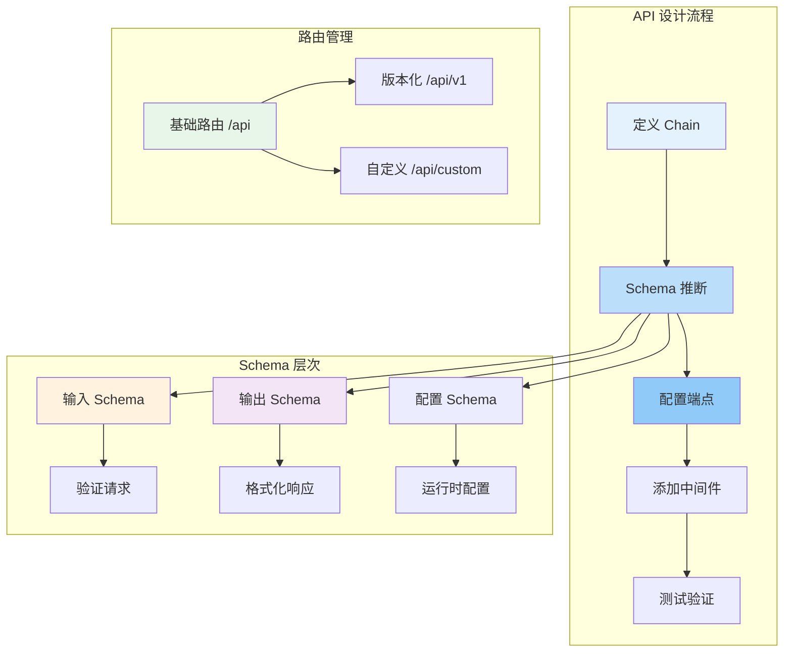

# LangServe API 设计

设计良好的 API 是构建可扩展、易维护的 LLM 服务的关键。本章将深入探讨 LangServe 的 API 设计原则、Schema 推断机制、自定义端点开发以及多路由管理策略。

::: v-pre

:::

## 输入输出 Schema 自动推断

### Schema 推断原理

LangServe 利用 Python 的类型提示和 Pydantic 模型自动推断链的输入输出 Schema。这使得：

- 客户端可以预先知道 API 的期望格式
- 自动生成 OpenAPI 文档
- 请求验证和错误提示
- IDE 自动补全支持

### 基础类型推断

```python
from langchain_core.prompts import ChatPromptTemplate
from langchain_openai import ChatOpenAI
from langchain_core.output_parsers import StrOutputParser

# 简单链 - 自动推断输入变量
prompt = ChatPromptTemplate.from_messages([
    ("human", "翻译以下内容到{language}: {text}")
])

chain = prompt | ChatOpenAI() | StrOutputParser()

# 推断的输入 Schema:
# {
#     "type": "object",
#     "properties": {
#         "language": {"type": "string"},
#         "text": {"type": "string"}
#     },
#     "required": ["language", "text"]
# }
```

### 使用 Pydantic 模型

```python
from pydantic import BaseModel, Field
from langchain_core.runnables import RunnableLambda

# 定义输入模型
class TranslationInput(BaseModel):
    text: str = Field(
        description="需要翻译的文本内容",
        min_length=1,
        max_length=5000
    )
    target_language: str = Field(
        description="目标语言",
        examples=["英语", "日语", "法语"]
    )
    include_pronunciation: bool = Field(
        default=False,
        description="是否包含发音标注"
    )

# 定义输出模型
class TranslationOutput(BaseModel):
    original_text: str
    translated_text: str
    target_language: str
    confidence_score: float = Field(
        ge=0, le=1,
        description="翻译置信度分数"
    )

# 创建链（使用 RunnableLambda 包装）
def translate(input: TranslationInput) -> TranslationOutput:
    # 实际的翻译逻辑
    result = perform_translation(input.text, input.target_language)
    return TranslationOutput(
        original_text=input.text,
        translated_text=result,
        target_language=input.target_language,
        confidence_score=0.95
    )

chain = RunnableLambda(translate)

# 现在 API 会自动使用这些模型的 Schema
```

### 自定义输入 Schema

当自动推断的 Schema 不符合需求时，可以手动指定：

```python
from pydantic import BaseModel, Field
from langserve import add_routes

class CustomInputSchema(BaseModel):
    query: str = Field(description="用户查询")
    context: list[str] = Field(
        default=[],
        description="可选的上下文文档列表"
    )
    max_tokens: int = Field(
        default=1000,
        ge=100,
        le=4000,
        description="最大输出 token 数"
    )

# 使用自定义 Schema
add_routes(
    app,
    chain,
    path="/qa",
    input_schema=CustomInputSchema,
)
```

### 自定义输出 Schema

```python
from pydantic import BaseModel

class CustomOutputSchema(BaseModel):
    answer: str
    sources: list[str]
    confidence: float
    processing_time_ms: int

add_routes(
    app,
    chain,
    path="/qa",
    output_schema=CustomOutputSchema,
)
```

### 复杂嵌套 Schema

```python
from typing import Optional, Union, Literal
from pydantic import BaseModel, Field

class Message(BaseModel):
    role: Literal["system", "human", "ai"]
    content: str

class ConversationInput(BaseModel):
    messages: list[Message] = Field(
        description="对话历史"
    )
    model_config: Optional[dict] = Field(
        default=None,
        description="模型配置"
    )
    system_prompt: Optional[str] = Field(
        default=None,
        description="自定义系统提示词"
    )

class Usage(BaseModel):
    prompt_tokens: int
    completion_tokens: int
    total_tokens: int

class ConversationOutput(BaseModel):
    response: Message
    usage: Usage
    model: str
    finish_reason: str
```

## 自定义端点

### 添加自定义 API 端点

虽然 LangServe 自动生成标准端点，但你可能需要添加自定义端点来处理特殊需求：

```python
from fastapi import FastAPI, HTTPException, BackgroundTasks
from langserve import add_routes
from pydantic import BaseModel

app = FastAPI()

# 标准 LangServe 路由
add_routes(app, chain, path="/api/translate")

# 自定义端点：获取翻译统计
class TranslationStats(BaseModel):
    total_translations: int
    avg_response_time_ms: float
    error_rate: float

@app.get("/api/stats", response_model=TranslationStats)
async def get_translation_stats():
    # 从数据库或缓存获取统计信息
    return TranslationStats(
        total_translations=10000,
        avg_response_time_ms=250.5,
        error_rate=0.02
    )

# 自定义端点：批量异步翻译
class BatchTranslateRequest(BaseModel):
    texts: list[str]
    target_language: str
    callback_url: Optional[str] = None

class BatchTranslateResponse(BaseModel):
    job_id: str
    status: str

@app.post("/api/batch-async", response_model=BatchTranslateResponse)
async def batch_async_translate(
    request: BatchTranslateRequest,
    background_tasks: BackgroundTasks
):
    import uuid
    job_id = str(uuid.uuid4())
    
    # 将任务加入后台处理
    background_tasks.add_task(
        process_batch_translation,
        job_id,
        request.texts,
        request.target_language,
        request.callback_url
    )
    
    return BatchTranslateResponse(job_id=job_id, status="queued")

async def process_batch_translation(job_id, texts, language, callback_url):
    # 后台处理逻辑
    pass
```

### 添加 Webhook 端点

```python
from fastapi import FastAPI, Request, Header
from langserve import add_routes

app = FastAPI()
add_routes(app, chain, path="/api")

@app.post("/webhook/langsmith")
async def langsmith_webhook(
    request: Request,
    x_langsmith_signature: str = Header(...)
):
    """
    接收 LangSmith 的 webhook 通知
    """
    payload = await request.json()
    
    # 验证签名
    if not verify_signature(payload, x_langsmith_signature):
        raise HTTPException(status_code=401, detail="Invalid signature")
    
    # 处理事件
    event_type = payload.get("type")
    if event_type == "feedback.created":
        handle_feedback_created(payload)
    elif event_type == "run.completed":
        handle_run_completed(payload)
    
    return {"status": "ok"}
```

### 文件上传端点

```python
from fastapi import UploadFile, File
from langserve import add_routes

app = FastAPI()
add_routes(app, chain, path="/api/summarize")

@app.post("/api/upload-document")
async def upload_document(file: UploadFile = File(...)):
    """
    上传文档进行摘要
    """
    # 验证文件类型
    if not file.filename.endswith(('.pdf', '.docx', '.txt')):
        raise HTTPException(
            status_code=400,
            detail="不支持的文件格式"
        )
    
    # 读取文件内容
    content = await file.read()
    
    # 调用链处理
    result = await chain.ainvoke({"document": content.decode()})
    
    return {
        "filename": file.filename,
        "summary": result
    }
```

### 流式文件下载

```python
from fastapi import Response
from fastapi.responses import StreamingResponse
import io

@app.get("/api/export/{job_id}")
async def export_results(job_id: str):
    """
    导出处理结果为文件
    """
    # 获取结果
    results = get_job_results(job_id)
    
    # 生成 CSV
    output = io.StringIO()
    output.write("id,text,result\n")
    for r in results:
        output.write(f'{r["id"]},"{r["text"]}","{r["result"]}"\n')
    
    return StreamingResponse(
        io.BytesIO(output.getvalue().encode()),
        media_type="text/csv",
        headers={"Content-Disposition": f"attachment; filename={job_id}.csv"}
    )
```

## CORS 配置

### 基础 CORS 设置

```python
from fastapi import FastAPI
from fastapi.middleware.cors import CORSMiddleware

app = FastAPI()

# 配置 CORS
app.add_middleware(
    CORSMiddleware,
    allow_origins=[
        "http://localhost:3000",      # 开发环境
        "https://myapp.example.com",   # 生产环境
    ],
    allow_credentials=True,  # 允许携带凭证（cookies）
    allow_methods=["GET", "POST", "PUT", "DELETE", "OPTIONS"],
    allow_headers=["*"],  # 或指定具体头部
    expose_headers=["X-Request-ID", "X-Processing-Time"],
    max_age=600,  # 预检请求缓存时间（秒）
)
```

### 动态 CORS 配置

```python
from fastapi.middleware.cors import CORSMiddleware

ALLOWED_ORIGINS = {
    "development": ["http://localhost:3000", "http://localhost:8080"],
    "staging": ["https://staging.myapp.com"],
    "production": ["https://myapp.com", "https://www.myapp.com"],
}

import os
env = os.getenv("ENVIRONMENT", "development")

app.add_middleware(
    CORSMiddleware,
    allow_origins=ALLOWED_ORIGINS.get(env, []),
    allow_credentials=True,
    allow_methods=["*"],
    allow_headers=["*"],
)
```

### CORS 预检处理

对于复杂请求，浏览器会先发送 OPTIONS 预检请求。FastAPI 自动处理这些请求，但你也可以自定义：

```python
from fastapi import FastAPI, Request, Response

app = FastAPI()

@app.options("/{path:path}")
async def preflight_handler(request: Request, path: str):
    """
    自定义 CORS 预检处理
    """
    headers = {
        "Access-Control-Allow-Origin": "https://myapp.com",
        "Access-Control-Allow-Methods": "POST, OPTIONS",
        "Access-Control-Allow-Headers": "Content-Type, Authorization",
        "Access-Control-Max-Age": "600",
    }
    return Response(status_code=200, headers=headers)
```

## 多 Runnable 路由

### 部署多个链

```python
from fastapi import FastAPI
from langserve import add_routes

app = FastAPI()

# 翻译服务
add_routes(app, translation_chain, path="/translate")

# 摘要服务
add_routes(app, summarization_chain, path="/summarize")

# 问答服务
add_routes(app, qa_chain, path="/qa")

# 代理服务
add_routes(app, agent_chain, path="/agent")

# 访问路径示例：
# POST /translate/invoke
# POST /summarize/invoke
# POST /qa/invoke
# POST /agent/invoke
```

### 带前缀的路由

```python
from fastapi import FastAPI, APIRouter
from langserve import add_routes

app = FastAPI()

# 创建路由组
api_v1 = APIRouter(prefix="/api/v1")
api_v2 = APIRouter(prefix="/api/v2")

# V1 版本
add_routes(api_v1, translation_chain_v1, path="/translate")

# V2 版本
add_routes(api_v2, translation_chain_v2, path="/translate")

# 注册路由组
app.include_router(api_v1)
app.include_router(api_v2)

# 访问路径：
# /api/v1/translate/invoke
# /api/v2/translate/invoke
```

### 条件路由

```python
from fastapi import FastAPI, Request
from langserve import add_routes

app = FastAPI()

# 根据环境配置决定启用哪些路由
import os

add_routes(app, translation_chain, path="/translate")

if os.getenv("ENABLE_EXPERIMENTAL", "false") == "true":
    add_routes(app, experimental_chain, path="/experimental")

# 根据功能标志动态控制
FEATURE_FLAGS = {
    "voice_support": True,
    "image_analysis": False,
}

if FEATURE_FLAGS["voice_support"]:
    add_routes(app, voice_chain, path="/voice")
```

### 路由中间件

```python
from fastapi import FastAPI, Request
from langserve import add_routes
import time
import uuid

app = FastAPI()

# 为特定路由添加中间件
@app.middleware("http")
async def add_request_id(request: Request, call_next):
    # 为每个请求生成唯一 ID
    request_id = str(uuid.uuid4())
    request.state.request_id = request_id
    
    start_time = time.time()
    response = await call_next(request)
    duration = time.time() - start_time
    
    # 添加自定义响应头
    response.headers["X-Request-ID"] = request_id
    response.headers["X-Processing-Time"] = f"{duration:.3f}s"
    
    return response

# 只针对特定路径的中间件
@app.middleware("http")
async def auth_middleware(request: Request, call_next):
    if request.url.path.startswith("/api/"):
        # 验证 API 请求
        api_key = request.headers.get("X-API-Key")
        if not validate_api_key(api_key):
            from fastapi import HTTPException
            raise HTTPException(status_code=401, detail="Invalid API key")
    
    return await call_next(request)

add_routes(app, chain, path="/api")
```

### 路由聚合

```python
from fastapi import FastAPI, APIRouter
from langserve import add_routes

app = FastAPI()

# 创建服务路由组
translation_router = APIRouter(prefix="/translation")
qa_router = APIRouter(prefix="/qa")
agent_router = APIRouter(prefix="/agent")

# 为每个服务添加路由
add_routes(translation_router, translation_chain, path="")
add_routes(qa_router, qa_chain, path="")
add_routes(agent_router, agent_chain, path="")

# 注册所有路由组
app.include_router(translation_router)
app.include_router(qa_router)
app.include_router(agent_router)

# 添加统一的健康检查
@app.get("/health")
async def health_check():
    return {
        "status": "healthy",
        "services": ["translation", "qa", "agent"]
    }
```

## 请求响应格式化

### 自定义响应格式

```python
from fastapi import FastAPI
from fastapi.responses import JSONResponse
from langserve import add_routes
from typing import Any, Dict

app = FastAPI()

# 自定义响应包装器
def wrap_response(data: Any, success: bool = True, message: str = None) -> Dict:
    return {
        "success": success,
        "message": message,
        "data": data,
        "timestamp": time.time()
    }

# 使用自定义响应
@app.post("/api/custom-response")
async def custom_response(request: dict):
    result = await chain.ainvoke(request)
    return JSONResponse(
        content=wrap_response(result, message="处理成功")
    )
```

### 错误处理标准化

```python
from fastapi import FastAPI, HTTPException, Request
from fastapi.responses import JSONResponse
from langserve import add_routes

app = FastAPI()

# 全局异常处理器
@app.exception_handler(HTTPException)
async def http_exception_handler(request: Request, exc: HTTPException):
    return JSONResponse(
        status_code=exc.status_code,
        content={
            "success": False,
            "error": {
                "code": exc.status_code,
                "message": exc.detail,
                "type": "http_error"
            }
        }
    )

@app.exception_handler(Exception)
async def general_exception_handler(request: Request, exc: Exception):
    return JSONResponse(
        status_code=500,
        content={
            "success": False,
            "error": {
                "code": 500,
                "message": str(exc),
                "type": "internal_error"
            }
        }
    )

add_routes(app, chain, path="/api")
```

## 性能优化

### 请求体大小限制

```python
from fastapi import FastAPI

app = FastAPI(
    # 限制请求体大小为 10MB
    docs_url=None,  # 禁用 Swagger UI（可选）
)

# 或使用中间件
@app.middleware("http")
async def check_request_size(request: Request, call_next):
    content_length = request.headers.get("content-length")
    if content_length and int(content_length) > 10 * 1024 * 1024:
        from fastapi import HTTPException
        raise HTTPException(
            status_code=413,
            detail="请求体过大，最大支持 10MB"
        )
    return await call_next(request)
```

### 响应缓存

```python
from fastapi import FastAPI, Response
from fastapi_cache import FastAPICache
from fastapi_cache.backends.redis import RedisBackend
from fastapi_cache.decorator import cache
import redis

app = FastAPI()

# 配置 Redis 缓存
redis_client = redis.Redis(host="localhost", port=6379)
FastAPICache.init(RedisBackend(redis_client), prefix="api-cache")

@app.post("/api/cached")
@cache(expire=300)  # 缓存 5 分钟
async def cached_endpoint(request: dict):
    return await chain.ainvoke(request)
```

### 连接复用

```python
from httpx import AsyncClient
from langchain_openai import ChatOpenAI

# 创建共享的 HTTP 客户端
http_client = AsyncClient()

# 多个链共享同一个客户端
llm1 = ChatOpenAI(client=http_client)
llm2 = ChatOpenAI(client=http_client)

# 在服务关闭时清理
@app.on_event("shutdown")
async def shutdown_event():
    await http_client.aclose()
```

## 常见问题

### Q1: 如何调试 Schema 问题？

A: 访问 `/input_schema` 和 `/output_schema` 端点查看实际推断的 Schema：

```bash
curl http://localhost:8000/api/input_schema | python -m json.tool
curl http://localhost:8000/api/output_schema | python -m json.tool
```

### Q2: 如何处理必填字段缺失？

A: FastAPI 会自动验证并返回 422 错误：

```json
{
    "detail": [
        {
            "loc": ["body", "text"],
            "msg": "field required",
            "type": "value_error.missing"
        }
    ]
}
```

### Q3: 可以修改自动生成的端点行为吗？

A: 可以，使用自定义端点覆盖或添加额外的处理逻辑。

### Q4: 如何实现 API 限流？

A: 使用 fastapi-limiter 或自定义中间件，参考 [认证与限流](/langserve/auth-rate-limit) 章节。

## 下一步

- 了解 [流式输出详解](/langserve/streaming-output)
- 学习 [认证与限流](/langserve/auth-rate-limit)
- 探索 [生产部署架构](/langserve/auth-rate-limit)

---

<Badge type="info" text="最后更新：2026-05-31" />
<Badge type="tip" text="FastAPI 版本：0.100+" />