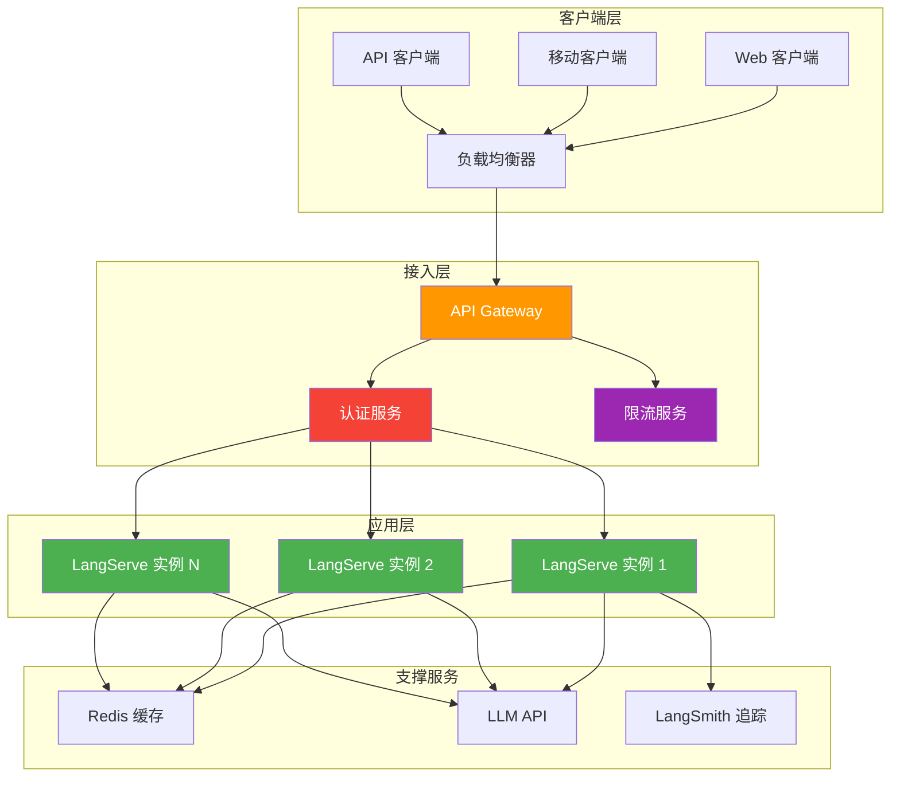
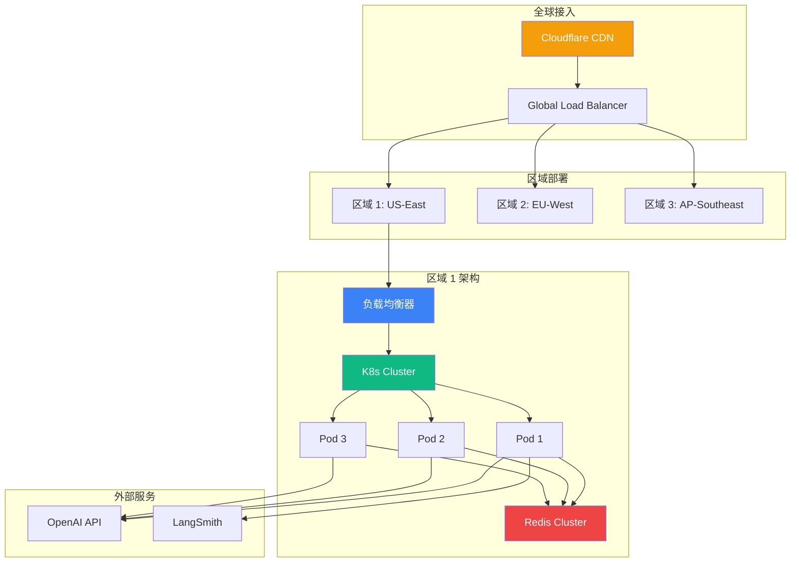

# LangServe 认证与限流

将 LangServe 应用部署到生产环境需要考虑安全性、可扩展性和成本效益。本章将详细介绍认证方案、限流策略、生产部署架构以及运营最佳实践。

::: v-pre

:::

## 认证方案

### API Key 认证（基础方案）

最简单直接的认证方式，适合内部服务或受信任的客户端。

```python
from fastapi import FastAPI, Depends, HTTPException, Header
from langserve import add_routes
from typing import Optional

app = FastAPI()

# API Key 存储（生产环境应从环境变量或密钥管理服务获取）
VALID_API_KEYS = {
    "sk-proj-abc123": {"name": "Project A", "rate_limit": 100},
    "sk-proj-def456": {"name": "Project B", "rate_limit": 50},
    "sk-admin-xyz": {"name": "Admin", "rate_limit": 1000},
}

async def verify_api_key(x_api_key: Optional[str] = Header(None)):
    """验证 API Key"""
    if not x_api_key:
        raise HTTPException(
            status_code=401,
            detail="缺少 API Key",
            headers={"WWW-Authenticate": "Bearer"},
        )
    
    if x_api_key not in VALID_API_KEYS:
        raise HTTPException(
            status_code=401,
            detail="无效的 API Key",
            headers={"WWW-Authenticate": "Bearer"},
        )
    
    return VALID_API_KEYS[x_api_key]

# 受保护的 LangServe 路由
add_routes(
    app,
    chain,
    path="/api",
    dependencies=[Depends(verify_api_key)],
)

# 公开的健康检查端点
@app.get("/health")
async def health_check():
    return {"status": "healthy"}
```

### 使用 API Key 中间件

```python
from fastapi import FastAPI, Request
from starlette.middleware.base import BaseHTTPMiddleware

class APIKeyMiddleware(BaseHTTPMiddleware):
    async def dispatch(self, request: Request, call_next):
        # 跳过健康检查端点
        if request.url.path in ["/health", "/metrics"]:
            return await call_next(request)
        
        api_key = request.headers.get("X-API-Key")
        if not api_key or not is_valid_key(api_key):
            from starlette.responses import JSONResponse
            return JSONResponse(
                status_code=401,
                content={"error": "Invalid API key"}
            )
        
        return await call_next(request)

app = FastAPI()
app.add_middleware(APIKeyMiddleware)
```

### JWT 认证（推荐方案）

适合多租户、需要细粒度权限控制的场景。

```python
from fastapi import FastAPI, Depends, HTTPException, Header
from fastapi.security import HTTPBearer, HTTPAuthorizationCredentials
from jose import jwt, JWTError
from datetime import datetime, timedelta
import os

app = FastAPI()
security = HTTPBearer()

SECRET_KEY = os.getenv("JWT_SECRET_KEY", "your-secret-key")
ALGORITHM = "HS256"

def create_access_token(data: dict, expires_delta: timedelta = None):
    """生成 JWT Token"""
    to_encode = data.copy()
    expire = datetime.utcnow() + (expires_delta or timedelta(hours=1))
    to_encode.update({"exp": expire})
    return jwt.encode(to_encode, SECRET_KEY, algorithm=ALGORITHM)

async def verify_jwt(
    credentials: HTTPAuthorizationCredentials = Depends(security)
):
    """验证 JWT Token"""
    try:
        payload = jwt.decode(
            credentials.credentials,
            SECRET_KEY,
            algorithms=[ALGORITHM]
        )
        return payload
    except JWTError:
        raise HTTPException(
            status_code=401,
            detail="Invalid or expired token",
            headers={"WWW-Authenticate": "Bearer"},
        )

def verify_scope(required_scope: str):
    """验证 Token 权限范围"""
    async def scope_checker(payload: dict = Depends(verify_jwt)):
        user_scopes = payload.get("scopes", [])
        if required_scope not in user_scopes:
            raise HTTPException(
                status_code=403,
                detail="Insufficient permissions"
            )
        return payload
    return scope_checker

# 使用 JWT 保护路由
add_routes(
    app,
    chain,
    path="/api",
    dependencies=[Depends(verify_jwt)],
)

# 需要特定权限的路由
@app.get("/admin/stats", dependencies=[Depends(verify_scope("admin"))])
async def admin_stats():
    return {"total_requests": 10000}

# Token 生成端点
@app.post("/auth/token")
async def get_token(username: str, password: str):
    # 实际应用中应验证用户名密码
    if authenticate_user(username, password):
        token = create_access_token(
            data={
                "sub": username,
                "scopes": ["read", "write"]
            }
        )
        return {"access_token": token, "token_type": "bearer"}
    raise HTTPException(status_code=401, detail="Invalid credentials")
```

### OAuth2 认证（企业级方案）

适合需要与第三方身份提供商（如 Google、GitHub、企业 AD）集成的场景。

```python
from fastapi import FastAPI, Depends, HTTPException, status
from fastapi.security import OAuth2PasswordBearer
from fastapi.middleware.cors import CORSMiddleware

app = FastAPI()

# 配置 OAuth2
oauth2_scheme = OAuth2PasswordBearer(tokenUrl="token")

# CORS 配置（OAuth2 需要）
app.add_middleware(
    CORSMiddleware,
    allow_origins=["https://accounts.google.com", "https://github.com"],
    allow_credentials=True,
    allow_methods=["*"],
    allow_headers=["*"],
)

async def get_current_user(token: str = Depends(oauth2_scheme)):
    """获取当前用户"""
    # 验证 Token（可以是 OAuth2 provider 的 token）
    user = await verify_oauth_token(token)
    if not user:
        raise HTTPException(
            status_code=status.HTTP_401_UNAUTHORIZED,
            detail="Invalid authentication credentials",
            headers={"WWW-Authenticate": "Bearer"},
        )
    return user

# 使用 OAuth2 保护路由
add_routes(
    app,
    chain,
    path="/api",
    dependencies=[Depends(get_current_user)],
)
```

### 认证方案对比

| 方案 | 复杂度 | 安全性 | 适用场景 |
|------|--------|--------|---------|
| **API Key** | ⭐ | ⭐⭐⭐ | 内部服务、服务间调用 |
| **JWT** | ⭐⭐⭐ | ⭐⭐⭐⭐ | 多租户、需要权限控制 |
| **OAuth2** | ⭐⭐⭐⭐⭐ | ⭐⭐⭐⭐⭐ | 企业级、第三方集成 |

## 限流策略

### 基础限流（内存方式）

适合单实例、开发环境。

```python
from fastapi import FastAPI, Request, HTTPException
from fastapi.responses import JSONResponse
from collections import defaultdict
import time

app = FastAPI()

# 简单的内存限流器
class InMemoryRateLimiter:
    def __init__(self, requests_per_minute: int = 60):
        self.requests = defaultdict(list)
        self.rpm = requests_per_minute
    
    def is_allowed(self, client_id: str) -> bool:
        now = time.time()
        # 清理 1 分钟前的请求
        self.requests[client_id] = [
            t for t in self.requests[client_id]
            if now - t < 60
        ]
        
        if len(self.requests[client_id]) >= self.rpm:
            return False
        
        self.requests[client_id].append(now)
        return True

rate_limiter = InMemoryRateLimiter(requests_per_minute=60)

@app.middleware("http")
async def rate_limit_middleware(request: Request, call_next):
    client_id = request.client.host
    
    if not rate_limiter.is_allowed(client_id):
        return JSONResponse(
            status_code=429,
            content={"error": "Too many requests"},
            headers={"Retry-After": "60"}
        )
    
    return await call_next(request)
```

### Redis 限流（推荐方案）

适合多实例、生产环境。

```python
from fastapi import FastAPI, Request, HTTPException
from fastapi.responses import JSONResponse
import redis.asyncio as redis
import time

app = FastAPI()

# Redis 客户端
redis_client = redis.Redis(host="localhost", port=6379, db=0)

class RedisRateLimiter:
    def __init__(self, redis: redis.Redis, rps: int = 10):
        self.redis = redis
        self.rps = rps  # 每秒请求数
        self.window = 1  # 时间窗口（秒）
    
    async def is_allowed(self, key: str) -> tuple[bool, int]:
        """
        检查请求是否允许
        返回：(是否允许，剩余重试秒数)
        """
        now = int(time.time())
        window_key = f"rate_limit:{key}:{now // self.window}"
        
        # 使用 Redis INCR 和 EXPIRE
        current = await self.redis.incr(window_key)
        if current == 1:
            await self.redis.expire(window_key, self.window)
        
        if current > self.rps:
            retry_after = self.window - (now % self.window)
            return False, retry_after
        
        return True, 0

rate_limiter = RedisRateLimiter(redis_client, rps=10)

@app.middleware("http")
async def rate_limit_middleware(request: Request, call_next):
    # 获取客户端标识（API Key 或 IP）
    api_key = request.headers.get("X-API-Key")
    client_id = api_key if api_key else request.client.host
    
    allowed, retry_after = await rate_limiter.is_allowed(client_id)
    
    if not allowed:
        return JSONResponse(
            status_code=429,
            content={"error": "Rate limit exceeded"},
            headers={"Retry-After": str(retry_after)}
        )
    
    response = await call_next(request)
    return response
```

### 基于令牌桶的限流

适合需要突发流量处理的场景。

```python
import aioredis
import time

class TokenBucketLimiter:
    def __init__(self, redis, capacity: int, refill_rate: float):
        """
        Args:
            capacity: 桶容量（最大令牌数）
            refill_rate: 令牌补充速率（令牌/秒）
        """
        self.redis = redis
        self.capacity = capacity
        self.refill_rate = refill_rate
    
    async def acquire(self, key: str, tokens: int = 1) -> tuple[bool, dict]:
        pipe = self.redis.pipeline()
        now = time.time()
        bucket_key = f"bucket:{key}"
        timestamp_key = f"bucket_ts:{key}"
        
        # 获取当前令牌数和上次更新时间
        tokens_available = await self.redis.get(bucket_key)
        last_update = await self.redis.get(timestamp_key)
        
        tokens_available = float(tokens_available or self.capacity)
        last_update = float(last_update or now)
        
        # 补充令牌
        elapsed = now - last_update
        tokens_available = min(
            self.capacity,
            tokens_available + elapsed * self.refill_rate
        )
        
        if tokens_available >= tokens:
            tokens_available -= tokens
            pipe.set(bucket_key, tokens_available)
            pipe.set(timestamp_key, now)
            await pipe.execute()
            return True, {"remaining": int(tokens_available)}
        
        # 计算等待时间
        wait_time = (tokens - tokens_available) / self.refill_rate
        return False, {"retry_after": wait_time}

# 使用示例
limiter = TokenBucketLimiter(
    redis_client,
    capacity=100,      # 最大 100 个令牌
    refill_rate=10     # 每秒补充 10 个
)
```

### 分层限流策略

针对不同用户等级实施不同限流策略。

```python
RATE_LIMITS = {
    "free": {"rpm": 60, "rph": 1000},    # 免费用户
    "basic": {"rpm": 300, "rph": 10000},  # 基础用户
    "pro": {"rpm": 1000, "rph": 50000},   # 专业用户
    "enterprise": {"rpm": 5000, "rph": None},  # 企业用户（无小时限制）
}

async def get_user_tier(api_key: str) -> str:
    """获取用户等级"""
    # 从数据库或缓存获取
    return await redis_client.hget(f"user:{api_key}", "tier") or "free"

class TieredRateLimiter:
    def __init__(self):
        self.limiters = {}
        for tier, limits in RATE_LIMITS.items():
            self.limiters[tier] = RedisRateLimiter(
                redis_client,
                rps=limits["rpm"] // 60
            )
    
    async def check(self, api_key: str) -> tuple[bool, str]:
        tier = await get_user_tier(api_key)
        limiter = self.limiters.get(tier, self.limiters["free"])
        
        allowed, retry_after = await limiter.is_allowed(api_key)
        if not allowed:
            return False, f"Upgrade to {next_tier(tier)} for higher limits"
        return True, tier

tiered_limiter = TieredRateLimiter()

@app.middleware("http")
async def rate_limit_middleware(request: Request, call_next):
    api_key = request.headers.get("X-API-Key")
    if not api_key:
        return await call_next(request)
    
    allowed, message = await tiered_limiter.check(api_key)
    if not allowed:
        return JSONResponse(
            status_code=429,
            content={"error": "Rate limit exceeded", "message": message},
            headers={"Retry-After": "60"}
        )
    
    return await call_next(request)
```

## 生产部署

### Docker 部署

```dockerfile
# Dockerfile
FROM python:3.11-slim

WORKDIR /app

# 安装系统依赖
RUN apt-get update && apt-get install -y \
    gcc \
    && rm -rf /var/lib/apt/lists/*

# 安装 Python 依赖
COPY requirements.txt .
RUN pip install --no-cache-dir -r requirements.txt

# 复制应用代码
COPY . .

# 创建非 root 用户
RUN useradd -m -u 1000 appuser && chown -R appuser:appuser /app
USER appuser

# 暴露端口
EXPOSE 8000

# 健康检查
HEALTHCHECK --interval=30s --timeout=10s --start-period=5s --retries=3 \
    CMD curl -f http://localhost:8000/health || exit 1

# 启动命令
CMD ["uvicorn", "server:app", "--host", "0.0.0.0", "--port", "8000", "--workers", "4"]
```

```yaml
# docker-compose.yml
version: '3.8'

services:
  api:
    build: .
    ports:
      - "8000:8000"
    environment:
      - OPENAI_API_KEY=${OPENAI_API_KEY}
      - LANGSMITH_API_KEY=${LANGSMITH_API_KEY}
      - JWT_SECRET_KEY=${JWT_SECRET_KEY}
      - REDIS_URL=redis://redis:6379
    depends_on:
      - redis
    restart: unless-stopped
    deploy:
      replicas: 3
      resources:
        limits:
          cpus: '2'
          memory: 2G

  redis:
    image: redis:7-alpine
    volumes:
      - redis_data:/data
    restart: unless-stopped

  nginx:
    image: nginx:alpine
    ports:
      - "80:80"
      - "443:443"
    volumes:
      - ./nginx.conf:/etc/nginx/nginx.conf
      - ./ssl:/etc/nginx/ssl
    depends_on:
      - api
    restart: unless-stopped

volumes:
  redis_data:
```

### Kubernetes 部署

```yaml
# k8s-deployment.yaml
apiVersion: apps/v1
kind: Deployment
metadata:
  name: langserve-api
spec:
  replicas: 3
  selector:
    matchLabels:
      app: langserve-api
  template:
    metadata:
      labels:
        app: langserve-api
    spec:
      containers:
      - name: api
        image: my-registry/langserve-api:latest
        ports:
        - containerPort: 8000
        env:
        - name: OPENAI_API_KEY
          valueFrom:
            secretKeyRef:
              name: api-secrets
              key: openai-api-key
        - name: JWT_SECRET_KEY
          valueFrom:
            secretKeyRef:
              name: api-secrets
              key: jwt-secret
        resources:
          requests:
            cpu: "500m"
            memory: "512Mi"
          limits:
            cpu: "2000m"
            memory: "2Gi"
        livenessProbe:
          httpGet:
            path: /health
            port: 8000
          initialDelaySeconds: 30
          periodSeconds: 10
        readinessProbe:
          httpGet:
            path: /health
            port: 8000
          initialDelaySeconds: 5
          periodSeconds: 5
---
apiVersion: v1
kind: Service
metadata:
  name: langserve-api
spec:
  selector:
    app: langserve-api
  ports:
  - port: 80
    targetPort: 8000
  type: ClusterIP
---
apiVersion: networking.k8s.io/v1
kind: Ingress
metadata:
  name: langserve-ingress
  annotations:
    kubernetes.io/ingress.class: nginx
    nginx.ingress.kubernetes.io/rate-limit: "100"
    nginx.ingress.kubernetes.io/rate-limit-window: "1m"
spec:
  rules:
  - host: api.example.com
    http:
      paths:
      - path: /
        pathType: Prefix
        backend:
          service:
            name: langserve-api
            port:
              number: 80
```

### 云函数部署

#### AWS Lambda

```python
# lambda_handler.py
from mangum import Mangum
from server import app

# 将 FastAPI 应用转换为 Lambda 处理器
handler = Mangum(app)
```

```yaml
# serverless.yml
service: langserve-api

provider:
  name: aws
  runtime: python3.11
  region: us-east-1
  environment:
    OPENAI_API_KEY: ${env:OPENAI_API_KEY}
    LANGSMITH_API_KEY: ${env:LANGSMITH_API_KEY}

functions:
  api:
    handler: lambda_handler.handler
    events:
      - http:
          path: /{proxy+}
          method: ANY
    timeout: 30
    memorySize: 1024
```

#### Google Cloud Functions

```python
# main.py
from functions_framework import http
from server import app
from mangum import Mangum

handler = Mangum(app)

@http
def api(request):
    return handler(request.scope, request.receive)
```

## 健康检查与监控

### 健康检查端点

```python
from fastapi import FastAPI
from pydantic import BaseModel
import time
import asyncio

app = FastAPI()

class HealthStatus(BaseModel):
    status: str
    timestamp: float
    version: str
    services: dict

@app.get("/health", response_model=HealthStatus)
async def health_check():
    """基础健康检查"""
    return HealthStatus(
        status="healthy",
        timestamp=time.time(),
        version="1.0.0",
        services={}
    )

@app.get("/health/detailed")
async def detailed_health_check():
    """详细健康检查"""
    services = {}
    
    # 检查 LLM API
    try:
        start = time.time()
        await test_llm_connection()
        services["llm"] = {
            "status": "healthy",
            "latency_ms": (time.time() - start) * 1000
        }
    except Exception as e:
        services["llm"] = {"status": "unhealthy", "error": str(e)}
    
    # 检查 Redis
    try:
        start = time.time()
        await redis_client.ping()
        services["redis"] = {
            "status": "healthy",
            "latency_ms": (time.time() - start) * 1000
        }
    except Exception as e:
        services["redis"] = {"status": "unhealthy", "error": str(e)}
    
    # 检查 LangSmith
    try:
        from langsmith import Client
        client = Client()
        client.read_project(project_name="default")
        services["langsmith"] = {"status": "healthy"}
    except Exception as e:
        services["langsmith"] = {"status": "unhealthy", "error": str(e)}
    
    overall_status = "healthy" if all(
        s["status"] == "healthy" for s in services.values()
    ) else "degraded"
    
    return {
        "status": overall_status,
        "timestamp": time.time(),
        "version": "1.0.0",
        "services": services
    }

async def test_llm_connection():
    """测试 LLM 连接"""
    from langchain_openai import ChatOpenAI
    llm = ChatOpenAI(model="gpt-3.5-turbo")
    await llm.ainvoke("test")
```

### Prometheus 指标

```python
from fastapi import FastAPI
from prometheus_fastapi_instrumentator import Instrumentator

app = FastAPI()

# 添加 Prometheus 指标
Instrumentator().instrument(app).expose(app)

# 自定义指标
from prometheus_client import Counter, Histogram, Gauge

# 定义指标
REQUEST_COUNT = Counter(
    "api_requests_total",
    "Total API requests",
    ["endpoint", "method", "status"]
)

REQUEST_LATENCY = Histogram(
    "api_request_latency_seconds",
    "API request latency",
    ["endpoint"]
)

ACTIVE_CONNECTIONS = Gauge(
    "api_active_connections",
    "Number of active connections"
)

@app.middleware("http")
async def metrics_middleware(request: Request, call_next):
    start_time = time.time()
    
    try:
        response = await call_next(request)
        
        # 记录请求
        REQUEST_COUNT.labels(
            endpoint=request.url.path,
            method=request.method,
            status=response.status_code
        ).inc()
        
        # 记录延迟
        REQUEST_LATENCY.labels(
            endpoint=request.url.path
        ).observe(time.time() - start_time)
        
        return response
    except Exception as e:
        REQUEST_COUNT.labels(
            endpoint=request.url.path,
            method=request.method,
            status=500
        ).inc()
        raise
```

### 日志配置

```python
import logging
import sys
from pythonjsonlogger import jsonlogger

# 配置 JSON 日志
logger = logging.getLogger()
logHandler = logging.StreamHandler(sys.stdout)
formatter = jsonlogger.JsonFormatter(
    fmt="%(asctime)s %(levelname)s %(name)s %(message)s"
)
logHandler.setFormatter(formatter)
logger.addHandler(logHandler)
logger.setLevel(logging.INFO)

# 在应用中使用
@app.middleware("http")
async def logging_middleware(request: Request, call_next):
    logger.info(
        "Request received",
        extra={
            "method": request.method,
            "path": request.url.path,
            "client_ip": request.client.host,
        }
    )
    
    start_time = time.time()
    response = await call_next(request)
    
    logger.info(
        "Request completed",
        extra={
            "method": request.method,
            "path": request.url.path,
            "status": response.status_code,
            "duration_ms": (time.time() - start_time) * 1000,
        }
    )
    
    return response
```

## 成本控制

### Token 使用监控

```python
from langsmith import Client
from datetime import datetime, timedelta

client = Client()

def get_token_usage(project_name: str, days: int = 7) -> dict:
    """获取 Token 使用统计"""
    traces = client.list_traces(
        project_name=project_name,
        filter=f"gte(start_time, {(datetime.now() - timedelta(days=days)).isoformat()})"
    )
    
    total_input = 0
    total_output = 0
    
    for trace in traces:
        if hasattr(trace, 'extra') and trace.extra:
            metadata = trace.extra.get('metadata', {})
            total_input += metadata.get('prompt_tokens', 0)
            total_output += metadata.get('completion_tokens', 0)
    
    return {
        "input_tokens": total_input,
        "output_tokens": total_output,
        "total_tokens": total_input + total_output,
        "period_days": days
    }
```

### 成本优化策略

| 策略 | 说明 | 预期节省 |
|------|------|---------|
| **选择合适模型** | 根据场景选择性价比最高的模型 | 30-70% |
| **提示词优化** | 精简提示词，减少无关内容 | 10-30% |
| **响应长度限制** | 设置 max_tokens 上限 | 10-50% |
| **缓存重复请求** | 使用 Redis 缓存相似查询结果 | 20-60% |
| **批量处理** | 合并多个请求为批量调用 | 10-30% |
| **流式输出** | 减少等待时间，提升体验 | 体验优化 |

### 预算告警

```python
COST_THRESHOLDS = {
    "warning": 100,    # 警告阈值（美元）
    "critical": 200,   # 严重阈值
    "shutdown": 500,   # 停止服务阈值
}

async def check_budget_and_alert():
    """检查预算并发送告警"""
    current_cost = await calculate_monthly_cost()
    
    if current_cost >= COST_THRESHOLDS["shutdown"]:
        # 停止服务
        await shutdown_service()
        await send_alert("服务已停止，超出预算", level="critical")
    elif current_cost >= COST_THRESHOLDS["critical"]:
        await send_alert(f"成本严重超出：${current_cost:.2f}", level="critical")
    elif current_cost >= COST_THRESHOLDS["warning"]:
        await send_alert(f"成本警告：${current_cost:.2f}", level="warning")

async def calculate_monthly_cost() -> float:
    """计算本月成本"""
    usage = get_token_usage("production", days=30)
    
    # GPT-4o 定价（示例）
    input_price = 0.000005  # $ per token
    output_price = 0.000015
    
    return (
        usage["input_tokens"] * input_price +
        usage["output_tokens"] * output_price
    )
```

## 部署架构对比

### 生产部署架构

::: v-pre

:::

### 部署规模建议

| 规模 | 日请求量 | 推荐架构 | 预估成本/月 |
|------|---------|---------|------------|
| **开发** | <100 | 单容器 | <$50 |
| **小型** | 100-1000 | 2-3 实例 + Redis | $100-300 |
| **中型** | 1000-10000 | K8s 集群 + CDN | $500-2000 |
| **大型** | 10000+ | 多区域 + 自动扩展 | $2000+ |

## 常见问题

### Q1: 如何处理 API Key 泄露？

A: 
1. 立即撤销泄露的 Key
2. 生成新 Key 并分发给授权用户
3. 审查访问日志确认是否有异常
4. 考虑添加 IP 白名单限制

### Q2: 限流太严格导致用户体验差怎么办？

A: 
1. 实施分层限流（免费/付费用户不同限制）
2. 添加排队机制而不是直接拒绝
3. 提供升级途径让用户获取更多配额

### Q3: 如何在 K8s 中管理 Secret？

A: 使用 Kubernetes Secrets 或外部密钥管理服务：

```bash
# 创建 Secret
kubectl create secret generic api-secrets \
  --from-literal=openai-api-key="$OPENAI_API_KEY" \
  --from-literal=jwt-secret="$JWT_SECRET"
```

### Q4: 如何实现零停机部署？

A: 使用滚动更新策略：

```yaml
spec:
  strategy:
    type: RollingUpdate
    rollingUpdate:
      maxSurge: 1
      maxUnavailable: 0
```

## 下一步

- 回顾 [LangSmith 概览](/langsmith/langsmith-overview)
- 学习 [LangServe 快速部署](/langserve/quick-deploy)
- 探索 [更多 LangChain 主题](/langsmith/langsmith-overview)

---

<Badge type="info" text="最后更新：2026-05-31" />
<Badge type="tip" text="安全建议：定期轮换密钥和证书" />