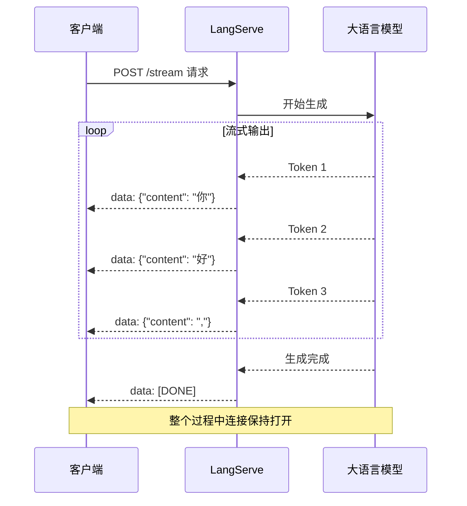
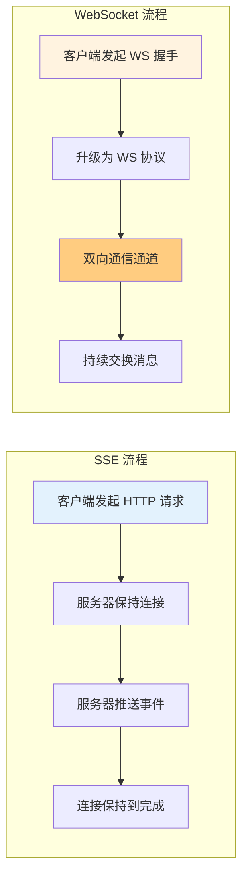

# LangServe 流式输出

流式输出是 LLM 应用的关键特性之一，它允许在模型生成响应时逐步返回内容，显著提升用户体验。LangServe 内置了对 Server-Sent Events (SSE) 的支持，使得实现流式输出变得简单。本章将深入探讨流式输出的工作原理、配置方法和最佳实践。

::: v-pre

:::

## 流式输出基础

### 什么是 SSE？

**Server-Sent Events (SSE)** 是一种允许服务器向浏览器推送实时更新的技术。它基于 HTTP 长连接，具有以下特点：

| 特性 | SSE | WebSocket |
|------|-----|-----------|
| **协议** | HTTP/HTTPS | WebSocket (ws/wss) |
| **连接方向** | 单向（服务器→客户端） | 双向 |
| **数据格式** | 文本（通常是 JSON） | 二进制或文本 |
| **重连机制** | 内置自动重连 | 需手动实现 |
| **浏览器支持** | 现代浏览器（除 IE） | 所有现代浏览器 |
| **适用场景** | 实时通知、流式响应 | 实时聊天、游戏 |

对于 LLM 流式输出，SSE 是更合适的选择，因为：
- 只需要单向数据流（服务器→客户端）
- 基于 HTTP，更容易通过防火墙和代理
- 内置重连机制，更可靠
- 实现简单，LangServe 开箱即用

### 最小流式示例

```python
from fastapi import FastAPI
from langserve import add_routes
from langchain_openai import ChatOpenAI
from langchain_core.prompts import ChatPromptTemplate
from langchain_core.output_parsers import StrOutputParser

app = FastAPI()

# 创建链
prompt = ChatPromptTemplate.from_messages([
    ("human", "{input}")
])

chain = prompt | ChatOpenAI(streaming=True) | StrOutputParser()

# 添加路由（stream 端点默认启用）
add_routes(app, chain, path="/api")

if __name__ == "__main__":
    import uvicorn
    uvicorn.run(app, host="0.0.0.0", port=8000)
```

### 测试流式端点

```bash
# 使用 curl 测试流式输出
curl -N -X POST http://localhost:8000/api/stream \
  -H "Content-Type: application/json" \
  -d '{"input": "讲一个短故事"}'

# 使用 Python 测试
import requests

response = requests.post(
    "http://localhost:8000/api/stream",
    json={"input": "讲一个短故事"},
    stream=True
)

for line in response.iter_lines():
    if line:
        print(line.decode())
```

## /stream 端点详解

### 默认行为

LangServe 的 `/stream` 端点会自动处理链的流式输出。当链支持流式时（如 ChatOpenAI 设置了 `streaming=True`），响应会以 SSE 格式逐步发送。

### SSE 事件格式

LangServe 使用标准 SSE 格式发送事件：

```
event: data
data: {"content": "你"}

event: data
data: {"content": "好"}

event: data
data: {"content": ","}

event: end
data: [DONE]
```

### 事件类型

| 事件类型 | 说明 | 数据格式 |
|---------|------|---------|
| **data** | 常规数据块 | JSON 对象 |
| **error** | 错误信息 | `{"error": "错误信息"}` |
| **metadata** | 元数据（如 run_id） | `{"run_id": "uuid"}` |
| **end** | 流结束 | `[DONE]` |

### 完整的 SSE 响应示例

```
event: metadata
data: {"run_id": "abc-123-xyz", "feedback_token": "token123"}

event: data
data: {"content": "你"}

event: data
data: {"content": "好"}

event: data
data: {"content": "，"}

event: data
data: {"content": "我"}

event: data
data: {"content": "是"}

event: data
data: {"content": "助"}

event: data
data: {"content": "手"}

event: data
data: {"content": "."}

event: end
data: [DONE]
```

## 事件流格式深入

### 自定义事件格式

你可以通过自定义链来处理特殊的事件格式：

```python
from langchain_core.output_parsers import BaseStreamOutputParser
from pydantic import BaseModel

class StreamData(BaseModel):
    delta: str
    metadata: dict

class CustomOutputParser(BaseStreamOutputParser):
    def parse(self, text: str) -> str:
        return text

# 创建自定义流式链
parser = CustomOutputParser()
chain = prompt | ChatOpenAI(streaming=True) | parser
```

### 流式日志输出

LangServe 还提供了 `/stream_log` 端点，用于输出更详细的执行日志：

```python
import requests

response = requests.post(
    "http://localhost:8000/api/stream_log",
    json={"input": "你好"},
    stream=True
)

for line in response.iter_lines():
    if line:
        event = line.decode()
        print(f"日志事件：{event}")
```

**日志事件示例：**

```json
{
    "op": "add",
    "path": "/streamed_output/-",
    "value": "你"
}
{
    "op": "add",
    "path": "/streamed_output/-",
    "value": "好"
}
{
    "op": "complete",
    "path": ""
}
```

## 前端消费流式 API

### JavaScript/TypeScript 示例

```typescript
// 使用 Fetch API 消费流式响应
async function streamCompletion(input: string) {
    const response = await fetch('http://localhost:8000/api/stream', {
        method: 'POST',
        headers: {
            'Content-Type': 'application/json',
        },
        body: JSON.stringify({ input }),
    });

    if (!response.ok) {
        throw new Error(`HTTP error: ${response.status}`);
    }

    const reader = response.body?.getReader();
    const decoder = new TextDecoder();
    let content = '';

    while (true) {
        const { done, value } = await reader!.read();
        if (done) break;

        const chunk = decoder.decode(value);
        const lines = chunk.split('\n');

        for (const line of lines) {
            if (line.startsWith('data: ')) {
                const data = line.slice(6);
                if (data === '[DONE]') {
                    continue;
                }
                
                try {
                    const parsed = JSON.parse(data);
                    content += parsed.content ?? '';
                    console.log('累积内容:', content);
                } catch (e) {
                    console.error('解析错误:', e);
                }
            }
        }
    }

    return content;
}

// 使用示例
streamCompletion('讲一个故事').then(content => {
    console.log('完整响应:', content);
});
```

### React 组件示例

```tsx
import { useState } from 'react';

function StreamingChat() {
    const [input, setInput] = useState('');
    const [response, setResponse] = useState('');
    const [isLoading, setIsLoading] = useState(false);

    const handleSubmit = async (e: React.FormEvent) => {
        e.preventDefault();
        setIsLoading(true);
        setResponse('');

        try {
            const res = await fetch('http://localhost:8000/api/stream', {
                method: 'POST',
                headers: { 'Content-Type': 'application/json' },
                body: JSON.stringify({ input }),
            });

            const reader = res.body?.getReader();
            const decoder = new TextDecoder();

            while (true) {
                const { done, value } = await reader!.read();
                if (done) break;

                const chunk = decoder.decode(value);
                const lines = chunk.split('\n');

                for (const line of lines) {
                    if (line.startsWith('data: ')) {
                        const data = line.slice(6);
                        if (data === '[DONE]') continue;
                        
                        const parsed = JSON.parse(data);
                        setResponse(prev => prev + (parsed.content ?? ''));
                    }
                }
            }
        } catch (error) {
            console.error('流式请求失败:', error);
        } finally {
            setIsLoading(false);
        }
    };

    return (
        <div>
            <form onSubmit={handleSubmit}>
                <input
                    value={input}
                    onChange={e => setInput(e.target.value)}
                    placeholder="输入问题..."
                />
                <button type="submit" disabled={isLoading}>
                    {isLoading ? '生成中...' : '发送'}
                </button>
            </form>
            <div>{response}</div>
        </div>
    );
}
```

### Python 客户端示例

```python
from langserve import RemoteRunnable

# 创建远程链
remote_chain = RemoteRunnable("http://localhost:8000/api")

# 流式调用
for chunk in remote_chain.stream({"input": "讲一个故事"}):
    print(chunk, end='', flush=True)

print()  # 换行
```

### 使用 EventSource API

```javascript
// 对于 GET 请求，可以使用 EventSource
const eventSource = new EventSource('http://localhost:8000/api/stream?input=你好');

eventSource.onmessage = (event) => {
    const data = JSON.parse(event.data);
    console.log('收到数据:', data.content);
};

eventSource.onerror = (error) => {
    console.error('连接错误:', error);
    eventSource.close();
};

// 完成后关闭
// eventSource.close();
```

## WebSocket vs SSE

### 技术对比

::: v-pre

:::

| 对比维度 | SSE | WebSocket |
|---------|-----|-----------|
| **连接建立** | HTTP 请求，简单 | 握手升级，稍复杂 |
| **通信方向** | 单向（服务器→客户端） | 双向 |
| **数据格式** | 文本（可 JSON） | 二进制或文本 |
| **重连** | 内置 | 需手动实现 |
| **浏览器支持** | 除 IE 外都支持 | 所有现代浏览器 |
| **代理友好** | 是（标准 HTTP） | 可能有问题 |
| **延迟** | 低 | 极低 |
| **带宽开销** | 低 | 低 |
| **LLM 流式适用性** | ⭐⭐⭐⭐⭐ | ⭐⭐⭐⭐ |

### 何时选择 SSE

选择 SSE 的场景：
1. **LLM 文本生成**：只需要单向流式传输
2. **实时通知**：服务器推送更新
3. **简单实时数据**：股票价格、进度更新
4. **需要自动重连**：SSE 内置重连机制
5. **需要穿越代理**：基于 HTTP，兼容性好

### 何时选择 WebSocket

选择 WebSocket 的场景：
1. **双向实时通信**：在线聊天室、协作编辑
2. **低延迟要求**：在线游戏、高频交易
3. **二进制数据传输**：音视频流
4. **需要客户端主动推送**：聊天消息、命令

### 使用 WebSocket 的 LangServe 示例

虽然 LangServe 默认使用 SSE，但你也可以添加 WebSocket 支持：

```python
from fastapi import FastAPI, WebSocket
from langserve import add_routes

app = FastAPI()
add_routes(app, chain, path="/api")

@app.websocket("/ws")
async def websocket_endpoint(websocket: WebSocket):
    await websocket.accept()
    
    while True:
        # 接收客户端消息
        data = await websocket.receive_text()
        input_data = json.loads(data)
        
        # 流式发送响应
        async for chunk in chain.astream(input_data):
            await websocket.send_text(json.dumps({"content": chunk}))
        
        # 发送结束标记
        await websocket.send_text(json.dumps({"done": True}))
```

## 流式输出最佳实践

### 1. 处理错误

```typescript
async function streamWithRetry(input: string, maxRetries = 3) {
    let retries = 0;
    
    while (retries < maxRetries) {
        try {
            const response = await fetch('/api/stream', {
                method: 'POST',
                headers: { 'Content-Type': 'application/json' },
                body: JSON.stringify({ input }),
            });

            if (!response.ok) {
                throw new Error(`HTTP ${response.status}`);
            }

            const reader = response.body?.getReader();
            // ... 处理流
            return;
        } catch (error) {
            retries++;
            if (retries >= maxRetries) {
                throw error;
            }
            // 等待后重试
            await new Promise(r => setTimeout(r, 1000 * retries));
        }
    }
}
```

### 2. 显示加载状态

```tsx
function useStreamingResponse() {
    const [content, setContent] = useState('');
    const [status, setStatus] = useState<'idle' | 'streaming' | 'complete' | 'error'>('idle');

    const stream = async (input: string) => {
        setStatus('streaming');
        setContent('');

        try {
            const res = await fetch('/api/stream', {
                method: 'POST',
                body: JSON.stringify({ input }),
            });

            const reader = res.body?.getReader();
            const decoder = new TextDecoder();

            while (true) {
                const { done, value } = await reader!.read();
                if (done) {
                    setStatus('complete');
                    break;
                }

                const chunk = decoder.decode(value);
                for (const line of chunk.split('\n')) {
                    if (line.startsWith('data: ')) {
                        const data = JSON.parse(line.slice(6));
                        setContent(prev => prev + (data.content ?? ''));
                    }
                }
            }
        } catch (error) {
            setStatus('error');
            throw error;
        }
    };

    return { content, status, stream };
}
```

### 3. 取消流式请求

```typescript
function useCancellableStream() {
    const abortControllerRef = useRef<AbortController | null>(null);

    const stream = async (input: string, onChunk: (chunk: string) => void) => {
        // 取消之前的请求
        abortControllerRef.current?.abort();
        
        const abortController = new AbortController();
        abortControllerRef.current = abortController;

        try {
            const response = await fetch('/api/stream', {
                method: 'POST',
                headers: { 'Content-Type': 'application/json' },
                body: JSON.stringify({ input }),
                signal: abortController.signal,
            });

            const reader = response.body?.getReader();
            const decoder = new TextDecoder();

            while (true) {
                const { done, value } = await reader!.read();
                if (done) break;

                const chunk = decoder.decode(value);
                for (const line of chunk.split('\n')) {
                    if (line.startsWith('data: ')) {
                        const data = JSON.parse(line.slice(6));
                        onChunk(data.content ?? '');
                    }
                }
            }
        } finally {
            abortControllerRef.current = null;
        }
    };

    const cancel = () => {
        abortControllerRef.current?.abort();
        abortControllerRef.current = null;
    };

    return { stream, cancel };
}
```

### 4. 处理 Token 限制

```python
from langserve import add_routes
from langchain_core.runnables import RunnablePassthrough

# 添加输出长度限制
def limit_output(output: str, max_length: int = 1000) -> str:
    if len(output) > max_length:
        return output[:max_length] + "..."
    return output

chain_with_limit = chain | RunnablePassthrough.assign(
    output=lambda x: limit_output(x.get("output", ""), 1000)
)

add_routes(app, chain_with_limit, path="/api")
```

## 性能优化

### 批处理

```python
from langserve import add_routes

# 配置批处理参数
add_routes(
    app,
    chain,
    path="/api",
    # 流式批处理配置
    batch_size=10,
)
```

### 连接池

```python
import httpx
from langchain_openai import ChatOpenAI

# 配置 HTTP 客户端连接池
httpx_client = httpx.AsyncClient(
    limits=httpx.Limits(
        max_keepalive_connections=50,
        max_connections=100,
    ),
    timeout=httpx.Timeout(30.0),
)

llm = ChatOpenAI(
    client=httpx_client,
    streaming=True,
)
```

### 缓冲区优化

```python
# 前端优化：使用较大的读取缓冲区
const reader = response.body?.getReader();
const CHUNK_SIZE = 1024 * 16; // 16KB

while (true) {
    const { done, value } = await reader.read();
    if (done) break;
    
    // 处理较大 chunk，减少渲染次数
    processChunk(value);
}
```

## 常见问题

### Q1: 流式输出不完整怎么办？

A: 检查以下几点：
1. 确保模型设置了 `streaming=True`
2. 检查网络是否稳定
3. 验证输出解析器是否支持流式
4. 查看服务器日志是否有错误

### Q2: 如何处理中文乱码？

A: 确保正确的字符编码：

```python
# 服务器端
@app.post("/api/stream")
async def stream_endpoint():
    return StreamingResponse(
        event_generator(),
        media_type="text/event-stream; charset=utf-8"
    )
```

```javascript
// 客户端
const decoder = new TextDecoder('utf-8');
```

### Q3: 流式输出延迟高怎么办？

A: 优化建议：
1. 使用更快的模型
2. 减少提示词长度
3. 优化网络延迟
4. 使用更近的服务器区域

### Q4: 如何实现打字机效果？

A: 前端逐字渲染：

```tsx
function TypewriterEffect({ text }) {
    const [displayed, setDisplayed] = useState('');
    
    useEffect(() => {
        let index = 0;
        const interval = setInterval(() => {
            setDisplayed(text.slice(0, index + 1));
            index++;
            if (index >= text.length) clearInterval(interval);
        }, 50); // 每 50ms 显示一个字
        
        return () => clearInterval(interval);
    }, [text]);
    
    return <div>{displayed}</div>;
}
```

## 下一步

- 学习 [认证与限流](/langserve/auth-rate-limit)
- 了解 [生产部署架构](/langserve/auth-rate-limit)
- 探索 [LangSmith 集成](/langsmith/langsmith-overview)

---

<Badge type="info" text="最后更新：2026-05-31" />
<Badge type="tip" text="SSE 规范：W3C Recommendation" />