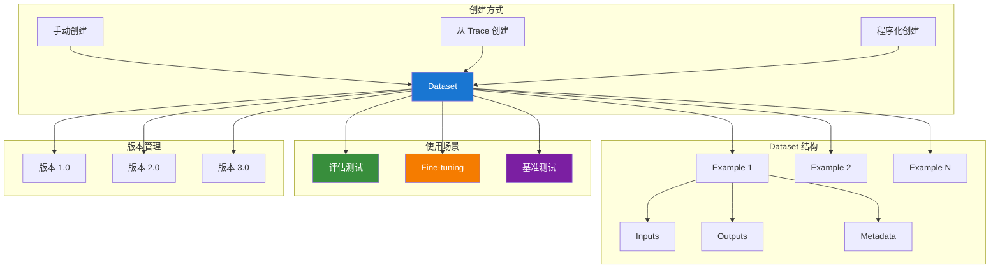
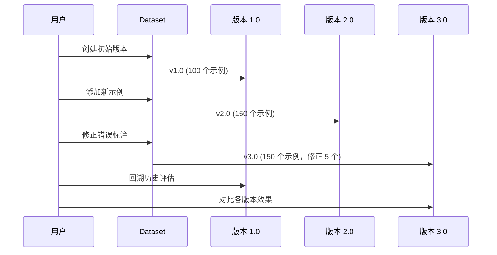

# LangSmith Dataset 数据集管理

Dataset（数据集）是 LangSmith 评估系统的基础。一个高质量的数据集可以帮助你准确评估 LLM 应用的性能、发现潜在问题、并追踪改进效果。本章将详细介绍数据集的创建、管理和最佳实践。

::: v-pre

:::

## Dataset 与 Example 的概念

### 什么是 Dataset？

**Dataset（数据集）** 是一组相关 Example（示例）的集合，用于评估和测试 LLM 应用。数据集可以包含问答对、对话样本、输入 - 输出对等任何形式的数据。

### 什么是 Example？

**Example（示例）** 是数据集的基本单位，包含：

- **Inputs（输入）**：传递给应用的输入数据
- **Outputs（输出）**：期望的正确输出（可选，用于监督评估）
- **Metadata（元数据）**：额外的上下文信息

### 数据模型结构

```python
# Example 的数据结构
{
    "id": "example-uuid",
    "dataset_id": "dataset-uuid",
    "inputs": {
        "question": "什么是 LangSmith？",
        "context": "可选的上下文信息"
    },
    "outputs": {
        "answer": "LangSmith 是 LangChain 的追踪和评估平台",
        "explanation": "详细解释..."
    },
    "metadata": {
        "difficulty": "easy",
        "category": "product-knowledge",
        "created_by": "human-reviewer"
    },
    "created_at": "2024-01-01T10:00:00Z",
    "modified_at": "2024-01-02T10:00:00Z"
}
```

## 创建 Dataset 的方式

### 方式一：手动创建（适合小规模数据）

```python
from langsmith import Client

client = Client()

# 创建数据集
dataset = client.create_dataset(
    dataset_name="customer-support-qa",
    description="客服场景常见问题及答案",
    metadata={
        "domain": "customer-support",
        "language": "zh-CN",
        "version": "1.0"
    }
)

# 添加示例
examples = [
    {
        "inputs": {"question": "如何重置密码？"},
        "outputs": {"answer": "请访问登录页面，点击'忘记密码'，按照提示操作。"},
        "metadata": {"category": "account", "difficulty": "easy"}
    },
    {
        "inputs": {"question": "退款需要多久？"},
        "outputs": {"answer": "退款通常在 3-5 个工作日内到账。"},
        "metadata": {"category": "payment", "difficulty": "easy"}
    },
    {
        "inputs": {"question": "如何联系客服？"},
        "outputs": {"answer": "您可以通过在线聊天、邮件或电话联系我们的客服团队。"},
        "metadata": {"category": "contact", "difficulty": "easy"}
    },
]

for ex in examples:
    client.create_example(
        inputs=ex["inputs"],
        outputs=ex["outputs"],
        metadata=ex.get("metadata"),
        dataset_id=dataset.id
    )

print(f"创建完成：{len(examples)} 个示例")
```

### 方式二：从 Trace 创建（适合从生产数据构建）

```python
from langsmith import Client

client = Client()

# 从生产环境的 Trace 中筛选高质量样本
traces = client.list_traces(
    project_name="production-support-bot",
    filter='and(eq(metadata.status, "success"), gt(feedback_score, 0.8))',
    limit=100
)

# 创建数据集
dataset = client.create_dataset(
    dataset_name="production-golden-set",
    description="从生产环境提取的高质量问答对"
)

# 从 Trace 提取 Example
for trace in traces:
    # 获取根 Run 的输入输出
    root_run = client.read_run(trace.root_run_id)
    
    client.create_example(
        inputs=root_run.inputs,
        outputs=root_run.outputs,
        metadata={
            "source": "production",
            "trace_id": trace.id,
            "feedback_score": trace.feedback_stats.get("user_rating", {}).get("avg_score", 0)
        },
        dataset_id=dataset.id
    )

print(f"从 Trace 导入了 {len(traces)} 个示例")
```

### 方式三：程序化创建（适合批量导入）

```python
from langsmith import Client
import pandas as pd
from typing import List, Dict

client = Client()

def create_dataset_from_csv(
    csv_path: str,
    dataset_name: str,
    input_columns: List[str],
    output_columns: List[str],
    description: str = ""
):
    """
    从 CSV 文件批量创建数据集
    
    Args:
        csv_path: CSV 文件路径
        dataset_name: 数据集名称
        input_columns: 输入列名
        output_columns: 输出列名
        description: 数据集描述
    """
    # 读取 CSV
    df = pd.read_csv(csv_path)
    
    # 创建数据集
    dataset = client.create_dataset(
        dataset_name=dataset_name,
        description=description
    )
    
    # 批量添加示例
    examples = []
    for _, row in df.iterrows():
        inputs = {col: row[col] for col in input_columns}
        outputs = {col: row[col] for col in output_columns}
        
        examples.append({
            "inputs": inputs,
            "outputs": outputs,
            "metadata": {
                "source": "csv_import",
                "row_index": row.name
            }
        })
    
    # 批量创建
    client.create_examples(
        inputs=[ex["inputs"] for ex in examples],
        outputs=[ex["outputs"] for ex in examples],
        metadata=[ex["metadata"] for ex in examples],
        dataset_id=dataset.id
    )
    
    return dataset

# 使用示例
dataset = create_dataset_from_csv(
    csv_path="benchmark-questions.csv",
    dataset_name="qa-benchmark-2024",
    input_columns=["question", "context"],
    output_columns=["answer", "source"],
    description="2024 年问答基准测试集"
)
```

### 方式四：从现有 Dataset 复制

```python
from langsmith import Client

client = Client()

# 获取源数据集的所有示例
source_dataset = client.read_dataset(dataset_name="source-dataset")
source_examples = list(client.list_examples(dataset_id=source_dataset.id))

# 创建新的数据集
new_dataset = client.create_dataset(
    dataset_name="derived-dataset",
    description="从源数据集派生的测试集"
)

# 复制并修改示例
for ex in source_examples:
    # 可以修改 inputs/outputs/metadata
    modified_inputs = ex.inputs.copy()
    if "difficulty" in ex.metadata:
        modified_inputs["difficulty_level"] = ex.metadata["difficulty"]
    
    client.create_example(
        inputs=modified_inputs,
        outputs=ex.outputs,
        metadata={**ex.metadata, "derived_from": source_dataset.id},
        dataset_id=new_dataset.id
    )
```

## Example 的结构详解

### 输入格式

Example 的输入可以是任何 JSON 可序列化的数据结构：

```python
# 简单文本输入
simple_input = {"question": "什么是机器学习？"}

# 多轮对话输入
conversation_input = {
    "messages": [
        {"role": "user", "content": "推荐一本书"},
        {"role": "assistant", "content": "您喜欢什么类型的书？"},
        {"role": "user", "content": "科幻类"},
    ]
}

# 带上下文的 RAG 输入
rag_input = {
    "question": "公司的年假政策是什么？",
    "context": [
        "文档 1：员工手册第 5 章 - 休假政策",
        "文档 2：2024 年 HR 通知",
    ],
    "chat_history": [
        {"role": "user", "content": "我想了解休假政策"},
    ]
}

# 结构化输入
structured_input = {
    "intent": "refund_request",
    "entities": {
        "order_id": "12345",
        "reason": "商品损坏",
        "amount": 299.00
    },
    "user_profile": {
        "vip_level": "gold",
        "history_orders": 50
    }
}
```

### 输出格式

输出通常是期望的正确答案：

```python
# 简单答案
simple_output = {"answer": "机器学习是 AI 的一个分支..."}

# 结构化输出
structured_output = {
    "answer": "您可以申请全额退款",
    "action": "create_refund",
    "parameters": {
        "order_id": "12345",
        "amount": 299.00
    },
    "follow_up": "退款将在 3-5 个工作日内到账"
}

# 多答案（用于多正确答案场景）
multi_output = {
    "acceptable_answers": [
        "巴黎是法国首都",
        "法国首都是巴黎",
        "巴黎，位于法国"
    ],
    "exact_answer": "巴黎"
}
```

### 元数据最佳实践

```python
# 丰富的元数据有助于后续分析
rich_metadata = {
    # 分类信息
    "category": "account-management",
    "subcategory": "password-reset",
    "difficulty": "easy",
    
    # 来源信息
    "source": "customer_chat",
    "source_date": "2024-01-15",
    "annotator": "human-reviewer-1",
    
    # 质量信息
    "quality_score": 0.95,
    "verified": True,
    "verification_date": "2024-01-20",
    
    # 业务信息
    "product_line": "premium",
    "region": "cn-east",
    "language": "zh-CN",
    
    # 实验标记
    "test_group": "control",
    "experiment_id": "exp-2024-01"
}
```

## Dataset 在评估中的使用

### 基础评估

```python
from langsmith import Client
from langsmith.evaluation import evaluate, LangChainStringEvaluator

client = Client()

# 定义被评估的 Chain
def my_qa_chain(inputs: dict):
    from langchain_openai import ChatOpenAI
    llm = ChatOpenAI(model="gpt-4o")
    
    prompt = f"请回答以下问题：\n{inputs['question']}"
    response = llm.invoke(prompt)
    
    return {"answer": response.content}

# 使用 Dataset 进行评估
results = evaluate(
    my_qa_chain,
    data="customer-support-qa",  # Dataset 名称
    evaluators=[
        LangChainStringEvaluator("qa"),
        LangChainStringEvaluator("criteria", criteria={"helpfulness": "是否有帮助"}),
    ],
    experiment_prefix="support-bot-v1",
)

# 查看结果统计
scores = [r["scores"]["qa"] for r in results]
print(f"平均得分：{sum(scores) / len(scores):.3f}")
```

### 动态数据加载

```python
from langsmith import Client

client = Client()

# 按条件筛选示例
examples = list(client.list_examples(
    dataset_name="qa-benchmark",
    filters={
        "difficulty": "hard",
        "category": "technical"
    },
    limit=50
))

# 仅评估困难样本
results = evaluate(
    my_chain,
    data=examples,  # 直接传入 Example 列表
    evaluators=evaluators,
    experiment_prefix="hard-samples-eval"
)
```

### 数据分割

```python
from langsmith import Client
from sklearn.model_selection import train_test_split

client = Client()

# 获取所有示例
examples = list(client.list_examples(dataset_name="full-dataset"))

# 分割为训练集和测试集
train_examples, test_examples = train_test_split(
    examples,
    test_size=0.2,
    random_state=42
)

# 创建分割后的数据集
train_dataset = client.create_dataset(
    dataset_name="full-dataset-train",
    description="训练集"
)
test_dataset = client.create_dataset(
    dataset_name="full-dataset-test",
    description="测试集"
)

# 批量导入
client.create_examples(
    inputs=[ex.inputs for ex in train_examples],
    outputs=[ex.outputs for ex in train_examples],
    dataset_id=train_dataset.id
)

client.create_examples(
    inputs=[ex.inputs for ex in test_examples],
    outputs=[ex.outputs for ex in test_examples],
    dataset_id=test_dataset.id
)
```

## 版本管理

### 理解 Dataset 版本

::: v-pre

:::

### 版本命名策略

```python
from langsmith import Client

client = Client()

# 使用有意义的版本命名
versions = [
    {
        "name": "v1.0-initial",
        "description": "初始版本，100 个手工标注样本"
    },
    {
        "name": "v1.1-expanded",
        "description": "扩充到 200 个样本，增加困难样本"
    },
    {
        "name": "v2.0-curated",
        "description": "质量清洗，移除低质量样本"
    },
    {
        "name": "v2.1-balanced",
        "description": "平衡各类别样本数量"
    },
]

for version in versions:
    dataset = client.create_dataset(
        dataset_name=f"qa-benchmark-{version['name']}",
        description=version["description"],
        metadata={"version_tag": version["name"]}
    )
```

### 版本对比

```python
from langsmith import Client
import numpy as np

client = Client()

# 获取不同版本数据集
versions = ["v1.0-initial", "v1.1-expanded", "v2.0-curated"]
version_results = {}

for version in versions:
    # 获取该版本数据集的示例
    dataset = client.read_dataset(dataset_name=f"qa-benchmark-{version}")
    examples = list(client.list_examples(dataset_id=dataset.id))
    
    # 运行评估
    results = evaluate(
        my_chain,
        data=examples,
        evaluators=[LangChainStringEvaluator("qa")],
        experiment_prefix=f"version-compare-{version}"
    )
    
    scores = [r["scores"]["qa"] for r in results]
    version_results[version] = {
        "mean": np.mean(scores),
        "std": np.std(scores),
        "count": len(scores),
        "min": np.min(scores),
        "max": np.max(scores)
    }

# 输出对比表
print("| 版本 | 样本数 | 平均分 | 标准差 | 最低分 | 最高分 |")
print("|------|--------|--------|--------|--------|--------|")
for version, stats in version_results.items():
    print(f"| {version} | {stats['count']} | {stats['mean']:.3f} | {stats['std']:.3f} | {stats['min']:.3f} | {stats['max']:.3f} |")
```

### 回滚到历史版本

```python
# 如果需要"回滚"，可以基于历史版本创建新的工作数据集
client = Client()

# 复制历史版本的示例
old_dataset = client.read_dataset(dataset_name="qa-benchmark-v1.0-initial")
old_examples = list(client.list_examples(dataset_id=old_dataset.id))

# 创建新的工作数据集
new_dataset = client.create_dataset(
    dataset_name="qa-benchmark-working",
    description="基于 v1.0 的工作副本"
)

client.create_examples(
    inputs=[ex.inputs for ex in old_examples],
    outputs=[ex.outputs for ex in old_examples],
    metadata=[{**ex.metadata, "restored_from": "v1.0-initial"} for ex in old_examples],
    dataset_id=new_dataset.id
)
```

## Dataset 管理操作

### 查询和筛选

```python
from langsmith import Client

client = Client()

# 列出所有数据集
datasets = list(client.list_datasets())
for ds in datasets:
    print(f"{ds.name}: {ds.example_count} 个示例")

# 按名称搜索
dataset = client.read_dataset(dataset_name="qa-benchmark")

# 按元数据筛选
filtered_datasets = list(client.list_datasets(
    metadata_filter={"domain": "customer-support"}
))

# 获取数据集详情
print(f"数据集 ID: {dataset.id}")
print(f"创建时间：{dataset.created_at}")
print(f"示例数量：{dataset.example_count}")
print(f"描述：{dataset.description}")
```

### 更新和删除

```python
# 更新数据集元数据
client.update_dataset_metadata(
    dataset_id=dataset.id,
    metadata={
        "status": "active",
        "last_reviewed": "2024-05-31",
        "owner": "nlp-team"
    }
)

# 更新示例
example = client.read_example(example_id="example-uuid")
client.update_example(
    example_id=example.id,
    inputs={"question": "更新后的问题"},
    outputs={"answer": "更新后的答案"},
    metadata={"updated_by": "admin", "update_reason": "修正错误"}
)

# 删除示例
client.delete_example(example_id="example-uuid")

# 删除数据集（谨慎操作！）
client.delete_dataset(dataset_id=dataset.id)
```

### 导入/导出

```python
import json
from langsmith import Client

client = Client()

# 导出为 JSON
def export_dataset(dataset_name: str, output_path: str):
    dataset = client.read_dataset(dataset_name=dataset_name)
    examples = list(client.list_examples(dataset_id=dataset.id))
    
    export_data = {
        "dataset_info": {
            "name": dataset.name,
            "description": dataset.description,
            "metadata": dataset.metadata,
        },
        "examples": [
            {
                "inputs": ex.inputs,
                "outputs": ex.outputs,
                "metadata": ex.metadata,
            }
            for ex in examples
        ]
    }
    
    with open(output_path, 'w', encoding='utf-8') as f:
        json.dump(export_data, f, ensure_ascii=False, indent=2)
    
    print(f"导出完成：{len(examples)} 个示例")

# 从 JSON 导入
def import_dataset(json_path: str, dataset_name: str):
    with open(json_path, 'r', encoding='utf-8') as f:
        data = json.load(f)
    
    dataset = client.create_dataset(
        dataset_name=dataset_name,
        description=data["dataset_info"]["description"],
        metadata=data["dataset_info"]["metadata"]
    )
    
    client.create_examples(
        inputs=[ex["inputs"] for ex in data["examples"]],
        outputs=[ex["outputs"] for ex in data["examples"]],
        metadata=[ex["metadata"] for ex in data["examples"]],
        dataset_id=dataset.id
    )
    
    print(f"导入完成：{len(data['examples'])} 个示例")
    return dataset
```

## 最佳实践

### 1. 数据质量控制

| 检查项 | 方法 | 阈值 |
|-------|------|------|
| **输入完整性** | 检查必填字段 | 100% 完整 |
| **输出质量** | 人工抽样评审 | >90% 准确率 |
| **多样性** | 检查类别分布 | 无单一类别 >50% |
| **重复检测** | 文本相似度检查 | 重复率 <5% |
| **标注一致性** | 多人标注对比 | 一致率 >85% |

```python
def quality_check(examples: list) -> dict:
    """数据集质量检查"""
    issues = {
        "missing_inputs": 0,
        "missing_outputs": 0,
        "empty_fields": 0,
        "duplicates": 0,
    }
    
    seen_inputs = set()
    for ex in examples:
        if not ex.inputs:
            issues["missing_inputs"] += 1
        if not ex.outputs:
            issues["missing_outputs"] += 1
        
        input_str = str(ex.inputs)
        if input_str in seen_inputs:
            issues["duplicates"] += 1
        seen_inputs.add(input_str)
    
    total = len(examples)
    issues["quality_score"] = 1.0 - sum(issues.values()) / (total * 4)
    
    return issues
```

### 2. 数据标注规范

```markdown
# 数据标注指南

## 输入标注
- 问题应清晰、完整、无歧义
- 上下文信息应包含必要背景
- 避免包含敏感信息

## 输出标注
- 答案应准确、完整
- 多个正确答案应全部列出
- 标明答案来源

## 元数据标注
- 必须标注难度等级（easy/medium/hard）
- 必须标注问题类别
- 可选标注子类别
```

### 3. 数据集组织

建议按以下方式组织数据集：

```
datasets/
├── benchmark/           # 基准测试集
│   ├── qa-general       # 通用问答
│   ├── qa-technical     # 技术问答
│   └── qa-domain        # 领域特定
├── training/            # 训练数据
│   ├── train-v1
│   └── train-v2
├── evaluation/          # 评估数据
│   ├── dev-set
│   └── test-set
└── production/          # 生产数据
    ├── golden-set       # 金标准集
    └── regression-set   # 回归测试集
```

### 4. 持续维护

```python
# 定期质量检查
def maintain_dataset(dataset_name: str):
    client = Client()
    dataset = client.read_dataset(dataset_name=dataset_name)
    examples = list(client.list_examples(dataset_id=dataset.id))
    
    # 检查质量
    issues = quality_check(examples)
    
    if issues["quality_score"] < 0.9:
        print(f"警告：{dataset_name} 质量下降")
        print(f"问题详情：{issues}")
        # 可以触发告警或自动修复
    
    return issues

# 每周运行
schedule.every().monday.do(maintain_dataset, "qa-benchmark")
```

## 常见问题

### Q1: Dataset 大小有限制吗？

A: 单个 Dataset 最多可包含 100,000 个 Example。对于更大数据集，建议分割为多个 Dataset。

### Q2: 如何保证数据安全？

A: 
1. 不要在 Example 中存储敏感信息
2. 使用 Metadata 标记敏感数据
3. 对安全敏感的数据使用私有项目

### Q3: 可以批量更新 Example 吗？

A: 目前不支持批量更新，需要逐个更新。可以使用脚本自动化：

```python
for ex in examples_to_update:
    client.update_example(
        example_id=ex.id,
        outputs={"answer": updated_answer}
    )
```

### Q4: 如何共享数据集？

A: 在 LangSmith Dashboard 中：
1. 进入 Dataset 页面
2. 点击 "Share"
3. 添加团队成员或生成分享链接
4. 设置访问权限（查看/编辑）

## 下一步

- 学习 [Prompt 提示词管理](/langsmith/prompt-management)
- 了解 [LangServe 快速部署](/langserve/quick-deploy)
- 探索 [API 设计最佳实践](/langserve/api-design)

---

<Badge type="info" text="最后更新：2026-05-31" />
<Badge type="tip" text="LangSmith SDK: 0.2+" />