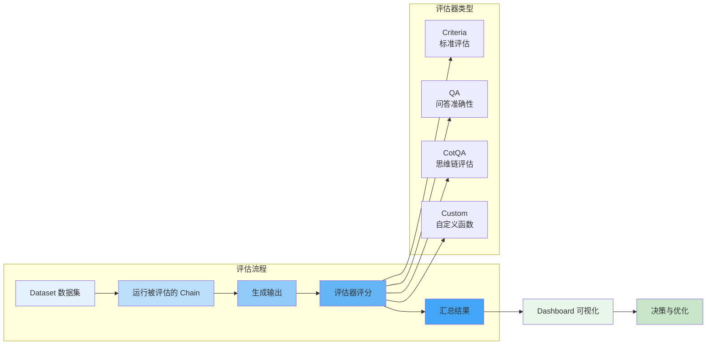
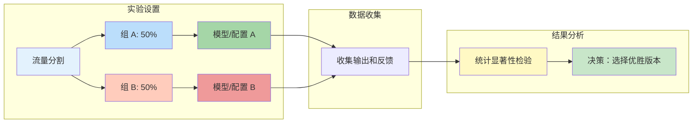

# LangSmith Evaluation 评估体系

评估是 LLM 应用开发中至关重要的一环。LangSmith 提供了一套完整的评估系统，帮助你量化应用性能、对比不同版本、并持续优化质量。本章将详细介绍评估器的使用、实验设计和结果分析。

::: v-pre

:::

## 评估体系概览

### 为什么需要评估？

在传统的软件开发中，我们可以通过单元测试确保代码的正确性。但 LLM 应用的输出是概率性的、主观的，传统的断言测试不再适用。

**LLM 评估的挑战：**

| 挑战 | 传统软件 | LLM 应用 |
|------|---------|---------|
| **输出确定性** | 相同输入 = 相同输出 | 相同输入 ≠ 相同输出 |
| **正确答案** | 明确的预期值 | 可能有多个"正确"答案 |
| **质量维度** | 通过/失败 | 相关性、准确性、安全性等多维度 |
| **评估成本** | 自动化、快速 | 可能需要人工评审 |

LangSmith 的评估系统通过以下方式解决这些问题：

1. **标准化评估器**：预置常用评估器，快速上手
2. **灵活扩展**：支持自定义评估函数
3. **批量评估**：在数据集上批量运行，获取统计结果
4. **可视化对比**：直观展示不同版本的表现

## 评估器类型详解

### 1. Criteria 评估器（标准评估）

基于预定义的标准对输出进行评分，适用于快速质量检查。

```python
from langsmith.evaluation import LangChainStringEvaluator

# 定义评估标准
criteria_evaluator = LangChainStringEvaluator(
    "criteria",
    criteria={
        "helpfulness": "回答是否提供了有用的信息？",
        "relevance": "回答是否与问题相关？",
        "accuracy": "信息是否准确无误？",
        "clarity": "表达是否清晰易懂？",
        "safety": "内容是否安全合规？",
    },
    config={"model": "gpt-4o"}  # 用于评估的模型
)

# 评估单个示例
result = criteria_evaluator.evaluate_strings(
    prediction="LangSmith 是 LangChain 的追踪平台",
    input="什么是 LangSmith？",
    reference="LangSmith 是用于追踪和评估 LLM 应用的平台"
)
print(f"得分：{result['helpfulness']}")
```

**内置标准说明：**

| 标准 | 说明 | 满分标准 |
|------|------|---------|
| **helpfulness** | 帮助性 | 完全解决了用户问题 |
| **relevance** | 相关性 | 内容与问题直接相关 |
| **accuracy** | 准确性 | 所有信息都正确 |
| **clarity** | 清晰度 | 表达流畅、易于理解 |
| **safety** | 安全性 | 无有害、偏见内容 |
| **conciseness** | 简洁性 | 无冗余信息 |
| **creativity** | 创造性 | 回答富有创意和新意 |

### 2. QA 评估器（问答准确性）

专门用于评估问答系统的准确性，需要 Ground Truth（标准答案）。

```python
from langsmith.evaluation import LangChainStringEvaluator

qa_evaluator = LangChainStringEvaluator("qa")

# 评估问答准确性
result = qa_evaluator.evaluate_strings(
    prediction="巴黎是法国的首都，位于塞纳河畔",
    input="法国的首都是哪里？",
    reference="巴黎"
)

print(f"QA 得分：{result['score']}")  # 0-1 之间的分数
```

### 3. CoT QA 评估器（思维链评估）

不仅评估最终答案，还评估推理过程的正确性。

```python
from langsmith.evaluation import LangChainStringEvaluator

cot_qa_evaluator = LangChainStringEvaluator("cot_qa")

# 需要提供思考过程和最终答案
result = cot_qa_evaluator.evaluate_strings(
    prediction="""
思考过程：
1. 小明有 5 个苹果
2. 给了小红 2 个
3. 剩下 5 - 2 = 3 个

答案：3 个
""",
    input="小明有 5 个苹果，给了小红 2 个，还剩几个？",
    reference="3 个"
)
```

### 4. Custom 评估器（自定义评估）

当预置评估器无法满足需求时，可以编写自定义评估函数。

```python
from langsmith.evaluation import evaluate, RunEvaluator
from langsmith.schemas import Example, Run

class CustomEvaluator(RunEvaluator):
    def __init__(self, criteria: str):
        self.criteria = criteria
    
    def evaluate_run(self, run: Run, example: Example) -> dict:
        # 自定义评估逻辑
        prediction = run.outputs.get("output", "")
        reference = example.outputs.get("expected", "")
        
        # 示例：检查是否包含关键词
        required_keywords = ["LangChain", "LangSmith"]
        has_keywords = all(kw in prediction for kw in required_keywords)
        
        return {
            "key": "keyword_match",
            "score": 1.0 if has_keywords else 0.0,
            "comment": f"包含关键词：{has_keywords}"
        }

# 使用自定义评估器
custom_evaluator = CustomEvaluator(criteria="technical_accuracy")
```

### 5. LLM-as-Judge 评估器

使用 LLM 本身作为评判者，适用于主观性较强的评估。

```python
from langchain_openai import ChatOpenAI
from langsmith.evaluation import LangChainStringEvaluator

# 配置 LLM 作为评判者
judge_llm = ChatOpenAI(model="gpt-4o", temperature=0)

llm_judge = LangChainStringEvaluator(
    "criteria",
    config={"model": judge_llm},
    criteria={
        "overall_quality": """
        请从以下维度评估回答质量（1-5 分）：
        - 准确性：信息是否正确
        - 完整性：是否覆盖问题要点
        - 可读性：表达是否清晰
        - 专业性：是否体现专业水准
        """,
    }
)
```

## 运行评估

### 批量评估

```python
from langsmith import Client
from langsmith.evaluation import evaluate, LangChainStringEvaluator
from langchain_openai import ChatOpenAI

client = Client()

# 定义被评估的 Chain
def my_chain(inputs: dict):
    llm = ChatOpenAI(model="gpt-4o")
    response = llm.invoke(inputs["question"])
    return {"answer": response.content}

# 选择评估器
evaluators = [
    LangChainStringEvaluator("qa"),
    LangChainStringEvaluator("criteria", criteria={"helpfulness": "是否有帮助"}),
]

# 运行批量评估
results = evaluate(
    my_chain,
    data="测试问题集",  # Dataset 名称或列表
    evaluators=evaluators,
    experiment_prefix="gpt-4o-v1",  # 实验名称前缀
    metadata={"model": "gpt-4o", "team": "nlp"},
    consecutive_errors=5,  # 连续错误容忍数
    max_concurrency=10,    # 并发数
)

# 处理结果
for result in results:
    print(f"示例：{result['example'].inputs}")
    print(f"得分：{result['scores']}")
    print(f"反馈：{result['feedback']}")
```

### 配置实验参数

```python
results = evaluate(
    my_chain,
    data=client.list_examples(dataset_name="qa-benchmark"),
    evaluators=evaluators,
    experiment_prefix="ab-test",
    
    # 实验配置
    repetition_ids=["rep1"],  # 重复实验 ID
    metadata={
        "model_version": "gpt-4o-2024-05",
        "temperature": 0.7,
        "prompt_version": "v3",
    },
    
    # 运行配置
    max_concurrency=20,
    description="GPT-4o vs GPT-3.5 对比实验"
)
```

## 自动评估 vs 人工评估

### 自动评估

**优势：**
- 快速、可扩展
- 成本较低
- 结果一致性好
- 易于集成到 CI/CD

**局限：**
- 无法评估复杂的主观质量
- 可能遗漏上下文理解问题
- 对模型偏见敏感

**适用场景：**
- 回归测试
- 大规模基准测试
- 持续集成检查

### 人工评估

**优势：**
- 能评估复杂、微妙的质量维度
- 可以发现自动化评估遗漏的问题
- 对业务场景理解更深

**局限：**
- 成本高、速度慢
- 评估者之间可能存在不一致
- 难以大规模进行

**适用场景：**
- 关键功能验收
- 主观质量评估
- 新功能的早期验证

### 混合评估策略

```python
from langsmith import Client
from langsmith.evaluation import evaluate

client = Client()

# 第一阶段：自动评估筛选
auto_results = evaluate(
    my_chain,
    data="validation-set",
    evaluators=[LangChainStringEvaluator("qa")],
    experiment_prefix="auto-filter",
)

# 筛选出需要人工评审的样本
low_score_examples = [
    r for r in auto_results 
    if r["scores"]["qa"] < 0.7
]

# 第二阶段：人工评审
def manual_review(example_ids: list):
    """
    在 LangSmith 中创建人工评审任务
    团队成员可以在 Dashboard 中查看并打分
    """
    for example_id in example_ids:
        client.create_feedback(
            run_id=example_id,
            key="human_review",
            score=None,  # 待人工填写
            comment="需要人工评审"
        )

manual_review([r["example"].id for r in low_score_examples])
```

## A/B 测试与对比实验

### 设置 A/B 测试

::: v-pre

:::

```python
from langsmith.evaluation import evaluate
import numpy as np
from scipy import stats

# 定义两个版本的 Chain
def chain_v1(inputs: dict):
    from langchain_openai import ChatOpenAI
    llm = ChatOpenAI(model="gpt-3.5-turbo")
    return {"answer": llm.invoke(inputs["question"]).content}

def chain_v2(inputs: dict):
    from langchain_openai import ChatOpenAI
    llm = ChatOpenAI(model="gpt-4o")
    return {"answer": llm.invoke(inputs["question"]).content}

# 运行两个实验
data = "benchmark-questions"  # 共享测试集

results_v1 = evaluate(
    chain_v1,
    data=data,
    evaluators=[LangChainStringEvaluator("qa")],
    experiment_prefix="ab-test-v1",
)

results_v2 = evaluate(
    chain_v2,
    data=data,
    evaluators=[LangChainStringEvaluator("qa")],
    experiment_prefix="ab-test-v2",
)

# 提取分数
scores_v1 = [r["scores"]["qa"] for r in results_v1]
scores_v2 = [r["scores"]["qa"] for r in results_v2]

# 统计检验
t_stat, p_value = stats.ttest_ind(scores_v1, scores_v2)
mean_diff = np.mean(scores_v2) - np.mean(scores_v1)

print(f"V1 平均分：{np.mean(scores_v1):.3f}")
print(f"V2 平均分：{np.mean(scores_v2):.3f}")
print(f"提升幅度：{mean_diff:.3f}")
print(f"P 值：{p_value:.4f}")
print(f"统计显著：{p_value < 0.05}")
```

### 多版本对比

```python
from langsmith import Client

client = Client()

# 获取多个实验的结果
experiments = client.list_experiments(
    project_name="my-app",
    reference_dataset="benchmark-questions"
)

# 汇总结果
comparison = {}
for exp in experiments:
    results = client.list_experiment_results(experiment_id=exp.id)
    scores = [r["scores"]["qa"] for r in results]
    comparison[exp.name] = {
        "mean": np.mean(scores),
        "std": np.std(scores),
        "count": len(scores),
    }

# 输出对比表格
print("| 实验 | 平均分 | 标准差 | 样本数 |")
print("|------|--------|--------|--------|")
for name, stats in comparison.items():
    print(f"| {name} | {stats['mean']:.3f} | {stats['std']:.3f} | {stats['count']} |")
```

## 评估结果分析

### Dashboard 可视化

LangSmith Dashboard 提供丰富的可视化工具：

1. **实验对比页面**：并排展示多个实验的结果
2. **分数分布图**：查看分数分布情况
3. **趋势图**：追踪性能随时间的变化
4. **热力图**：发现特定类型问题的模式

### 导出分析数据

```python
import pandas as pd
from langsmith import Client

client = Client()

# 获取实验结果
experiment = client.read_experiment(experiment_name="gpt-4o-evaluation")
results = list(client.list_experiment_results(experiment_id=experiment.id))

# 转换为 DataFrame
df_data = []
for r in results:
    df_data.append({
        "example_id": r["example"].id,
        "input": str(r["example"].inputs),
        "reference": str(r["example"].outputs),
        "prediction": r["run"].outputs.get("output", ""),
        "qa_score": r["scores"].get("qa", None),
        "helpfulness_score": r["scores"].get("helpfulness", None),
        "latency": r["run"].end_time - r["run"].start_time,
    })

df = pd.DataFrame(df_data)

# 分析
print(df.describe())
print(df[df["qa_score"] < 0.5])  # 查看低分样本

# 导出
df.to_csv("evaluation-results.csv", index=False)
```

### 识别问题模式

```python
# 分析低分样本的共同特征
low_score = df[df["qa_score"] < 0.5]

# 检查是否与特定问题类型相关
print("低分样本的问题类型分布:")
print(low_score["input"].str.contains("计算").value_counts())
print(low_score["input"].str.contains("解释").value_counts())

# 检查是否与输入长度相关
low_score["input_length"] = low_score["input"].str.len()
print(f"低分样本平均输入长度：{low_score['input_length'].mean()}")
print(f"高分样本平均输入长度：{df[df['qa_score'] > 0.8]['input'].str.len().mean()}")
```

## 最佳实践

### 1. 构建高质量的 Dataset

```python
from langsmith import Client

client = Client()

# 创建高质量的测试集
client.create_dataset(
    dataset_name="golden-qa-set",
    description="高质量问答案例，用于基准测试"
)

# 添加经过人工审核的示例
examples = [
    {"question": "什么是 LangSmith?", "answer": "LangSmith 是 LangChain 的..."},
    {"question": "如何调试 Agent?", "answer": "可以使用 LangSmith 的追踪功能..."},
]

for ex in examples:
    client.create_example(
        inputs={"question": ex["question"]},
        outputs={"answer": ex["answer"]},
        dataset_name="golden-qa-set"
    )
```

### 2. 选择合适的评估器组合

| 应用场景 | 推荐评估器 |
|---------|-----------|
| **问答系统** | QA + Criteria(accuracy) |
| **客服对话** | Criteria(helpfulness, relevance) + 人工评审 |
| **代码生成** | Custom(代码可执行性) + Criteria(clarity) |
| **内容创作** | Criteria(creativity, clarity) + LLM-as-Judge |
| **数据分析** | Custom(数值准确性) + Criteria(reasoning) |

### 3. 持续监控

```python
# 设置定期评估任务（结合 cron）
import schedule
import time

def weekly_evaluation():
    """每周运行一次评估"""
    results = evaluate(
        production_chain,
        data="weekly-benchmark",
        evaluators=[LangChainStringEvaluator("qa")],
        experiment_prefix=f"weekly-{datetime.now().strftime('%Y%m%d')}",
    )
    
    # 发送报告
    avg_score = np.mean([r["scores"]["qa"] for r in results])
    if avg_score < 0.8:
        send_alert(f"周度质量下降：{avg_score:.2f}")

schedule.every().monday.at("09:00").do(weekly_evaluation)

while True:
    schedule.run_pending()
    time.sleep(3600)
```

### 4. 建立评估基线

在开始优化前，先建立性能基线：

```python
# 基线评估
baseline_results = evaluate(
    current_chain,
    data="benchmark-v1",
    evaluators=evaluators,
    experiment_prefix="baseline-2024-05",
)

baseline_score = np.mean([r["scores"]["qa"] for r in baseline_results])
print(f"基线得分：{baseline_score:.3f}")

# 后续优化目标：提升 5% 以上
target_score = baseline_score * 1.05
```

## 常见问题

### Q1: 评估结果不一致怎么办？

A: LLM 评估器本身有随机性。建议：
1. 使用 temperature=0 的评估模型
2. 对同一示例多次评估取平均
3. 对于关键决策，结合多种评估器

### Q2: 评估运行太慢怎么办？

A: 优化建议：
1. 增加 `max_concurrency`
2. 使用更小的评估模型
3. 对大数据集进行采样
4. 使用缓存减少重复评估

### Q3: 如何评估 RAG 系统？

A: RAG 需要专门的评估器：

```python
from langchain.evaluation import QAEvalChain

# 评估检索质量
retrieval_evaluator = ...

# 评估生成质量
generation_evaluator = LangChainStringEvaluator("qa")

# 组合评估
def rag_evaluator(run, example):
    retrieval_score = retrieval_evaluator(run)
    generation_score = generation_evaluator(run, example)
    return {
        "retrieval": retrieval_score,
        "generation": generation_score,
        "overall": (retrieval_score + generation_score) / 2,
    }
```

### Q4: 如何评估多轮对话？

A: 使用会话级别的评估：

```python
# 评估整个对话序列
def conversation_evaluator(conversation: list):
    # 评估连贯性、一致性、任务完成度
    pass

# 将多轮对话打包为单个示例
client.create_example(
    inputs={"conversation_history": [...]},
    outputs={"success": True, "turns": 5},
    dataset_name="conversation-benchmark"
)
```

## 下一步

- 学习 [Dataset 数据集管理](/langsmith/dataset)
- 了解 [Prompt 提示词管理](/langsmith/prompt-management)
- 探索 [LangServe 快速部署](/langserve/quick-deploy)

---

<Badge type="info" text="最后更新：2026-05-31" />
<Badge type="tip" text="LangSmith SDK: 0.2+" />