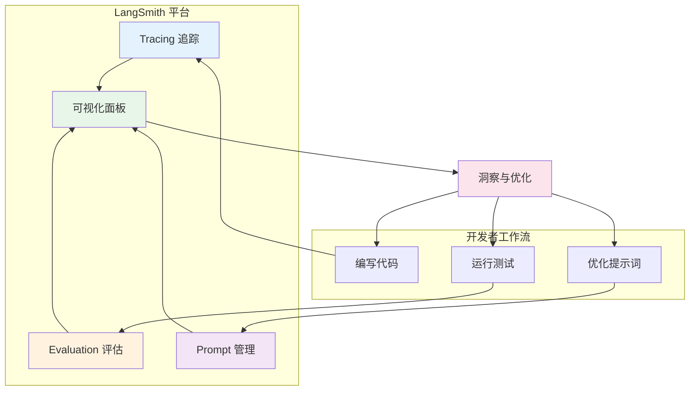
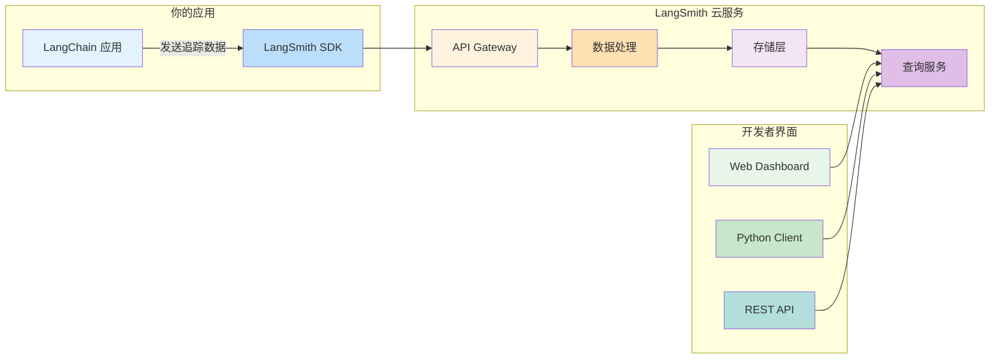

# LangSmith 概览

LangSmith 是 LangChain 团队推出的 LLM 应用开发平台，为开发者提供追踪（Tracing）、评估（Evaluation）和提示词管理（Prompt Management）的一站式解决方案。在构建基于大语言模型的应用时，LangSmith 帮助你理解应用行为、诊断问题并持续优化性能。

::: v-pre

:::

## 为什么需要 LangSmith

### LLM 应用开发的可观测性挑战

大语言模型应用与传统软件有着本质区别，这带来了独特的调试和监控挑战：

| 挑战类型 | 传统软件 | LLM 应用 | LangSmith 解决方案 |
|---------|---------|---------|------------------|
| **输出确定性** | 确定性输出 | 概率性生成 | 追踪每次请求的完整上下文 |
| **问题诊断** | 堆栈追踪清晰 | 黑盒模型调用 | 可视化调用链和中间结果 |
| **性能评估** | 单元测试覆盖 | 主观质量评估 | 自动化评估器和人工评审 |
| **提示词迭代** | 代码版本控制 | 提示词难以管理 | Prompt Registry 版本管理 |
| **成本监控** | 资源使用清晰 | Token 消耗不透明 | Token 用量统计和成本分析 |

### 可观测性的必要性

💡 **提示**：在没有可观测性的情况下调试 LLM 应用，就像在黑暗中摸索——你可能最终会找到问题，但过程既缓慢又痛苦。LangSmith 为你打开了灯。

LangSmith 解决的核心问题：

1. **理解应用行为**：当你调用一个链（Chain）或 Agent 时，底层发生了什么？模型收到了什么输入？生成了什么输出？中间经过了哪些处理步骤？

2. **诊断失败原因**：当应用返回错误结果时，是提示词设计问题？模型选择问题？还是工具调用失败？LangSmith 的追踪功能让问题一目了然。

3. **量化性能改进**：当你修改提示词或更换模型后，如何知道效果是变好了还是变差了？LangSmith 的评估系统提供客观指标。

4. **协作与知识沉淀**：团队成员如何共享有效的提示词？如何复现彼此的实验结果？LangSmith 提供统一的协作平台。

## LangSmith 核心功能

### 1. Tracing（追踪）

追踪是 LangSmith 的基础功能，记录 LLM 应用运行时的完整调用链。

**核心概念：**
- **Run（运行）**：每次模型调用、工具执行或链处理都是一个 Run
- **Trace（追踪）**：一个完整请求的所有 Run 组成的树状结构
- **Span（跨度）**：单个 Run 的时间跨度和详细信息

**追踪记录的信息：**
- 输入和输出内容
- Token 消耗（输入/输出）
- 执行时间和延迟
- 模型名称和参数
- 错误信息和堆栈追踪
- 自定义元数据和标签

```python
from langchain_openai import ChatOpenAI
from langchain_core.prompts import ChatPromptTemplate
from langsmith import traceable

# 启用 LangSmith 追踪（设置环境变量后自动生效）
# export LANGSMITH_TRACING=true
# export LANGSMITH_API_KEY=your_api_key

llm = ChatOpenAI(model="gpt-4o", temperature=0.7)

prompt = ChatPromptTemplate.from_messages([
    ("system", "你是一个 ASSISTANT。"),
    ("human", "{question}")
])

chain = prompt | llm

# 每次 invoke 都会自动记录到 LangSmith
result = chain.invoke({"question": "什么是 LangSmith？"})
print(result.content)
```

### 2. Evaluation（评估）

评估系统帮助你量化 LLM 应用的性能，支持自动化和人工评估。

**评估器类型：**

| 评估器类型 | 描述 | 适用场景 |
|-----------|------|---------|
| **Criteria** | 基于预定义标准的评估（如相关性、帮助性） | 快速质量检查 |
| **QA** | 问题 - 答案准确性评估 | RAG 系统、问答场景 |
| **CoT QA** | 思维链准确性评估 | 复杂推理任务 |
| **Custom** | 自定义 Python 评估函数 | 业务特定需求 |
| **LLM-as-Judge** | 使用 LLM 进行评分 | 主观质量评估 |

```python
from langsmith import Client
from langsmith.evaluation import LangChainStringEvaluator, evaluate
from langchain_openai import ChatOpenAI

client = Client()

# 定义被评估的链
def my_chain(inputs: dict):
    llm = ChatOpenAI(model="gpt-4o")
    return llm.invoke(inputs["question"]).content

# 定义评估器
evaluators = [
    LangChainStringEvaluator("criteria", criteria={"helpfulness": "是否提供了有帮助的回答"}),
    LangChainStringEvaluator("qa"),  # 答案准确性
]

# 运行评估（使用已有的 Dataset）
results = evaluate(
    my_chain,
    data=client.list_examples(dataset_name="测试问题集"),
    evaluators=evaluators,
    experiment_prefix="gpt-4o-评估",
)

# 查看结果
for result in results:
    print(f"得分：{result['scores']}")
```

### 3. Prompt Management（提示词管理）

LangSmith 提供 Prompt Registry，实现提示词的版本控制、协作和 A/B 测试。

**核心能力：**
- 集中存储和管理提示词
- 版本历史追踪
- 在代码中引用远程提示词
- A/B 测试不同提示词版本
- 团队协作和共享

```python
from langchain import hub

# 从 LangSmith 拉取提示词
prompt = hub.pull("my-team/customer-support-prompt")

# 或者使用特定版本
prompt_v2 = hub.pull("my-team/customer-support-prompt:v2")

# 提示词可以包含多个消息模板
print(prompt.messages)
print(f"输入变量：{prompt.input_variables}")
```

### 4. Feedback（反馈）

收集和管理来自用户或评估系统的反馈，用于持续改进。

```python
from langsmith import Client

client = Client()

# 为特定的 Run 添加反馈
client.create_feedback(
    run_id="xxx-xxx-xxx",  # Run 的 UUID
    key="user_rating",
    score=0.8,  # 0-1 之间的分数
    comment="回答很有帮助，但可以更详细",
)
```

## LangSmith 与 LangChain 的集成

### 自动集成

使用最新版本的 LangChain 时，LangSmith 集成是开箱即用的。只需设置环境变量：

```bash
# 启用追踪
export LANGSMITH_TRACING=true

# 设置 API Key（从 https://smith.langchain.com 获取）
export LANGSMITH_API_KEY="lsv2_pt_xxxxxxxxxxxxxxxxxxxxxxxxxxxxxxxxxxxx"

# 可选：设置项目名称
export LANGSMITH_PROJECT="my-llm-project"

# 可选：设置端点（企业版）
export LANGSMITH_ENDPOINT="https://api.smith.langchain.com"
```

### 手动配置

```python
from langsmith import wrappers
from openai import OpenAI

# 包装 OpenAI 客户端以启用追踪
client = wrappers.wrap_openai(OpenAI())

response = client.chat.completions.create(
    model="gpt-4o",
    messages=[{"role": "user", "content": "Hello"}]
)
```

### 添加自定义元数据

```python
from langsmith import traceable
from langchain_core.runnables import RunnableConfig

@traceable(
    run_type="chain",
    metadata={"custom_field": "value", "version": "1.0.0"},
    tags=["production", "v1"]
)
def my_chain(inputs: dict):
    # 你的逻辑
    pass

# 或者在调用时传入配置
config = RunnableConfig(
    run_name="custom_run_name",
    metadata={"user_id": "12345"},
    tags=["important"]
)
chain.invoke(inputs, config=config)
```

## 套餐与计费

### 免费套餐

LangSmith 提供慷慨的免费套餐，适合个人开发者和小型团队：

| 功能 | 免费版限制 |
|------|-----------|
| **追踪** | 每月 1,000 次运行 |
| **评估** | 包含在追踪额度内 |
| **Prompt 管理** | 无限个 Prompt |
| **数据存储** | 90 天保留期 |
| **协作成员** | 最多 3 人 |

💡 **提示**：对于学习和个人项目，免费套餐完全足够。只有当月追踪量超过 1000 次时才需要考虑付费升级。

### 付费套餐

| 套餐 | 价格 | 追踪额度 | 数据保留 | 适用场景 |
|------|------|---------|---------|---------|
| **Plus** | $39/月 | 10,000 次/月 | 1 年 | 小型团队 |
| **Pro** | $149/月 | 50,000 次/月 | 2 年 | 中型团队 |
| **Enterprise** | 定制 | 无限制 | 自定义 | 大型企业 |

### 成本控制技巧

1. **采样追踪**：只对部分请求进行追踪
2. **排除简单链**：只为关键链启用追踪
3. **定期清理**：删除不再需要的数据
4. **监控使用量**：在 Settings 中查看用量统计

## 快速开始

### 第一步：创建账户

1. 访问 [https://smith.langchain.com](https://smith.langchain.com)
2. 使用 GitHub 或 Google 账户登录
3. 在 Settings → API Keys 创建新的 API Key

### 第二步：配置环境

```bash
# 在你的项目中设置环境变量
export LANGSMITH_TRACING=true
export LANGSMITH_API_KEY="lsv2_pt_xxxxxxxxxx"
export LANGSMITH_PROJECT="my-first-project"
```

### 第三步：运行并查看追踪

```python
from langchain_openai import ChatOpenAI

llm = ChatOpenAI(model="gpt-4o")
response = llm.invoke("讲一个关于 LangSmith 的笑话")
print(response.content)
```

### 第四步：在 LangSmith 中查看

回到 LangSmith 网页，你应该能在 "Traces" 页面看到刚才的运行记录。点击查看详细信息，包括输入、输出、Token 消耗和执行时间。

## 最佳实践

### 1. 命名规范

为你的链和运行设置清晰的名称，便于后续检索：

```python
from langchain_core.runnables import RunnableConfig

config = RunnableConfig(run_name="customer-support-agent-v2")
chain.invoke(inputs, config=config)
```

### 2. 敏感信息处理

**切勿**在追踪中记录敏感信息：

```python
from langsmith import traceable

@traceable
def process_query(user_query: str, api_key: str):
    # ❌ 错误：会将 API Key 记录到 LangSmith
    # return call_api(user_query, api_key)
    
    # ✅ 正确：使用手动追踪控制
    return call_api(user_query)
```

### 3. 项目隔离

为不同环境创建不同的项目：

| 环境 | 项目命名 |
|------|---------|
| 开发 | `my-app-dev` |
| 测试 | `my-app-staging` |
| 生产 | `my-app-prod` |

### 4. 标签策略

使用标签进行分类和筛选：

```python
config = RunnableConfig(
    tags=["agent", "rag", "production", "v2.1"]
)
```

## 架构图

::: v-pre

:::

## 常见问题

### Q1: LangSmith 会存储我的数据多久？

A: 免费套餐保留 90 天，付费套餐根据等级可保留 1-2 年或自定义。到期后数据会自动删除。

### Q2: LangSmith 是否安全？

A: LangSmith 通过 SOC 2 Type II 认证，数据加密传输和存储，支持企业级访问控制。敏感数据可以通过配置排除在追踪之外。

### Q3: 可以在本地部署 LangSmith 吗？

A: LangSmith 主要是云服务，但企业客户可以申请私有化部署。详情请联系 LangChain 销售团队。

### Q4: 追踪会影响性能吗？

A: 追踪是异步非阻塞的，通常对性能影响小于 5%。在高延迟敏感场景，可以降低采样率或关闭追踪。

### Q5: 如何迁移到其他平台？

A: LangSmith 支持导出追踪数据为 JSON 格式，可以通过 API 批量获取历史数据。

## 学习资源

- 📚 [官方文档](https://docs.smith.langchain.com/)
- 🎥 [视频教程](https://www.youtube.com/@LangChain)
- 💬 [Discord 社区](https://discord.gg/langchain)
- 📝 [示例项目](https://github.com/langchain-ai/langsmith-cookbook)

## 下一步

- 深入学习 [Tracing 追踪功能](/langsmith/tracing)
- 掌握 [Evaluation 评估系统](/langsmith/evaluation)
- 探索 [Dataset 数据集管理](/langsmith/dataset)
- 了解 [Prompt 提示词管理](/langsmith/prompt-management)

---

<Badge type="info" text="最后更新：2026-05-31" />
<Badge type="tip" text="LangChain 版本：0.3+" />