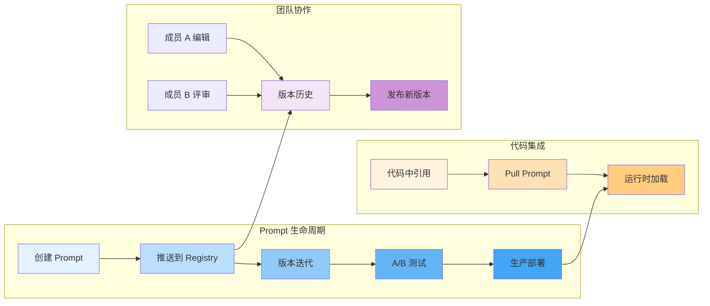
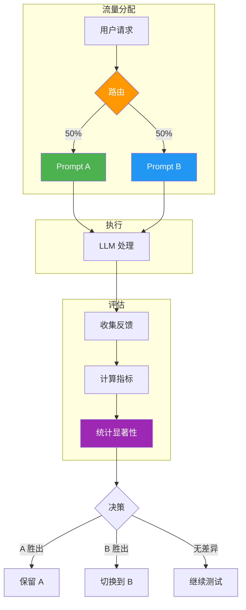
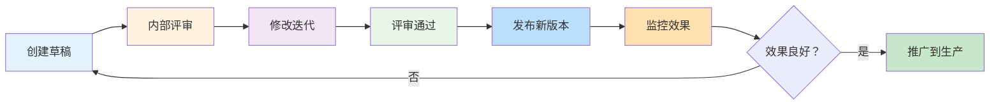

# LangSmith Prompt 管理

Prompt（提示词）是 LLM 应用的核心组成部分。随着应用复杂度的提升，有效管理提示词的版本、测试不同变体、并促进团队协作变得至关重要。LangSmith 的 Prompt Management 功能提供了一套完整的解决方案。

::: v-pre

:::

## LangSmith Prompt 版本管理

### 什么是 Prompt Registry？

**Prompt Registry** 是 LangSmith 提供的集中式提示词存储和管理系统。它允许你将提示词从代码中解耦，实现：

- 版本控制和历史追踪
- 团队协作和共享
- A/B 测试和多版本对比
- 运行时动态加载
- 跨项目复用

### Prompt 的组成部分

一个完整的 Prompt 包含以下要素：

```python
# LangSmith Prompt 结构
{
    "id": "prompt-uuid",
    "owner": "my-team",
    "name": "customer-support-agent",
    "tags": ["support", "production", "v2"],
    
    # 提示词模板
    "template": {
        "messages": [
            {
                "role": "system",
                "content": "你是一个专业的客服助手，专门帮助解决客户问题。",
                "template_format": "f-string"
            },
            {
                "role": "human",
                "content": "{user_question}",
                "template_format": "f-string"
            }
        ]
    },
    
    # 输入变量
    "input_variables": ["user_question"],
    
    # 元数据
    "metadata": {
        "model": "gpt-4o",
        "temperature": 0.7,
        "created_by": "alice@company.com",
        "approved_by": "bob@company.com"
    },
    
    # 版本信息
    "version": "2.1.0",
    "commit_hash": "abc123",
    "created_at": "2024-01-15T10:00:00Z",
}
```

## 从代码中提取 Prompt 到 LangSmith

### 方法一：使用 push 命令

```python
from langchain import hub
from langchain_core.prompts import ChatPromptTemplate

# 创建提示词模板
template = ChatPromptTemplate.from_messages([
    ("system", "你是一个{role}助手，专注于{domain}领域。"),
    ("human", "{question}"),
])

# 推送到 LangSmith
hub.push(
    "my-team/customer-support-prompt",
    template,
    new_repo_is_public=False,  # 设为私有
    tags=["support", "v1"],
)
```

### 方法二：使用 LangSmith CLI

```bash
# 安装 CLI
pip install langchain-cli

# 登录
langchain login

# 推送提示词
langchain prompt push my-team/my-prompt --file prompt.yaml

# 或者使用文件路径
langchain prompt push my-team/my-prompt /path/to/prompt.json
```

### 方法三：程序化推送

```python
from langsmith import Client
from langchain_core.prompts import ChatPromptTemplate

client = Client()

# 创建提示词
prompt = ChatPromptTemplate.from_messages([
    ("system", "你是一个友好的 {tone} 助手"),
    ("human", "{input}"),
])

# 转换为 LangSmith 格式
prompt_data = {
    "template_messages": [
        {
            "type": "system",
            "template": "你是一个友好的 {tone} 助手",
            "input_variables": ["tone"]
        },
        {
            "type": "human",
            "template": "{input}",
            "input_variables": ["input"]
        }
    ],
    "metadata": {
        "model": "gpt-4o",
        "temperature": 0.7
    }
}

# 创建 Prompt 仓库
repo = client.create_prompt_repo(
    owner="my-team",
    name="friendly-assistant",
    prompt_data=prompt_data
)

print(f"创建成功：{repo['full_name']}")
```

### Prompt 文件示例

```yaml
# prompt.yaml
id: my-team/customer-support-agent
description: 客服助手提示词 - 处理客户咨询和投诉
tags:
  - customer-support
  - production

template:
  messages:
    - role: system
      content: |
        你是由 XX 公司开发的智能客服助手。
        
        你的职责：
        1. 礼貌地回应客户问题
        2. 准确理解客户需求
        3. 提供清晰的解决方案
        4. 必要时转接人工客服
        
        回答原则：
        - 保持专业和友善
        - 避免承诺无法实现的事情
        - 保护客户隐私
        
        当前时间：{current_date}
    
    - role: human
      content: "{user_message}"
    
    - role: ai
      content: "{agent_response}"

input_variables:
  - current_date
  - user_message
  - agent_response

metadata:
  model: gpt-4o
  temperature: 0.7
  max_tokens: 500
  created_by: support-team
  last_reviewed: 2024-05-31
```

## Pull Prompt 到应用

### 基础用法

```python
from langchain import hub

# 拉取提示词（获取最新版本）
prompt = hub.pull("my-team/customer-support-prompt")

# 使用提示词
from langchain_openai import ChatOpenAI
llm = ChatOpenAI(model="gpt-4o")

chain = prompt | llm
response = chain.invoke({
    "user_question": "如何申请退款？",
    "role": "客服",
    "domain": "电商"
})

print(response.content)
```

### 指定版本

```python
from langchain import hub

# 拉取特定版本
prompt_v1 = hub.pull("my-team/customer-support-prompt:v1.0.0")
prompt_v2 = hub.pull("my-team/customer-support-prompt:v2.0.0")

# 或者使用 commit hash
prompt_commit = hub.pull("my-team/customer-support-prompt:abc123")

# 比较不同版本
print(f"V1 输入变量：{prompt_v1.input_variables}")
print(f"V2 输入变量：{prompt_v2.input_variables}")
```

### 带缓存的拉取

```python
from langchain import hub
import functools

# 缓存提示词，避免重复拉取
@functools.lru_cache(maxsize=100)
def get_prompt(prompt_name: str, version: str = None):
    full_name = f"{prompt_name}:{version}" if version else prompt_name
    return hub.pull(full_name)

# 使用
prompt = get_prompt("my-team/customer-support-prompt", "v2.0.0")
```

### 错误处理

```python
from langchain import hub
from requests.exceptions import HTTPError

def safely_pull_prompt(prompt_name: str, fallback_prompt=None):
    """
    安全地拉取提示词，失败时使用默认提示词
    """
    try:
        return hub.pull(prompt_name)
    except HTTPError as e:
        if e.response.status_code == 404:
            print(f"提示词未找到：{prompt_name}")
            if fallback_prompt:
                return fallback_prompt
            raise
        elif e.response.status_code == 401:
            print("认证失败，请检查 API Key")
            raise
        else:
            print(f"未知错误：{e}")
            raise

# 默认提示词
from langchain_core.prompts import ChatPromptTemplate
default_prompt = ChatPromptTemplate.from_messages([
    ("human", "{input}")
])

prompt = safely_pull_prompt(
    "my-team/customer-support-prompt",
    fallback_prompt=default_prompt
)
```

## A/B 测试 Prompt

### 设置 A/B 测试

::: v-pre

:::

```python
from langchain import hub
from langsmith import Client
from langsmith.evaluation import evaluate
import random

client = Client()

# 定义两个版本的 Prompt
prompt_a = hub.pull("my-team/support-prompt:v1")
prompt_b = hub.pull("my-team/support-prompt:v2")

# 定义两个版本的 Chain
def chain_a(inputs):
    from langchain_openai import ChatOpenAI
    llm = ChatOpenAI(model="gpt-4o")
    return (prompt_a | llm).invoke(inputs).content

def chain_b(inputs):
    from langchain_openai import ChatOpenAI
    llm = ChatOpenAI(model="gpt-4o")
    return (prompt_b | llm).invoke(inputs).content

# 运行 A/B 测试
results_a = evaluate(
    chain_a,
    data="support-questions",
    evaluators=[],  # 根据需要添加评估器
    experiment_prefix="prompt-ab-test-v1"
)

results_b = evaluate(
    chain_b,
    data="support-questions",
    evaluators=[],
    experiment_prefix="prompt-ab-test-v2"
)

# 比较结果
import numpy as np

# 假设有用户反馈分数
scores_a = [r["feedback"].get("user_rating", 0) for r in results_a]
scores_b = [r["feedback"].get("user_rating", 0) for r in results_b]

mean_a = np.mean(scores_a)
mean_b = np.mean(scores_b)

print(f"Prompt A 平均分：{mean_a:.2f}")
print(f"Prompt B 平均分：{mean_b:.2f}")
print(f"提升：{(mean_b - mean_a) / mean_a * 100:.1f}%")
```

### 运行时随机分配

```python
from langchain import hub
import hashlib

class PromptABTester:
    def __init__(self, prompt_a_name: str, prompt_b_name: str, traffic_split: float = 0.5):
        """
        Args:
            prompt_a_name: Prompt A 的名称
            prompt_b_name: Prompt B 的名称
            traffic_split: 分配给 B 的流量比例 (0-1)
        """
        self.prompt_a = hub.pull(prompt_a_name)
        self.prompt_b = hub.pull(prompt_b_name)
        self.traffic_split = traffic_split
    
    def get_prompt(self, session_id: str) -> ChatPromptTemplate:
        """
        基于会话 ID 进行确定性分配
        确保同一用户总是看到相同的 Prompt 版本
        """
        # 使用会话 ID 的 hash 值决定
        hash_value = int(hashlib.md5(session_id.encode()).hexdigest(), 16)
        ratio = (hash_value % 1000) / 1000.0
        
        if ratio < self.traffic_split:
            return self.prompt_b
        else:
            return self.prompt_a
    
    def invoke(self, inputs: dict, session_id: str):
        """
        使用分配的 Prompt 进行调用
        """
        from langchain_openai import ChatOpenAI
        
        prompt = self.get_prompt(session_id)
        llm = ChatOpenAI(model="gpt-4o")
        
        chain = prompt | llm
        response = chain.invoke(inputs)
        
        return response.content

# 使用示例
ab_tester = PromptABTester(
    prompt_a_name="my-team/support-prompt-v1",
    prompt_b_name="my-team/support-prompt-v2",
    traffic_split=0.5  # 50% 流量给 B
)

response = ab_tester.invoke(
    inputs={"user_question": "如何退款？"},
    session_id="user-123-session-456"
)
```

### 跟踪 A/B 测试结果

```python
from langsmith import Client

client = Client()

def track_ab_test_result(
    run_id: str,
    variant: str,  # "A" or "B"
    user_rating: float = None,
    conversion: bool = None
):
    """
    记录 A/B 测试结果
    """
    # 添加反馈
    if user_rating is not None:
        client.create_feedback(
            run_id=run_id,
            key="user_rating",
            score=user_rating,
            metadata={"variant": variant}
        )
    
    if conversion is not None:
        client.create_feedback(
            run_id=run_id,
            key="conversion",
            score=1.0 if conversion else 0.0,
            metadata={"variant": variant}
        )

# 在应用中使用
# run_id 可以从 LangSmith 响应中获取
```

## Prompt 管理工作流

### 团队协作流程



### 版本发布规范

```markdown
# Prompt 版本发布检查清单

## 发布前检查
- [ ] 已通过至少 2 人评审
- [ ] 已在测试集上验证效果
- [ ] 已更新版本号和变更日志
- [ ] 已通知相关团队成员

## 版本命名
- 主版本 (X.0.0): 不兼容的变更
- 次版本 (1.X.0): 向后兼容的功能新增
- 补丁版本 (1.0.X): 向后兼容的问题修复

## 发布步骤
1. 在 LangSmith 中创建新版本
2. 更新标签和元数据
3. 通知团队新版本可用
4. 监控生产环境表现
5. 收集反馈并记录

## 回滚计划
- 确定回滚条件（如错误率>5%）
- 准备回滚脚本
- 指定回滚决策人
```

### 变更日志示例

```markdown
# Prompt 变更日志

## v2.1.0 (2024-05-31)
### 新增
- 添加多语言支持
- 增加情感识别指令

### 优化
- 精简系统提示词，减少 Token 消耗
- 改进错误处理逻辑

### 修复
- 修复某些边界情况下的幻觉问题

## v2.0.0 (2024-05-15)
### 重大变更
- 重构为多消息模板格式
- 移除已废弃的变量

### 新增
- 新增上下文记忆功能

## v1.0.0 (2024-05-01)
- 初始版本
```

## 最佳实践

### 1. Prompt 模板设计

```python
# ✅ 好的做法：模块化、可复用
good_template = ChatPromptTemplate.from_messages([
    ("system", SYSTEM_PROMPT),  # 系统指令独立
    ("human", "{question}"),
    ("ai", "{previous_response}"),  # 支持多轮对话
    ("human", "{followup}"),
])

# ❌ 不好的做法：硬编码、难以维护
bad_template = ChatPromptTemplate.from_messages([
    ("human", "你是一个客服助手。用户问：{question} 请回答。")
])
```

### 2. 变量命名规范

| 规范 | 示例 | 说明 |
|------|------|------|
| **小写下划线** | `user_question` | 推荐格式 |
| **语义清晰** | `customer_name` vs `x` | 避免单字母 |
| **类型暗示** | `question_list`, `count` | 暗示类型 |
| **上下文前缀** | `user_`, `system_`, `context_` | 区分来源 |

### 3. 元数据管理

```python
# 完整的元数据示例
metadata = {
    # 基础信息
    "name": "customer-support-agent",
    "description": "处理客户咨询的标准客服助手",
    "version": "2.1.0",
    
    # 技术配置
    "model": "gpt-4o",
    "temperature": 0.7,
    "max_tokens": 500,
    
    # 业务信息
    "domain": "customer-support",
    "use_case": "general-inquiry",
    "target_audience": "all-customers",
    
    # 团队信息
    "owner": "support-team",
    "created_by": "alice@company.com",
    "reviewed_by": ["bob@company.com", "carol@company.com"],
    
    # 时间信息
    "created_at": "2024-01-01",
    "last_modified": "2024-05-31",
    "last_reviewed": "2024-05-15",
    
    # 状态信息
    "status": "production",  # draft, review, production, deprecated
    "deprecation_date": None,
    
    # 性能指标
    "avg_response_time": "1.2s",
    "user_satisfaction": 0.92,
}
```

### 4. 安全考虑

```python
# ✅ 安全的 Prompt 设计
safe_template = ChatPromptTemplate.from_messages([
    ("system", """
    你是一个客服助手。请遵守以下规则：
    1. 不要泄露内部系统信息
    2. 不要承诺无法保证的事情
    3. 涉及财务问题请引导至官方渠道
    4. 保护用户隐私，不要重复敏感信息
    """),
    ("human", "{question}"),
])

# ❌ 不安全的 Prompt 设计
unsafe_template = ChatPromptTemplate.from_messages([
    ("system", """
    你是客服，使用以下内部信息：
    - 数据库地址：db.internal.company.com
    - API Key: {api_key}  # 危险！
    """),
    ("human", "{question}"),
])
```

### 5. 测试驱动开发

```python
def test_prompt_template():
    """测试 Prompt 模板的功能"""
    from langchain import hub
    
    prompt = hub.pull("my-team/test-prompt")
    
    # 测试输入变量
    assert "question" in prompt.input_variables
    assert "context" in prompt.input_variables
    
    # 测试模板渲染
    rendered = prompt.format(question="测试问题", context="测试上下文")
    assert "测试问题" in rendered
    assert "测试上下文" in rendered
    
    # 测试输出格式
    from langchain_openai import ChatOpenAI
    llm = ChatOpenAI(model="gpt-4o")
    chain = prompt | llm
    
    response = chain.invoke({
        "question": "测试",
        "context": "上下文"
    })
    assert len(response.content) > 0
    
    print("所有测试通过！")
```

## 常见问题

### Q1: 如何管理多环境配置？

A: 使用不同的仓库或标签：

```python
# 按环境分离仓库
dev_prompt = hub.pull("my-team/support-prompt-dev")
prod_prompt = hub.pull("my-team/support-prompt-prod")

# 或使用标签
prompt = hub.pull("my-team/support-prompt:production")
```

### Q2: Prompt 拉取失败怎么办？

A: 实现降级策略：

```python
def get_prompt_with_fallback(prompt_name: str):
    try:
        return hub.pull(prompt_name)
    except Exception as e:
        logger.error(f"拉取失败：{e}")
        return get_local_fallback()  # 返回本地缓存版本
```

### Q3: 如何限制 Prompt 访问量？

A: 使用 LangSmith 的访问控制：
1. 在 Dashboard 中设置私有仓库
2. 只添加授权团队成员
3. 使用 API Key 进行访问控制

### Q4: Prompt 版本太多如何管理？

A: 定期清理和归档：
1. 标记废弃版本（deprecate）
2. 只保留最近的 3-5 个版本
3. 导出重要版本到本地备份

## 下一步

- 了解 [LangServe 快速部署](/langserve/quick-deploy)
- 学习 [API 设计最佳实践](/langserve/api-design)
- 探索 [流式输出](/langserve/streaming-output)

---

<Badge type="info" text="最后更新：2026-05-31" />
<Badge type="tip" text="LangChain 版本：0.3+" />