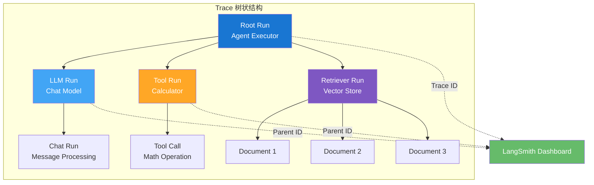
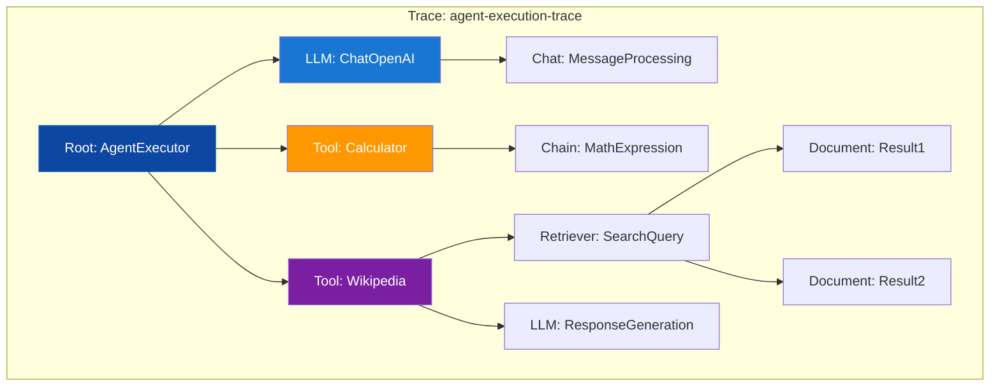

# LangSmith Tracing 追踪详解

Tracing（追踪）是 LangSmith 最核心的功能，它记录 LLM 应用运行时的完整执行链路，帮助开发者理解应用行为、诊断问题并优化性能。本章将深入探讨追踪的工作原理、配置方法和高级用法。

::: v-pre

:::

## Run 的概念详解

### 什么是 Run？

**Run（运行）** 是 LangSmith 追踪的基本单位，代表应用执行过程中的单个操作。每次模型调用、工具执行、链处理都会创建一个 Run。

### Run 的类型

LangSmith 定义了多种 Run 类型，每种类型对应不同的操作：

| Run 类型 | 描述 | 典型场景 | 记录信息 |
|---------|------|---------|---------|
| **LLM Run** | 大语言模型调用 | ChatOpenAI、ChatAnthropic | 模型名、输入消息、输出内容、Token 数 |
| **Chain Run** | 链式处理 | LCEL Chain、SequentialChain | 输入、输出、中间步骤 |
| **Tool Run** | 工具函数执行 | Calculator、Search、Custom Tool | 工具名、输入参数、执行结果 |
| **Retriever Run** | 检索器调用 | VectorStoreRetriever、BM25 | 查询文本、返回文档、相似度分数 |
| **Embedding Run** | 嵌入模型调用 | OpenAIEmbeddings | 输入文本、向量维度、延迟 |
| **Chat Run** | 聊天消息处理 | ChatPromptTemplate | 消息模板、格式化结果 |
| **Executor Run** | 执行器调度 | AgentExecutor、PlanAndExecute | 执行计划、步骤结果 |

### Run 的数据结构

每个 Run 包含以下核心字段：

```python
# LangSmith 中 Run 的典型数据结构
{
    "id": "uuid-string",              # 唯一标识符
    "name": "ChatOpenAI",             # Run 名称
    "run_type": "llm",                # Run 类型
    "start_time": "2024-01-01T10:00:00Z",
    "end_time": "2024-01-01T10:00:02Z",
    "inputs": {"messages": [...]},    # 输入数据
    "outputs": {"generations": [...]}, # 输出数据
    "error": None,                     # 错误信息（如果有）
    "parent_run_id": "parent-uuid",    # 父 Run ID（根节点为 null）
    "trace_id": "trace-uuid",          # 所属 Trace ID
    "metadata": {...},                 # 自定义元数据
    "tags": ["production", "v1"],      # 标签
    "events": [...],                   # 时间线事件
    "extra": {
        "metadata": {...},
        "invocation_params": {...}
    }
}
```

## Trace 的结构与嵌套

### 什么是 Trace？

**Trace（追踪）** 是一个完整请求的所有 Run 组成的树状结构。它从根节点（通常是用户请求入口）开始，记录所有子调用的层级关系。

### 父子关系

::: v-pre

:::

在上图中：
- **Trace ID** 标识整个追踪
- **Root Run**（AgentExecutor）是树的根节点
- 每个子 Run 都有 `parent_run_id` 指向其直接父节点
- 通过遍历父子关系，可以重建完整的执行树

### 实际代码示例

```python
from langchain_openai import ChatOpenAI
from langchain_core.prompts import ChatPromptTemplate
from langchain.agents import tool, AgentExecutor, create_openai_functions_agent

llm = ChatOpenAI(model="gpt-4o", temperature=0)

@tool
def calculator(expression: str) -> str:
    """计算数学表达式"""
    return str(eval(expression))

@tool
def search(query: str) -> str:
    """搜索网络信息"""
    return f"搜索结果：{query}"

tools = [calculator, search]

prompt = ChatPromptTemplate.from_messages([
    ("system", "你是一个智能助手"),
    ("human", "{input}"),
    ("placeholder", "{agent_scratchpad}"),
])

agent = create_openai_functions_agent(llm, tools, prompt)
agent_executor = AgentExecutor(agent=agent, tools=tools, verbose=True)

# 这个调用会创建一个完整的 Trace
# 包含：AgentExecutor Root → LLM Run → Tool Runs → ...
result = agent_executor.invoke({
    "input": "计算 123 * 456，然后搜索相关历史事件"
})

print(result["output"])
```

在 LangSmith Dashboard 中，你可以看到这个 Trace 的完整树状结构，展开每个节点查看详细信息。

## 自动追踪配置

### 环境变量配置（推荐）

最简单的方式是通过环境变量启用追踪：

```bash
# 启用追踪
export LANGSMITH_TRACING=true

# API Key（必需）
export LANGSMITH_API_KEY="lsv2_pt_xxxxxxxxxxxxxxxxxxxxxxxxxxxxxxxxxxxx"

# 项目名称（可选，默认"default"）
export LANGSMITH_PROJECT="my-app"

# 端点（可选，企业版使用）
export LANGSMITH_ENDPOINT="https://api.smith.langchain.com"

# 会话 ID（可选，用于关联多次请求）
export LANGSMITH_SESSION_ID="session-123"
```

### 代码配置

在代码中显式配置 LangSmith 客户端：

```python
from langsmith import Client, wrappers
from langchain_openai import ChatOpenAI

# 创建客户端
client = Client(
    api_key="lsv2_pt_xxxxx",
    api_url="https://api.smith.langchain.com",
)

# 包装 OpenAI 客户端
openai_client = wrappers.wrap_openai(
    ChatOpenAI(model="gpt-4o"),
    client=client
)

# 现在所有调用都会自动追踪
response = openai_client.invoke("Hello")
```

### 选择性追踪

在高流量场景，你可能只想追踪部分请求：

```python
import random
from langsmith import traceable

@traceable
def main_chain(inputs):
    # 只有 10% 的请求会被追踪
    if random.random() > 0.1:
        return process(inputs)
    else:
        # 关闭本次追踪
        return process(inputs, langsmith_trace=False)
```

## 自定义 Metadata 和 Tags

### 添加 Metadata

Metadata 为你的追踪添加额外的上下文信息，便于筛选和分析：

```python
from langchain_core.runnables import RunnableConfig
from langsmith import traceable

# 方法 1：通过 RunnableConfig
config = RunnableConfig(
    metadata={
        "user_id": "user-123",
        "session_id": "session-456",
        "environment": "production",
        "version": "2.1.0",
        "feature_flag": "new_agent_v2",
    }
)
chain.invoke(inputs, config=config)

# 方法 2：通过 @traceable 装饰器
@traceable(
    metadata={
        "department": "customer-support",
        "priority": "high",
    }
)
def support_agent(query: str):
    return handle_query(query)

# 方法 3：通过回调
from langchain.callbacks import tracing_v2_enabled

with tracing_v2_enabled(
    project_name="my-project",
    metadata={"custom": "value"}
):
    chain.invoke(inputs)
```

### 添加 Tags

Tags 用于分类和筛选追踪：

```python
config = RunnableConfig(
    tags=[
        "agent",           # 类型
        "production",      # 环境
        "v2",              # 版本
        "customer-facing", # 用途
        "requires-review", # 状态
    ]
)
chain.invoke(inputs, config=config)
```

### 在 LangSmith 中筛选

在 LangSmith Dashboard 中，你可以：
- 按 Metadata 字段筛选（如 `user_id: user-123`）
- 按 Tags 筛选（如 `tag:production`）
- 组合多个条件进行高级筛选

## 追踪数据查询与分析

### 使用 Python Client 查询

```python
from langsmith import Client
from datetime import datetime, timedelta

client = Client()

# 列出最近的 Traces
traces = client.list_traces(
    project_name="my-app",
    limit=10,
    filter='and(eq(metadata.environment, "production"), gt(start_time, "2024-01-01"))',
)

for trace in traces:
    print(f"Trace ID: {trace.id}")
    print(f"  开始时间：{trace.start_time}")
    print(f"  执行时长：{trace.end_time - trace.start_time}")
    print(f"  状态：{'成功' if trace.error is None else '失败'}")

# 获取单个 Trace 详情
trace = client.read_trace(trace_id="xxx-xxx-xxx")
print(f"根 Run: {trace.root_run.name}")
print(f"总 Run 数：{len(trace.runs)}")

# 获取特定 Run 的详情
run = client.read_run(run_id="yyy-yyy-yyy")
print(f"输入：{run.inputs}")
print(f"输出：{run.outputs}")
print(f"元数据：{run.metadata}")
```

### 高级筛选语法

LangSmith 支持强大的筛选表达式：

```python
# 组合条件筛选
filters = [
    # 等于
    'eq(metadata.user_id, "user-123")',
    
    # 大于/小于
    'gt(total_tokens, 1000)',
    'lt(latency, 5.0)',
    
    # 包含
    'contains(tags, "production")',
    
    # 正则匹配
    'regex(name, ".*ChatOpenAI.*")',
    
    # 布尔运算
    'and(eq(metadata.env, "prod"), not(has_error))',
    'or(eq(run_type, "llm"), eq(run_type, "chain"))',
]

traces = client.list_traces(filter=' and '.join(filters))
```

### 统计分析

```python
from langsmith import Client
import statistics

client = Client()

# 收集性能数据
latencies = []
token_counts = []

for trace in client.list_traces(project_name="my-app", limit=1000):
    if trace.end_time and trace.start_time:
        latency = (trace.end_time - trace.start_time).total_seconds()
        latencies.append(latency)
    
    if hasattr(trace, 'extra') and trace.extra:
        tokens = trace.extra.get('metadata', {}).get('total_tokens', 0)
        token_counts.append(tokens)

# 计算统计指标
print(f"平均延迟：{statistics.mean(latencies):.2f}秒")
print(f"P50 延迟：{statistics.median(latencies):.2f}秒")
print(f"P95 延迟：{sorted(latencies)[int(len(latencies)*0.95)]:.2f}秒")
print(f"平均 Token 数：{statistics.mean(token_counts):.0f}")
```

## 调试技巧

### 1. 使用 verbose 模式

```python
from langchain.globals import set_verbose, set_debug

set_verbose(True)   # 打印链的执行过程
set_debug(True)     # 打印更详细的调试信息

chain.invoke(inputs)
```

### 2. 查看实时追踪

在开发时，保持 LangSmith Dashboard 打开，可以实时看到每次调用的追踪数据。配合浏览器的自动刷新功能，可以实现类似"热重载"的开发体验。

### 3. 比较不同版本

```python
# 获取两个版本的平均延迟
v1_traces = client.list_traces(
    filter='and(eq(metadata.version, "1.0"), eq(name, "agent"))'
)
v2_traces = client.list_traces(
    filter='and(eq(metadata.version, "2.0"), eq(name, "agent"))'
)

v1_latency = statistics.mean([
    (t.end_time - t.start_time).total_seconds()
    for t in v1_traces if t.end_time
])
v2_latency = statistics.mean([
    (t.end_time - t.start_time).total_seconds()
    for t in v2_traces if t.end_time
])

print(f"V1 平均延迟：{v1_latency:.2f}s")
print(f"V2 平均延迟：{v2_latency:.2f}s")
print(f"性能变化：{(v2_latency - v1_latency) / v1_latency * 100:.1f}%")
```

### 4. 错误追踪

```python
# 筛选所有失败的 Trace
failed_traces = client.list_traces(
    project_name="my-app",
    filter="has_error",
    limit=50
)

for trace in failed_traces:
    print(f"错误 Trace: {trace.id}")
    print(f"错误信息：{trace.error}")
    
    # 获取错误发生的 Run
    for run in trace.runs:
        if run.error:
            print(f"  错误 Run: {run.name}")
            print(f"  错误详情：{run.error}")
```

## 性能注意事项

| 配置项 | 性能影响 | 建议 |
|-------|---------|------|
| **追踪采样率** | 降低采样率可减少网络开销 | 生产环境建议 10-20% |
| **Metadata 大小** | 过大的元数据增加传输时间 | 保持 Metadata < 10KB |
| **批量发送** | SDK 自动批量上报，减少请求数 | 使用默认配置即可 |
| **同步 vs 异步** | 异步模式不阻塞主线程 | 使用默认异步模式 |

## 常见问题

### Q1: 追踪数据何时发送？

A: SDK 默认使用异步批量发送，通常在 Run 完成后几秒内发送。程序退出前会刷新队列。

### Q2: 如何完全禁用追踪？

```python
# 方法 1： unset 环境变量
import os
os.environ.pop("LANGSMITH_TRACING", None)

# 方法 2：使用回调上下文
from langchain.callbacks import tracing_v2_disabled

with tracing_v2_disabled():
    chain.invoke(inputs)  # 不会追踪
```

### Q3: 追踪会暴露敏感数据吗？

A: 默认会记录所有输入输出。敏感数据需要在代码中过滤：

```python
@traceable
def process_query(query: str, api_key: str):
    # 手动控制记录内容
    from langsmith import get_current_run_tree
    
    run = get_current_run_tree()
    if run:
        run.inputs = {"query": query}  # 排除 api_key
    
    result = call_api(query, api_key)
    
    if run:
        run.outputs = {"result": result}  # 排除敏感输出
    
    return result
```

### Q4: 如何处理大量追踪数据？

A: 建议：
1. 使用项目隔离不同环境
2. 设置合理的保留策略
3. 对历史数据进行归档
4. 使用筛选和采样减少查询量

## 下一步

- 学习 [Evaluation 评估系统](/langsmith/evaluation)
- 掌握 [Dataset 数据集管理](/langsmith/dataset)
- 了解 [Prompt 提示词管理](/langsmith/prompt-management)

---

<Badge type="info" text="最后更新：2026-05-31" />
<Badge type="tip" text="LangSmith SDK: 0.2+" />