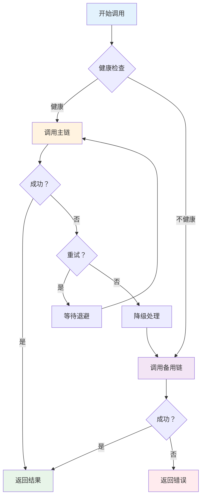

# 错误处理与容错机制

在生产环境中，错误处理是至关重要的。LCEL 提供了多种内置的错误处理机制，包括 `with_fallbacks` 降级策略和 `with_retry` 重试机制。

## with_fallbacks - 降级策略

### 基础用法

`with_fallbacks()` 允许你指定备用链，当主链失败时自动切换到备用方案。

```python
from langchain_core.prompts import ChatPromptTemplate
from langchain_openai import ChatOpenAI
from langchain_core.output_parsers import StrOutputParser

# 主链 - 使用 GPT-4
primary_chain = (
    ChatPromptTemplate.from_template("详细回答:{question}")
    | ChatOpenAI(model="gpt-4-turbo")
    | StrOutputParser()
)

# 备用链 - 使用 GPT-3.5
fallback_chain = (
    ChatPromptTemplate.from_template("简要回答:{question}")
    | ChatOpenAI(model="gpt-3.5-turbo")
    | StrOutputParser()
)

# 组合：主链失败时使用备用链
robust_chain = primary_chain.with_fallbacks([fallback_chain])

# 使用
try:
    result = robust_chain.invoke({"question": "什么是 AI？"})
    print(result)
except Exception as e:
    print(f"所有链都失败了：{e}")
```

### 多个降级级别

```python
# 多级降级策略
chain = (
    primary_chain                                    # 第一选择：GPT-4
    .with_fallbacks([
        fallback_chain,                              # 第二选择：GPT-3.5
        lambda x: "抱歉，暂时无法回答问题。"          # 第三选择：默认回复
    ])
)
```

### 自定义降级逻辑

```python
from langchain_core.runnables import RunnableLambda

def fallback_handler(input_data, error):
    """自定义降级处理函数"""
    print(f"主链失败：{error}")
    # 可以记录日志、发送告警等
    return f"降级响应：输入为 {input_data.get('question', 'unknown')}"

# 使用 RunnableLambda 作为降级
chain = primary_chain.with_fallbacks([
    RunnableLambda(fallback_handler)
])

result = chain.invoke({"question": "测试问题"})
```

### 配置降级条件

```python
chain = primary_chain.with_fallbacks(
    fallbacks=[fallback_chain],
    exceptions_to_handle=(TimeoutError, ConnectionError),  # 只处理特定异常
    key="primary",  # 用于日志标识
)
```

## with_retry - 重试机制

### 基础重试

```python
from langchain_core.prompts import ChatPromptTemplate
from langchain_openai import ChatOpenAI
from langchain_core.output_parsers import StrOutputParser

chain = (
    ChatPromptTemplate.from_template("{question}")
    | ChatOpenAI(model="gpt-3.5-turbo")
    | StrOutputParser()
)

# 添加重试机制
retry_chain = chain.with_retry(
    stop_after_attempt=3,           # 最多重试 3 次
    wait_exponential_jitter=True,   # 指数退避 + 抖动
)

result = retry_chain.invoke({"question": "你好"})
```

### 自定义重试配置

```python
chain = chain.with_retry(
    stop_after_attempt=5,                    # 最多 5 次尝试
    wait_exponential_jitter=True,            # 指数退避
    retry_if_exception_type=(TimeoutError,), # 只重试特定异常
    before_sleep=lambda log: print(f"重试中... {log}")  # 重试前回调
)
```

### 重试 + 降级组合

```python
# 先重试，失败后降级
robust_chain = (
    chain
    .with_retry(stop_after_attempt=3)
    .with_fallbacks([fallback_chain])
)

# 或者：先降级，每个分支内部重试
chain_with_both = (
    primary_chain.with_retry(stop_after_attempt=3)
).with_fallbacks([
    fallback_chain.with_retry(stop_after_attempt=2)
])
```

## 自定义错误处理

### 使用 RunnableLambda 捕获异常

```python
from langchain_core.runnables import RunnableLambda

def safe_execute(input_data):
    """带错误处理的执行函数"""
    try:
        # 可能失败的逻辑
        result = risky_operation(input_data)
        return {"success": True, "data": result}
    except Exception as e:
        # 优雅降级
        return {"success": False, "error": str(e), "fallback": "默认值"}

safe_chain = RunnableLambda(safe_execute)
```

### 包装整个链

```python
def chain_wrapper(input_data):
    """包装整个链的错误处理"""
    try:
        return chain.invoke(input_data)
    except TimeoutError:
        return "请求超时，请稍后重试"
    except ConnectionError:
        return "网络连接失败"
    except Exception as e:
        return f"发生错误：{str(e)}"

safe_chain = RunnableLambda(chain_wrapper)
```

### 使用 LangChain 的异常处理工具

```python
from langchain_core.exceptions import OutputParserException
from langchain_core.output_parsers import BaseOutputParser

class SafeParser(BaseOutputParser):
    """安全的输出解析器"""
    
    def parse(self, text: str):
        try:
            # 尝试解析 JSON
            import json
            return json.loads(text)
        except json.JSONDecodeError as e:
            # 解析失败时返回原始文本
            return {"raw": text, "parse_error": str(e)}

safe_parser = SafeParser()
chain = prompt | llm | safe_parser
```

## 生产环境容错模式

### 模式 1：断路器模式 (Circuit Breaker)

```python
import time
from datetime import datetime, timedelta
from langchain_core.runnables import RunnableLambda

class CircuitBreaker:
    """断路器实现"""
    
    def __init__(self, failure_threshold=5, recovery_timeout=60):
        self.failure_count = 0
        self.failure_threshold = failure_threshold
        self.recovery_timeout = recovery_timeout
        self.last_failure_time = None
        self.state = "closed"  # closed, open, half-open
    
    def call(self, func):
        def wrapper(*args, **kwargs):
            # 检查是否需要尝试恢复
            if self.state == "open":
                if time.time() - self.last_failure_time > self.recovery_timeout:
                    self.state = "half-open"
                    print("🔄 尝试恢复...")
                else:
                    raise Exception("断路器打开，服务不可用")
            
            try:
                result = func(*args, **kwargs)
                # 成功则重置
                if self.state == "half-open":
                    self.state = "closed"
                    self.failure_count = 0
                return result
            except Exception as e:
                self.failure_count += 1
                self.last_failure_time = time.time()
                
                if self.failure_count >= self.failure_threshold:
                    self.state = "open"
                    print(f"⚠️ 断路器打开！失败次数：{self.failure_count}")
                raise
        return wrapper

# 使用断路器包装链
breaker = CircuitBreaker(failure_threshold=3, recovery_timeout=30)

@breaker.call
def call_chain(input_data):
    return chain.invoke(input_data)

safe_chain = RunnableLambda(call_chain)
```

### 模式 2：超时控制

```python
import asyncio
from langchain_core.runnables import RunnableLambda

async def with_timeout(chain, input_data, timeout=30):
    """带超时的调用"""
    try:
        return await asyncio.wait_for(
            chain.ainvoke(input_data),
            timeout=timeout
        )
    except asyncio.TimeoutError:
        return f"请求超时（{timeout}秒）"

# 使用
async def main():
    result = await with_timeout(chain, {"question": "你好"}, timeout=10)
    print(result)

asyncio.run(main())
```

### 模式 3：带缓存的容错

```python
from functools import lru_cache
import hashlib
from langchain_core.runnables import RunnableLambda

class CachedChain:
    """带缓存的容错链"""
    
    def __init__(self, chain, cache_size=1000):
        self.chain = chain
        self.cache = {}
    
    def _get_cache_key(self, input_data):
        import json
        key_str = json.dumps(input_data, sort_keys=True)
        return hashlib.md5(key_str.encode()).hexdigest()
    
    def invoke(self, input_data):
        cache_key = self._get_cache_key(input_data)
        
        # 检查缓存
        if cache_key in self.cache:
            print("📦 缓存命中")
            return self.cache[cache_key]
        
        try:
            # 尝试调用链
            result = self.chain.invoke(input_data)
            self.cache[cache_key] = result
            return result
        except Exception as e:
            # 失败时尝试从缓存获取近似结果
            print(f"❌ 调用失败：{e}")
            if self.cache:
                print("🔄 返回缓存的最近结果")
                return list(self.cache.values())[-1]
            raise

cached_chain = CachedChain(chain)
```

### 模式 4：健康检查 + 自动切换

```python
from langchain_core.runnables import RunnableLambda
import time

class HealthCheckChain:
    """带健康检查的链"""
    
    def __init__(self, primary_chain, backup_chain):
        self.primary = primary_chain
        self.backup = backup_chain
        self.primary_healthy = True
        self.last_check = 0
        self.check_interval = 60  # 60 秒检查一次
    
    def check_health(self):
        """检查主链健康状态"""
        if time.time() - self.last_check < self.check_interval:
            return self.primary_healthy
        
        try:
            # 尝试简单调用
            self.primary.invoke({"question": "hi"})
            self.primary_healthy = True
        except Exception:
            self.primary_healthy = False
        
        self.last_check = time.time()
        return self.primary_healthy
    
    def invoke(self, input_data):
        if self.check_health():
            try:
                return self.primary.invoke(input_data)
            except Exception as e:
                print(f"主链失败，切换到备用：{e}")
                self.primary_healthy = False
        
        # 使用备用链
        print("使用备用链")
        return self.backup.invoke(input_data)

robust_chain = HealthCheckChain(primary_chain, fallback_chain)
```

::: v-pre

:::

## 错误监控与日志

### 使用回调记录错误

```python
from langchain_core.callbacks import BaseCallbackHandler
from langchain_core.outputs import LLMResult

class ErrorTrackingHandler(BaseCallbackHandler):
    """错误追踪回调"""
    
    def __init__(self):
        self.errors = []
    
    def on_llm_error(self, error, **kwargs):
        self.errors.append({
            "type": "llm_error",
            "error": str(error),
            "timestamp": time.time()
        })
        print(f"❌ LLM 错误：{error}")
    
    def on_chain_error(self, error, **kwargs):
        self.errors.append({
            "type": "chain_error",
            "error": str(error),
            "timestamp": time.time()
        })
        print(f"❌ 链错误：{error}")

# 使用
error_handler = ErrorTrackingHandler()
config = {"callbacks": [error_handler]}

try:
    result = chain.invoke({"question": "test"}, config=config)
except Exception:
    print(f"记录到 {len(error_handler.errors)} 个错误")
```

### 结构化日志

```python
import logging
import json
from datetime import datetime

logging.basicConfig(
    level=logging.INFO,
    format='%(asctime)s - %(name)s - %(levelname)s - %(message)s'
)
logger = logging.getLogger("langchain_chain")

def log_chain_execution(input_data, result=None, error=None):
    """记录链执行日志"""
    log_entry = {
        "timestamp": datetime.now().isoformat(),
        "input": input_data,
        "success": result is not None,
        "result": str(result)[:100] if result else None,
        "error": str(error) if error else None,
    }
    
    if error:
        logger.error(json.dumps(log_entry))
    else:
        logger.info(json.dumps(log_entry))
```

## 💡 提示块

> 💡 **最佳实践**
>
> 1. **始终添加超时**：防止无限等待
> 2. **使用指数退避**：避免快速重试压垮服务
> 3. **记录所有错误**：便于事后分析
> 4. **设置合理的降级策略**：保证基本功能可用
> 5. **监控错误率**：及时发现系统性问题
> 6. **测试故障场景**：确保容错机制有效

## 总结

| 机制 | 用途 | 适用场景 |
|------|------|----------|
| **with_fallbacks** | 降级备用 | 主服务不可用时切换 |
| **with_retry** | 自动重试 | 临时性故障 |
| **超时控制** | 防止挂起 | 不确定响应时间的调用 |
| **断路器** | 快速失败 | 持续故障场景 |
| **缓存** | 降低依赖 | 可接受旧数据的场景 |

构建健壮的生产系统需要组合使用这些容错机制。