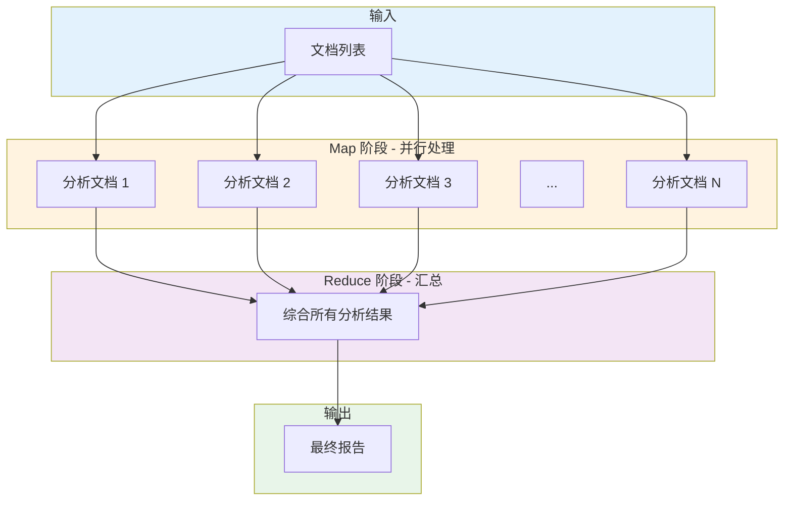

# RunnableParallel 并行执行与分支逻辑

`RunnableParallel` 是 LCEL 中用于并行执行多个分支的核心组件，它允许你同时执行多个独立的操作，并将结果收集到字典中。

## RunnableParallel 基础

### 什么是 RunnableParallel？

`RunnableParallel`（也称为字典形式的链）允许你定义多个并行执行的分支，所有分支同时接收相同的输入，并独立执行。

```python
from langchain_core.runnables import RunnableParallel
from langchain_openai import ChatOpenAI

llm = ChatOpenAI(model="gpt-3.5-turbo")

# 定义并行分支
parallel = RunnableParallel({
    "summary": llm | (lambda x: x.content[:50] + "..."),
    "title": llm | (lambda x: x.content.split("\n")[0]),
    "full": llm,
    "word_count": llm | (lambda x: len(x.content.split()))
})

# 所有分支并行执行
result = parallel.invoke("介绍人工智能")
print(result.keys())  # dict_keys(['summary', 'title', 'full', 'word_count'])
```

### 并行执行的优势

```python
import time
from langchain_openai import ChatOpenAI

llm = ChatOpenAI(model="gpt-3.5-turbo")

# ❌ 顺序执行：3 次调用 = 3 倍响应时间
def sequential_approach(topic: str):
    start = time.time()
    r1 = llm.invoke(f"总结{topic}")
    r2 = llm.invoke(f"关键词{topic}")
    r3 = llm.invoke(f"评价{topic}")
    print(f"顺序执行耗时：{time.time() - start:.2f}s")
    return [r1, r2, r3]

# ✅ 并行执行：3 次调用 ≈ 1 倍响应时间
parallel = RunnableParallel({
    "summary": llm,
    "keywords": llm,
    "evaluation": llm
})

def parallel_approach(topic: str):
    start = time.time()
    result = parallel.invoke({
        "summary": f"总结{topic}",
        "keywords": f"关键词{topic}",
        "evaluation": f"评价{topic}"
    })
    print(f"并行执行耗时：{time.time() - start:.2f}s")
    return result
```

## itemgetter 配合使用

`itemgetter` 是从字典输入中提取特定字段的强大工具，常与 `RunnableParallel` 配合使用。

### 基本用法

```python
from operator import itemgetter
from langchain_core.prompts import ChatPromptTemplate
from langchain_openai import ChatOpenAI

prompt = ChatPromptTemplate.from_template(
    "根据{context}，回答{question}"
)

llm = ChatOpenAI(model="gpt-3.5-turbo")

# 使用 itemgetter 从输入字典提取字段
chain = {
    "context": itemgetter("context"),  # 提取 context 字段
    "question": itemgetter("question"),  # 提取 question 字段
} | prompt | llm

result = chain.invoke({
    "context": "Python 是一种编程语言",
    "question": "什么是 Python？"
})
```

### 复杂字段提取

```python
from operator import itemgetter

# 提取嵌套字段
extractor = {
    "name": itemgetter("user", "name"),       # input["user"]["name"]
    "email": itemgetter("user", "contact", "email"),
    "first_topic": itemgetter("topics", 0),   # input["topics"][0]
}

result = extractor.invoke({
    "user": {
        "name": "小明",
        "contact": {"email": "xiaoming@example.com"}
    },
    "topics": ["AI", "ML", "DL"]
})
# 输出：{'name': '小明', 'email': 'xiaoming@example.com', 'first_topic': 'AI'}
```

### 在 RAG 中的应用

```python
from langchain_core.prompts import ChatPromptTemplate
from langchain_openai import ChatOpenAI
from langchain_core.runnables import RunnableParallel
from operator import itemgetter

# 假设有一个检索器
def retrieve(query):
    # 模拟检索
    return ["相关文档 1", "相关文档 2"]

# RAG 链
rag_chain = (
    RunnableParallel({
        # 检索相关文档
        "context": itemgetter("question") | retrieve,
        # 保持原始问题
        "question": itemgetter("question")
    })
    | RunnableParallel({
        "context": lambda x: "\n".join(x["context"]),
        "question": itemgetter("question")
    })
    | ChatPromptTemplate.from_template(
        "基于以下上下文回答问题:\n\n上下文:\n{context}\n\n问题:{question}"
    )
    | ChatOpenAI(model="gpt-3.5-turbo")
)

result = rag_chain.invoke({"question": "什么是机器学习？"})
```

## 分支逻辑

### RunnableBranch - 条件分支

`RunnableBranch` 允许根据条件执行不同的分支。

```python
from langchain_core.runnables import RunnableBranch
from langchain_openai import ChatOpenAI

llm = ChatOpenAI(model="gpt-3.5-turbo")

# 根据问题类型路由到不同的处理链
branch = RunnableBranch(
    # (条件函数，对应的 Runnable)
    (
        lambda x: "如何" in x.get("question", ""),
        ChatPromptTemplate.from_template("这是一个操作指南问题:{question}") | llm
    ),
    (
        lambda x: "为什么" in x.get("question", ""),
        ChatPromptTemplate.from_template("这是一个原因解释问题:{question}") | llm
    ),
    (
        lambda x: "什么" in x.get("question", ""),
        ChatPromptTemplate.from_template("这是一个定义问题:{question}") | llm
    ),
    # 默认分支（最后一个没有条件函数）
    ChatPromptTemplate.from_template("回答这个问题:{question}") | llm
)

# 测试不同问题
result1 = branch.invoke({"question": "如何使用 Python？"})
result2 = branch.invoke({"question": "为什么天空是蓝色的？"})
result3 = branch.invoke({"question": "什么是 AI？"})
result4 = branch.invoke({"question": "1+1 等于几？"})  # 默认分支
```

### 复杂分支嵌套

```python
from langchain_core.runnables import RunnableBranch, RunnableParallel

# 多层分支
complex_branch = RunnableBranch(
    (
        # 第一层：按语言分类
        lambda x: x.get("lang") == "python",
        RunnableBranch(
            # 第二层：按难度分类
            (lambda x: x.get("level") == "beginner", beginner_python_chain),
            (lambda x: x.get("level") == "advanced", advanced_python_chain),
            default_python_chain
        )
    ),
    (
        lambda x: x.get("lang") == "javascript",
        RunnableBranch(
            (lambda x: x.get("level") == "beginner", beginner_js_chain),
            (lambda x: x.get("level") == "advanced", advanced_js_chain),
            default_js_chain
        )
    ),
    # 默认
    default_chain
)
```

## Map-Reduce 模式

Map-Reduce 是一种经典的并行处理模式：先并行处理多个项目（Map），然后汇总结果（Reduce）。

### 基础 Map-Reduce

```python
from langchain_core.runnables import RunnableParallel, RunnableLambda
from langchain_openai import ChatOpenAI

llm = ChatOpenAI(model="gpt-3.5-turbo")

# Map 函数：分析单个文档
def analyze_document(doc_text: str) -> dict:
    prompt = f"分析这个文档并提取关键信息:\n{doc_text}"
    response = llm.invoke(prompt)
    return {
        "summary": response.content[:100],
        "sentiment": "positive"  # 简化示例
    }

# Reduce 函数：汇总所有分析结果
def reduce_results(results: dict) -> str:
    summaries = []
    for doc_name, analysis in results.items():
        summaries.append(f"## {doc_name}\n- 摘要：{analysis['summary']}\n- 情感：{analysis['sentiment']}")
    return "\n\n".join(summaries)

# Map-Reduce 链
map_reduce_chain = (
    RunnableParallel({
        "doc1": lambda x: analyze_document(x["doc1"]),
        "doc2": lambda x: analyze_document(x["doc2"]),
        "doc3": lambda x: analyze_document(x["doc3"]),
    })
    | RunnableLambda(reduce_results)
)

result = map_reduce_chain.invoke({
    "doc1": "文档 1 内容...",
    "doc2": "文档 2 内容...",
    "doc3": "文档 3 内容..."
})
```

### 动态 Map-Reduce

对于未知数量的项目，可以使用动态方式：

```python
from langchain_core.runnables import RunnableLambda, RunnableParallel

def dynamic_map_reduce(documents: list[str], analyze_func) -> list:
    """动态处理任意数量的文档"""
    
    # 创建动态并行分支
    parallel_steps = {
        f"doc_{i}": RunnableLambda(lambda x, doc=doc: analyze_func(doc))
        for i, doc in enumerate(documents)
    }
    
    parallel_chain = RunnableParallel(parallel_steps)
    
    # 执行
    results = parallel_chain.invoke({})
    
    # 汇总
    final_results = [results[key] for key in sorted(results.keys())]
    return final_results

# 使用
docs = ["文档 1", "文档 2", "文档 3", "文档 4", "文档 5"]
results = dynamic_map_reduce(docs, analyze_document)
```

### 生产级 Map-Reduce

```python
from langchain_core.runnables import RunnableParallel, RunnableLambda
from langchain_openai import ChatOpenAI
from typing import List
import asyncio

llm = ChatOpenAI(model="gpt-3.5-turbo")

async def analyze_single(doc: dict) -> dict:
    """分析单个文档"""
    prompt = f"分析文档:\n标题:{doc['title']}\n内容:{doc['content'][:500]}"
    response = await llm.ainvoke(prompt)
    return {
        "title": doc["title"],
        "summary": response.content[:200],
        "key_points": extract_points(response.content)
    }

async def batch_analyze(documents: List[dict]) -> List[dict]:
    """批量异步分析"""
    tasks = [analyze_single(doc) for doc in documents]
    results = await asyncio.gather(*tasks)
    return list(results)

def synthesize(analyses: List[dict]) -> str:
    """综合分析结果"""
    report = ["# 综合分析报告\n"]
    for analysis in analyses:
        report.append(f"## {analysis['title']}")
        report.append(f"摘要：{analysis['summary']}")
        report.append(f"要点：{', '.join(analysis['key_points'])}")
    return "\n\n".join(report)

# 异步 Map-Reduce 链
async def full_pipeline(documents: List[dict]) -> str:
    # Map 阶段
    analyses = await batch_analyze(documents)
    # Reduce 阶段
    return synthesize(analyses)

# 使用
import asyncio
documents = [
    {"title": "文档 1", "content": "..."},
    {"title": "文档 2", "content": "..."},
]
report = asyncio.run(full_pipeline(documents))
```

::: v-pre

:::

## 实际应用场景

### 场景 1：多维度内容分析

```python
from langchain_core.runnables import RunnableParallel, RunnableLambda
from langchain_openai import ChatOpenAI

llm = ChatOpenAI(model="gpt-3.5-turbo")

# 多维度分析
analysis_chain = RunnableParallel({
    "summary": llm | (lambda x: x.content[:200]),
    "sentiment": llm | (lambda x: "positive/negative/neutral"),
    "topics": llm | (lambda x: extract_topics(x.content)),
    "action_items": llm | (lambda x: extract_actions(x.content)),
    "complexity_score": llm | (lambda x: score_complexity(x.content))
})

result = analysis_chain.invoke("长篇报告内容...")
```

### 场景 2：多模型对比

```python
from langchain_openai import ChatOpenAI
from langchain_anthropic import ChatAnthropic
from langchain_core.runnables import RunnableParallel

# 使用多个模型回答同一个问题
models = RunnableParallel({
    "gpt35": ChatOpenAI(model="gpt-3.5-turbo"),
    "gpt4": ChatOpenAI(model="gpt-4-turbo"),
    "claude": ChatAnthropic(model="claude-3-sonnet-20240229"),
})

# 比较不同模型的回答
question = "解释量子纠缠"
results = models.invoke(question)

for model, response in results.items():
    print(f"{model}: {response.content[:100]}...")
```

### 场景 3：批量翻译

```python
from langchain_core.runnables import RunnableParallel
from langchain_openai import ChatOpenAI

llm = ChatOpenAI(model="gpt-3.5-turbo")

def translate_to(text: str, target_lang: str) -> str:
    prompt = f"翻译为{target_lang}: {text}"
    return llm.invoke(prompt).content

# 并行翻译到多种语言
translations = RunnableParallel({
    "english": lambda x: translate_to(x["text"], "英语"),
    "japanese": lambda x: translate_to(x["text"], "日语"),
    "korean": lambda x: translate_to(x["text"], "韩语"),
    "french": lambda x: translate_to(x["text"], "法语"),
})

result = translations.invoke({"text": "你好，世界！"})
```

## 性能优化技巧

### 1. 控制并发度

```python
from langchain_core.runnables import RunnableConfig

# 限制最大并发数
config = RunnableConfig(max_concurrency=5)

parallel = RunnableParallel({
    "task1": heavy_task_1,
    "task2": heavy_task_2,
    "task3": heavy_task_3,
})

# 使用配置调用
result = parallel.invoke(input_data, config=config)
```

### 2. 使用异步提高吞吐量

```python
import asyncio
from langchain_core.runnables import RunnableParallel

async def process_item(item):
    # 异步处理
    await asyncio.sleep(0.1)  # 模拟 IO
    return f"Processed: {item}"

parallel = RunnableParallel({
    "a": RunnableLambda(process_item),
    "b": RunnableLambda(process_item),
    "c": RunnableLambda(process_item),
})

async def main():
    results = await parallel.ainvoke({
        "a": "item_a",
        "b": "item_b", 
        "c": "item_c"
    })
    return results

asyncio.run(main())
```

### 3. 批处理优化

```python
# ❌ 低效：逐个处理
results = []
for item in items:
    results.append(chain.invoke(item))

# ✅ 高效：批量处理
results = chain.batch(items)

# ✅ 更优：异步批处理
results = await chain.abatch(items)
```

## 💡 提示块

> 💡 **最佳实践**
>
> 1. **并行适合 IO 密集型任务**：对于 CPU 密集型任务，考虑使用多进程
> 2. **使用 itemgetter 提取字段**：使代码更清晰简洁
> 3. **合理分组并行任务**：将相关任务分组，便于错误处理
> 4. **监控并行性能**：使用 `astream_events` 观察执行时间
> 5. **设置超时**：防止个别任务拖慢整体

## 总结

| 组件 | 用途 | 关键特性 |
|------|------|----------|
| **RunnableParallel** | 并行执行 | 字典形式收集结果 |
| **RunnableBranch** | 条件分支 | 多路路由选择 |
| **itemgetter** | 字段提取 | 配合并行分支使用 |
| **Map-Reduce** | 批量处理 | 先并行后汇总 |

掌握并行和分支逻辑，可以构建高效、灵活的复杂 LCEL 应用。