# 管道操作 Pipe 详解

Pipe 操作符 `|` 是 LCEL 的灵魂，它提供了一种直观、声明式的方式来组合多个 Runnable 组件，形成清晰的数据流管道。

## Pipe 操作符基础

### 什么是 Pipe？

Pipe 操作符 `|` 将多个 Runnable 连接成一个 `RunnableSequence`，数据从左向右流动：

```python
# 基本语法
chain = runnable_a | runnable_b | runnable_c

# 等价于
from langchain_core.runnables import RunnableSequence
chain = RunnableSequence([runnable_a, runnable_b, runnable_c])
```

### 数据流动原理

```
输入 → [Runnable A] → 输出 A → [Runnable B] → 输出 B → [Runnable C] → 最终输出
```

每个 Runnable 的输出自动成为下一个 Runnable 的输入。

## 完整的 Pipeline 示例

### 示例 1：从 Prompt 到 Parser 的完整流程

```python
from langchain_core.prompts import ChatPromptTemplate
from langchain_openai import ChatOpenAI
from langchain_core.output_parsers import StrOutputParser

# 1. 提示模板
prompt = ChatPromptTemplate.from_template(
    "你是一个{role}专家。请回答：{question}"
)

# 2. 语言模型
llm = ChatOpenAI(model="gpt-3.5-turbo", temperature=0.7)

# 3. 输出解析器
parser = StrOutputParser()

# 组合成管道
chain = prompt | llm | parser

# 执行
result = chain.invoke({
    "role": "Python",
    "question": "什么是装饰器？"
})

print(result)  # 字符串形式的回答
```

### 执行流程详解

```python
# Step 1: 提示模板处理输入
# 输入：{"role": "Python", "question": "什么是装饰器？"}
# 输出：ChatMessage 列表
messages = prompt.invoke({"role": "Python", "question": "什么是装饰器？"})
print(messages)
# [SystemMessage(...), HumanMessage(content="你是一个 Python 专家...")]

# Step 2: LLM 处理消息
# 输入：ChatMessage 列表
# 输出：AIMessage
response = llm.invoke(messages)
print(type(response))  # AIMessage
print(response.content)  # 模型生成的内容

# Step 3: Parser 提取字符串
# 输入：AIMessage
# 输出：str
final_output = parser.invoke(response)
print(type(final_output))  # str
```

## 链式组合模式

### 模式 1：线性管道

最简单的顺序执行模式：

```python
# 数据依次经过每个组件
chain = (
    ChatPromptTemplate.from_template("翻译为{lang}: {text}")
    | ChatOpenAI(model="gpt-3.5-turbo")
    | StrOutputParser()
)

result = chain.invoke({"lang": "英语", "text": "你好"})
```

### 模式 2：分支后合并

使用字典形式创建并行分支，然后合并：

```python
from langchain_core.runnables import RunnableParallel, RunnableLambda
from langchain_openai import ChatOpenAI

llm = ChatOpenAI(model="gpt-3.5-turbo")

# 创建并行分支
branch = RunnableParallel({
    "summary": llm | (lambda x: x.content[:100]),  # 短摘要
    "title": llm | (lambda x: x.content.split("\n")[0]),  # 标题
    "full_response": llm  # 完整回复
})

# 三个调用并行执行
result = branch.invoke("介绍人工智能")
print(result.keys())  # dict_keys(['summary', 'title', 'full_response'])
```

### 模式 3：条件分支

根据输入内容选择不同的处理路径：

```python
from langchain_core.runnables import RunnableBranch

# 根据语言选择不同的模型或处理逻辑
language_branch = RunnableBranch(
    # (条件，对应的处理链)
    (
        lambda x: x.get("language") == "zh",
        ChatOpenAI(model="gpt-4") | (lambda x: f"中文回复：{x.content}")
    ),
    (
        lambda x: x.get("language") == "en", 
        ChatOpenAI(model="gpt-4") | (lambda x: f"English: {x.content}")
    ),
    # 默认分支
    ChatOpenAI(model="gpt-3.5-turbo") | (lambda x: f"Other: {x.content}")
)

result = language_branch.invoke({"language": "zh", "topic": "AI"})
```

### 模式 4：Map-Reduce

先并行处理多个项目，然后汇总：

```python
from langchain_core.runnables import RunnableParallel, RunnableLambda
from langchain_openai import ChatOpenAI

llm = ChatOpenAI(model="gpt-3.5-turbo")

# Map 阶段：并行分析多个文档
def analyze_doc(doc: str) -> dict:
    return llm.invoke(f"分析这个文档：{doc}").content

parallel_analyzer = RunnableParallel({
    "doc1": RunnableLambda(analyze_doc),
    "doc2": RunnableLambda(analyze_doc),
    "doc3": RunnableLambda(analyze_doc),
})

# Reduce 阶段：汇总分析结果
def reduce_results(results: dict) -> str:
    summary_parts = []
    for name, analysis in results.items():
        summary_parts.append(f"### {name}\n{analysis}")
    return "\n\n".join(summary_parts)

# 完整的 Map-Reduce 链
map_reduce_chain = parallel_analyzer | RunnableLambda(reduce_results)

result = map_reduce_chain.invoke({
    "doc1": "文档 1 内容...",
    "doc2": "文档 2 内容...",
    "doc3": "文档 3 内容..."
})
```

## 数据流转详解

### 类型转换过程

```python
from langchain_core.prompts import ChatPromptTemplate
from langchain_core.messages import HumanMessage, AIMessage
from langchain_openai import ChatOpenAI
from langchain_core.output_parsers import StrOutputParser, JsonOutputParser
from pydantic import BaseModel, Field

# 定义结构化输出
class Answer(BaseModel):
    response: str
    confidence: float

# 查看每个阶段的类型
chain = (
    ChatPromptTemplate.from_template("{question}")  # dict → ChatPromptValue
    | ChatOpenAI(model="gpt-3.5-turbo")              # ChatPromptValue → AIMessage
    | JsonOutputParser(pydantic_object=Answer)       # AIMessage → Answer (dict)
)

# 类型流转：
# {"question": "..."} 
#   → ChatPromptValue 
#   → AIMessage 
#   → {"response": "...", "confidence": 0.9}
```

### 上下文传递

在管道中，某些信息会自动传递：

```python
from langchain_core.prompts import ChatPromptTemplate, MessagesPlaceholder
from langchain_openai import ChatOpenAI

# 包含历史消息的提示
prompt = ChatPromptTemplate.from_messages([
    ("system", "你是一个有帮助的助手。"),
    MessagesPlaceholder(variable_name="history", optional=True),
    ("human", "{input}")
])

llm = ChatOpenAI(model="gpt-3.5-turbo")
chain = prompt | llm

# history 会传递给 MessagesPlaceholder
result = chain.invoke({
    "input": "继续刚才的话题",
    "history": [
        HumanMessage(content="什么是 AI?"),
        AIMessage(content="AI 是人工智能的缩写...")
    ]
})
```

## 复杂管道示例

### 示例 1：RAG 检索增强生成

```python
from langchain_core.prompts import ChatPromptTemplate
from langchain_openai import ChatOpenAI, OpenAIEmbeddings
from langchain_core.output_parsers import StrOutputParser
from langchain_core.runnables import RunnableParallel, RunnableLambda
from langchain_community.vectorstores import FAISS

# 向量存储检索器
embeddings = OpenAIEmbeddings()
vectorstore = FAISS.from_texts(["文档 1", "文档 2"], embeddings)
retriever = vectorstore.as_retriever()

# 构建 RAG 链
rag_chain = (
    RunnableParallel({
        # 检索相关文档
        "context": RunnableLambda(lambda x: x["question"]) | retriever,
        # 保持原始问题
        "question": RunnableLambda(lambda x: x["question"])
    })
    | RunnableLambda(lambda x: {
        "context": "\n".join([doc.page_content for doc in x["context"]]),
        "question": x["question"]
    })
    | ChatPromptTemplate.from_template(
        "基于以下上下文回答问题:\n\n上下文:\n{context}\n\n问题:{question}"
    )
    | ChatOpenAI(model="gpt-3.5-turbo")
    | StrOutputParser()
)

result = rag_chain.invoke({"question": "什么是机器学习？"})
```

### 示例 2：多轮对话链

```python
from langchain_core.prompts import ChatPromptTemplate, MessagesPlaceholder
from langchain_openai import ChatOpenAI
from langchain_core.runnables import RunnableLambda
from langchain_core.messages import HumanMessage, AIMessage

# 简单的对话内存（实际应使用专门的 memory 组件）
class SimpleMemory:
    def __init__(self):
        self.history = []
    
    def add(self, human: str, ai: str):
        self.history.extend([HumanMessage(content=human), AIMessage(content=ai)])
    
    def get(self):
        return self.history.copy()

memory = SimpleMemory()

# 对话链
prompt = ChatPromptTemplate.from_messages([
    ("system", "你是一个友好的对话助手。"),
    MessagesPlaceholder(variable_name="history"),
    ("human", "{input}")
])

llm = ChatOpenAI(model="gpt-3.5-turbo")

chain = prompt | llm

def chat(input_text: str) -> str:
    # 获取历史
    history = memory.get()
    
    # 调用链
    response = chain.invoke({
        "history": history,
        "input": input_text
    })
    
    # 更新记忆
    memory.add(input_text, response.content)
    
    return response.content

# 多轮对话
print(chat("你好"))
print(chat("我叫小明"))
print(chat("你记得我叫什么吗？"))
```

### 示例 3：带验证的输出管道

```python
from langchain_core.prompts import ChatPromptTemplate
from langchain_openai import ChatOpenAI
from langchain_core.output_parsers import JsonOutputParser
from langchain_core.runnables import RunnableLambda
from pydantic import BaseModel, Field, ValidationError

class ValidatedResponse(BaseModel):
    answer: str = Field(description="回答内容")
    confidence: float = Field(description="置信度 0-1", ge=0, le=1)
    sources: list[str] = Field(description="参考来源列表")

prompt = ChatPromptTemplate.from_template(
    "回答这个问题：{question}\n以 JSON 格式返回"
)

llm = ChatOpenAI(model="gpt-4-turbo")
parser = JsonOutputParser(pydantic_object=ValidatedResponse)

def validate_and_retry(result):
    """验证输出，如果无效则抛出异常触发重试"""
    try:
        validated = ValidatedResponse(**result)
        return validated
    except ValidationError as e:
        raise ValueError(f"输出验证失败：{e}")

chain = (
    prompt 
    | llm.bind(response_format={"type": "json_object"})
    | parser
    | RunnableLambda(validate_and_retry)
)

result = chain.invoke({"question": "什么是量子计算？"})
print(result.confidence)  # 类型安全的访问
```

### 示例 4：带缓存的生产管道

```python
from langchain_core.prompts import ChatPromptTemplate
from langchain_openai import ChatOpenAI
from langchain_core.output_parsers import StrOutputParser
from langchain_core.runnables import RunnableLambda
from functools import lru_cache

# 简单缓存装饰器
def cache(ttl=3600):
    cache_store = {}
    def decorator(func):
        def wrapper(key, value):
            import time
            if key in cache_store:
                cached_time, cached_value = cache_store[key]
                if time.time() - cached_time < ttl:
                    return cached_value
            result = func(key, value)
            cache_store[key] = (time.time(), result)
            return result
        return wrapper
    return decorator

llm = ChatOpenAI(model="gpt-3.5-turbo")
prompt = ChatPromptTemplate.from_template("{question}")

def cache_key(input_dict):
    """生成缓存键"""
    import hashlib
    return hashlib.md5(str(input_dict).encode()).hexdigest()

chain = (
    RunnableLambda(lambda x: (cache_key(x), x))
    | RunnableLambda(lambda kv: kv[1]["question"])
    | prompt
    | llm
    | StrOutputParser()
)

result = chain.invoke({"question": "你好"})
```

::: v-pre

```mermaid
flowchart LR
    subgraph Input["输入层"]
        I1[用户输入 dict]
    end
    
    subgraph Prompt["提示层"]
        P1[ChatPromptTemplate]
        P2[填充变量]
        P3[生成 Messages]
    end
    
    subgraph Model["模型层"]
        M1[ChatModel]
        M2[API 调用]
        M3[AIMessage]
    end
    
    subgraph Parser["解析层"]
        PA1[OutputParser]
        PA2[提取内容]
        PA3[格式化输出]
    end
    
    subgraph Post["后处理层"]
        PT1[RunnableLambda]
        PT2[验证/转换]
        PT3[最终输出]
    end
    
    I1 --> P1
    P1 --> P2
    P2 --> P3
    P3 --> M1
    M1 --> M2
    M2 --> M3
    M3 --> PA1
    PA1 --> PA2
    PA2 --> PA3
    PA3 --> PT1
    PT1 --> PT2
    PT2 --> PT3
    
    style Input fill:#e3f2fd
    style Prompt fill:#fff3e0
    style Model fill:#f3e5f5
    style Parser fill:#e8f5e9
    style Post fill:#ffebee
```

:::

上图展示了一个典型 LCEL 管道的数据流转过程。

## 💡 提示块

> 💡 **最佳实践**
>
> 1. **保持组件原子化**：每个 Runnable 应该只做一件事，便于测试和复用
> 2. **使用有意义的第一步**：第一步通常是 Prompt 或 RunnableLambda，用于标准化输入
> 3. **使用 assign() 保留中间结果**：便于调试和审计
> 4. **命名你的链**：使用 `.with_config(run_name="MyChain")` 便于追踪
> 5. **考虑错误处理**：使用 `with_fallbacks()` 处理异常情况
> 6. **异步优先**：在生产环境中优先使用异步方法

## 常见陷阱

### 陷阱 1：忘记输入格式

```python
# ❌ 错误：输入格式不匹配
prompt = ChatPromptTemplate.from_template("你好{名字}")
chain = prompt | ChatOpenAI()

# 这会报错，因为模板需要"名字"键
chain.invoke("小明")  # 错误！

# ✅ 正确
chain.invoke({"名字": "小明"})
```

### 陷阱 2：类型不匹配

```python
# ❌ 错误：输出类型不匹配
from langchain_core.output_parsers import StrOutputParser

prompt = ChatPromptTemplate.from_template("{q}")
parser = StrOutputParser()

# LLM 输出 AIMessage，parser 期望 AIMessage，这是对的
# 但如果你加了错误的转换器...

# ✅ 正确
chain = prompt | ChatOpenAI() | parser
```

### 陷阱 3：忽略流式支持

```python
# ❌ 不是所有组合都支持流式
# 某些 RunnableLambda 可能破坏流式

# ✅ 确保整条链支持流式
chain = prompt | llm | parser  # 通常支持流式

# 测试流式
for chunk in chain.stream({"q": "你好"}):
    print(chunk, end="")
```

## 总结

Pipe 操作符是 LCEL 的核心，它提供了：

| 特性 | 说明 |
|------|------|
| **声明式语法** | 清晰的数据流管道 |
| **类型推断** | 自动推断输入输出类型 |
| **流式传递** | 原生支持流式输出 |
| **异步支持** | 自动传递异步能力 |
| **灵活组合** | 可以组合任意 Runnable |

掌握 Pipe 操作符，你就掌握了 LCEL 的精髓。