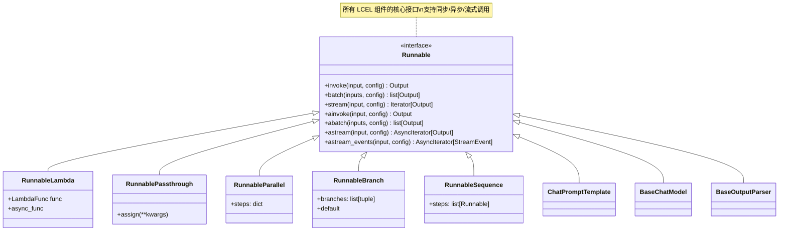

# Runnable 接口详解

Runnable 是 LCEL 的核心抽象，它定义了一套标准接口，使得任何实现该接口的组件都可以无缝组合、流式传输和异步执行。

## Runnable 接口定义

Runnable 是一个 Protocol（协议类），定义了以下核心方法：

```python
from typing import Any, AsyncIterator, Iterator, Mapping, Optional
from langchain_core.runnables import Runnable, RunnableConfig

class Runnable:
    """所有 LCEL 组件的基础接口"""
    
    # ============ 同步方法 ============
    
    def invoke(
        self,
        input: Input,
        config: Optional[RunnableConfig] = None
    ) -> Output:
        """
        同步调用，返回单个输出
        
        Args:
            input: 输入值
            config: 运行配置（可选）
        
        Returns:
            输出值
        """
        ...
    
    def batch(
        self,
        inputs: list[Input],
        config: Optional[RunnableConfig | list[RunnableConfig]] = None,
        *,
        return_exceptions: bool = False
    ) -> list[Output]:
        """
        批量处理多个输入
        
        Args:
            inputs: 输入列表
            config: 配置（单个或列表）
            return_exceptions: 是否返回异常而不是抛出
        
        Returns:
            输出列表
        """
        ...
    
    def stream(
        self,
        input: Input,
        config: Optional[RunnableConfig] = None
    ) -> Iterator[Output]:
        """
        流式输出，返回迭代器
        
        Args:
            input: 输入值
            config: 运行配置
        
        Returns:
            输出分块的迭代器
        """
        ...
    
    # ============ 异步方法 ============
    
    async def ainvoke(
        self,
        input: Input,
        config: Optional[RunnableConfig] = None
    ) -> Output:
        """异步版本的 invoke"""
        ...
    
    async def abatch(
        self,
        inputs: list[Input],
        config: Optional[RunnableConfig | list[RunnableConfig]] = None,
        *,
        return_exceptions: bool = False
    ) -> list[Output]:
        """异步版本的 batch"""
        ...
    
    async def astream(
        self,
        input: Input,
        config: Optional[RunnableConfig] = None
    ) -> AsyncIterator[Output]:
        """异步流式版本"""
        ...
    
    async def astream_events(
        self,
        input: Any,
        config: Optional[RunnableConfig] = None,
        *,
        version: Literal["v1", "v2"]
    ) -> AsyncIterator[StreamEvent]:
        """
        流式输出事件，包含中间状态
        
        这是最强大的调试工具，可以观察整个链的执行过程
        """
        ...
```

## Runnable 核心实现类

### RunnableLambda - 将函数转换为 Runnable

`RunnableLambda` 允许你将任意 Python 函数转换为 Runnable 组件。

```python
from langchain_core.runnables import RunnableLambda
from langchain_openai import ChatOpenAI

# 定义普通函数
def extract_first_sentence(text: str) -> str:
    """提取第一段话"""
    return text.split('.')[0] + '.'

def count_words(text: str) -> dict:
    """统计词数"""
    words = text.split()
    return {"text": text, "word_count": len(words)}

# 转换为 Runnable
extractor = RunnableLambda(extract_first_sentence)
counter = RunnableLambda(count_words)

# 现在可以作为 LCEL 的一部分使用
llm = ChatOpenAI(model="gpt-3.5-turbo")

chain = llm | extractor | counter

result = chain.invoke("你好世界。这是第二句。这是第三句。")
print(result)  
# 输出：{'text': '你好世界。', 'word_count': 1}
```

#### 异步函数支持

```python
import asyncio
from langchain_core.runnables import RunnableLambda

async def async_fetch_data(url: str) -> str:
    """异步获取数据"""
    # 模拟异步操作
    await asyncio.sleep(0.1)
    return f"Data from {url}"

# RunnableLambda 支持异步函数
async_fetcher = RunnableLambda(async_fetch_data)

# 使用异步调用
async def main():
    result = await async_fetcher.ainvoke("https://example.com")
    print(result)

asyncio.run(main())
```

#### 带配置的 RunnableLambda

```python
from langchain_core.runnables import RunnableLambda, RunnableConfig

def process_with_config(
    input: str, 
    config: Optional[RunnableConfig] = None
) -> str:
    """可以访问运行配置的函数"""
    # 从配置中获取额外信息
    if config and 'metadata' in config:
        metadata = config['metadata']
        print(f"处理元数据：{metadata}")
    
    # 也可以从配置中获取回调、标签等
    if config and 'tags' in config:
        tags = config['tags']
        print(f"标签：{tags}")
    
    return f"处理：{input}"

# 创建 Runnable
processor = RunnableLambda(process_with_config)

# 调用时传入配置
result = processor.invoke(
    "测试输入",
    config={
        "metadata": {"user_id": "123"},
        "tags": ["important", "test"]
    }
)
```

### RunnablePassthrough - 传递不变的数据

`RunnablePassthrough` 将输入原样传递到输出，常用于：

1. 在链中保持某些输入值不变
2. 分支后合并数据
3. 调试时输出中间结果

```python
from langchain_core.runnables import RunnablePassthrough
from langchain_openai import ChatOpenAI
from langchain_core.prompts import ChatPromptTemplate

llm = ChatOpenAI(model="gpt-3.5-turbo")

# 场景 1：保持原始输入
chain1 = RunnablePassthrough() | (lambda x: f"输入是：{x}")
result1 = chain1.invoke("hello")
print(result1)  # 输入是：hello

# 场景 2：分支后合并
prompt = ChatPromptTemplate.from_template("总结：{doc}")

chain2 = {
    "summary": prompt | llm,           # 分支 1：生成摘要
    "original": RunnablePassthrough()   # 分支 2：保持原文
}

result2 = chain2.invoke({"doc": "这是一篇很长的文档..."})
print(result2.keys())  # dict_keys(['summary', 'original'])
```

#### assign() 方法 - 添加新字段

```python
from langchain_core.runnables import RunnablePassthrough

# 使用 assign 添加新字段到字典
chain = RunnablePassthrough().assign(
    word_count=lambda x: len(x['text'].split()),
    char_count=lambda x: len(x['text'])
)

result = chain.invoke({"text": "Hello World"})
print(result)
# 输出：{
#     'text': 'Hello World',
#     'word_count': 2,
#     'char_count': 11
# }
```

### RunnableParallel - 并行执行多个分支

`RunnableParallel`（也称为 `RunnableBranch` 的字典形式）允许同时执行多个 Runnable，并将结果收集到字典中。

```python
from langchain_core.runnables import RunnableParallel, RunnableLambda
from langchain_openai import ChatOpenAI

llm = ChatOpenAI(model="gpt-3.5-turbo")

# 定义多个处理函数
def analyze_sentiment(text: str) -> str:
    return "正面"  # 简化示例

def extract_keywords(text: str) -> list:
    return ["关键词 1", "关键词 2"]

def categorize(text: str) -> str:
    return "技术类"

# 并行执行所有分析
parallel_analyzer = RunnableParallel({
    "sentiment": RunnableLambda(analyze_sentiment),
    "keywords": RunnableLambda(extract_keywords),
    "category": RunnableLambda(categorize),
    # 也可以使用 LCEL 链
    "summary": llm | (lambda x: x.content[:50])
})

# 所有分支同时执行
result = parallel_analyzer.invoke("这是一篇关于 AI 的技术文章")
print(result)
# 输出：{
#     'sentiment': '正面',
#     'keywords': ['关键词 1', '关键词 2'],
#     'category': '技术类',
#     'summary': '...'
# }
```

#### 并行执行优化

```python
import asyncio
from langchain_core.runnables import RunnableParallel
from langchain_openai import ChatOpenAI

llm = ChatOpenAI(model="gpt-3.5-turbo")

# 场景：需要多次调用 LLM，使用并行加速
parallel_chain = RunnableParallel({
    "topic1": llm | (lambda x: x.content),
    "topic2": llm | (lambda x: x.content),
    "topic3": llm | (lambda x: x.content),
})

# 相比顺序执行，时间减少约 2/3
# 顺序：3 次调用 = 3 个响应时间
# 并行：3 次调用 = 1 个响应时间（并发）
result = parallel_chain.invoke("介绍一下")
```

### RunnableBranch - 条件分支

`RunnableBranch` 允许根据输入条件执行不同的分支。

```python
from langchain_core.runnables import RunnableBranch
from langchain_openai import ChatOpenAI

llm = ChatOpenAI(model="gpt-3.5-turbo")

# 根据语言选择不同的处理链
branch = RunnableBranch(
    # (条件函数，对应的 Runnable)
    (lambda x: x.get("language") == "en", llm | (lambda x: f"English: {x.content}")),
    (lambda x: x.get("language") == "zh", llm | (lambda x: f"中文：{x.content}")),
    # 默认分支（最后一个没有条件）
    llm | (lambda x: f"其他语言：{x.content}")
)

result1 = branch.invoke({"language": "en", "topic": "AI"})
result2 = branch.invoke({"language": "zh", "topic": "AI"})
result3 = branch.invoke({"language": "ja", "topic": "AI"})
```

## RunnableConfig - 运行配置

`RunnableConfig` 是一个 TypedDict，用于传递运行时配置：

```python
from typing import Optional
from langchain_core.runnables import RunnableConfig
from langchain_core.callbacks import BaseCallbackHandler

config: RunnableConfig = {
    # 并发控制
    "max_concurrency": 5,
    
    # 回调函数
    "callbacks": [MyCustomHandler()],
    
    # 标签（用于日志和追踪）
    "tags": ["important", "production"],
    
    # 元数据（传递给回调）
    "metadata": {
        "user_id": "123",
        "request_id": "abc-456"
    },
    
    # 递归配置
    "recursion_limit": 50,
    
    # 运行名称（用于追踪）
    "run_name": "MyChain",
    
    # 可配置的字段（用于配置替代）
    "configurable_fields": {...},
    
    # 可配置的键
    "configurable": {
        "model_name": "gpt-4",
        "temperature": 0.7
    }
}
```

### 使用配置

```python
from langchain_core.prompts import ChatPromptTemplate
from langchain_openai import ChatOpenAI
from langchain_core.runnables import RunnableConfig

prompt = ChatPromptTemplate.from_template("你好，{topic}")
llm = ChatOpenAI(model="gpt-3.5-turbo")
chain = prompt | llm

# 方式 1：直接传入 dict
result = chain.invoke(
    {"topic": "AI"},
    config={"tags": ["demo"], "metadata": {"env": "dev"}}
)

# 方式 2：使用 RunnableConfig 类型
config: RunnableConfig = {
    "tags": ["demo"],
    "max_concurrency": 3
}
result = chain.invoke({"topic": "AI"}, config=config)
```

## 输入输出类型系统

LCEL 使用 Python 的类型注解来推断和验证类型。

### 类型推断

```python
from langchain_core.prompts import ChatPromptTemplate
from langchain_openai import ChatOpenAI
from langchain_core.output_parsers import StrOutputParser
from typing import TypedDict

# 定义输入类型
class ChainInput(TypedDict):
    topic: str
    language: str

# 定义输出类型
class ChainOutput(TypedDict):
    response: str
    word_count: int

prompt = ChatPromptTemplate.from_template(
    "用{language}写一篇关于{topic}的文章"
)

llm = ChatOpenAI(model="gpt-3.5-turbo")
parser = StrOutputParser()

# LCEL 可以推断类型
# 输入：{"topic": str, "language": str}
# 输出：str
chain = prompt | llm | parser

# 添加类型化的后处理
from langchain_core.runnables import RunnableLambda

def count_words(text: str) -> ChainOutput:
    return {
        "response": text,
        "word_count": len(text.split())
    }

typed_chain = chain | RunnableLambda(count_words)
# 现在类型系统知道：输入 ChainInput -> 输出 ChainOutput
```

### 类型错误处理

```python
from langchain_core.runnables import RunnableLambda

def expects_int(x: int) -> str:
    return str(x * 2)

chain = RunnableLambda(expects_int)

try:
    # 这会在运行时出错
    result = chain.invoke("not an int")
except Exception as e:
    print(f"类型错误：{e}")
```

## 标准方法详解

### invoke vs ainvoke

```python
import asyncio
from langchain_openai import ChatOpenAI

llm = ChatOpenAI(model="gpt-3.5-turbo")

# 同步调用 - 阻塞
result_sync = llm.invoke("你好")
print(result_sync.content)

# 异步调用 - 非阻塞
async def main():
    result_async = await llm.ainvoke("你好")
    print(result_async.content)

asyncio.run(main())
```

### batch 批量处理

```python
from langchain_openai import ChatOpenAI

llm = ChatOpenAI(model="gpt-3.5-turbo")

inputs = [
    "介绍 Python",
    "介绍 JavaScript", 
    "介绍 Rust"
]

# 批量处理 - 比循环调用更高效
results = llm.batch(inputs)

for i, result in enumerate(results):
    print(f"{inputs[i]}: {result.content[:50]}...")
```

### stream 流式输出

```python
from langchain_openai import ChatOpenAI

llm = ChatOpenAI(model="gpt-3.5-turbo", streaming=True)

# 流式输出 - 逐块接收响应
for chunk in llm.stream("写一篇短诗"):
    print(chunk.content, end="", flush=True)
```

### astream_events 事件流

这是最强大的调试和监控工具：

```python
import asyncio
from langchain_core.prompts import ChatPromptTemplate
from langchain_openai import ChatOpenAI
from langchain_core.output_parsers import StrOutputParser

prompt = ChatPromptTemplate.from_template("写一首关于{topic}的诗")
llm = ChatOpenAI(model="gpt-3.5-turbo")
parser = StrOutputParser()

chain = prompt | llm | parser

async def main():
    # 流式输出完整事件
    async for event in chain.astream_events(
        {"topic": "月亮"},
        version="v2"
    ):
        kind = event["event"]
        
        if kind == "on_chain_start":
            print(f"开始：{event['name']}")
        elif kind == "on_chain_end":
            print(f"完成：{event['name']}")
        elif kind == "on_llm_stream":
            print(f"LLM 输出：{event['data']['chunk'].content}", end="")
        elif kind == "on_parser_end":
            print(f"\n解析完成：{event['data']['output']}")

asyncio.run(main())
```

::: v-pre

:::

## 💡 提示块

> 💡 **实践建议**
> 
> 1. **优先使用异步方法**：`ainvoke`、`astream` 在生产环境中性能更好
> 2. **使用 astream_events 调试**：这是理解链内部行为的最强大工具
> 3. **合理使用 RunnableParallel**：对于 IO 密集型操作，并行可以显著提升性能
> 4. **使用 config 传递元数据**：便于日志记录和追踪
> 5. **类型注解是文档**：即使 Python 不强制，也要添加类型注解

## 总结

Runnable 接口是 LCEL 的基石，理解它对于掌握 LangChain 至关重要：

| 组件 | 用途 | 关键特性 |
|------|------|----------|
| **RunnableLambda** | 自定义函数 | 支持同步/异步函数 |
| **RunnablePassthrough** | 数据透传 | assign() 添加字段 |
| **RunnableParallel** | 并行执行 | 字典形式收集结果 |
| **RunnableBranch** | 条件分支 | 多路路由选择 |
| **RunnableConfig** | 运行配置 | 回调/标签/元数据 |

掌握这些组件，你就可以构建任意复杂的 LCEL 链了。