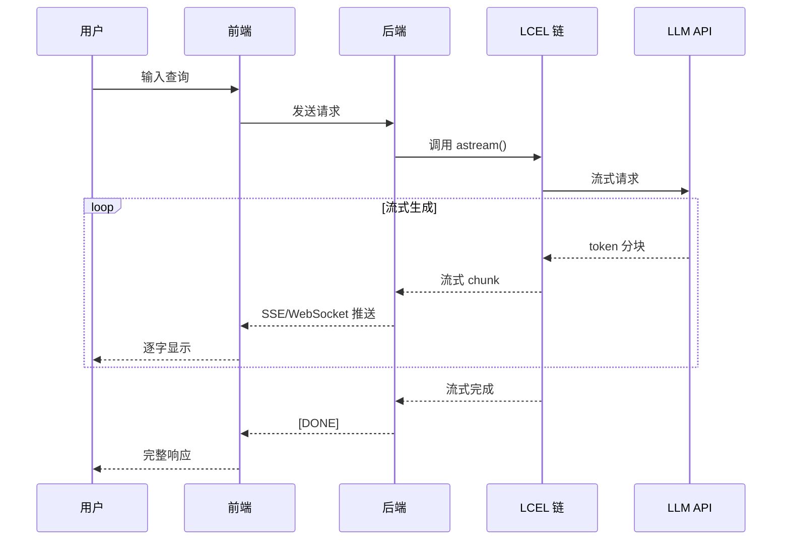

# 流式输出 Streaming 详解

流式输出是 LCEL 的核心特性之一，它允许你实时获取模型生成的内容，而不是等待完整的响应。这对于聊天界面、长文本生成等场景尤为重要。

## 流式 API 对比

LCEL 提供了三种流式 API，每种适用于不同的场景：

| API | 类型 | 用途 | 返回类型 |
|-----|------|------|----------|
| `stream()` | 同步 | 同步流式输出 | `Iterator[Output]` |
| `astream()` | 异步 | 异步流式输出 | `AsyncIterator[Output]` |
| `astream_events()` | 异步 | 事件流（含中间状态） | `AsyncIterator[StreamEvent]` |

### stream() - 同步流式

```python
from langchain_core.prompts import ChatPromptTemplate
from langchain_openai import ChatOpenAI
from langchain_core.output_parsers import StrOutputParser

prompt = ChatPromptTemplate.from_template("写一首关于{topic}的短诗")
llm = ChatOpenAI(model="gpt-3.5-turbo", streaming=True)
parser = StrOutputParser()

chain = prompt | llm | parser

# 同步流式输出
for chunk in chain.stream({"topic": "月亮"}):
    print(chunk, end="", flush=True)
# 输出：皎洁的月光洒向大地...（逐字/逐词输出）
```

### astream() - 异步流式

```python
import asyncio
from langchain_core.prompts import ChatPromptTemplate
from langchain_openai import ChatOpenAI
from langchain_core.output_parsers import StrOutputParser

prompt = ChatPromptTemplate.from_template("写一首关于{topic}的短诗")
llm = ChatOpenAI(model="gpt-3.5-turbo", streaming=True)
parser = StrOutputParser()

chain = prompt | llm | parser

async def main():
    # 异步流式输出
    async for chunk in chain.astream({"topic": "月亮"}):
        print(chunk, end="", flush=True)

asyncio.run(main())
```

### astream_events() - 事件流

这是最强大的调试和监控工具，可以观察整个链的执行过程：

```python
import asyncio
from langchain_core.prompts import ChatPromptTemplate
from langchain_openai import ChatOpenAI
from langchain_core.output_parsers import StrOutputParser

prompt = ChatPromptTemplate.from_template("写一首关于{topic}的诗")
llm = ChatOpenAI(model="gpt-3.5-turbo", streaming=True)
parser = StrOutputParser()

chain = prompt | llm | parser

async def main():
    async for event in chain.astream_events({"topic": "月亮"}, version="v2"):
        kind = event["event"]
        
        if kind == "on_chain_start":
            print(f"🔵 开始：{event['name']}")
        elif kind == "on_chain_end":
            print(f"🟢 完成：{event['name']}")
        elif kind == "on_llm_start":
            print(f"🟡 LLM 开始处理...")
        elif kind == "on_llm_stream":
            # LLM 流式输出分块
            chunk = event["data"]["chunk"]
            print(chunk.content, end="", flush=True)
        elif kind == "on_llm_end":
            print(f"\n🟢 LLM 完成")
        elif kind == "on_parser_start":
            print(f"🟡 解析器开始...")
        elif kind == "on_parser_end":
            print(f"🟢 解析完成：{event['data']['output'][:50]}...")

asyncio.run(main())
```

## 流式输出的底层原理

### 流式是如何工作的？

1. **LLM 层**：模型逐 token 生成内容
2. **Runnable 层**：每个 Runnable 组件传递流式分块
3. **Parser 层**：解析器增量处理流式内容

```python
from langchain_core.runnables import RunnableLambda
from langchain_core.output_parsers import StrOutputParser

# 自定义支持流式的 Runnable
def custom_processor(chunks):
    """处理流式分块"""
    for chunk in chunks:
        # 对每个分块进行处理
        yield chunk.upper()  # 示例：转换为大写

stream_processor = RunnableLambda(custom_processor)

# 与 LLM 组合
chain = ChatOpenAI(streaming=True) | stream_processor | StrOutputParser()

for chunk in chain.stream("你好"):
    print(chunk, end="")
```

### 流式传递机制

```
用户输入
    ↓
[Prompt Template] → 流式 Messages
    ↓
[ChatModel] → 流式 AIMessage 分块
    ↓
[Output Parser] → 流式解析结果
    ↓
用户界面（逐字显示）
```

## 各种 Runnable 的流式支持

### ChatModel 流式

```python
from langchain_openai import ChatOpenAI

llm = ChatOpenAI(model="gpt-3.5-turbo", streaming=True)

# 流式调用
for chunk in llm.stream("写一个故事"):
    # chunk 是 AIMessageChunk
    print(chunk.content, end="")
```

### PromptTemplate 流式

```python
from langchain_core.prompts import ChatPromptTemplate

prompt = ChatPromptTemplate.from_template("你好，{name}！")

# Prompt 本身也支持流式（虽然通常没什么用）
for chunk in prompt.stream({"name": "小明"}):
    print(chunk)
```

### OutputParser 流式

```python
from langchain_core.output_parsers import StrOutputParser, JsonOutputParser

# StrOutputParser 支持流式
parser = StrOutputParser()

for chunk in parser.stream("一些文本"):
    print(chunk)

# JsonOutputParser 也支持流式解析
json_parser = JsonOutputParser()
```

### RunnableLambda 流式

```python
from langchain_core.runnables import RunnableLambda

# 生成器函数天然支持流式
def uppercase_stream(text):
    for char in text:
        yield char.upper()

stream_upper = RunnableLambda(uppercase_stream)

for chunk in stream_upper.stream("hello"):
    print(chunk, end="")  # H E L L O
```

### RunnableParallel 流式

```python
from langchain_core.runnables import RunnableParallel

# 并行分支的流式
parallel = RunnableParallel({
    "a": lambda x: x + "A",
    "b": lambda x: x + "B",
})

# 流式返回完整结果（因为需要等待所有分支）
for chunk in parallel.stream("input"):
    print(chunk)
    # {'a': 'inputA', 'b': 'inputB'}
```

### RunnableSequence 流式

```python
# 序列的流式 - 最常见的场景
chain = prompt | llm | parser

for chunk in chain.stream({"topic": "AI"}):
    print(chunk, end="")
```

## 实际场景：聊天界面流式输出

### 场景 1：简单的聊天流式

```python
import asyncio
from langchain_core.prompts import ChatPromptTemplate, MessagesPlaceholder
from langchain_openai import ChatOpenAI
from langchain_core.output_parsers import StrOutputParser
from langchain_core.messages import HumanMessage, AIMessage

class ChatStream:
    def __init__(self):
        self.history = []
        self.prompt = ChatPromptTemplate.from_messages([
            ("system", "你是一个有帮助的助手。"),
            MessagesPlaceholder(variable_name="history"),
            ("human", "{input}")
        ])
        self.llm = ChatOpenAI(model="gpt-3.5-turbo", streaming=True)
        self.parser = StrOutputParser()
        self.chain = self.prompt | self.llm | self.parser
    
    async def chat(self, user_input: str):
        # 构建完整输入
        chain_input = {
            "history": self.history,
            "input": user_input
        }
        
        # 流式输出
        full_response = ""
        async for chunk in self.chain.astream(chain_input):
            print(chunk, end="", flush=True)
            full_response += chunk
        
        # 更新历史
        self.history.extend([
            HumanMessage(content=user_input),
            AIMessage(content=full_response)
        ])
        
        return full_response

# 使用
chat = ChatStream()
asyncio.run(chat.chat("你好"))
asyncio.run(chat.chat("介绍一下你自己"))
```

### 场景 2：WebSocket 流式推送

```python
import asyncio
import json
from langchain_core.prompts import ChatPromptTemplate
from langchain_openai import ChatOpenAI
from langchain_core.output_parsers import StrOutputParser

# 模拟 WebSocket 连接
class WebSocketMock:
    async def send_json(self, data: dict):
        print(f"WS 发送：{json.dumps(data)}")
    
    async def send_text(self, text: str):
        print(f"WS 发送：{text}")

async def stream_to_websocket(ws: WebSocketMock, query: str):
    prompt = ChatPromptTemplate.from_template("{query}")
    llm = ChatOpenAI(model="gpt-3.5-turbo", streaming=True)
    parser = StrOutputParser()
    
    chain = prompt | llm | parser
    
    # 发送开始标记
    await ws.send_json({"type": "start"})
    
    # 流式输出
    async for chunk in chain.astream({"query": query}):
        await ws.send_text(chunk)  # 逐块推送
    
    # 发送结束标记
    await ws.send_json({"type": "end"})

# 使用
ws = WebSocketMock()
asyncio.run(stream_to_websocket(ws, "写一首诗"))
```

### 场景 3：带进度显示的流式

```python
import asyncio
from langchain_core.prompts import ChatPromptTemplate
from langchain_openai import ChatOpenAI

async def stream_with_progress(query: str):
    prompt = ChatPromptTemplate.from_template("写一篇关于{query}的长文")
    llm = ChatOpenAI(model="gpt-3.5-turbo", streaming=True)
    
    chain = prompt | llm
    
    total_tokens = 0
    async for event in chain.astream_events({"query": query}, version="v2"):
        if event["event"] == "on_llm_stream":
            chunk = event["data"]["chunk"]
            total_tokens += 1
            print(f"[{total_tokens}] {chunk.content}", end="")
    
    print(f"\n✅ 完成，共{total_tokens}个 token")

asyncio.run(stream_with_progress("人工智能"))
```

### 场景 4：SSE (Server-Sent Events) 响应

```python
from fastapi import FastAPI
from fastapi.responses import StreamingResponse
from langchain_core.prompts import ChatPromptTemplate
from langchain_openai import ChatOpenAI
from langchain_core.output_parsers import StrOutputParser
import asyncio
import json

app = FastAPI()

@app.post("/stream")
async def stream_endpoint(query: str):
    prompt = ChatPromptTemplate.from_template("{query}")
    llm = ChatOpenAI(model="gpt-3.5-turbo", streaming=True)
    parser = StrOutputParser()
    
    chain = prompt | llm | parser
    
    async def generate():
        async for chunk in chain.astream({"query": query}):
            # SSE 格式
            yield f"data: {json.dumps({'content': chunk})}\n\n"
        yield "data: [DONE]\n\n"
    
    return StreamingResponse(generate(), media_type="text/event-stream")
```

::: v-pre

:::

## 流式事件类型详解

`astream_events()` 返回的事件类型：

| 事件类型 | 触发时机 | 数据内容 |
|---------|---------|---------|
| `on_chain_start` | 链开始执行 | 输入数据 |
| `on_chain_end` | 链执行完成 | 输出数据 |
| `on_llm_start` | LLM 开始调用 | 输入 prompts |
| `on_llm_stream` | LLM 流式输出 | AIMessageChunk |
| `on_llm_end` | LLM 调用完成 | 完整响应 |
| `on_parser_start` | 解析器开始 | - |
| `on_parser_end` | 解析器完成 | 解析结果 |
| `on_tool_start` | 工具开始调用 | 工具输入 |
| `on_tool_end` | 工具调用完成 | 工具输出 |

### 事件流示例

```python
import asyncio
from langchain_core.prompts import ChatPromptTemplate
from langchain_openai import ChatOpenAI
from langchain_core.output_parsers import JsonOutputParser
from pydantic import BaseModel, Field

class Response(BaseModel):
    answer: str
    confidence: float

async def detailed_event_stream():
    prompt = ChatPromptTemplate.from_template("回答:{q}")
    llm = ChatOpenAI(model="gpt-4-turbo", streaming=True)
    parser = JsonOutputParser(pydantic_object=Response)
    
    chain = prompt | llm.bind(response_format={"type": "json_object"}) | parser
    
    async for event in chain.astream_events({"q": "什么是 AI？"}, version="v2"):
        event_type = event["event"]
        name = event.get("name", "unknown")
        
        if event_type == "on_chain_start":
            print(f"▶️ 链开始：{name}")
        elif event_type == "on_llm_stream":
            chunk = event["data"]["chunk"]
            print(f"📝 LLM: {chunk.content}", end="")
        elif event_type == "on_parser_end":
            print(f"\n✅ 解析结果：{event['data']['output']}")
        elif event_type == "on_chain_end":
            print(f"✓ 链完成")

asyncio.run(detailed_event_stream())
```

## 💡 提示块

> 💡 **最佳实践**
>
> 1. **始终启用 streaming=True**：在 ChatModel 初始化时设置
> 2. **使用 astream_events 调试**：理解链的内部行为
> 3. **前端去抖动**：避免过快更新 UI，可以累积几个 token 再显示
> 4. **错误处理**：流式中捕获异常并优雅处理
> 5. **取消支持**：实现用户取消长任务的功能

## 总结

| API | 适用场景 | 优点 |
|-----|---------|------|
| **stream()** | 同步脚本、CLI | 简单直观 |
| **astream()** | 异步应用、Web 服务 | 高性能 |
| **astream_events()** | 调试、监控、复杂 UI | 完整可观测性 |

掌握流式输出是构建响应式 AI 应用的关键。