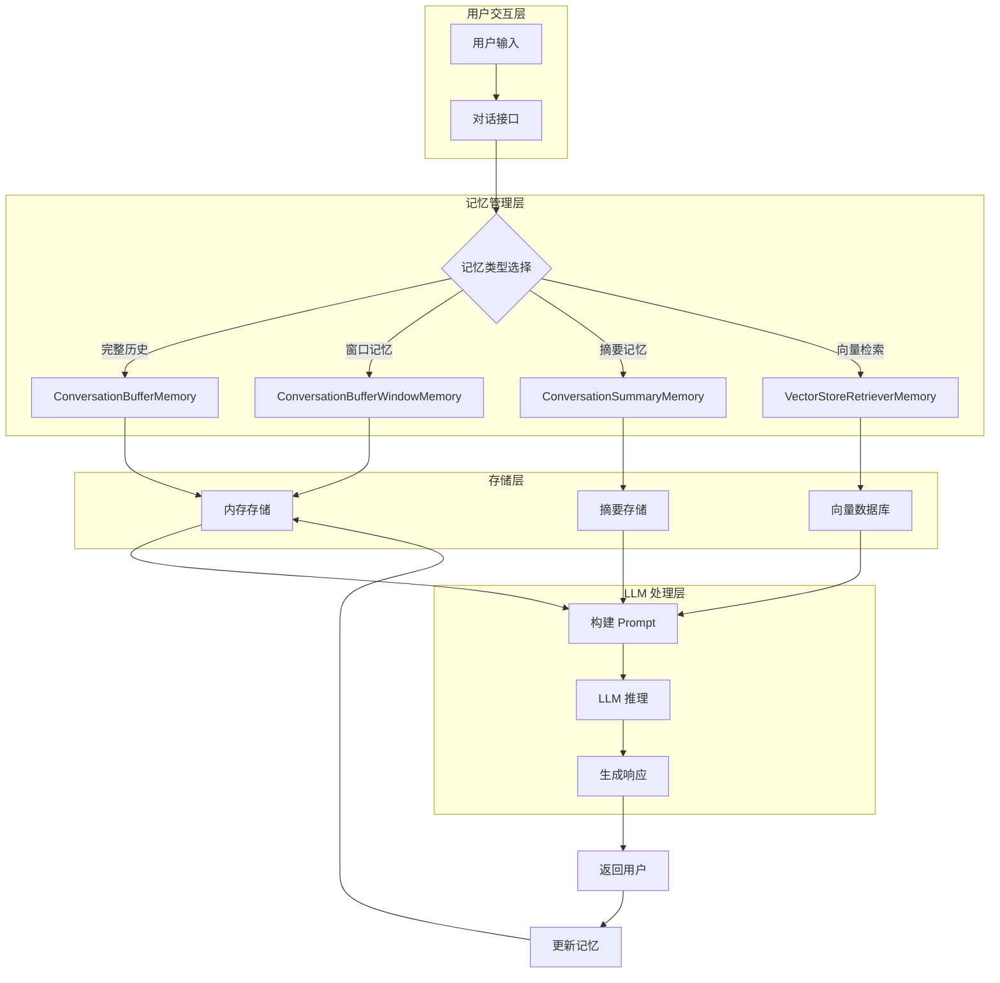

# 对话记忆基础

在构建 LangChain 应用时，让 AI 记住之前的对话内容是实现自然、连贯交互的关键。本文将深入讲解 LangChain 中的对话记忆机制，帮助你构建有"记忆力"的智能应用。

## 为什么需要对话记忆？

大语言模型（LLM）本身是无状态的。每次 API 调用都是独立的，模型不会自动记住之前的对话内容。为了实现多轮对话，我们需要显式地将历史对话传递给模型。

**对话记忆的核心价值：**

- 📌 **上下文连续性**：让 AI 理解当前问题与之前对话的关联
- 📌 **个性化体验**：记住用户的偏好、背景信息
- 📌 **任务完成度**：在多步骤任务中保持状态追踪
- 📌 **减少重复**：避免用户反复提供相同信息

## ConversationBufferMemory：基础记忆组件

`ConversationBufferMemory` 是最简单的记忆类型，它会存储完整的对话历史。

### 基本用法

```python
from langchain.memory import ConversationBufferMemory
from langchain.chains import ConversationChain
from langchain_openai import ChatOpenAI

# 初始化记忆组件
memory = ConversationBufferMemory(
    memory_key="chat_history",  # 变量名，用于在 prompt 中引用
    return_messages=True,       # 返回消息对象而非字符串
    input_key="input",          # 输入变量名
    output_key="output"         # 输出变量名
)

# 创建对话链
llm = ChatOpenAI(
    model="gpt-4o",
    temperature=0.7,
    max_tokens=2048
)

conversation = ConversationChain(
    llm=llm,
    memory=memory,
    verbose=True  # 输出调试信息
)

# 多轮对话示例
response1 = conversation.invoke({"input": "你好，我叫林傒，在长沙工作"})
print(response1)
# 输出：你好林傒！很高兴认识你。你在长沙做什么工作呢？

response2 = conversation.invoke({"input": "我是一名前端工程师"})
print(response2)
# 输出：很棒！前端开发是个很有趣的领域。你在长沙的哪家公司工作呢？

response3 = conversation.invoke({"input": "你还记得我叫什么吗？"})
print(response3)
# 输出：当然记得！你叫林傒，是一名在长沙工作的前端工程师。
```

### 关键参数说明

| 参数 | 类型 | 默认值 | 说明 |
|------|------|--------|------|
| `memory_key` | str | `"history"` | 在 prompt 中引用记忆的变量名 |
| `return_messages` | bool | `False` | 是否返回 BaseMessage 对象 |
| `input_key` | str | `None` | 输入变量名，用于多变量场景 |
| `output_key` | str | `None` | 输出变量名 |
| `human_prefix` | str | `"Human"` | 人类消息的前缀 |
| `ai_prefix` | str | `"AI"` | AI 消息的前缀 |

### 查看记忆内容

```python
# 获取当前记忆
print(memory.buffer)
# 输出：完整的历史对话文本

# 获取消息列表
print(memory.chat_memory.messages)
# 输出：[HumanMessage(...), AIMessage(...), ...]

# 获取记忆变量
print(memory.load_memory_variables({}))
# 输出：{'chat_history': [...]}

# 清除记忆
memory.clear()
```

## ConversationBufferWindowMemory：窗口记忆

当对话历史很长时，完整的 Buffer Memory 会消耗大量 token。`ConversationBufferWindowMemory` 只保留最近的 k 轮对话。

```python
from langchain.memory import ConversationBufferWindowMemory

# 只保留最近 5 轮对话
window_memory = ConversationBufferWindowMemory(
    k=5,                    # 保留 5 轮
    return_messages=True,
    memory_key="chat_history"
)

conversation = ConversationChain(
    llm=llm,
    memory=window_memory,
    verbose=True
)

# 进行 10 轮对话后，记忆只保留最新的 5 轮
for i in range(10):
    response = conversation.invoke({"input": f"这是第{i+1}轮对话"})

# 查看记忆，只有最近 5 轮
print(len(window_memory.chat_memory.messages))  # 输出：10 (每轮 2 条消息)
```

💡 **提示**：`k` 参数表示对话轮数，不是消息条数。每轮对话包含 1 条用户消息和 1 条 AI 消息。

## Memory 在 LCEL 时代的角色变化

LangChain Expression Language (LCEL) 引入了更现代的编排方式，传统的 Memory 组件在 LCEL 中有了新用法。

### Legacy 方式 vs LCEL 方式

**传统 Chain 方式：**

```python
# Legacy - 使用 ConversationChain
from langchain.chains import ConversationChain

chain = ConversationChain(
    llm=llm,
    memory=ConversationBufferMemory()
)
response = chain.invoke({"input": "你好"})
```

**LCEL 方式：**

```python
# LCEL - 使用 RunnableWithMessageHistory
from langchain_core.runnables.history import RunnableWithMessageHistory
from langchain_memory import ConversationBufferMemory

# 定义核心链
prompt = ChatPromptTemplate.from_messages([
    ("system", "你是一个有帮助的助手"),
    MessagesPlaceholder(variable_name="history"),
    ("human", "{input}")
])

chain = prompt | llm

# 包装记忆
chain_with_history = RunnableWithMessageHistory(
    chain,
    get_session_history=lambda session_id: ConversationBufferMemory(),
    input_messages_key="input",
    history_messages_key="history"
)

response = chain_with_history.invoke(
    {"input": "你好"},
    config={"configurable": {"session_id": "user_123"}}
)
```

### LCEL 的优势

| 特性 | Legacy Chain | LCEL |
|------|--------------|------|
| 组合性 | 有限 | 高度可组合 |
| 流式支持 | 部分支持 | 原生支持 |
| 异步支持 | 有限 | 完整支持 |
| 类型安全 | 弱 | 强类型 |
| 可观测性 | 基础 | 原生集成 LangSmith |

## 记忆管理架构图

::: v-pre

:::

## 实际应用场景

### 场景 1：客服机器人

```python
from langchain.memory import ConversationBufferWindowMemory

# 客服场景：保留最近 10 轮对话
memory = ConversationBufferWindowMemory(
    k=10,
    memory_key="chat_history",
    return_messages=True
)

# 系统提示强调客服角色
system_prompt = """你是一个专业的客服助手。
请友善、专业地回答用户问题。
记住用户之前提到的订单信息和问题。"""
```

### 场景 2：心理咨询助手

```python
# 心理咨询需要更长的上下文
memory = ConversationBufferMemory(
    memory_key="session_history",
    return_messages=True
)

# 系统提示关注用户情绪
system_prompt = """你是一个温暖的心理咨询助手。
请认真倾听用户的每一句话，记住他们提到的情绪和经历。
给予共情和支持性的回应。"""
```

### 场景 3：编程教学助手

```python
# 教学场景：需要记住学生的学习进度
memory = ConversationBufferWindowMemory(
    k=15,  # 保留较多上下文
    memory_key="learning_history"
)

system_prompt = """你是一个耐心的编程导师。
记住学生之前学过的概念，不要重复讲解。
根据学生的理解程度调整解释的深度。"""
```

## 最佳实践与注意事项

### ✅ 推荐做法

1. **根据场景选择 k 值**
   - 简单问答：k=3~5
   - 客服对话：k=10~15
   - 心理咨询：使用完整 Buffer

2. **定期清理记忆**
   ```python
   # 对话结束时清理
   if conversation_ended:
       memory.clear()
   ```

3. **使用 session_id 隔离用户**
   ```python
   # 多用户场景
   user_memory = get_memory_for_user(user_id)
   ```

4. **监控 token 使用**
   ```python
   # 估算 token 消耗
   from langchain_core.callbacks import get_openai_callback
   
   with get_openai_callback() as cb:
       response = conversation.invoke({"input": "..."})
       print(f"Total Tokens: {cb.total_tokens}")
   ```

### ❌ 避免的陷阱

1. **无限制增长**：Buffer Memory 不设置上限会导致 token 爆炸
2. **忽略上下文窗口**：确保记忆 + prompt 不超过模型限制
3. **未隔离会话**：多用户时必须用 session_id 隔离
4. **过度依赖记忆**：对于关键信息，应显式存储到数据库

## 总结

对话记忆是构建自然交互体验的核心组件。选择合适的记忆类型需要权衡：

- **完整度** vs **成本**：Buffer Memory 完整但昂贵，Window Memory 经济但会遗忘
- **简单性** vs **灵活性**：传统 Memory 简单易用，LCEL 方式更灵活强大

在实际项目中，建议：
1. 从简单的 `ConversationBufferWindowMemory` 开始
2. 根据用户反馈调整 k 值
3. 监控 token 使用，优化成本
4. 对于长期记忆需求，考虑 Vector Memory

下一节我们将深入探讨窗口记忆的更多细节和优化技巧。