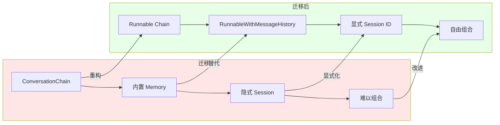

# Memory 在 LCEL 中的新范式

LangChain Expression Language (LCEL) 带来了记忆管理的现代化方式。本文讲解如何从传统的 `ConversationChain` 迁移到 LCEL 的 `RunnableWithMessageHistory`。

## 为什么需要迁移？

### Legacy 方式的局限性

```python
# Legacy 方式 - 问题所在
from langchain.chains import ConversationChain

memory = ConversationBufferMemory()
chain = ConversationChain(
    llm=llm,
    memory=memory
)

# 问题:
# 1. 不透明：内部管理 Session ID，难以控制
# 2. 难组合：无法与其他 Chain 自由组合
# 3. 异步支持弱：async/await 支持不完整
# 4. 可观测性差：缺少原生 LangSmith 集成
```

### LCEL 的优势

```python
# LCEL 方式 - 更现代
from langchain_core.runnables.history import RunnableWithMessageHistory

# 1. 透明控制：显式管理 session_id
# 2. 可组合：可以组合任何 Runnable
# 3. 异步优先：完整的异步支持
# 4. 原生集成：与 LangSmith 无缝集成
# 5. 流式友好：支持流式输出
```

## RunnableWithMessageHistory

### 基础用法

```python
from langchain_core.runnables.history import RunnableWithMessageHistory
from langchain.memory import ConversationBufferMemory
from langchain_openai import ChatOpenAI
from langchain_core.prompts import ChatPromptTemplate, MessagesPlaceholder

# 1. 定义核心链（不含记忆）
prompt = ChatPromptTemplate.from_messages([
    ("system", "你是一个有帮助的助手"),
    MessagesPlaceholder(variable_name="history"),
    ("human", "{input}")
])

llm = ChatOpenAI(model="gpt-4o")
chain = prompt | llm

# 2. 定义会话历史获取函数
def get_session_history(session_id: str):
    """每个 session_id 对应独立的对话历史"""
    return ConversationBufferMemory(
        memory_key="history",
        return_messages=True
    )

# 3. 包装记忆
chain_with_history = RunnableWithMessageHistory(
    chain,
    get_session_history=get_session_history,
    input_messages_key="input",
    history_messages_key="history"
)

# 4. 使用
response = chain_with_history.invoke(
    {"input": "你好，我叫林傒"},
    config={"configurable": {"session_id": "user_123"}}
)
print(response.content)

# 后续对话
response = chain_with_history.invoke(
    {"input": "你还记得我叫什么吗？"},
    config={"configurable": {"session_id": "user_123"}}
)
# 输出：记得，你叫林傒
```

### 关键参数详解

```python
chain_with_history = RunnableWithMessageHistory(
    runnables=chain,                    # 要包装的核心链
    get_session_history=get_session_history,  # session 工厂函数
    input_messages_key="input",         # 输入消息的 key
    history_messages_key="history",     # 历史消息的 key
    history_factory_config=[           # 可选：配置参数
        ConfigurableField(
            id="session_id",
            name="Session ID",
            description="唯一标识对话会话"
        )
    ]
)
```

## 从 Legacy Memory 迁移

### 迁移对照表

::: v-pre
```mermaid
graph TB
    subgraph Legacy[传统方式]
        A1[ConversationChain] --> A2[ConversationBufferMemory]
        A2 --> A3[自动管理 session]
    end
    
    subgraph LCEL[LCEL 方式]
        B1[prompt | llm] --> B2[RunnableWithMessageHistory]
        B2 --> B3[显式 session_id]
    end
    
    A1 -.->|迁移 | B1
    A2 -.->|替代 | B3
    A3 -.->|显式化 | B3
```
:::

### 迁移示例：Buffer Memory

```python
# ============== Legacy 方式 ==============
from langchain.chains import ConversationChain
from langchain.memory import ConversationBufferMemory

legacy_memory = ConversationBufferMemory(memory_key="chat_history")
legacy_chain = ConversationChain(
    llm=llm,
    memory=legacy_memory
)
response = legacy_chain.invoke({"input": "你好"})

# ============== LCEL 迁移 ==============
from langchain_core.runnables.history import RunnableWithMessageHistory
from langchain.memory import ConversationBufferMemory
from langchain_core.prompts import ChatPromptTemplate, MessagesPlaceholder

# 步骤 1: 定义 prompt
prompt = ChatPromptTemplate.from_messages([
    ("system", "你是助手"),
    MessagesPlaceholder(variable_name="history"),
    ("human", "{input}")
])

# 步骤 2: 创建链
chain = prompt | llm

# 步骤 3: 包装记忆
chain_with_history = RunnableWithMessageHistory(
    chain,
    get_session_history=lambda sid: ConversationBufferMemory(
        memory_key="history",
        return_messages=True
    ),
    input_messages_key="input",
    history_messages_key="history"
)

# 步骤 4: 使用
response = chain_with_history.invoke(
    {"input": "你好"},
    config={"configurable": {"session_id": "session_1"}}
)
```

### 迁移示例：Window Memory

```python
# Legacy
from langchain.memory import ConversationBufferWindowMemory

window_memory = ConversationBufferWindowMemory(k=5)
chain = ConversationChain(llm=llm, memory=window_memory)

# LCEL 迁移
from langchain.memory import ConversationBufferWindowMemory

chain_with_history = RunnableWithMessageHistory(
    prompt | llm,
    get_session_history=lambda sid: ConversationBufferWindowMemory(
        k=5,
        memory_key="history",
        return_messages=True
    ),
    input_messages_key="input",
    history_messages_key="history"
)
```

### 迁移示例：Summary Memory

```python
# Legacy
from langchain.memory import ConversationSummaryMemory

summary_memory = ConversationSummaryMemory(llm=llm)
chain = ConversationChain(llm=llm, memory=summary_memory)

# LCEL 迁移
from langchain.memory import ConversationSummaryMemory

chain_with_history = RunnableWithMessageHistory(
    prompt | llm,
    get_session_history=lambda sid: ConversationSummaryMemory(
        llm=llm,
        memory_key="history",
        return_messages=True
    ),
    input_messages_key="input",
    history_messages_key="history"
)
```

## 最佳实践

### 1. 持久化 Session 历史

```python
from langchain.memory import ConversationBufferMemory
import json
from pathlib import Path

MEMORY_DIR = Path("./memory_store")
MEMORY_DIR.mkdir(exist_ok=True)

def get_persistent_history(session_id: str):
    """从磁盘加载或创建会话历史"""
    memory_file = MEMORY_DIR / f"{session_id}.json"
    
    memory = ConversationBufferMemory(
        memory_key="history",
        return_messages=True
    )
    
    if memory_file.exists():
        # 加载历史
        with open(memory_file, 'r') as f:
            data = json.load(f)
            for msg_data in data.get("messages", []):
                # 恢复消息对象
                pass
    
    # 包装 save_context 以持久化
    original_save = memory.save_context
    def save_and_persist(inputs, outputs):
        original_save(inputs, outputs)
        # 保存到磁盘
        with open(memory_file, 'w') as f:
            json.dump({"messages": []}, f)  # 简化示例
    
    memory.save_context = save_and_persist
    return memory

# 使用
chain_with_history = RunnableWithMessageHistory(
    chain,
    get_session_history=get_persistent_history,
    input_messages_key="input",
    history_messages_key="history"
)
```

### 2. 多用户 Session 管理

```python
from langchain.memory import ConversationBufferWindowMemory

class SessionManager:
    """管理多用户会话"""
    
    def __init__(self, k=10):
        self.sessions = {}
        self.k = k
    
    def get_session(self, session_id: str):
        if session_id not in self.sessions:
            self.sessions[session_id] = ConversationBufferWindowMemory(
                k=self.k,
                memory_key="history",
                return_messages=True
            )
        return self.sessions[session_id]
    
    def clear_session(self, session_id: str):
        if session_id in self.sessions:
            self.sessions[session_id].clear()
    
    def get_all_sessions(self):
        return list(self.sessions.keys())

# 使用
session_manager = SessionManager(k=10)

chain_with_history = RunnableWithMessageHistory(
    chain,
    get_session_history=session_manager.get_session,
    input_messages_key="input",
    history_messages_key="history"
)
```

### 3. 带超时的 Session

```python
import time
from collections import OrderedDict

class ExpiringSessionManager:
    """带超时清理的 Session 管理"""
    
    def __init__(self, ttl_seconds=3600):
        self.sessions = OrderedDict()
        self.timestamps = {}
        self.ttl = ttl_seconds
    
    def get_session(self, session_id: str):
        # 检查是否过期
        if session_id in self.timestamps:
            if time.time() - self.timestamps[session_id] > self.ttl:
                # 过期，清理
                self.sessions.pop(session_id, None)
                self.timestamps.pop(session_id, None)
        
        # 创建新 session
        if session_id not in self.sessions:
            self.sessions[session_id] = ConversationBufferWindowMemory(
                k=10, memory_key="history", return_messages=True
            )
        
        # 更新访问时间
        self.timestamps[session_id] = time.time()
        return self.sessions[session_id]
    
    def cleanup_expired(self):
        """清理过期 session"""
        now = time.time()
        expired = [
            sid for sid, ts in self.timestamps.items()
            if now - ts > self.ttl
        ]
        for sid in expired:
            self.sessions.pop(sid, None)
            self.timestamps.pop(sid)
```

### 4. 流式响应支持

```python
from langchain_core.runnables.history import RunnableWithMessageHistory

# LCEL 原生支持流式
for chunk in chain_with_history.stream(
    {"input": "写一首关于春天的诗"},
    config={"configurable": {"session_id": "user_123"}}
):
    print(chunk.content, end="", flush=True)
```

### 5. 异步支持

```python
import asyncio

async def main():
    # 异步调用
    response = await chain_with_history.ainvoke(
        {"input": "你好"},
        config={"configurable": {"session_id": "user_123"}}
    )
    print(response.content)
    
    # 异步流式
    async for chunk in chain_with_history.astream(
        {"input": "讲个故事"},
        config={"configurable": {"session_id": "user_123"}}
    ):
        print(chunk.content, end="", flush=True)

asyncio.run(main())
```

## 迁移前后对比

::: v-pre

:::

### 详细对比表

| 维度 | Legacy ConversationChain | LCEL RunnableWithMessageHistory |
|------|--------------------------|--------------------------------|
| **Session 管理** | 内部自动管理 | 显式通过 config 传递 |
| **可组合性** | 有限 | 完全可组合 |
| **异步支持** | 部分支持 | 完整异步支持 |
| **流式输出** | 部分支持 | 原生流式支持 |
| **类型安全** | 弱类型 | 强类型提示 |
| **可观测性** | 基础 | 原生 LangSmith |
| **测试友好** | 较难 mock | 易于单元测试 |
| **生产就绪** | 遗留方式 | 推荐方式 |

## 完整迁移示例

### 客服机器人迁移

```python
# ============== Legacy 实现 ==============
from langchain.chains import ConversationChain
from langchain.memory import ConversationBufferWindowMemory

def create_legacy_bot():
    memory = ConversationBufferWindowMemory(k=10, memory_key="chat_history")
    chain = ConversationChain(
        llm=llm,
        memory=memory,
        verbose=True
    )
    return chain

# ============== LCEL 实现 ==============
from langchain_core.runnables.history import RunnableWithMessageHistory
from langchain_core.prompts import ChatPromptTemplate, MessagesPlaceholder

def create_modern_bot():
    # 自定义客服 prompt
    prompt = ChatPromptTemplate.from_messages([
        ("system", """你是专业客服助手。
记住客户的问题和已提供的解决方案。
保持友好、专业的语气。"""),
        MessagesPlaceholder(variable_name="history"),
        ("human", "{input}")
    ])
    
    chain = prompt | llm
    
    return RunnableWithMessageHistory(
        chain,
        get_session_history=lambda sid: ConversationBufferWindowMemory(
            k=10,
            memory_key="history",
            return_messages=True
        ),
        input_messages_key="input",
        history_messages_key="history"
    )

# 使用
bot = create_modern_bot()
response = bot.invoke(
    {"input": "我的订单还没发货"},
    config={"configurable": {"session_id": "customer_001"}}
)
```

## 常见问题

### Q1: 如何清空会话历史？

```python
# 方法 1: 清除特定 session
from langchain.memory import ConversationBufferMemory

class ClearableHistory:
    def __init__(self):
        self.histories = {}
    
    def get_session(self, session_id: str):
        if session_id not in self.histories:
            self.histories[session_id] = ConversationBufferMemory(
                memory_key="history", return_messages=True
            )
        return self.histories[session_id]
    
    def clear(self, session_id: str):
        if session_id in self.histories:
            self.histories[session_id].clear()

# 方法 2: 使用不同的 session_id
new_session_id = f"{user_id}_{timestamp}"  # 新会话
```

### Q2: 如何获取当前历史？

```python
# 访问 session 历史
session_history = session_manager.get_session("user_123")
messages = session_history.chat_memory.messages
print(f"当前有 {len(messages)} 条消息")
```

### Q3: 多模态记忆如何迁移？

```python
# LCEL 同样支持多模态
from langchain_core.messages import HumanMessage, AIMessage

prompt = ChatPromptTemplate.from_messages([
    MessagesPlaceholder(variable_name="history"),
    ("human", "{input}")
])

# history 可以包含文本和图像消息
```

## 总结

从 Legacy Memory 迁移到 LCEL 是现代化的必经之路：

**迁移收益：**
- ✅ 更好的可组合性
- ✅ 完整的异步/流式支持
- ✅ 显式 session 控制
- ✅ 原生 LangSmith 集成
- ✅ 更强的类型安全

**迁移步骤：**
1. 将 `ConversationChain` 改为 `prompt | llm`
2. 用 `RunnableWithMessageHistory` 包装
3. 定义 `get_session_history` 函数
4. 通过 `config` 传递 `session_id`

**关键变化：**
- Session 从隐式变为显式
- Memory 从内置变为外部工厂
- 调用从直接变为带 config

下一节我们将深入 Callback 系统，了解如何监控和调试 LangChain 应用。