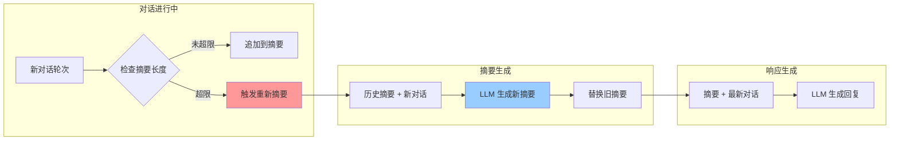
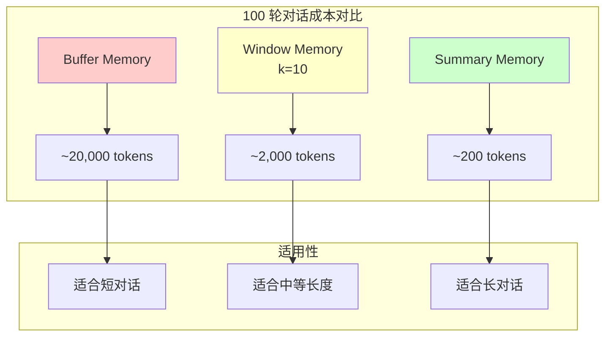

# ConversationSummaryMemory：高效的长期记忆

当对话历史非常长时，即使窗口记忆也可能不够用。`ConversationSummaryMemory` 通过持续生成对话摘要，以固定的 token 成本实现"无限"对话长度支持。

## 核心原理

### 摘要记忆的运作机制

传统记忆存储原始对话，而摘要记忆会持续压缩历史信息：

```
原始对话 (100 轮): [对话 1][对话 2]...[对话 100] = 约 20,000 tokens
                          ↓ LLM 摘要
摘要版本："用户询问了产品价格、功能对比，最终决定购买基础版" = 约 50 tokens
```

::: v-pre

:::

## ConversationSummaryMemory 详解

### 基本用法

```python
from langchain.memory import ConversationSummaryMemory
from langchain_openai import ChatOpenAI
from langchain.chains import ConversationChain

# 初始化摘要记忆
memory = ConversationSummaryMemory(
    llm=ChatOpenAI(model="gpt-4o", temperature=0),  # 摘要模型
    memory_key="chat_history",
    return_messages=True
)

conversation = ConversationChain(
    llm=ChatOpenAI(model="gpt-4o", temperature=0.7),
    memory=memory,
    verbose=True
)

# 进行长对话
for i in range(20):
    response = conversation.invoke({
        "input": f"这是第{i+1}轮对话，讨论话题{chr(65+i)}"
    })
    print(f"轮次{i+1}: {response['response'][:30]}...")

# 查看摘要后的记忆
print("\n=== 当前记忆状态 ===")
print(memory.load_memory_variables({}))
```

### 关键参数

| 参数 | 类型 | 说明 | 推荐值 |
|------|------|------|--------|
| `llm` | BaseLanguageModel | 用于生成摘要的模型 | 与主模型相同或更小 |
| `memory_key` | str | 记忆变量名 | `"chat_history"` |
| `return_messages` | bool | 是否返回消息对象 | `True` |
| `human_prefix` | str | 人类前缀 | `"Human"` |
| `ai_prefix` | str | AI 前缀 | `"AI"` |

## 摘要模型的选择

### 模型选择策略

```python
from langchain_openai import ChatOpenAI

# ==================== 按场景选择摘要模型 ====================

# 场景 1: 高性能需求，使用与主模型相同的模型
# 优点：摘要质量高，理解准确
# 缺点：成本较高
summary_model_v1 = ChatOpenAI(model="gpt-4o", temperature=0)

# 场景 2: 成本优化，使用较小模型
# 优点：摘要速度快，成本低
# 缺点：可能丢失细节
summary_model_v2 = ChatOpenAI(model="gpt-4o-mini", temperature=0)

# 场景 3: 极致成本优化
# 适用：简单对话，不要求高质量摘要
summary_model_v3 = ChatOpenAI(model="gpt-3.5-turbo", temperature=0)

# 场景 4: 使用专用摘要模型（推荐）
# 平衡质量和成本的最佳实践
summary_model_optimal = ChatOpenAI(
    model="gpt-4o",           # 主对话模型
    temperature=0             # 确定性输出
)
```

### 自定义摘要 Prompt

```python
from langchain.memory import ConversationSummaryMemory
from langchain.prompts import PromptTemplate

# 自定义摘要提示词
custom_summary_prompt = PromptTemplate(
    input_tokens=["summary", "new_lines"],
    template="""请简洁地总结以下对话内容，重点关注：
1. 用户的核心需求和意图
2. 已解决的关键问题
3. 待处理的事项
4. 用户的个人偏好（如有提到）

保持摘要在 200 字以内。

当前摘要：{summary}

新增对话：
{new_lines}

新摘要："""
)

memory = ConversationSummaryMemory(
    llm=ChatOpenAI(model="gpt-4o", temperature=0),
    prompt=custom_summary_prompt,
    memory_key="chat_history"
)
```

## 摘要质量优化

### 问题：摘要丢失关键信息

```python
# 解决方案 1：在摘要中保留结构化信息
structured_summary_prompt = """总结以下对话，必须保留以下信息：
- 用户姓名（如有提及）
- 关键数字（订单号、金额、日期）
- 用户明确表达的偏好
- 未完成的任务

当前摘要：{summary}
新增对话：{new_lines}
新摘要："""
```

### 问题：摘要过于冗长

```python
# 解决方案：在 prompt 中明确长度限制
concise_summary_prompt = """用不超过 100 字总结对话，只保留核心信息。

当前摘要：{summary}
新增对话：{new_lines}

精简摘要："""

memory = ConversationSummaryMemory(
    llm=ChatOpenAI(model="gpt-4o-mini", temperature=0),
    prompt=PromptTemplate(
        input_tokens=["summary", "new_lines"],
        template=concise_summary_prompt
    )
)
```

### 问题：摘要偏离主题

```python
# 解决方案：添加领域特定的摘要指导
domain_specific_prompt = """作为客服对话摘要助手，请总结：
1. 客户咨询的问题类型
2. 已提供的解决方案
3. 客户满意度（从语气推断）
4. 是否需要后续跟进

当前摘要：{summary}
新增对话：{new_lines}

客服摘要："""
```

## Token 成本对比分析

### 三种记忆类型的成本对比

::: v-pre

:::

### 详细成本计算

```python
from langchain.memory import (
    ConversationBufferMemory,
    ConversationBufferWindowMemory,
    ConversationSummaryMemory
)

def calculate_memory_cost(memory_type, num_rounds, avg_tokens_per_round=100):
    """
    计算不同记忆类型的 token 成本
    
    参数:
        memory_type: "buffer", "window", "summary"
        num_rounds: 对话轮数
        avg_tokens_per_round: 每轮平均 token 数
    """
    if memory_type == "buffer":
        # Buffer: 所有历史
        return num_rounds * avg_tokens_per_round
    
    elif memory_type == "window":
        # Window: 固定窗口 (假设 k=10)
        k = 10
        effective_rounds = min(num_rounds, k)
        return effective_rounds * avg_tokens_per_round
    
    elif memory_type == "summary":
        # Summary: 固定摘要长度 + 最新对话
        summary_tokens = 200  # 摘要固定长度
        latest_tokens = avg_tokens_per_round * 2  # 最新 1-2 轮
        return summary_tokens + latest_tokens

# 成本对比表
print("=== Token 成本对比表 ===")
print(f"{'轮数':<8}{'Buffer':<12}{'Window(k=10)':<15}{'Summary':<12}")
print("-" * 50)

for rounds in [10, 20, 50, 100, 200]:
    buffer_cost = calculate_memory_cost("buffer", rounds)
    window_cost = calculate_memory_cost("window", rounds)
    summary_cost = calculate_memory_cost("summary", rounds)
    print(f"{rounds:<8}{buffer_cost:<12}{window_cost:<15}{summary_cost:<12}")
```

**输出示例：**
```
轮数      Buffer      Window(k=10)   Summary     
--------------------------------------------------
10        1000        1000           400         
20        2000        1000           400         
50        5000        1000           400         
100       10000       1000           400         
200       20000       1000           400         
```

### 真实场景成本分析

```python
# 假设场景：客服机器人，日均 1000 次对话，平均每对话 30 轮

daily_scenarios = {
    "buffer": 30 * 100 * 1000,      # 3,000,000 tokens/天
    "window": 10 * 100 * 1000,       # 1,000,000 tokens/天
    "summary": 400 * 1000,           # 400,000 tokens/天
}

# GPT-4 成本：$0.03/1K tokens
gpt4_price_per_1k = 0.03

print("=== 日均成本 (GPT-4) ===")
for memory_type, tokens in daily_scenarios.items():
    cost = (tokens / 1000) * gpt4_price_per_1k
    print(f"{memory_type}: ${cost:.2f}/天 = ${cost*30:.2f}/月")
```

## 摘要记忆流程图

::: v-pre
```mermaid
stateDiagram-v2
    [*] --> 初始对话
    
    state 对话过程 {
        初始对话 --> 添加新对话
        添加新对话 --> 检查摘要长度
        
        state 摘要管理 {
            检查摘要长度 --> 未超限：长度 OK
            检查摘要长度 --> 超限：需要重新摘要
            
            需要重新摘要 --> 合并历史
            合并历史 --> 调用 LLM 摘要
            调用 LLM 摘要 --> 更新记忆
            
            未超限 --> 直接追加
        }
        
        直接追加 --> 生成响应
        更新记忆 --> 生成响应
    end
    
    生成响应 --> 返回用户
    返回用户 --> [*]
```
:::

## 实战：长对话处理

### 客服场景完整示例

```python
from langchain.memory import ConversationSummaryMemory
from langchain.chains import ConversationChain
from langchain_openai import ChatOpenAI

# 配置摘要记忆
memory = ConversationSummaryMemory(
    llm=ChatOpenAI(model="gpt-4o", temperature=0),
    memory_key="chat_history",
    return_messages=True,
    human_prefix="客户",
    ai_prefix="客服"
)

# 创建对话链
llm = ChatOpenAI(model="gpt-4o", temperature=0.7)
conversation = ConversationChain(
    llm=llm,
    memory=memory,
    verbose=False
)

# 模拟长客服对话
long_conversation = [
    "你好，我想咨询一下你们的产品价格",
    "基础版多少钱？有什么功能？",
    "专业版呢？和企业版有什么区别？",
    "企业版支持多少用户？",
    "有折扣吗？我们需要买 100 个账号",
    "付款方式有哪些？可以开发票吗？",
    "实施周期多久？需要培训吗？",
    "好的，我需要和团队讨论一下",
    "讨论好了，我们决定购买企业版",
    "合同流程是怎样的？",
]

print("=== 长对话模拟 (摘要记忆) ===\n")

for i, user_input in enumerate(long_conversation, 1):
    response = conversation.invoke({"input": user_input})
    print(f"{i}. 客户：{user_input}")
    print(f"   客服：{response['response'][:50]}...")
    
    # 显示当前摘要状态
    current_summary = memory.buffer
    print(f"   [摘要长度：{len(current_summary)} 字符]")
    print()

# 最终摘要
final_summary = memory.load_memory_variables({})
print("=== 最终对话摘要 ===")
print(final_summary['chat_history'])
```

### 技术文档问答场景

```python
# 技术支持需要记住大量技术细节
tech_memory = ConversationSummaryMemory(
    llm=ChatOpenAI(model="gpt-4o", temperature=0),
    memory_key="tech_history",
    return_messages=True
)

# 系统提示强调技术准确性
tech_prompt = """你是一个资深技术顾问。
准确记录用户的技术环境、错误信息、已尝试的解决方案。
在摘要中保留：
- 操作系统和版本
- 编程语言版本
- 错误代码和堆栈
- 已验证无效的解决方案"""
```

## 混合记忆策略

对于复杂场景，可以组合使用多种记忆：

```python
from langchain.memory import ConversationSummaryBufferMemory

# 混合策略：保留最近 N 轮 + 历史摘要
memory = ConversationSummaryBufferMemory(
    llm=ChatOpenAI(model="gpt-4o-mini", temperature=0),
    max_token_limit=2000,  # 超过此限制触发摘要
    memory_key="chat_history",
    return_messages=True
)

# 工作原理：
# 1. 最近对话保持原始格式（便于精确引用）
# 2. 超出 max_token_limit 后，旧对话被摘要
# 3. 结合窗口记忆的新鲜度和摘要记忆的持久性
```

## 最佳实践清单

### ✅ 推荐做法

1. **选择合适的摘要模型**
   - 长对话：使用与主模型相同的模型
   - 成本敏感：使用 GPT-4o-mini 或 GPT-3.5

2. **定制摘要 Prompt**
   ```python
   # 根据业务需求定制摘要重点
   custom_prompt = """总结对话，重点关注{关注点}"""
   ```

3. **监控摘要质量**
   ```python
   # 定期抽样检查摘要是否丢失关键信息
   def audit_summary_quality(memory):
       summary = memory.buffer
       return len(summary) < 500  # 过短可能丢失信息
   ```

4. **设置合理的摘要触发频率**
   - 默认：每轮都检查
   - 优化：每 N 轮触发一次摘要

### ❌ 避免的问题

1. **使用高 temperature 生成摘要**
   ```python
   # 错误
   llm = ChatOpenAI(temperature=0.7)  # 摘要会不稳定
   # 正确
   llm = ChatOpenAI(temperature=0)    # 确定性输出
   ```

2. **忽略摘要长度限制**
   ```python
   # 错误：摘要可能无限增长
   # 正确：在 prompt 中明确长度限制
   ```

3. **单一摘要策略应对所有场景**
   - 不同业务需要不同的摘要重点
   - 客服：关注问题和解决方案
   - 销售：关注客户偏好和预算
   - 技术：关注环境和错误信息

## 总结

`ConversationSummaryMemory` 是处理长对话的最佳选择：

**优势：**
- ✅ 固定 token 成本，适合超长对话
- ✅ 自动压缩，无需手动管理
- ✅ 保留核心信息，丢失细节可接受

**适用场景：**
- 长周期咨询（法律、医疗）
- 多轮技术支持
- 心理咨询对话
- 教学辅导会话

**成本对比：**
- 100 轮对话：Buffer=~20K tokens, Summary=~200 tokens
- 成本降低约 100 倍

下一节我们将学习 `VectorStoreRetrieverMemory`，它通过向量检索实现更智能的长期记忆。