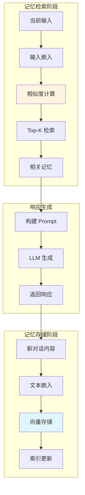
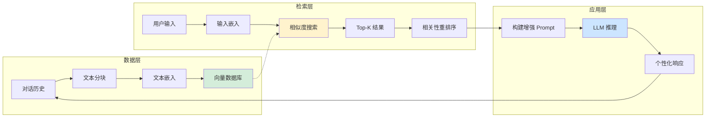

# VectorStoreRetrieverMemory：向量检索长期记忆

当对话历史包含大量信息时，简单存储或摘要可能不够。`VectorStoreRetrieverMemory` 通过向量检索，只召回与当前对话最相关的记忆片段，实现"无限"且"智能"的记忆管理。

## 核心概念

### 什么是向量记忆？

向量记忆的工作方式类似于人类大脑：不会记住每件事的每个细节，但能在需要时回忆起相关信息。

```
传统记忆：按时间顺序存储所有对话
              ↓
向量记忆：将每轮对话嵌入向量空间，按需检索最相关的
```

### 与传统记忆的对比

| 特性 | Buffer/Window Memory | Summary Memory | Vector Memory |
|------|----------------------|----------------|---------------|
| 存储方式 | 按时间顺序 | 压缩摘要 | 向量索引 |
| 检索方式 | 全部/最近 N 轮 | 固定摘要 | 语义相似度 |
| 相关性 | 时间相关性 | 摘要质量决定 | 语义相关性 |
| 可扩展性 | 有限 | 较好 | 优秀 |
| 成本 | 线性增长 | 固定 | 检索成本低 |

## VectorStoreRetrieverMemory 详解

### 基本用法

```python
from langchain.memory import VectorStoreRetrieverMemory
from langchain_community.vectorstores import FAISS
from langchain_openai import OpenAIEmbeddings
from langchain.chains import ConversationChain
from langchain_openai import ChatOpenAI

# 1. 创建向量存储
embeddings = OpenAIEmbeddings(model="text-embedding-3-small")
vectorstore = FAISS.from_texts([""], embeddings)  # 初始空存储

# 2. 创建检索器
retriever = vectorstore.as_retriever(
    search_kwargs={"k": 3}  # 每次检索 3 条相关记忆
)

# 3. 创建向量记忆
memory = VectorStoreRetrieverMemory(
    retriever=retriever,
    memory_key="relevant_history",
    return_messages=True
)

# 4. 配置对话链
llm = ChatOpenAI(model="gpt-4o", temperature=0.7)
conversation = ConversationChain(
    llm=llm,
    memory=memory,
    verbose=True
)

# 5. 进行对话
response = conversation.invoke({"input": "我喜欢吃湘菜，特别是辣椒炒肉"})
print(response)

# 几轮对话后...
response = conversation.invoke({"input": "你记得我喜欢吃什么菜吗？"})
# AI 能够检索并回忆起之前的偏好
print(response)
```

### 工作原理

::: v-pre

:::

## 长期记忆的向量检索

### 相似度检索机制

```python
from langchain_community.vectorstores import FAISS
from langchain_openai import OpenAIEmbeddings
import numpy as np

# 创建示例向量存储
texts = [
    "用户喜欢湘菜，特别是辣椒炒肉",
    "用户住在长沙，在数字马力工作",
    "用户是前端工程师，擅长 React",
    "用户生日是 12 月 29 日",
    "用户喜欢打羽毛球和游泳",
]

embeddings = OpenAIEmbeddings()
vectorstore = FAISS.from_texts(texts, embeddings)

# 模拟检索
query = "周末有什么运动推荐吗？"
results = vectorstore.similarity_search(query, k=2)

print("检索结果:")
for doc in results:
    print(f"  - {doc.page_content}")
    # 输出会包含"用户喜欢打羽毛球和游泳"
```

### 检索参数调优

```python
# k 值：检索返回的记忆条数
# 太小：可能遗漏相关信息
# 太大：引入噪声，增加 token 消耗

retriever = vectorstore.as_retriever(
    search_type="similarity",      # 相似度检索
    search_kwargs={
        "k": 3,                     # 返回 3 条最相关
        "score_threshold": 0.7      # 相似度阈值（需要支持）
    }
)

# 或者使用 MMR (Maximal Marginal Relevance)
# 在相关性和多样性之间取得平衡
mmr_retriever = vectorstore.as_retriever(
    search_type="mmr",
    search_kwargs={
        "k": 5,
        "fetch_k": 10,              # 先取 10 条
        "lambda_mult": 0.5          # 多样性参数 (0-1)
    }
)
```

### 分数阈值过滤

```python
from langchain_core.documents import Document

class ThresholdRetriever:
    """带阈值过滤的检索器"""
    
    def __init__(self, base_retriever, threshold=0.7):
        self.base_retriever = base_retriever
        self.threshold = threshold
    
    def invoke(self, query):
        # 获取带分数的结果
        docs_with_scores = self.base_retriever.invoke(query)
        
        # 过滤低分结果
        filtered_docs = [
            doc for doc in docs_with_scores
            if getattr(doc, 'metadata', {}).get('score', 1.0) >= self.threshold
        ]
        
        return filtered_docs

# 使用
filtered_retriever = ThresholdRetriever(
    vectorstore.as_retriever(search_kwargs={"k": 5}),
    threshold=0.65
)
```

## 与对话记忆的结合

### 混合记忆架构

将向量记忆与短期对话记忆结合，兼顾即时上下文和长期记忆：

```python
from langchain.memory import (
    ConversationBufferWindowMemory,
    VectorStoreRetrieverMemory,
    CombinedMemory
)
from langchain_community.vectorstores import FAISS
from langchain_openai import OpenAIEmbeddings, ChatOpenAI

# 短期记忆：保留最近 5 轮对话
short_term_memory = ConversationBufferWindowMemory(
    k=5,
    memory_key="recent_history",
    return_messages=True
)

# 长期记忆：向量检索
embeddings = OpenAIEmbeddings()
vectorstore = FAISS.from_texts([""], embeddings)
long_term_memory = VectorStoreRetrieverMemory(
    retriever=vectorstore.as_retriever(search_kwargs={"k": 3}),
    memory_key="relevant_history",
    return_messages=True
)

# 组合记忆
combined_memory = CombinedMemory(
    memories=[short_term_memory, long_term_memory],
    input_keys=["input"],
    output_keys=["output"]
)

# 创建对话链
llm = ChatOpenAI(model="gpt-4o")
conversation = ConversationChain(
    llm=llm,
    memory=combined_memory,
    verbose=True
)
```

### Prompt 设计

```python
from langchain.prompts import ChatPromptTemplate, MessagesPlaceholder

# 设计能同时利用短期和长期记忆的 prompt
prompt = ChatPromptTemplate.from_messages([
    ("system", """你是一个有帮助的助手。
    
最近对话:
{recent_history}

相关历史记忆:
{relevant_history}

请结合以上信息回答用户问题。对于回忆起的长期信息，可以自然融入对话中。"""),
    MessagesPlaceholder(variable_name="history"),
    ("human", "{input}")
])
```

## 实战：记忆增强的 RAG

### 构建个人化问答机器人

```python
from langchain.memory import VectorStoreRetrieverMemory
from langchain_community.vectorstores import Chroma
from langchain_openai import OpenAIEmbeddings, ChatOpenAI
from langchain.chains import RetrievalQA
import os

# 1. 准备个人知识数据
personal_knowledge = """
# 个人信息
姓名：林傒
工作：数字马力前端工程师
地点：长沙
生日：12 月 29 日

# 技术栈
- 前端：React, Vue, TypeScript
- 工具：Vite, Webpack, ESLint
- 后端：Node.js, Python 基础

# 项目经历
- 支付宝移动端 H5 开发
- 内部效率工具
- 数据可视化大屏

# 偏好
- 喜欢的菜：湘菜
- 运动：羽毛球、游泳
- 音乐：摇滚、独立音乐
"""

# 2. 创建向量存储
os.makedirs("./personal_memory", exist_ok=True)
embeddings = OpenAIEmbeddings(model="text-embedding-3-small")

vectorstore = Chroma.from_texts(
    texts=[personal_knowledge],  # 实际场景应分块
    embedding=embeddings,
    persist_directory="./personal_memory"
)

# 3. 创建记忆组件
memory = VectorStoreRetrieverMemory(
    retriever=vectorstore.as_retriever(search_kwargs={"k": 3}),
    memory_key="personal_context"
)

# 4. 创建问答链
from langchain.prompts import PromptTemplate

qa_prompt = PromptTemplate(
    input_variables=["context", "question", "personal_context"],
    template="""使用以下信息回答问题：

个人背景：
{personal_context}

参考文档：
{context}

问题：{question}

回答："""
)

qa_chain = RetrievalQA.from_chain_type(
    llm=ChatOpenAI(model="gpt-4o"),
    chain_type="stuff",
    retriever=vectorstore.as_retriever(search_kwargs={"k": 3}),
    return_source_documents=True
)

# 5. 测试
result = qa_chain.invoke({
    "query": "我适合学习什么新技术？"
})
print(result["result"])
```

### 对话历史持久化

```python
import pickle
from pathlib import Path

class PersistentVectorMemory(VectorStoreRetrieverMemory):
    """支持持久化的向量记忆"""
    
    def __init__(self, persist_path="./memory_store.pkl", **kwargs):
        super().__init__(**kwargs)
        self.persist_path = Path(persist_path)
        self._load()
    
    def _load(self):
        """加载已保存的记忆"""
        if self.persist_path.exists():
            with open(self.persist_path, 'rb') as f:
                saved_data = pickle.load(f)
                # 恢复向量存储
                # 实际实现需要根据 vectorstore 类型调整
    
    def _save(self):
        """保存记忆到磁盘"""
        with open(self.persist_path, 'wb') as f:
            # 保存向量存储状态
            pickle.dump(self.retriever.vectorstore, f)
    
    def save_context(self, inputs, outputs):
        """保存对话并持久化"""
        super().save_context(inputs, outputs)
        self._save()
```

## 向量记忆检索图

::: v-pre

:::

## 高级技巧

### 元数据过滤

```python
from langchain_community.vectorstores import FAISS
from langchain_openai import OpenAIEmbeddings

# 带元数据的文档
documents = [
    ("用户的工作信息", {"category": "work", "confidence": 0.95}),
    ("用户的兴趣爱好", {"category": "hobby", "confidence": 0.88}),
    ("用户的技术能力", {"category": "skills", "confidence": 0.92}),
]

texts = [doc[0] for doc in documents]
metadatas = [doc[1] for doc in documents]

vectorstore = FAISS.from_texts(texts, OpenAIEmbeddings(), metadatas=metadatas)

# 带过滤的检索
filtered_retriever = vectorstore.as_retriever(
    search_kwargs={
        "k": 2,
        "filter": {"category": "skills"}  # 只检索技能相关
    }
)
```

### 时间衰减记忆

```python
import time
from datetime import datetime

class TimeDecayMemory(VectorStoreRetrieverMemory):
    """带时间衰减的记忆，旧记忆权重降低"""
    
    def save_context(self, inputs, outputs):
        # 添加时间戳
        metadata = {
            "timestamp": time.time(),
            "input": str(inputs),
            "output": str(outputs)
        }
        
        # 存入向量存储
        content = f"输入：{inputs}\n输出：{outputs}"
        self.retriever.vectorstore.add_texts([content], [metadata])
    
    def invoke(self, query):
        # 检索时考虑时间衰减
        results = self.retriever.invoke(query)
        
        # 按时间衰减调整分数
        current_time = time.time()
        for doc in results:
            timestamp = doc.metadata.get("timestamp", current_time)
            age_days = (current_time - timestamp) / 86400
            decay_factor = 0.95 ** age_days  # 每天衰减 5%
            doc.metadata["adjusted_score"] *= decay_factor
        
        return results
```

### 多向量索引

```python
from langchain.retrievers import EnsembleRetriever

# 使用多个检索器组合
dense_retriever = vectorstore.as_retriever(
    search_type="similarity",
    search_kwargs={"k": 3}
)

# 可以结合稀疏检索 (BM25)
from langchain_community.retrievers import BM25Retriever

bm25_retriever = BM25Retriever.from_texts(texts)
bm25_retriever.k = 3

# 组合检索器
ensemble_retriever = EnsembleRetriever(
    retrievers=[bm25_retriever, dense_retriever],
    weights=[0.3, 0.7]  # 稠密检索权重更高
)
```

## 性能优化

### 批量嵌入优化

```python
# 批量处理提高嵌入效率
def batch_embed_texts(texts, batch_size=50):
    """批量嵌入文本"""
    embeddings = OpenAIEmbeddings()
    all_embeddings = []
    
    for i in range(0, len(texts), batch_size):
        batch = texts[i:i+batch_size]
        batch_embeddings = embeddings.embed_documents(batch)
        all_embeddings.extend(batch_embeddings)
        
        # 避免 API 限流
        if i + batch_size < len(texts):
            time.sleep(0.1)
    
    return all_embeddings
```

### 增量更新

```python
class IncrementalVectorMemory:
    """增量更新向量记忆"""
    
    def __init__(self, vectorstore, embeddings):
        self.vectorstore = vectorstore
        self.embeddings = embeddings
    
    def add_single_memory(self, text, metadata=None):
        """添加单条记忆"""
        self.vectorstore.add_texts([text], [metadata or {}])
    
    def add_batch_memories(self, texts, metadatas=None):
        """批量添加记忆"""
        self.vectorstore.add_texts(texts, metadatas)
    
    def remove_old_memories(self, max_memories=1000):
        """当记忆过多时，移除最旧的"""
        # 实现删除逻辑（需要 vectorstore 支持）
        pass
```

## 常见问题

### 问题 1：检索结果不相关

```python
# 解决方案
# 1. 调整 k 值
retriever = vectorstore.as_retriever(search_kwargs={"k": 5})

# 2. 使用 MMR 增加多样性
retriever = vectorstore.as_retriever(
    search_type="mmr",
    search_kwargs={"k": 5, "lambda_mult": 0.7}
)

# 3. 改善文本分块
# 确保每块包含完整语义
```

### 问题 2：记忆污染

```python
# 随着时间推移，不相关记忆累积
# 解决方案：定期清理
def clean_memory(memory, min_relevance=0.5):
    """清理低相关性记忆"""
    # 获取所有记忆
    all_memories = memory.retriever.vectorstore.similarity_search("", k=1000)
    
    # 过滤低质量记忆
    quality_memories = [
        m for m in all_memories
        if len(m.page_content) > 20  # 太短的可能无意义
    ]
    
    # 重建向量库
    # ...
```

### 问题 3：多用户隔离

```python
# 每个用户独立向量库
user_vectorstores = {}

def get_user_memory(user_id):
    if user_id not in user_vectorstores:
        vectorstore = FAISS.from_texts([""], OpenAIEmbeddings())
        memory = VectorStoreRetrieverMemory(
            retriever=vectorstore.as_retriever(),
            memory_key="history"
        )
        user_vectorstores[user_id] = memory
    return user_vectorstores[user_id]
```

## 总结

`VectorStoreRetrieverMemory` 提供了最灵活的长期记忆方案：

**优势：**
- ✅ 语义检索，召回最相关信息
- ✅ 可扩展至大量记忆
- ✅ 支持元数据过滤
- ✅ 与短期记忆完美互补

**适用场景：**
- 个人化 AI 助手
- 长期客户关系管理
- 知识密集型问答
- 多轮复杂任务

**成本效益：**
- 检索成本远低于发送全部历史
- 只传输相关信息，节省 token

下一节我们将探讨如何在 LCEL 中迁移和使用记忆系统。