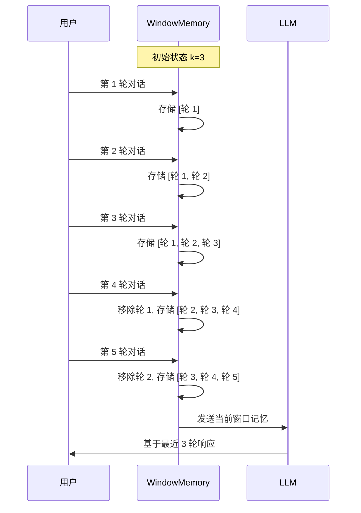

# ConversationBufferWindowMemory 详解

`ConversationBufferWindowMemory` 是 LangChain 中最实用的记忆组件之一，它通过限制保留的对话轮数，在上下文完整性和成本之间取得平衡。

## 核心概念

### 什么是窗口记忆？

想象你在看一场电影，但你只能通过一个固定大小的窗口观看。窗口记忆的工作原理与此类似——它只显示最近的对话内容，超过窗口范围的历史会被自动丢弃。

```
对话历史：[轮 1][轮 2][轮 3][轮 4][轮 5][轮 6][轮 7][轮 8]
                    当前窗口 (k=5) └───────────┘
                    实际保留：[轮 4][轮 5][轮 6][轮 7][轮 8]
```

### 与 Buffer Memory 的本质区别

| 对比维度 | ConversationBufferMemory | ConversationBufferWindowMemory |
|----------|--------------------------|--------------------------------|
| 存储策略 | 存储全部历史 | 只保留最近 k 轮 |
| Token 消耗 | 随对话线性增长 | 有上限，可预测 |
| 适合场景 | 短对话、关键信息不丢失 | 长对话、成本敏感 |
| 记忆管理 | 需手动清理 | 自动截断 |
| 成本预估 | 难以预测 | 容易计算 |

## k 参数详解

### k 值的含义

`k` 参数指定保留的**对话轮数**，不是消息条数。每轮对话包含：
- 1 条用户消息（HumanMessage）
- 1 条 AI 消息（AIMessage）

```python
from langchain.memory import ConversationBufferWindowMemory

# k=3 表示保留最近 3 轮对话
memory = ConversationBufferWindowMemory(k=3, return_messages=True)

# 添加 5 轮对话
for i in range(5):
    memory.save_context(
        {"input": f"用户消息{i}"},
        {"output": f"AI 回复{i}"}
    )

# 查看记忆
print(memory.load_memory_variables({}))
# 输出只包含第 3、4、5 轮，第 1、2 轮已被丢弃
```

### k 值选择指南

```python
# ==================== 不同场景的 k 值推荐 ====================

# 场景 1：简单问答机器人（天气、新闻查询）
# 特点：每轮对话独立，不需要太多上下文
simple_bot_memory = ConversationBufferWindowMemory(k=2)

# 场景 2：客服机器人
# 特点：需要记住用户问题、订单信息、解决进度
customer_service_memory = ConversationBufferWindowMemory(k=10)

# 场景 3：教学辅导
# 特点：需要跟踪学生学习进度、之前讲过的知识点
tutor_memory = ConversationBufferWindowMemory(k=15)

# 场景 4：创意写作伙伴
# 特点：需要记住故事设定、角色信息、情节发展
writing_partner_memory = ConversationBufferWindowMemory(k=20)

# 场景 5：心理咨询
# 特点：需要完整上下文，建议使用 Buffer Memory
# therapy_memory = ConversationBufferMemory()  # 不用窗口
```

### Token 成本计算

```python
def estimate_window_tokens(k, avg_message_length=100):
    """
    估算窗口记忆的 token 消耗
    
    参数:
        k: 窗口大小（轮数）
        avg_message_length: 平均每条消息的 token 数
    
    返回:
        总 token 数估算
    """
    # 每轮 2 条消息（用户 + AI）
    messages_per_round = 2
    total_messages = k * messages_per_round
    return total_messages * avg_message_length

# 示例计算
for k in [3, 5, 10, 15, 20]:
    tokens = estimate_window_tokens(k)
    print(f"k={k}: 约 {tokens} tokens")

# 输出:
# k=3: 约 600 tokens
# k=5: 约 1000 tokens
# k=10: 约 2000 tokens
# k=15: 约 3000 tokens
# k=20: 约 4000 tokens
```

💡 **提示**：GPT-4 的输入成本约为$0.01/1K tokens。如果每小时处理 100 次请求，k 从 5 增加到 20，每小时成本增加约$0.12。

## 窗口截断机制

### 截断工作原理

当新增对话导致超出 k 轮限制时，最旧的对话会被自动移除。

::: v-pre

:::

### 截断演示代码

```python
from langchain.memory import ConversationBufferWindowMemory

memory = ConversationBufferWindowMemory(k=3, return_messages=True)

print("=== 窗口记忆截断演示 ===\n")

for i in range(1, 8):
    # 保存对话
    memory.save_context(
        {"input": f"这是用户第{i}轮的问题"},
        {"output": f"这是 AI 第{i}轮的回答"}
    )
    
    # 查看当前记忆
    current_messages = memory.chat_memory.messages
    print(f"第{i}轮后，记忆中有 {len(current_messages)} 条消息:")
    
    for msg in current_messages:
        role = "用户" if hasattr(msg, 'content') and '用户' in str(msg.content) else "AI"
        print(f"  - {role}")
    print()
```

## 实际聊天场景示例

### 示例 1：电商客服对话

```python
from langchain.memory import ConversationBufferWindowMemory
from langchain.chains import ConversationChain
from langchain_openai import ChatOpenAI

# 配置客服记忆
memory = ConversationBufferWindowMemory(
    k=5,
    memory_key="chat_history",
    return_messages=True,
    human_prefix="客户",
    ai_prefix="客服"
)

llm = ChatOpenAI(model="gpt-4o", temperature=0.7)

conversation = ConversationChain(
    llm=llm,
    memory=memory,
    verbose=False
)

# 模拟完整客服对话
dialogue = [
    ("你好，我昨天买的订单还没发货", "您好！请提供订单号，我帮您查询"),
    ("订单号是 DD20240530123", "已查询到您的订单，预计今天下午发货"),
    ("能发顺丰吗？我比较急", "可以的，我帮您备注发顺丰速运"),
    ("好的，大概什么时候能到？", "顺丰通常 1-2 天送达，预计后天您能收到"),
    ("我在长沙，应该没问题吧？", "长沙在顺丰次日达范围内，没问题的"),
    ("谢谢！我还想问下能开发票吗？", "可以的，请问您需要什么类型的发票？"),
    ("公司抬头：数字马力信息技术", "好的，已记录。电子发票会发送到您的邮箱"),
]

print("=== 电商客服对话模拟 ===\n")

for user_input, expected_topic in dialogue:
    response = conversation.invoke({"input": user_input})
    print(f"客户：{user_input}")
    print(f"客服：{response['response'][:50]}...")
    print()

# 查看最终记忆状态
print(f"最终记忆保留轮数：{len(memory.chat_memory.messages) // 2}轮")
```

### 示例 2：技术支持对话

```python
# 技术支持场景：需要记住错误信息、已尝试的解决方案
tech_support_memory = ConversationBufferWindowMemory(
    k=8,  # 技术支持需要更多上下文
    memory_key="support_history"
)

# 典型对话流程
tech_dialogue = """
用户：我的应用启动时报错 404
AI: 请问是什么类型的错误？能分享错误堆栈吗？
用户：[粘贴错误日志]
AI: 看起来是路由配置问题，请检查 app.py 中的路由定义
用户：我检查了，路由定义看起来没问题
AI: 那可能是端口占用，请尝试更换端口
用户：换了端口还是不行
AI: 请确认依赖是否都安装了，运行 pip install -r requirements.txt
用户：安装完依赖后好了！谢谢
"""
```

### 示例 3：语言学习对话

```python
# 语言学习：需要记住用户水平、学过的单词、常犯错误
learning_memory = ConversationBufferWindowMemory(
    k=10,
    memory_key="learning_history"
)

# 系统提示
learning_prompt = """你是一个英语老师。
记住学生的英语水平和常犯错误。
根据学生水平调整用词难度。
每次对话教 1-2 个新单词或语法点。"""
```

## 高级配置选项

### 自定义消息格式化

```python
from langchain.memory import ConversationBufferWindowMemory
from langchain.schema import HumanMessage, AIMessage

class CustomWindowMemory(ConversationBufferWindowMemory):
    """自定义窗口记忆，添加时间戳"""
    
    def save_context(self, inputs, outputs):
        # 添加时间戳
        from datetime import datetime
        timestamp = datetime.now().strftime("%H:%M")
        
        # 调用父类方法
        super().save_context(inputs, outputs)
        
        # 可以在这里添加额外的日志记录
        print(f"[{timestamp}] 保存对话：{inputs} -> {outputs}")

# 使用自定义记忆
memory = CustomWindowMemory(k=5)
```

### 结合其他 Memory 类型

```python
from langchain.memory import (
    ConversationBufferWindowMemory,
    CombinedMemory
)

# 组合窗口记忆和摘要记忆
window_memory = ConversationBufferWindowMemory(k=5)
# 注意：CombinedMemory 在较新版本中可能有变化，请检查文档
```

## 性能优化技巧

### 1. 动态调整 k 值

```python
class AdaptiveWindowMemory(ConversationBufferWindowMemory):
    """根据对话复杂度动态调整 k 值"""
    
    def __init__(self, base_k=5, max_k=15, **kwargs):
        super().__init__(k=base_k, **kwargs)
        self.base_k = base_k
        self.max_k = max_k
        self.complexity_score = 0
    
    def adjust_k(self, message_length):
        """根据消息长度调整窗口大小"""
        if message_length > 500:  # 长消息
            self.k = min(self.max_k, self.k + 1)
        elif message_length < 50:  # 短消息
            self.k = max(self.base_k, self.k - 1)
```

### 2. 重要信息持久化

```python
# 窗口记忆会遗忘旧信息，重要信息需额外存储
important_info = {
    "user_name": None,
    "user_preferences": [],
    "critical_context": []
}

def extract_important_info(message):
    """从对话中提取重要信息"""
    # 使用 LLM 或规则提取
    if "我叫" in message:
        # 提取用户名
        pass
    if "我喜欢" in message:
        # 提取偏好
        pass
```

### 3. 批量处理优化

```python
# 批量保存上下文，减少 I/O
batch_contexts = []

for dialogue in dialogues:
    batch_contexts.append((dialogue.input, dialogue.output))

# 批量保存
for inputs, outputs in batch_contexts:
    memory.save_context(inputs, outputs)
```

## 常见问题排查

### 问题 1：记忆没有生效

```python
# 检查清单
# 1. 确保 memory_key 与 prompt 中的变量名匹配
# 2. 确保 return_messages=True 时 prompt 使用 MessagesPlaceholder
# 3. 确保 input_key/output_key 设置正确

from langchain.prompts import ChatPromptTemplate, MessagesPlaceholder

prompt = ChatPromptTemplate.from_messages([
    ("system", "你是助手"),
    MessagesPlaceholder(variable_name="chat_history"),  # 必须与 memory_key 一致
    ("human", "{input}")
])
```

### 问题 2：Token 超出限制

```python
# 解决方案：减小 k 值或使用更小的模型
memory = ConversationBufferWindowMemory(k=3)  # 从 10 减到 3

# 或者使用 token 计数监控
from tiktoken import get_encoding

def count_tokens(text, model="gpt-4"):
    encoding = get_encoding("cl100k_base")
    return len(encoding.encode(text))

# 在发送前检查
current_memory = memory.load_memory_variables({})
token_count = count_tokens(str(current_memory))
if token_count > 10000:
    memory.k = 2  # 临时减小窗口
```

### 问题 3：多用户会话混淆

```python
# 错误做法：共享同一个 memory 实例
# shared_memory = ConversationBufferWindowMemory(k=5)  # ❌

# 正确做法：每个用户独立 memory
user_memories = {}

def get_memory_for_user(user_id):
    if user_id not in user_memories:
        user_memories[user_id] = ConversationBufferWindowMemory(k=5)
    return user_memories[user_id]

# 使用
user_memory = get_memory_for_user("user_123")
```

## 总结

`ConversationBufferWindowMemory` 是构建实用对话系统的理想选择：

✅ **优点：**
- 成本可控，token 消耗有上限
- 自动管理，无需手动清理
- 配置简单，开箱即用
- 适合大多数对话场景

⚠️ **注意：**
- 会遗忘超出窗口的历史
- k 值需要根据场景调整
- 重要信息需要额外存储

选择 k 值的核心原则：
1. 简单问答：k=2~3
2. 标准客服：k=5~10
3. 复杂任务：k=10~20
4. 关键场景：考虑 Buffer Memory

下一节我们将学习 `ConversationSummaryMemory`，它通过摘要压缩来实现更高效的长期记忆。