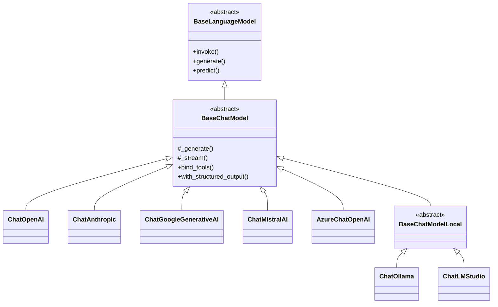

# Chat Models 聊天模型

Chat Models 是 LangChain 中与聊天型语言模型交互的核心组件。与传统的 LLM 不同，Chat Models 专门设计用于处理消息序列，支持多轮对话和复杂的交互模式。

## Chat Models 体系结构

### 类层次结构

::: v-pre

:::

### 核心接口

```python
from langchain_core.language_models import BaseChatModel
from langchain_core.messages import BaseMessage
from typing import Iterator, AsyncIterator, Optional

class BaseChatModel(BaseLanguageModel):
    """所有聊天模型的基类"""
    
    # ============ 核心方法 ============
    
    def invoke(
        self,
        input: LanguageModelInput,
        config: Optional[RunnableConfig] = None,
        **kwargs
    ) -> BaseMessage:
        """同步调用，返回单个 AIMessage"""
        ...
    
    async def ainvoke(
        self,
        input: LanguageModelInput,
        config: Optional[RunnableConfig] = None,
        **kwargs
    ) -> BaseMessage:
        """异步调用"""
        ...
    
    def stream(
        self,
        input: LanguageModelInput,
        config: Optional[RunnableConfig] = None,
        **kwargs
    ) -> Iterator[AIMessageChunk]:
        """同步流式输出"""
        ...
    
    async def astream(
        self,
        input: LanguageModelInput,
        config: Optional[RunnableConfig] = None,
        **kwargs
    ) -> AsyncIterator[AIMessageChunk]:
        """异步流式输出"""
        ...
    
    def batch(
        self,
        inputs: list[LanguageModelInput],
        config: Optional[RunnableConfig | list[RunnableConfig]] = None,
        **kwargs
    ) -> list[BaseMessage]:
        """批量处理"""
        ...
```

## 消息类型

Chat Models 使用消息（而非纯文本）进行交互。LangChain 定义了多种消息类型：

### 基础消息类型

```python
from langchain_core.messages import (
    HumanMessage,      # 用户消息
    AIMessage,         # AI 助手消息
    SystemMessage,     # 系统消息
    AIMessageChunk,    # 流式 AI 消息分块
    BaseMessage,       # 所有消息的基类
)

# 创建消息
human_msg = HumanMessage(content="你好")
ai_msg = AIMessage(content="你好！有什么可以帮助你的？")
system_msg = SystemMessage(content="你是一个有帮助的助手。")

# 消息可以有额外属性
human_msg_with_name = HumanMessage(
    content="你好",
    name="小明"  # 多用户场景
)

# 消息可以有 metadata
ai_msg_with_tool = AIMessage(
    content="",
    tool_calls=[
        {"name": "search", "args": {"query": "天气"}, "id": "call_123"}
    ]
)
```

### 消息转换

```python
from langchain_core.messages import (
    HumanMessage, 
    AIMessage, 
    get_buffer_string,
    messages_to_dict,
    messages_from_dict
)

# 消息列表转字符串
messages = [
    SystemMessage(content="你是助手"),
    HumanMessage(content="你好"),
    AIMessage(content="你好！")
]

buffer = get_buffer_string(messages)
print(buffer)
# System: 你是助手\nHuman: 你好\nAI: 你好！

# 序列化/反序列化
msg_dict = messages_to_dict(messages)
restored = messages_from_dict(msg_dict)
```

### 内容类型

```python
from langchain_core.messages import HumanMessage

# 纯文本
text_msg = HumanMessage(content="你好")

# 多模态内容（文本 + 图片）
multimodal_msg = HumanMessage(
    content=[
        {"type": "text", "text": "这张图片里有什么？"},
        {
            "type": "image_url",
            "image_url": {"url": "https://example.com/image.jpg"}
        },
    ]
)

# Tool 调用结果
from langchain_core.messages import ToolMessage

tool_result = ToolMessage(
    content="搜索结果是...",
    tool_call_id="call_123"
)
```

## 主流 Chat Model 实现

### ChatOpenAI

```python
from langchain_openai import ChatOpenAI

# 基础使用
llm = ChatOpenAI(
    model="gpt-4-turbo",
    temperature=0.7,
    max_tokens=1000,
    timeout=30,
    max_retries=2,
)

response = llm.invoke("你好")
print(response.content)

# 流式
for chunk in llm.stream("写一首诗"):
    print(chunk.content, end="")

# 异步流式
import asyncio

async def main():
    async for chunk in llm.astream("写一首诗"):
        print(chunk.content, end="")

asyncio.run(main())

# 批量
results = llm.batch(["问题 1", "问题 2", "问题 3"])
```

### ChatAnthropic

```python
from langchain_anthropic import ChatAnthropic

llm = ChatAnthropic(
    model="claude-3-sonnet-20240229",
    temperature=0.7,
    max_tokens=1024,
)

response = llm.invoke("你好")
```

### ChatGoogleGenerativeAI

```python
from langchain_google_genai import ChatGoogleGenerativeAI

llm = ChatGoogleGenerativeAI(
    model="gemini-pro",
    temperature=0.7,
)

response = llm.invoke("你好")
```

### 国产模型接入

```python
# 通义千问 (阿里)
from langchain_community.chat_models import QianfanChatEndpoint

qianfan = QianfanChatEndpoint(
    model="ERNIE-Bot-4",
    qianfan_ak="your_access_key",
    qianfan_sk="your_secret_key",
)

# 智谱 AI
from langchain_community.chat_models import ChatZhipuAI

zhipu = ChatZhipuAI(
    model="glm-4",
    zhipuai_api_key="your_api_key",
    temperature=0.7,
)

# 百度文心一言
from langchain_community.chat_models import QianfanChatEndpoint

wenxin = QianfanChatEndpoint(
    model="ERNIE-Bot",
    qianfan_ak="your_ak",
    qianfan_sk="your_sk",
)

# 使用
response = zhipu.invoke("你好")
print(response.content)
```

## bind_tools - 绑定工具

```python
from langchain_openai import ChatOpenAI
from langchain_core.tools import tool

@tool
def search(query: str) -> str:
    """搜索网络获取信息。"""
    return f"搜索结果：{query}"

@tool
def calculator(expression: str) -> float:
    """计算数学表达式。"""
    return eval(expression)

llm = ChatOpenAI(model="gpt-4-turbo")

# 绑定工具
llm_with_tools = llm.bind_tools([search, calculator])

# 调用
response = llm_with_tools.invoke("计算 123 * 456")

# 检查是否有工具调用
if response.tool_calls:
    print(f"模型想调用工具：{response.tool_calls}")
    # [{'name': 'calculator', 'args': {'expression': '123 * 456'}, 'id': '...'}]
```

### 多工具协同

```python
from langchain_core.runnables import RunnableLambda

# 定义工具执行器
def execute_tools(message):
    if message.tool_calls:
        for tool_call in message.tool_calls:
            tool_name = tool_call["name"]
            tool_args = tool_call["args"]
            # 执行对应工具...
            print(f"执行 {tool_name}({tool_args})")

chain = llm_with_tools | RunnableLambda(execute_tools)
```

## with_structured_output - 结构化输出

```python
from pydantic import BaseModel, Field
from langchain_openai import ChatOpenAI

class Joke(BaseModel):
    """笑话结构"""
    setup: str = Field(description="笑话铺垫")
    punchline: str = Field(description="笑点")
    rating: int = Field(description="评分 1-10", ge=1, le=10)

llm = ChatOpenAI(model="gpt-4-turbo")

# 启用结构化输出
structured_llm = llm.with_structured_output(Joke)

# 调用 - 直接返回 Pydantic 模型
joke = structured_llm.invoke("讲一个程序员笑话")
print(joke.setup)      # 类型安全访问
print(joke.punchline)
print(f"评分：{joke.rating}/10")

# 使用 dict 输出
structured_llm_dict = llm.with_structured_output(Joke.model_json_schema())
result = structured_llm_dict.invoke("讲一个笑话")
print(type(result))  # dict
```

## 批量调用与异步

### 批量处理

```python
from langchain_openai import ChatOpenAI

llm = ChatOpenAI(model="gpt-3.5-turbo")

# 同步批量
inputs = ["问题 1", "问题 2", "问题 3", "问题 4", "问题 5"]
results = llm.batch(inputs)

for i, result in enumerate(results):
    print(f"Q{i+1}: {result.content[:50]}...")
```

### 异步批量

```python
import asyncio
from langchain_openai import ChatOpenAI

llm = ChatOpenAI(model="gpt-3.5-turbo")

async def main():
    inputs = ["问题 1", "问题 2", "问题 3", "问题 4", "问题 5"]
    results = await llm.abatch(inputs)
    
    for i, result in enumerate(results):
        print(f"Q{i+1}: {result.content}")

asyncio.run(main())
```

### 并发控制

```python
from langchain_core.runnables import RunnableConfig

# 限制并发数
config = RunnableConfig(max_concurrency=5)

results = await llm.abatch(inputs, config=config)
```

## 实际应用场景

### 场景 1：多轮对话

```python
from langchain_core.prompts import ChatPromptTemplate, MessagesPlaceholder
from langchain_openai import ChatOpenAI

prompt = ChatPromptTemplate.from_messages([
    ("system", "你是一个友好的对话助手。"),
    MessagesPlaceholder(variable_name="history"),
    ("human", "{input}")
])

llm = ChatOpenAI(model="gpt-3.5-turbo")
chain = prompt | llm

# 对话历史
history = [
    HumanMessage(content="你好"),
    AIMessage(content="你好！有什么可以帮助你的？"),
]

response = chain.invoke({
    "history": history,
    "input": "今天天气怎么样？"
})
```

### 场景 2：多模型对比

```python
from langchain_core.runnables import RunnableParallel
from langchain_openai import ChatOpenAI
from langchain_anthropic import ChatAnthropic

# 并行调用多个模型
models = RunnableParallel({
    "gpt4": ChatOpenAI(model="gpt-4-turbo"),
    "claude": ChatAnthropic(model="claude-3-sonnet-20240229"),
})

results = models.invoke("解释量子力学")

for name, response in results.items():
    print(f"{name}: {response.content[:100]}...")
```

### 场景 3：对话摘要

```python
from langchain_core.messages import HumanMessage, AIMessage, SystemMessage
from langchain_openai import ChatOpenAI

llm = ChatOpenAI(model="gpt-3.5-turbo")

async def summarize_conversation(messages: list):
    """总结对话历史"""
    prompt = ChatPromptTemplate.from_messages([
        SystemMessage(content="请总结以下对话的关键要点。"),
        *messages,
        HumanMessage(content="请总结以上对话。")
    ])
    
    chain = prompt | llm
    summary = await chain.ainvoke({})
    return summary.content

# 使用
messages = [
    HumanMessage(content="你好"),
    AIMessage(content="你好！"),
]

summary = await summarize_conversation(messages)
```

## 💡 提示块

> 💡 **最佳实践**
>
> 1. **选择合适的模型**：根据任务复杂度选择模型（简单任务用便宜模型）
> 2. **合理使用温度**：创意任务用高温度（0.7-1.0），精确任务用低温度（0-0.3）
> 3. **始终设置超时**：防止 API 调用无限期等待
> 4. **使用结构化输出**：便于后续处理和类型检查
> 5. **监控 Token 用量**：设置 budget 和使用追踪
> 6. **国产模型注意**：访问速度和稳定性可能不如国际模型

## 总结

| 特性 | ChatOpenAI | ChatAnthropic | ChatGoogleGenerativeAI |
|------|-----------|---------------|----------------------|
| **代表模型** | GPT-4 Turbo | Claude 3 | Gemini Pro |
| **流式支持** | ✅ | ✅ | ✅ |
| **Tool Calling** | ✅ | ✅ | ✅ |
| **多模态** | ✅ | ✅ | ✅ |
| **JSON Mode** | ✅ | ✅ | ✅ |
| **国产替代** | Qianfan | - | - |

Chat Models 是与现代 LLM 交互的标准方式，掌握它是构建 AI 应用的基础。